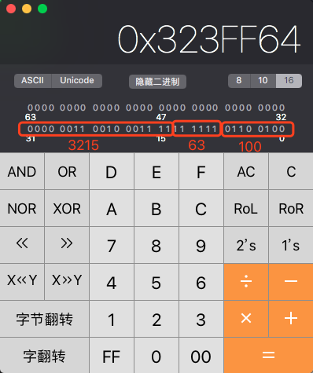
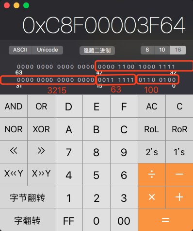
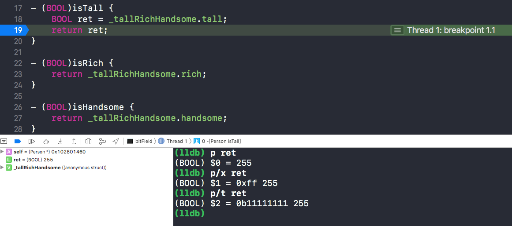

# 一、位域
位域(Bit field)为一种数据结构，可以把数据以位的形式紧凑地存储，并允许程序员对此结构的位进行操作，这种数据结构的好处有：

- 可以使数据单元节省储存空间，当程序需要成千上万个数据单元时，这种方式就显得尤为重要。
- 位域可以方便地访问一个整数值的部分内容从而简化程序源代码（通过位运算）

位域这种数据结构的缺点在于，其内存分配与内存对齐的实现方式依赖于具体的机器和系统，在不同的平台可能有不同的结果，这导致了位段在本质上是不可移植的。

# 二、简介
在C语言中，位域的声明与结构体(struct)类似，但它的成员是**一个或多个位**的字段，**这些不同长度的字段实际储存在一个或多个整型变量中**。在声明时，位段成员必须是整型或枚举类型（通常是无符号类型），且在成员名后面是一个冒号和一个整数，整数规定了成员所占用的位数。位域不能是静态类型。不能使用&对位域做取地址运算，因此不存在位域的指针，编译器通常不支持位域的引用（reference）。

# 三、实例对比

采用位域的实例

```
/**
 采用位域声明
 
 ch可以处理256个不同字符（8位）
 font可以表示64种不同字体(6位)
 size可以表示262144个单位长度（18位）
 
 b1这个实例，一共才占据32位（4字节的空间）
 */
struct bitField {
    unsigned char ch : 8;
    unsigned int font : 6;
    unsigned int size : 18;
};
struct bitField b1;

int main(int argc, const char * argv[]) {
    b1.ch = 100;
    b1.font = 63;
    b1.size = 3215;
    long size = sizeof(b1);
    return 0;
}
```

断点在return行，LLDB查看

```
(lldb) p/x &b1	//打印位域实例b1内存地址
(bitField *) $2 = 0x0000000100001000
(lldb) x 0x0000000100001000	//通过b1内存地址查看b1内存内容
0x100001000: 64 ff 23 03 00 00 00 00 00 00 00 00 00 00 00 00  d.#.............
0x100001010: 00 00 00 00 00 00 00 00 00 00 00 00 00 00 00 00  ................
//根据iOS小端模式读取得到数据:0x000000000323ff64
(lldb) p/x 100
(int) $3 = 0x00000064
(lldb) p/x 63
(int) $4 = 0x0000003f
(lldb) p/t 100
(int) $5 = 0b00000000000000000000000001100100
(lldb) p/t 63
(int) $6 = 0b00000000000000000000000000111111
(lldb) p/t 3215
(int) $7 = 0b00000000000000000000110010001111
(lldb) p sizeof(b1)
(unsigned long) $8 = 4
```

将`0x000000000323ff64`转换为二进制检验对应的位段数据，如下



在这32位中的数据，各个位段的数据对应上了以上lldb调试打印的二进制值，同时也能看到b1实例确实只占32位，而`sizeof(b1)`也是输出4（字节）

---

没有采用位域的结构体实例

```
/**
 可以看出，处理相同的数据，str类型占用了48位空间，
 如果考虑边界对齐并把要求最严格的int类型最先声明进行优化，
 那么str类型则要占据64位的空间。
 */
struct str {
    unsigned char ch;  //8位
    unsigned char font; //8位
    unsigned int size;  //32位
};
struct str s1;
```

断点在return行，LLDB查看

```
(lldb) p/x & s1
(str *) $0 = 0x0000000100001004
(lldb) x 0x0000000100001004
0x100001004: 64 3f 00 00 8f 0c 00 00 00 00 00 00 00 00 00 00  d?..............
0x100001014: 00 00 00 00 00 00 00 00 00 00 00 00 00 00 00 00  ................
(lldb) p/x 0x00000c8f00003f64
(long) $1 = 0x00000c8f00003f64
(lldb) p/t 100
(int) $2 = 0b00000000000000000000000001100100
(lldb) p/t 63
(int) $3 = 0b00000000000000000000000000111111
(lldb) p/t 3215
(int) $4 = 0b00000000000000000000110010001111
(lldb) p sizeof(s1)
(unsigned long) $5 = 8
```

将`0x00000c8f00003f64`转换为二进制检验对应的位段数据，如下



在这64位中的数据，各个位段的数据对应上了以上lldb调试打印的二进制值，同时也能看到s1实例确实只占64位，而`sizeof(s1)`也是输出8（字节）

---

通过两实例对比，采用位域技术确实能够用较少的空间存储更多的信息

# 四、联合、结构体优化

先简单了解联合`union`

联合(union)（也叫共用体）是一个能在同一存储空间里（但不同时）存储不同类型数据的数据类型。一个典型的应用是一个表，设计它用来表示某种既没有规律、事先也未知的顺序保存混合类型数据。使用联合类型的数组，可以创建相同大小单元的数组，每个单元都能存储多种类型的数据。

联合是以与结构同样的方式建立

```
union unionType {
    int intVar;
    double doubleVar;
    char charVar;
};
```

---

实例

创建一个OC类，并且定义三个`BOOL`类型属性

```
@interface Person : NSObject
@property(nonatomic, assign, getter = isTall) BOOL tall;
@property(nonatomic, assign, getter = isRich ) BOOL rich;
@property(nonatomic, assign, getter = isHandsome) BOOL handsome;
@end
```

通过runtime API获取类的实例大小

```
int main(int argc, const char * argv[]) {
    @autoreleasepool {
        size_t size = class_getInstanceSize([Person class]);
        NSLog(@"Person instanceSize:%zu",size);
    }
    return 0;
}

//log
2019-03-02 11:41:20.578934+0800 bitField[2080:79628] Person instanceSize:16
```

打印实例所占内存空间为16字节，isa指针(8字节),BOOL类型最低也需要占1个字节，8 + 1 * 3 = 13(字节)，由于内存对齐原则（8字节、16字节、32字节...），因此这里为16字节。

结合上几章的学习分析，这样存储浪费空间，我们知道BOOL值只有0与1两种情况，用1个二进制位即可存储，但是这里却用了1个字节（8位）存储，自然会想到是否可以用1个字节就可以保存这3个BOOL值？

目标是用1个字节保存，那么我们先定义一个1字节内存占用的类型，可以使用`char`，用这个`char`类型的后n(n<8)位存储。虽然这里使用一个`char`类型存储后，Person实例内存占用仍为16字节（因为内存对齐），但是在大数据存储中，这种方式非常节省空间，上面几章有分析到。

```
@interface Person : NSObject
{
    char _tallRichHandsome;
}
@end
```

如此一来，`_tallRichHandsome`变量的一种存储情况可以为以下:


---

数据定义后，就是存取操作，因为是用位存储，在计算机中，可以通过**位运算**操作实现,这些用于位运算的值称之为**掩码**，此处的三个掩码可定义为

```
#define TALL_MASK (1<<0) //(0000 0001)
#define RICH_MASK (1<<1) //(0000 0010)
#define HANDSOME_MASK (1<<2) //(0000 0100)
```

**存值**

效果就是将某一位设为0或1

```
//将第一位设为0
  0000 0111
& 1111 1110  //将对应掩码取反,即~(0000 0001) = 1111 1110，再按位与
  0000 0110
  
//将第一位设为1
  0000 0110
| 0000 0001  //用掩码按位或
  0000 0111 
```

据此，可以得出set方法

```
- (void)setTall:(BOOL)tall {
    _tallRichHandsome = tall ? (_tallRichHandsome |= TALL_MASK) : (_tallRichHandsome &= ~TALL_MASK);
}

- (void)setRich:(BOOL)rich {
    _tallRichHandsome = rich ? (_tallRichHandsome |= RICH_MASK) : (_tallRichHandsome &= ~RICH_MASK);
}

- (void)setHandsome:(BOOL)handsome {
    _tallRichHandsome = handsome ? (_tallRichHandsome |= HANDSOME_MASK) : (_tallRichHandsome &= ~HANDSOME_MASK);
}
```

---

**取值**

```
//按位与（&），取出第一位的值
  0000 0111
& 0000 0001
  0000 0001
```

据此，可以得出get方法

```
- (BOOL)isTall {
    return !!(_tallRichHandsome & TALL_MASK);
}

- (BOOL)isRich {
    return !!(_tallRichHandsome & RICH_MASK);
}

- (BOOL)isHandsome {
    return !!(_tallRichHandsome & RICH_MASK);
}
```

这样的代码局限性很大，当需要添加新的属性时，需要重复几乎同样的代码，可以**用位域来优化**

---

优化后的数据结构

```
@interface Person : NSObject
{
    struct {
        char tall : 1;
        char rich : 1;
        char handsome : 1;
    }_tallRichHandsome;
}
```

存取方法通过结构体成员变量直接存取

```
- (BOOL)isTall {
    return _tallRichHandsome.tall;
}

- (BOOL)isRich {
    return _tallRichHandsome.rich;
}

- (BOOL)isHandsome {
    return _tallRichHandsome.handsome;
}

- (void)setTall:(BOOL)tall {
    _tallRichHandsome.tall = tall;
}

- (void)setRich:(BOOL)rich {
    _tallRichHandsome.rich = rich;
}

- (void)setHandsome:(BOOL)handsome {
    _tallRichHandsome.handsome = handsome;
}
```

验证

```
int main(int argc, const char * argv[]) {
    @autoreleasepool {
        Person *p = [[Person alloc] init];
        [p setTall:YES];
        [p setRich:NO];
        [p setHandsome:YES];
        NSLog(@"tall:%d,rich:%d,handsome:%d.",[p isTall],[p isRich],[p isHandsome]);
    }
    return 0;
}

//log
2019-03-02 12:57:24.363123+0800 bitField[2645:121619] tall:-1,rich:0,handsome:-1.
```

这与期望值不同，从get方法入手查看返回值

```
- (BOOL)isTall {
    BOOL ret = _tallRichHandsome.tall;
    return ret;
}
```

断点调试得到结果如下:



从调试结果看出，我们原本想要的结果`0b00000001`被转换成`0b11111111`,原因是，结构体中`tall`是以1位存储的，但系统的BOOL类型占1字节，也就是8位，当1位的值扩展为8位时，**其余空位根据前面一位的值全部补位成1**，因此返回值被转换成`0b111111111`,而`0b111111111`在有符号数表示下，为`-1`,无符号数下为`255`

根据效果，可以将get方法改写:

```
- (BOOL)isTall {
    return !!_tallRichHandsome.tall;
}

- (BOOL)isRich {
    return !!_tallRichHandsome.rich;
}

- (BOOL)isHandsome {
    return !!_tallRichHandsome.handsome;
}
```

上述代码中使用结构体的位域则不在需要使用掩码，使代码可读性增强了很多，但是效率相比直接使用位运算的方式来说差很多，如果想要高效率的进行数据的读取与存储同时又有较强的可读性就需要使用到共用体了。

---

为了使代码存储数据高效率的同时，有较强的可读性，可以使用共用体来增强代码可读性，同时使用位运算来提高数据存取的效率。

```
@interface Person : NSObject
{
    union bitFiels_t {
        char bits;  //公用的一个字节，按位存储信息
        
        struct {    //结构体在这里用处不大，表示bits一字节内，各个二进制位存储的信息
        
            char tall : 1;
            char rich : 1;
            char handsome : 1;
        };
    }_tallRichHandsome;
}

-(BOOL)isTall;
-(BOOL)isRich;
-(BOOL)isHandsome;

-(void)setTall:(BOOL)tall;
-(void)setRich:(BOOL)rich;
-(void)setHandsome:(BOOL)handsome;

@end

#define TALL_MASK (1<<0)

#define RICH_MASK (1<<1)

#define HANDSOME_MASK (1<<2)


@implementation Person

- (BOOL)isTall {
    return !!(_tallRichHandsome.bits & TALL_MASK);
}

- (BOOL)isRich {
    return !!(_tallRichHandsome.bits & RICH_MASK);
}

- (BOOL)isHandsome {
    return !!(_tallRichHandsome.bits & RICH_MASK);
}

- (void)setTall:(BOOL)tall {
    _tallRichHandsome.bits = tall ? (_tallRichHandsome.bits |= TALL_MASK) : (_tallRichHandsome.bits &= ~TALL_MASK);
}

- (void)setRich:(BOOL)rich {
    _tallRichHandsome.bits = rich ? (_tallRichHandsome.bits |= RICH_MASK) : (_tallRichHandsome.bits &= ~RICH_MASK);
}

- (void)setHandsome:(BOOL)handsome {
    _tallRichHandsome.bits = handsome ? (_tallRichHandsome.bits |= HANDSOME_MASK) : (_tallRichHandsome.bits &= ~HANDSOME_MASK);
}

@end
```

>上述代码中使用位运算这种比较高效的方式存取值，使用union共用体来对数据进行存储。增加读取效率的同时增强代码可读性。

>其中`_tallRichHandsome`共用体只占用一个字节，因为结构体中`tall`、`rich`、`handsome`都只占一位二进制空间，所以结构体只占一个字节，而char类型的bits也只占一个字节，他们都在共用体中，因此共用一个字节的内存即可。

>并且在get、set方法中并没有使用到结构体，结构体仅仅为了增加代码可读性，指明共用体中存储了哪些值，以及这些值各占多少位空间。同时存值取值还使用位运算来增加效率，存储使用共用体，存放的位置依然通过与掩码进行位运算来控制。

# 五、参考

- [位段](https://zh.wikipedia.org/wiki/位段)
- [iOS底层原理总结 - 探寻Runtime本质（一）](https://www.jianshu.com/p/d949b51d5de7)


