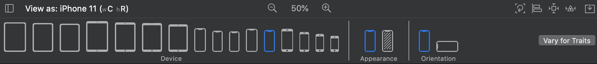
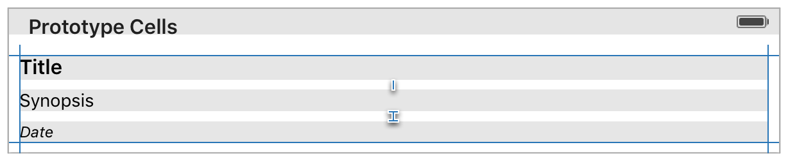

# 目录

   * [Programmatically Creating Constraints](#programmatically-creating-constraints)
      * [Layout Anchors](#layout-anchors)
      * [NSLayoutConstraint Class](#nslayoutconstraint-class)
      * [Visual Format Language](#visual-format-language)
   * [Size-Class-Specific Layout](#size-class-specific-layout)
   * [Working with Scroll Views](#working-with-scroll-views)
   * [Working with Self-Sizing Table View Cells](#working-with-self-sizing-table-view-cells)
   * [Changing Constraints](#changing-constraints)
      * [The Deferred Layout Pass](#the-deferred-layout-pass)
         * [Update Pass](#update-pass)
         * [Layout Pass](#layout-pass)
      * [Batching Changes](#batching-changes)
      * [Custom Layouts](#custom-layouts)
   * [源文档](#源文档)

# Programmatically Creating Constraints

使用`Interface Builder`可以满足大部分布局需求，但是，对视图层次结构的一些动态更改只能通过代码来实现。

在以编程方式创建约束时，有三种选择:可以使用 `Layout Anchors`，可以使用`NSLayoutConstraint`类，或者可以使用`Visual Format Language`。

## Layout Anchors

`NSLayoutAnchor`类提供了用于创建约束的接口。要使用此API，请访问要约束的`item`上的`anchor`属性。例如，视图控制器的`top` 和 `bottom layout guides`有`topAnchor`, `bottomAnchor`和`heightAnchor`属性。另一方面，视图暴露了其边缘(`edges`)、中心(centers)、大小(`size`)和`baselines`的`anchors`。

> 在`iOS`中，视图也有`layoutMarginsGuide`和`readableContentGuide`属性，这些属性表示视图边距和`readable content guides`的`UILayoutGuide`对象，这些参考线暴露其边缘(`edges`)、中心(`centers`)、大小(`size`)的`anchors`
>
> 当以编程方式为`margins`或`readable content guides`创建约束时，请使用这些`guides`。

`Layout anchors`让你在一个易于阅读，紧凑的格式创建约束，它们公开了许多用于创建不同类型约束的方法，如清单13-1所示。

清单13-1 创建`Layout anchors`

```swift
// Get the superview's layout
let margins = view.layoutMarginsGuide
 
// Pin the leading edge of myView to the margin's leading edge
myView.leadingAnchor.constraint(equalTo: margins.leadingAnchor).isActive = true
 
// Pin the trailing edge of myView to the margin's trailing edge
myView.trailingAnchor.constraint(equalTo: margins.trailingAnchor).isActive = true
 
// Give myView a 1:2 aspect ratio
myView.heightAnchor.constraint(equalTo: myView.widthAnchor, multiplier: 2.0).isActive = true
```

如[Anatomy of a Constraint](https://developer.apple.com/library/archive/documentation/UserExperience/Conceptual/AutolayoutPG/AnatomyofaConstraint.html#//apple_ref/doc/uid/TP40010853-CH9-SW1)描述那样，一个约束是一个线性方程。

<div align="center">    

</div>

`layout anchors`有几种不同的方法来创建约束，在下面这行代码中:

`myView.leadingAnchor.constraint(equalTo: margins.leadingAnchor).isActive = true`

这些符号对应方程的以下部分:

| Equation     | Symbol                  |
| ------------ | ----------------------- |
| Item 1       | myView                  |
| Attribute 1  | leadingAnchor           |
| Relationship | constraintEqualToAnchor |
| Multiplier   | None (defaults to 1.0)  |
| Item 2       | margins                 |
| Attribute 2  | leadingAnchor           |
| Constant     | None (defaults to 0.0)  |

`layout anchors`也提供额外的类型安全，`NSLayoutAnchor`类具有许多子类，这些子类添加了用于创建约束的类型信息和特定于子类的方法，这有助于防止意外创建无效约束。例如，你只能用其他`horizontal anchors `来约束`horizontal anchors `(`leadingAnchor`或`trailingAnchor`)。类似地，你只能为大小约束提供乘数。

> 这些规则不是由NSLayoutConstraint API强制执行的，相反，如果你创建了一个无效的约束，那么该约束将在运行时抛出异常。因此，Layout anchors有助于将运行时错误转换为编译时错误。

更多信息，请参阅[NSLayoutAnchor Class Reference](https://developer.apple.com/documentation/appkit/nslayoutanchor)

## NSLayoutConstraint Class

你也可以直接使用`NSLayoutConstraint`类创建约束，使用的方法是`constraintWithItem:attribute:relatedBy:toItem:attribute:multiplier:constant:`，此方法显式地将约束方程转换为代码，每个参数对应于方程的一部分。

与`layout anchors`API采用的方法不同，你必须为每个参数指定一个值，即使它不影响布局，最终的结果是大量的样板代码，这些代码通常很难阅读。例如，清单13-2中的代码在功能上与清单13-1中的代码完全相同。

清单13-2 直接创建约束

```swift
NSLayoutConstraint(item: myView, attribute: .leading, relatedBy: .equal, toItem: view, attribute: .leadingMargin, multiplier: 1.0, constant: 0.0).isActive = true
 
NSLayoutConstraint(item: myView, attribute: .trailing, relatedBy: .equal, toItem: view, attribute: .trailingMargin, multiplier: 1.0, constant: 0.0).isActive = true
 
NSLayoutConstraint(item: myView, attribute: .height, relatedBy: .equal, toItem: myView, attribute:.width, multiplier: 2.0, constant:0.0).isActive = true
```

>在iOS中，NSLayoutAttribute枚举包含视图边距的值。这意味着，你可以创建边界约束，而无需通过layoutMarginsGuide属性。然而，你仍然需要使用readableContentGuide属性来约束readable content guides。

与`layout anchors`API不同，这些方法不突出特定约束的重要特性，因此，在浏览代码时很容易忽略重要的细节。此外，编译器不会对约束执行任何静态分析，你可以自由地创建无效的约束，这些约束然后在运行时抛出异常。因此，除非你需要支持iOS 8或OS X v10.10或更早的版本，否则请考虑将你的代码迁移到新的`layout anchor` API。

更多相关信息，请参阅[NSLayoutConstraint Class Reference](https://developer.apple.com/documentation/uikit/nslayoutconstraint)

## Visual Format Language

可视化格式语言允许你像使用字符串一样使用`ASCII-art`来定义约束，这提供了约束的可视化描述。可视化格式语言有以下优点和缺点:

* 自动布局使用可视格式语言将约束打印到控制台；由于这个原因，调试消息看起来非常类似于用于创建约束的代码
* 可视化格式语言允许你使用一个非常紧凑的表达式同时创建多个约束
* 可视化格式语言只允许创建有效的约束
* 这个符号强调良好的形象化而不是完整性。因此，一些约束(例如，宽高比)不能使用可视格式语言创建
* The notation emphasizes good visualization over completeness. Therefore some constraints (for example, aspect ratios) cannot be created using the visual format language.
* 编译器不会以任何方式验证字符串，你只能通过运行时测试来发现错误

清单13-1的例子，可以用可视化语言重写：

清单13-3 

```swift
let views = ["myView" : myView]
let formatString = "|-[myView]-|"
 
let constraints = NSLayoutConstraint.constraints(withVisualFormat: formatString, options: .alignAllTop, metrics: nil, views: views)
 
NSLayoutConstraint.activate(constraints)
```

这个例子创建并激活了`leading`约束和`trailing`约束。当使用默认间距时，可视化格式语言总是为父视图的边距创建`0pt`约束，所以这些约束与前面的示例相同。但是，清单13-3不能创建纵横比约束。

如果创建一个更复杂的视图，其中一行上有多个`item`，可视格式语言将同时指定垂直对齐和水平间距。正如所写的，"`Align All Top`"选项并不影响布局，因为这个例子只有一个视图(不包括父视图)。

**使用可视格式语言创建约束:**

1. 创建`views` `dictionary`，这个字典必须有`key`和视图对象(或者其他可以在自动布局中约束的`item`，如`layout guide`)作为值，使用`key`来标识视图。

   > OC中使用NSDictionaryOfVariableBindings宏定义，创建view dictionary。使用Swift，必须自己手动创建

2. (可选的)创建指标字典，这个字典必须有字符串作为键，`NSNumber`对象作为值。使用键来表示格式字符串中的常量值。

3. 通过列出一行或一列的`item`来创建格式字符串。

4. 调用`NSLayoutConstraint`类的 `constraintsWithVisualFormat:options:metrics:views:`方法，该方法返回一个数组，包含所有约束。

5. 通过调用`NSLayoutConstraint`类的`activateConstraints:`方法来激活约束。

更多信息，请参阅[Visual Format Language](https://developer.apple.com/library/archive/documentation/UserExperience/Conceptual/AutolayoutPG/VisualFormatLanguage.html#//apple_ref/doc/uid/TP40010853-CH27-SW1) 附录

# Size-Class-Specific Layout

官方文档中介绍的内容，在新版Xcode里已经有所变化，对应的内容在`Interface Builder`显示下

<div align="center">    

</div>

简而言之，不同的设备对应着不同的`Size-Class`类型，自动布局会在不同的类型下自适应，只需要切换设备，就可以马上看到对应的变化。

# Working with Scroll Views

当使用`scrollview`时，你需要定义`scrollview`及其父视图`frame`的大小和位置，以及`scrollview`的`content area`(内容区域)的大小，所有这些功能都可以使用自动布局来设置。

为了支持`scrollview`，系统以不同的方式解释约束，这取决于约束所在的位置。

* 与其他视图一样，`scrollview`和`scrollview`之外的对象之间的任何约束都可附加到`scrollview`的`frame`上
* 对于`scrollview`及其内容之间的约束，其行为取决于被约束的属性:
  * `scrollview`的边缘或边距及其内容之间的约束附加到`scrollview`的`content area`内容区域
  * 高度、宽度或中心之间的约束附加到`scrollview`的`frame`上
* 你还可以使用`scrollview`内容和`scrollview`外部对象之间的约束来为`scrollview`的内容提供一个固定的位置，使该内容看起来悬浮在`scrollview`上

对于大多数常见的布局任务，如果使用虚拟视图或布局组来包含`scrollview`的内容，逻辑会变得容易得多。当使用`Interface Builder`时，一般的方法如下所示:

1. 添加`scrollview`到场景

2. 添加约束确定`scrollview`的大小与位置

3. 向`scrollview`添加一个视图，给该内容视图设置特定的标签

4. 将内容视图的顶部、底部、前后边缘与`scrollview`的相应边缘固定在一起，内容视图现在定义了`scrollview`的内容区域

   > 此时内容视图并没有固定的大小。它可以拉伸和增长，以适应你放置在它里面的任何视图和控件

5. (可选)要禁用水平滚动，设置内容视图的宽度等于`scrollview`的宽度，内容视图现在水平填充`scrollview`

6. (可选)要禁用垂直滚动，设置内容视图的高度等于`scrollview`的高度，内容视图现在水平填充`scrollview`

7. 在内容视图中布局`scrollview`的内容，正常使用约束来定位内容视图中的内容

>您的布局必须完全定义内容视图的大小(除了步骤5和6)，**为了根据你的内容大小来确定高度，你必须有一个不间断的约束链和从内容视图的上边缘延伸到下边缘的视图**
>
>类似地，要设置宽度，你必须有一个从内容视图的`leading`到`trailing`不间断的约束和视图链
>
>当内容视图比`scrollview`高时，`scrollview`启用垂直滚动，当内容视图比`scrollview`宽时，`scrollview`启用水平滚动，否则，默认情况下滚动都是禁用的。

# Working with Self-Sizing Table View Cells

在iOS中，你可以使用自动布局来定义`table view cell`的高度;但是，该特性在默认情况下是不启用的。通常，`tableview cell`的高度是由`tableview`的`delegate`方法`tableView:heightForRowAtIndexPath:`方法决定的。要使用自适应的`tableview cell`，需要设置`tableview`的rowHeight属性为`UITableViewAutomaticDimension`，还必须设置一个`estimatedRowHeight`属性值，一旦设置了这两个属性，系统就会使用自动布局来计算`row`的实际高度。

```objective-c
tableView.estimatedRowHeight = 85.0
tableView.rowHeight = UITableViewAutomaticDimension
```

接下来，在`cell`的`content view`中布局`cell`的内容，要定义`cell`的高度，你需要一个不间断的约束和视图链(具有定义的高度)来填充`content view`的上边缘和下边缘之间的区域。

<div align="center">    

</div>

此外，尽量使预估行高尽可能准确，系统根据这些预估值来计算诸如滚动条高度之类的`item`，评估越准确，用户体验就会变得越无缝。

>当使用cell时，你不能改变预定义内容的布局(例如，textLabel、detailTextLabel和imageView)
>
>以下约束是支持的:
>
>* 定位子控件的约束是相对于cell的content view
>* 定位子控件的约束是相对于cell的bounds
>* 定位子控件的约束是相对于预定义内容

# Changing Constraints

改变约束实质上是改变约束的线性方程式

<div align="center">    

</div>

下面的所有操作都会改变一个或多个约束 ：

* 激活或取消激活一个约束
* 更改约束的常量值
* 更改约束的优先级
* 将视图从视图层次中移除

其他更改，如设置控件的属性、修改视图层次结构，也可以更改约束，当这些更改发生时，系统会设定一个延迟的`layout pass`

一般来说，您可以在任何时候进行这些更改，理想情况下，大多数约束应该在`Interface Builder`中设置，或者在控制器初始化期间由视图控制器通过编程方式创建(例如，在`viewDidLoad`中)。如果你需要在运行时动态更改约束，通常最好在应用程序的状态更改时更改它们，**例如，如果你想通过一个按钮点击来改变一个约束，直接在按钮的`action`方法中改变**。

有时，由于性能原因，你可能需要批处理一组更改，有关更多信息，请参阅[Batching Changes](https://developer.apple.com/library/archive/documentation/UserExperience/Conceptual/AutolayoutPG/ModifyingConstraints.html#//apple_ref/doc/uid/TP40010853-CH29-SW2)

## The Deferred Layout Pass

`Auto Layout`不会立即更新受影响的视图的`frame`，而是为不久的将来设定一个`layout pass`，这个`pass`更新布局的约束，然后计算视图层次结构中所有视图的`frame`。

你可以通过调用`setNeedsLayout`方法或`setNeedsUpdateConstraints`方法来调度你自己的`deferred layout pass`。

`deferred layout pass`实际上会涉及到视图层次结构的两个`pass`：

1. `update pass`根据所需更新约束
2. `layout pass`根据所需重新设置视图的`frame`

### Update Pass

系统遍历视图层次结构，并在所有视图控制器上调用`updateViewConstraints`方法，在所有视图上调用`updateconconstraints`方法，你可以重写这些方法来优化对约束的更改(请参阅[Changes](https://developer.apple.com/library/archive/documentation/UserExperience/Conceptual/AutolayoutPG/ModifyingConstraints.html#//apple_ref/doc/uid/TP40010853-CH29-SW2))。

### Layout Pass

系统再次遍历视图层次结构，并在所有视图控制器上调用`viewWillLayoutSubviews`，在所有视图上调用`layoutSubviews`(在OS X上是`layout`)。默认情况下，`layoutSubviews`方法使用自动布局引擎计算的矩形来更新每个子视图的`frame`，你可以重写这些方法来修改布局(请参阅[Custom Layouts](https://developer.apple.com/library/archive/documentation/UserExperience/Conceptual/AutolayoutPG/ModifyingConstraints.html#//apple_ref/doc/uid/TP40010853-CH29-SW4))。

## Batching Changes

**在产生影响的更改发生后，立即更新约束是明确和简洁的**。将这些更改延迟到以后的方法会使代码更加复杂和难于理解。

然而，有时出于性能原因，你可能需要批处理更改，只有当更改约束过于缓慢，或者视图正在进行大批量更改时，才应该这样做。

要批量处理更改，而不是直接进行更改，可以在持有约束的视图上调用`setNeedsUpdateConstraints`方法，然后，重写视图的`updateConstraints`方法来修改受影响的约束。

> 你的updateConstraints实现必须尽可能高效，不要停用所有的约束，然后重新激活你需要的约束。相反，你的应用程序必须有一些方法来跟踪你的约束，并在每次更新过程中验证它们，只更改需要更改的项，在每次更新过程中，你必须确保应用程序的当前状态有适当的约束。

在方法的最后，务必调用父类的实现(`[super updateConstraints]`)

不要在`updateConstraints`方法中调用`setNeedsUpdateConstraints`，调用`setNeedsUpdateConstraints`会调度另一个`update pass`，这就构成了反馈循环。

## Custom Layouts

可以重写`viewWillLayoutSubviews`或`layoutSubviews`方法来修改布局引擎返回的结果。

> 尽可能使用约束来定义所有的布局，它生成的布局更加健壮，也更容易调试，当你需要创建一个不能单独用约束来表达的布局时，你应该只重写viewWillLayoutSubviews或layoutSubviews方法。

当重写这些方法时，布局处于不一致的状态，部分视图已经布局完成，而有其他的部分还没完成，你需要非常小心地修改视图层次结构，否则的话可能会造成反馈循环 ：

* 必须在方法的某个地方调用父类的实现
* 你可以安全地让子视图的布局失效，但是，必须在调用父类的实现之前完成此操作
* 不要干涉子视图之外的任何视图的布局，这可能会形成一个反馈循环
* 不要调用`setNeedsUpdateConstraints`，你在刚不久完成了一个`update pass`，调用该方法会创建一个反馈循环
* 不要调用`setNeedsLayout`，调用该方法会创建一个反馈循环
* 更改约束时要小心，你不希望意外地使子视图之外的任何视图的布局失效

# 源文档

[Advanced Auto Layout](https://developer.apple.com/library/archive/documentation/UserExperience/Conceptual/AutolayoutPG/ModifyingConstraints.html#//apple_ref/doc/uid/TP40010853-CH29-SW1)