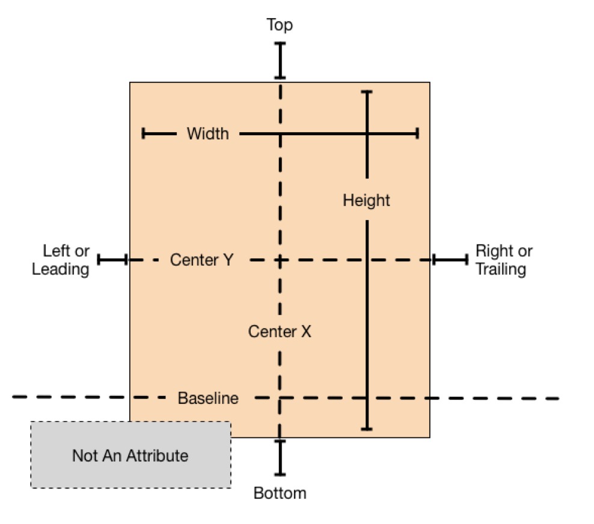
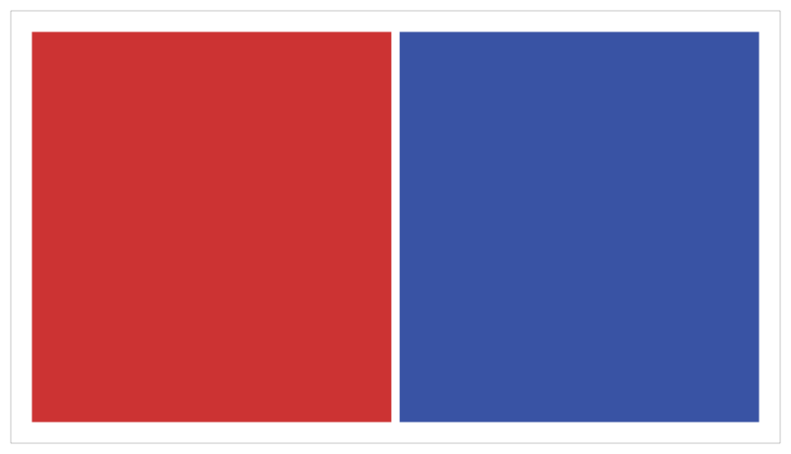

# Anatomy of a Constraint(剖析约束)

视图层次结构的布局被定义为一系列**线性方程**。每个约束都代表一个方程。你的目标是声明一系列有且只有一个可能解的方程。

示例方程如下所示。

<div align="center">    

</div>

这个约束规定，红色视图的`leading`(前面)必须距离蓝色视图`trailing`(后面)8个屏幕点。它的方程有几个部分:

* **Item 1** 等式中的第一项——在本例中是红色视图。`item`必须是视图或`layout guide`。
* **Attribute 1** 要约束在第一个`item`上的属性——在本例中，是红色视图的`leading`。
* **Relationship** 左右两边的关系。关系可以是三个值中的其中一个:**等于**、**大于或等于**或**小于或等于**。在这种情况下，左右两边相等。
* **Multiplier** 属性2的值乘以这个浮点数。在本例中，乘数是1.0。
* **Item 2** 等式中的第二项——在本例中是蓝色视图。与第一项不同的是，可以将其留空。
* **Attribute 2** 限制在第二个`item`上的属性——在本例中是蓝色视图的`trai`。如果第二项为空，则这必须不是一个属性。
* **Constant** 一个常量，浮点偏移量——在本例中为8.0。这个值被添加到属性2的值中。

在我们的用户界面中，大多数约束定义了两个**item**之间的关系。这些`item`可以是视图或`layout guide`。约束还可以定义单个`item`的两个不同属性之间的关系，例如，设置`item`的高度和宽度之间的宽高比。还可以将常量值分配给`item`的高度或宽度。当使用常量值时，第二项为空，第二个属性设置为非属性，乘数设置为0.0。

## Auto Layout Attributes(自动布局属性)

在自动布局中，属性定义了一个可以被约束的特性。一般来说，这包括四边(`edge`)(前面(`leading`)、后面(`trailing`)、顶部(`top`)和底部(`bottom`))，以及高度(`height`)、宽度(`width`)和垂直(`vertical`)和水平(`horizontal`)中心。文本`items`也有一个或多个`baseline`属性。

<div align="center">    

</div>


有关属性的完整列表，请参阅`NSLayoutAttribute`枚举。

>注意：尽管OS X和iOS都使用NSLayoutAttribute枚举，但它们定义的值稍有不同。要查看完整的属性列表，请确保查看的是正确的平台文档。

## Sample Equations(方程示例)

这些方程中广泛的参数和属性可以让你创建许多不同类型的约束。你可以定义视图之间的空间，对齐视图的边缘，定义两个视图的相对大小，甚至定义一个视图的宽高比。然而，并不是所有的属性都是兼容的。

属性有两种基本类型。大小属性(例如，高度和宽度)和位置属性(例如，`Leading`、`Left`和`Top`)。大小属性用于指定`item`的大小，而不指示其位置。位置属性用于指定`item`相对于其他东西的位置。然而，他们没有显示项目的大小。

考虑到这些差异，需要遵循以下规则:

* 不能将大小属性约束为位置属性。
* 不能将常量值分配给位置属性。
* 不能在位置属性中使用非标识乘数(1.0以外的值)。
* 对于位置属性，不能将垂直属性约束为水平属性。
* 对于位置属性，不能将`Leading`属性或`Trailing`属性约束为`Left`属性或`Right`属性。

例如，如果没有额外的上下文，将`item`的`Top`设置为常量值20.0就没有意义。你必须总是定义一个`item`的位置属性与其他`item`的关系，例如，在父视图顶部的20.0屏幕点以下。但是，将`item`的高度设置为20.0是完全有效的。有关更多信息，请参阅[Interpreting Values](https://developer.apple.com/library/archive/documentation/UserExperience/Conceptual/AutolayoutPG/AnatomyofaConstraint.html#//apple_ref/doc/uid/TP40010853-CH9-SW22)。

清单3-1列出了各种常见约束的示例方程。

>注意：本章所有的例子方程都是以伪代码形式给出，要查看使用实际代码的实际约束，请参阅 [Programmatically Creating Constraints](https://developer.apple.com/library/archive/documentation/UserExperience/Conceptual/AutolayoutPG/ProgrammaticallyCreatingConstraints.html#//apple_ref/doc/uid/TP40010853-CH16-SW1)或 [Auto Layout Cookbook](https://developer.apple.com/library/archive/documentation/UserExperience/Conceptual/AutolayoutPG/LayoutUsingStackViews.html#//apple_ref/doc/uid/TP40010853-CH3-SW1).

清单3-1 约束方程

```
/ Setting a constant height
View.height = 0.0 * NotAnAttribute + 40.0
 
// Setting a fixed distance between two buttons
Button_2.leading = 1.0 * Button_1.trailing + 8.0
 
// Aligning the leading edge of two buttons
Button_1.leading = 1.0 * Button_2.leading + 0.0
 
// Give two buttons the same width
Button_1.width = 1.0 * Button_2.width + 0.0
 
// Center a view in its superview
View.centerX = 1.0 * Superview.centerX + 0.0
View.centerY = 1.0 * Superview.centerY + 0.0
 
// Give a view a constant aspect ratio
View.height = 2.0 * View.width + 0.0

```

> 注意：在重新排序item时，请确保将乘数和常数颠倒过来。例如，常数8变成-8。2.0的乘数变成0.5。常数0.0和乘数1.0保持不变。

你会发现自动布局经常提供多种方法来解决相同的问题。理想情况下，你应该选择最清楚地描述你意图的解决方案。然而，不同的开发人员无疑会对哪种解决方案是最好的产生分歧。在这一点上，保持一致性比正确要好。如果你选择了一种方法并一直坚持下去，从长远来看，你将会经历较少的问题。例如，本教程使用以下经验法则:

1. **整数乘数比分数乘数更受欢迎**。
2. **正的常数比负的常数更受欢迎**。
3. **在可能的情况下，视图应该按照布局顺序出现:从上到下依次排列**。

## Creating Nonambiguous, Satisfiable Layouts(创建明确的、可满足的布局)

当使用自动布局时，目标是提供一系列方程，其中只有一个可能的解。模糊约束有不止一个可能的解。不可满足的约束没有有效解。

通常，约束必须定义每个视图的大小和位置(两个维度)。假设父视图的大小已经设置好了(例如，iOS中的一个场景的根视图)，**一个无歧义的、可满足的布局需要每个视图每个维度两个约束**(不包括父视图)。然而，在选择要使用哪些约束时，你有很多选择。例如，以下三种布局都能产生明确的、可满足的布局(只展示水平约束):

<div align="center">    

</div>
* 第一个布局限制了视图的`leading`相对于父视图的`leading`。它也给视图一个固定的宽度。`trailing`的位置可以根据父视图的大小和其他约束来计算。
* 第二个布局限制了视图的`leading`相对于父视图的`leading`。它也限制了视图的`trailing`相对于父视图的`trailing`。视图的宽度可以根据父视图的大小和其他约束来计算。
* 第三个布局限制了视图的`leading`相对于父视图的`leading`。它也会让视图和父视图居中对齐。宽度和`trailing`的位置都可以根据父视图的大小和其他约束来计算。

注意，每个布局都有一个视图和两个水平约束。在每种情况下，约束完全定义了视图的宽度和水平位置。这意味着所有的布局都会沿着水平轴产生一个明确的、可满足的布局。**然而，这些布局并不是同样有用。考虑一下当父视图的宽度改变时会发生什么**。

在第一个布局中，视图的宽度没有改变。大多数时候，这不是你想要的。实际上，作为一般规则，**你应该避免给视图分配常量大小**。自动布局是设计来创建布局，动态地适应它们的环境。当你约束一个固定大小的视图时，你就会限制这个特性。

这可能不是很明显，但是第二和第三个布局产生了相同的行为:**当父视图的宽度改变时，它们都在视图和它的父视图之间保持一个固定的边界**。然而，他们并不一定是平等的。一般来说，第二个例子更容易理解，但第三个例子可能更有用，特别是当你需要对许多`item`居中对齐时。和往常一样，为你的特定布局选择最佳方法。

现在考虑一些更复杂的事情。假设你想在iPhone上并排显示两个视图，你要确保它们所有的边距都很好，而且它们宽度是一样的，它们也应该在设备旋转时正确地调整大小。

下面的插图显示了纵向和横向的视图:

<div align="center">    

</div>

<div align="center">    

</div>


那么这些约束应该是什么样的呢?下面的插图展示了一个简单的解决方案:

<div align="center">    

</div>


上述解决方案使用了以下约束条件:

```
// Vertical Constraints
Red.top = 1.0 * Superview.top + 20.0
Superview.bottom = 1.0 * Red.bottom + 20.0
Blue.top = 1.0 * Superview.top + 20.0
Superview.bottom = 1.0 * Blue.bottom + 20.0
 
// Horizontal Constraints
Red.leading = 1.0 * Superview.leading + 20.0
Blue.leading = 1.0 * Red.trailing + 8.0
Superview.trailing = 1.0 * Blue.trailing + 20.0
Red.width = 1.0 * Blue.width + 0.0
```

按照前面的经验法则，这个布局有两个视图、四个水平约束和四个垂直约束。虽然这并不是一个绝对可靠的指南，但它能迅速表明你走在正确的道路上(While this isn’t an infallible guide, it is a quick indication that you’re on the right track. )。更重要的是，约束唯一地指定两个视图的大小和位置，从而产生一个明确的、可满足的布局。删除任何这些约束，布局就会变得不明确。添加额外的约束，就会有引入冲突的风险。

不过，这并不是唯一可能的解决方案。这里有一个同样有效的方法:

<div align="center">    

</div>


你不需要将蓝框的顶部和底部固定到它的父视图中，而是让蓝框的顶部与红框的顶部对齐。同样，将蓝框的底部与红框的底部对齐。约束条件如下所示：

```
// Vertical Constraints
Red.top = 1.0 * Superview.top + 20.0
Superview.bottom = 1.0 * Red.bottom + 20.0
Red.top = 1.0 * Blue.top + 0.0
Red.bottom = 1.0 * Blue.bottom + 0.0
 
//Horizontal Constraints
Red.leading = 1.0 * Superview.leading + 20.0
Blue.leading = 1.0 * Red.trailing + 8.0
Superview.trailing = 1.0 * Blue.trailing + 20.0
Red.width = 1.0 * Blue.width + 0.0
```

该示例仍然有两个视图、四个水平约束和四个垂直约束。它仍然产生一个明确的、可满足的布局。

> 但是哪一种方案更好呢？
>
> 这些解决方案都可以产生有效的布局。那么哪一个更好呢?
>
> 不幸的是，客观地证明一种方法严格地优于另一种方法几乎是不可能的。每一种都有自己的优缺点。
>
> 第一个解决方案在删除视图时更加健壮。从视图层次结构中删除一个视图也会删除引用该视图的所有约束。因此，如果您删除红色视图，蓝色视图将保留三个约束来保持它的位置。你只需要添加一个约束，就可以得到一个有效的布局。在第二个解决方案中，删除红色视图将只给蓝色视图留下一个约束。
>
> 另一方面，在第一个解决方案中，如果你希望视图的顶部和底部对齐，你必须确保它们的顶部和底部约束使用相同的常量值。如果你改变了一个常数，你必须记住也要改变另一个常数。

## Constraint Inequalities(约束不等式)

到目前为止，所有的例子都是约束等式，但这只是介绍了一部分。约束也可以表示不等式，具体地说，约束的关系可以等于、大于或等于、小于或等于。

例如，您可以使用约束来定义视图的最小或最大尺寸(清单3-3)。

清单3-3 指定最小和最大尺寸

```
// Setting the minimum width
View.width >= 0.0 * NotAnAttribute + 40.0
 
// Setting the maximum width
View.width <= 0.0 * NotAnAttribute + 280.0
```

**一旦你开始使用不等式，每个视图每个维度的两个约束规则就失效了**。**你总是可以用两个不等式来代替一个等式关系**。在清单3-4中，单个相等关系和一对不等式产生相同的行为。

清单3-4 用两个不等式代替一个相等关系

```
// A single equal relationship
Blue.leading = 1.0 * Red.trailing + 8.0
 
// Can be replaced with two inequality relationships
Blue.leading >= 1.0 * Red.trailing + 8.0
Blue.leading <= 1.0 * Red.trailing + 8.0
```

相反的并不总是正确的，因为两个不等式并不总是等价于一个相等关系。

例如，清单3-3中的不等式限制了视图宽度的可能值的范围——但是它们本身并没有定义宽度。你仍然需要额外的水平约束来定义视图在这个范围内的位置和大小。

## Constraint Priorities(约束优先级)

默认情况下，所有约束都是有优先级。自动布局必须计算出满足所有约束的解决方案。如果不能，则会发生错误。 自动布局将关于无法满足的约束的信息打印到控制台，并选择要修复的约束之一(Auto Layout prints information about the unsatisfiable constraints to the console, and chooses one of the constraints to break. )。然后，它在没有破坏约束的情况下重新计算解。有关更多信息，请参见[Unsatisfiable Layouts](https://developer.apple.com/library/archive/documentation/UserExperience/Conceptual/AutolayoutPG/ConflictingLayouts.html#//apple_ref/doc/uid/TP40010853-CH19-SW1)。

你还可以创建可选的约束，所有约束的优先级都在1到1000之间，优先级为1000的约束是必需的，所有其他约束都是可选的。

在计算解决方案时，自动布局尝试以优先级从高到低的顺序满足所有约束。如果它不能满足一个可选的约束，则跳过该约束并继续执行下一个约束。

即使一个可选的约束没有满足条件，它仍然会影响布局。如果在跳过约束后布局中存在任何歧义，则系统会选择最接近约束的解决方案。这样，未满足的可选约束会成为向其拉动视图的力量。

**可选的约束条件和不等式通常是密不可分的**。例如，在清单3-4中，你可以为这两个不等式提供不同的优先级。大于或等于关系可能是必需的(优先级为1000)，小于或等于关系的优先级较低(优先级为250)。这意味着蓝色视图不能靠近红色视图`trailing`的8个屏幕点。然而，其他限制因素可能会把它拉得更远。尽管如此，可选的约束将蓝色视图拉向红色视图，确保它尽可能接近8个屏幕点的间距(给定布局中的其他约束)。

> 注意：不必强制使用所有1000个优先级值。事实上，优先级一般应该围绕系统定义的低(250)、中(500)、高(750)和必需(1000)优先级。You may need to make constraints that are one or two points higher or lower than these values, to help prevent ties. If you’re going much beyond that, you probably want to reexamine your layout’s logic.
>
> 有关iOS上预定义的约束常量列表，请参阅UILayoutPriority enum。对于OS X，请参阅布局优先级常量。

## Intrinsic Content Size(内部内容尺寸)

到目前为止，所有的例子都使用了约束来定义视图的位置和大小。然而，有些视图有一个给定的当前内容的自然大小。这被称为它们的`Intrinsic Content Size`。例如，一个`button`的内部内容尺寸是它的标题大小加上一个小的边距(For example, a button’s intrinsic content size is the size of its title plus a small **margin**.)。

不是所有的视图都有内部内容尺寸。对于这样做的视图，内部内容尺寸可以定义视图的高度、宽度或两者。如表3-1所示。

表3-1常用控件的内部内容尺寸

| View                                       | Intrinsic content size                                       |
| ------------------------------------------ | ------------------------------------------------------------ |
| UIView and NSView                          | 没有 intrinsic content size                                  |
| Sliders                                    | 只定义宽度(iOS)<br/>根据滑块的类型(OS X)定义宽度、高度或两者都定义。 |
| Labels, buttons, switches, and text fields | 定义高度和宽度                                               |
| Text views and image views                 | Intrinsic content size可以变化                               |

内部内容尺寸基于视图的当前内容。**Label或Button的内部内容尺寸是基于显示的文本数量和使用的字体**。对于其他视图，内部内容尺寸更加复杂。例如，一个空的`image view`没有内在的内容大小。但是，一旦添加了图像，其内部内容尺寸就会被设置为图像的大小。

文本视图的内部内容尺寸取决于内容本身、是否启用了滚动，以及应用于视图的其他约束。例如，在启用滚动时，视图没有内部内容尺寸。**在禁用滚动的情况下，默认情况下，视图的内部内容尺寸是根据不带换行的文本大小计算的**。例如，如果文本中没有换行，它将计算将内容布局为一行文本所需的高度和宽度。如果你添加约束来指定视图的宽度，内部内容尺寸定义了显示给定宽度的文本所需的高度。

**自动布局使用每个维度的一对约束来表示视图的内部内容尺寸。content hugging将视图向内拉，使其紧贴着内容。`compression resistance `将视图向外推，这样它就不会剪掉内容**。

<div align="center">    

</div>

这些约束是使用清单3-5中所示的不等式定义的。这里，`IntrinsicHeight`和`IntrinsicWidth`常量代表了来自视图内部内容尺寸的高度和宽度值。

清单3-5 **Compression-Resistance**和**Content-Hugging**方程

```
// Compression Resistance
View.height >= 0.0 * NotAnAttribute + IntrinsicHeight
View.width >= 0.0 * NotAnAttribute + IntrinsicWidth
 
// Content Hugging
View.height <= 0.0 * NotAnAttribute + IntrinsicHeight
View.width <= 0.0 * NotAnAttribute + IntrinsicWidth
```

每个约束都有自己的优先级。默认情况下，视图的**Content-Hugging**优先级为250，**Compression-Resistance**优先级为750。**因此，拉伸视图比收缩视图更容易**。对于大多数控件来说，这是期望的行为。例如，你可以安全地拉伸一个大于其内部内容尺寸的按钮;然而，如果你缩小它，它的内容可能会被剪切。请注意，`Interface Builder`可能偶尔会修改这些优先级，以防止绑定。更多信息，请参阅 [Setting Content-Hugging and Compression-Resistance Priorities](https://developer.apple.com/library/archive/documentation/UserExperience/Conceptual/AutolayoutPG/WorkingwithConstraintsinInterfaceBuidler.html#//apple_ref/doc/uid/TP40010853-CH10-SW2)。

只要可能，在布局中使用视图的内部内容尺寸。它允许你的布局动态地适应视图内容的变化。它还减少了创建一个无歧义、无冲突的布局所需要的约束，但你将需要管理视图的`content-hugging`和`compression-resistance`(**CHCR**)优先级。以下是一些处理内部内容尺寸的技巧:

* 当拉伸一系列视图来填充空间时，如果所有视图都具有相同的`content-hugging`优先级，那么布局是不明确的。自动布局不知道哪个视图应该被拉伸。

  一个常见的例子是`label`和`text field`在同一水平上成对。通常，你希望`text field`拉伸以填充额外的空间，而`label`保持其固有的内容大小。要确保这一点，请确保`text field`的水平`content-hugging`优先级低于`label`的优先级。

  实际上，这个示例非常常见，以至于`Interface Builder`自动为你处理它，将所有`label`的`content-hugging`设置为251。如果你正在以编程方式创建布局，则需要自己修改`content-hugging`优先级。

* 当带有不可见背景的视图(如`button`或`label`)被意外拉伸到超出其内部内容尺寸时，经常会出现奇怪和意想不到的布局。实际的问题可能并不明显，因为文本只是出现在了错误的位置。为了防止不必要的拉伸，增大`content-hugging`优先级。

* `Baseline`约束只适用于处于其内部内容高度的视图。如果视图被垂直拉伸或压缩，基线约束不再正确对齐。

* 有些视图，比如开关，应该始终以其内部内容尺寸显示。根据需要增加他们的`CHCR`优先级，以防止拉伸或压缩。

* 避免为视图添加`required`的`CHCR`优先级，通常，视图大小错误要比它意外地产生冲突要好。如果视图应该始终保持其内部内容尺寸，那么考虑使用非常高的优先级(999)。

  > This approach generally keeps the view from being stretched or compressed but still provides an emergency pressure valve, just in case your view is displayed in an environment that is bigger or smaller than you expected.

### Intrinsic Content Size Versus Fitting Size

`Intrinsic Content Size`充当自动布局的输入。当一个视图具有`Intrinsic Content Size`时，系统会生成约束来表示该大小，并使用约束来计算布局。

另一方面，`Fitting size`是自动布局引擎的输出。它是根据视图的约束为视图计算的大小。**如果视图使用自动布局来布局它的子视图，那么系统可能能够根据它的内容为视图计算一个合适的大小**。

`stack view`就是一个很好的例子，排除任何其他限制，系统根据其内容和属性计算`stack view`的大小。在许多方面，`stack view`的作用就像它自有一个`Intrinsic Content Size`:你可以创建一个有效的布局，只需使用一个垂直和一个水平的约束来定义它的位置。但是**它的大小是由自动布局计算的**——它不是自动布局的输入。设置`stack view`的`CHCR`优先级没有效果，因为`stack view`没有`Intrinsic Content Size`。

如果你需要相对于`stack view`之外的`item`来调整`stack view`的`fitting size`，可以创建显式的约束来捕获这些关系，或者修改`stack view`内容相对于`stack view`之外的`item`的`CHCR`优先级。

## Interpreting Values

自动布局中的值总是以`points`为单位。然而，这些度量的确切含义可能会根据所涉及的属性和视图的布局方向而变化。

| Auto Layout Attributes                                       | Value    | Notes                                                        |
| ------------------------------------------------------------ | -------- | ------------------------------------------------------------ |
| Height<br>Width | 视图尺寸 | 这些属性可以被赋值为常量，也可以与其他高度和宽度属性组合使用。这些值不能为负。 |
|                                                              |          |                                                              |
|                                                              |          |                                                              |
|                                                              |          |                                                              |
|                                                              |          |                                                              |

