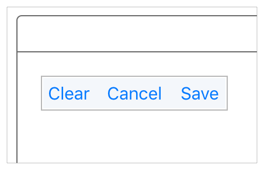
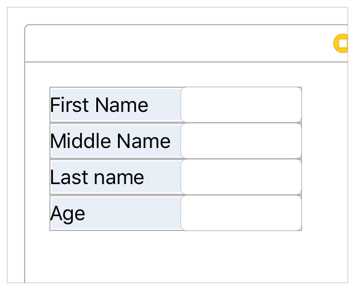

## Auto Layout Without Constraints

`Stack views`提供了一种简单的方法来利用自动布局的强大功能，而不会引入复杂的约束。一个`stack view`定义了用户界面元素的行或列。`stack view`根据其属性排列这些元素。

* `axis`: (只有`UIStackView`) 定义了`stack view`的方向，垂直或水平
* `orientation`:(只有`NSStackView`)定义了`stack view`的方向，垂直或水平
* `distribution`:沿`axis`定义视图的布局。
* `alignment`:定义垂直于`stack view`的`axis`的视图布局。
* `spacing`: 定义相邻视图之间的间距。

若要使用`stack view`，请在`Interface Builder`中将垂直或水平的`stack view`拖到画布上。然后拖出内容并将其放入`stack`中。

如果对象具有固有的内容大小，则该对象将以该大小显示在`stack`中。如果没有固有内容大小，则`Interface Builder`将提供默认大小。你可以调整对象的大小，然后`Interface Builder`添加约束来保持其大小。

为了进一步调整布局，你可以使用`Attributes`检查器修改`stack view`的属性。例如，下面的示例使用8个屏幕点的间距均匀填充分布。

    

`stack view`的布局还基于排列视图的`content-hugging`和`compression-resistance` 优先级。你可以使用`Size inspector`来修改它们。

> 注意：你可以直接添加约束到排列视图中，然而，你想要避免任何可能的冲突:从经验上来说，如果一个视图的大小默认为一个给定维度的内在内容大小，你可以安全地为这个维度添加一个约束。如果视图的大小默认返回给定维度的固有内容大小，则可以安全地为该维度添加视图约束。有关约束冲突的更多信息，参阅[Unsatisfiable Layouts](https://developer.apple.com/library/archive/documentation/UserExperience/Conceptual/AutolayoutPG/ConflictingLayouts.html#//apple_ref/doc/uid/TP40010853-CH19-SW1).

此外，你还可以在其他`stack view`中嵌套`stack view`，以构建更复杂的布局。

    

一般来说，使用`stack view`来管理尽可能多的布局。**只有当你不能仅通过`stack view`实现目标时，才求助于创建约束**。

关于使用`stack view`的更多信息，请参阅 [UIStackView Class Reference](https://developer.apple.com/documentation/uikit/uistackview)或[NSStackView Class Reference](https://developer.apple.com/documentation/appkit/nsstackview)。

> 注意：虽然创造性地使用嵌套的`stack view`可以产生复杂的用户界面，但你不能完全摆脱对约束的需要。至少，你总是需要约束来定义最外层`stack`的位置(可能还有大小)。

# 源文档

[Auto Layout Without Constraints](https://developer.apple.com/library/archive/documentation/UserExperience/Conceptual/AutolayoutPG/AutoLayoutWithoutConstraints.html#//apple_ref/doc/uid/TP40010853-CH8-SW1)