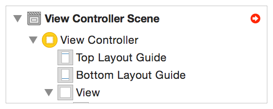
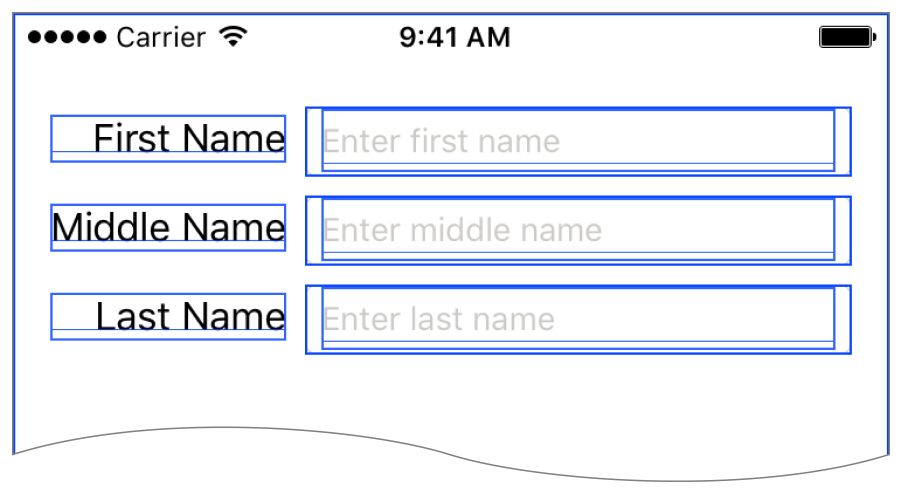
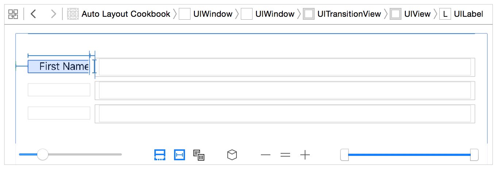

# Types of Errors

自动布局错误可以分为三大类：

* 布局不满足，你的布局没有有效解决方案（即根据当前约束，无法确定控件位置大小）
* 模糊布局，你的布局有两个或更多的可能的解决方案（不能唯一确定控件的位置大小）
* 逻辑错误，布局逻辑有问题

大多数时候，真正的问题只是需要确定哪里出了问题。你添加了你认为需要的约束条件，但当你运行应用程序时，事情的结果并不是你希望的那样。

通常，一旦你理解了问题，解决方案是显而易见的。**删除冲突的约束**，**添加缺失的约束**，**调整并列的优先级**，这样就有一个明确的布局。当然，要想容易理解问题，可能需要进行一些实验试错。和其他技能一样，熟能生巧。

然而，有时事情会变得更加复杂，也是本文存在的原因。

# Unsatisfiable Layouts

当系统无法为当前的约束集找到有效的解决方案时，就会出现不可满足的布局。两个或多个必需的约束发生冲突，因为它们不可能同时都为真。

## Identifying Unsatisfiable Constraints

通常，`Interface Builder`可以在设计时检测到冲突。在这种情况下，`Interface Builder`会以多种方式显示错误:

* **所有冲突的约束都用红色绘制在画布上**
* **Xcode在问题导航器中将冲突的约束列为警告**
* I**nterface Builder在文档大纲的右上角显示一个红色的箭头**

<div align="center">    

</div>

单击箭头显示当前布局中所有自动布局问题的列表，`Interface Builder`通常会建议修复这些问题。

> 注意：虽然Interface Builder提供的即时反馈使创建有效的布局变得更加容易，但它不能找到所有可能的布局错误。
>
> 例如，Interface Builder仅以画布的当前大小检测冲突；但是，仅当根视图被拉伸或缩小到特定点之外（或内容扩展或缩小到特定点之外）时，才会发生某些冲突。Interface Builder无法检测到这些冲突。
>
> 有时候根据IB修复问题还是不够，仍需要对大部分情况进行运行时测试。

当系统在运行时检测到不能满足的布局时，会执行以下步骤:

1. 自动布局标记一组冲突的约束
2. 系统`break`一个冲突约束，然后重新布局，一直`break`冲突的约束，直到找到一个有效的布局
3. 系统将有关冲突和破坏约束的信息打印到控制台

这个反馈系统让应用程序继续运行，同时仍然试图向用户呈现一些有意义的东西。然而，打破约束的效果在不同的布局，甚至在不同的构建之间可能会有很大的不同。

在许多情况下，缺失的约束可能没有任何可见的效果。视图层次结构与你预期的完全一样。在其他情况下，缺少约束可能导致视图层次结构的整个部分错位、大小错误，或者完全消失。

当错误没有明显影响时，人们往往会忽略它们——毕竟，它们不会改变应用程序的行为。但是，对视图层次结构更改或SDK可能改变破坏的约束集，突然产生一个明显错误的布局。

因此，在检测到不可满足的约束错误时，始终要修复它们，为了确保在测试过程中捕捉到不明显的错误，给`UIViewAlertForUnsatisfiableConstraints`下一个断点。

## Preventing Unsatisfiable Constraints

无法满足的约束相对容易解决，系统会告诉你无法满足的约束何时发生，并向你提供一个冲突约束的列表。一旦你知道了错误，解决方案通常是非常直接的，要么删除其中一个约束，要么将其更改为一个可选约束。

然而，有几个共同的问题值得我们更详细地研究:

* 当以编程方式向视图层次结构添加视图时，经常会出现无法满足的约束。默认情况下，新视图的`translatesAutoresizingMaskIntoConstraints`属性设置为`YES`。当您开始在画布中为视图绘制约束时，`Interface Builder`会自动将此属性设置为`NO`。**然而，当你以编程方式创建和布局你的视图时，你需要在添加你自己的自定义约束之前将属性设置为NO**。

* 当视图层次结构出现在一个太小的空间时，常常会出现无法满足的约束。

  你通常可以预测视图可以访问的最小空间，并适当地设计你的布局，然而，国际化和动态类型都可能导致视图的内容比预期的要大得多，随着可能的排列数量的增加，越来越难以保证你的布局将在所有情况下工作。

  考虑将一些`required`的约束转换为高优先级的可选约束，这些约束允许你控制当冲突发生时布局将在何处中断。
  例如，将故障点的优先级设置为999。在大多数情况下，这种高优先级的约束似乎是`required`的；然而，当冲突发生时，高优先级约束中断，保护布局的其余部分。

  类似地，避免给具有`intrinsic content size`的视图提供所需的`content-hugging` 或 `compression-resistance`优先级。

  > Typically, a control’s size acts as an ideal failure point. The control can be a little bigger or a little smaller without having any meaningful effect on the layout.

  是的，有一些控件应该只显示其`intrinsic content size`；然而，即使是在这些情况下，通常最好是有几个点的控制，而不是让你的布局以不可预知的方式中断。

# Ambiguous Layouts

当约束系统有两个或两个以上的有效解时，会出现模糊布局。主要有两个原因:

* 布局需要额外的约束来唯一地指定每个视图位置。

  在确定哪些视图是不明确的之后，只需添加约束来唯一地指定视图的位置和大小。

* 布局具有相同优先级的可选约束冲突，并且系统不知道应该打破哪个约束。

  这里，你需要通过更改优先级，使它们不再相等，来告诉系统它应该打破哪个约束，系统首先打破优先级最低的约束。

## Detecting Ambiguous Layouts

对于无法满足要求的布局，`Interface Builder`通常可以在设计时检测并提供修复模糊布局的建议，这些歧义在问题导航器中显示为警告，在文档大纲中显示为错误，在画布中显示为红线。更多信息，请参阅[Identifying Unsatisfiable Constraints](https://developer.apple.com/library/archive/documentation/UserExperience/Conceptual/AutolayoutPG/ConflictingLayouts.html#//apple_ref/doc/uid/TP40010853-CH19-SW3)

与无法满足的布局一样，`Interface Builder`无法检测到所有可能的歧义，许多错误只有通过测试才能发现。

当运行时出现不明确的布局时，自动布局会选择一种可能的解决方案来使用，这意味着布局可能如你所期望的那样出现，也可能不出现。此外，没有向控制台写入警告，也没有办法为不明确的布局设置断点。

因此，模糊的布局往往比不满足的布局更难检测和识别，即使歧义确实有一个明显的、可见的影响，也很难确定错误是由于歧义还是布局逻辑产生的。

幸运的是，你可以调用一些方法来帮助识别不明确的布局，所有这些方法都应该只用于调试，在某个可以访问视图层次结构的地方设置一个断点，然后从控制台调用以下方法之一:

* hasAmbiguousLayout | 在一个错位的视图上调用这个方法，如果视图的`frame`是不明确的，它返回YES。否则，返回NO。
* exerciseAmbiguityInLayout | 在布局不明确的视图上调用此方法，这将在可能的有效解决方案之间切换系统。
* constraintsAffectingLayoutForAxis | 仅用于iOS，在视图上调用此方法。它返回沿指定轴影响该视图的所有约束的数组
* constraintsAffectingLayoutForOrientation | 仅用于OSX，在视图上调用这个方法。它返回沿指定方向影响该视图的所有约束的数组
* _autolayoutTrace | 在iOS中可用的私有方法，在视图上调用此方法，它返回一个字符串，其中包含关于该视图的整个视图层次结构的诊断信息。**不明确的视图被标记，将translatesAutoresizingMaskIntoConstraints设置为YES的视图也是如此**。

你可以在控制台使用OC的语法运行这些命令，例如，断点之后，输入`call [self.myView exerciseAmbiguityInLayout]`来调用方法，类似地，输入`po [self.myView autolayoutTrace]`来输出有关`myView`诊断信息。

> 注意：在运行上面列出的诊断方法之前，请确保修复Interface Builder发现的任何问题，Interface Builder试图修复它发现的任何错误，这意味着，如果它发现一个不明确的布局，它会添加约束，使布局不再不明确。
>
> 结果，hasAmbiguousLayout返回NO。exerciseAmbiguityInLayout似乎没有任何影响，constraintsAffectingLayoutForAxis:可能会返回额外的、意想不到的约束。

# Logical Errors

> Logical errors are simply bugs. Somewhere, you have an assumption that is faulty. Perhaps it’s an assumption about how Auto Layout calculates the views’ frames. Perhaps it’s an assumption about the set of constraints that you’ve created, or the view properties you’ve set. Perhaps it’s an assumption about how the constraints interact to create complex behaviors. Regardless, something somewhere does not quite match your mental model.

> Logical errors are the hardest to find. After you eliminate all other possibilities, whatever remains, however improbable, must be a logical error. However, even after you’ve determined that you have a bug, you must still discover where, exactly, the faulty assumption lies.

这里没有工具或步骤说明，修复逻辑错误通常涉及试验和反复测试，以确定问题并找出修复它的方法。然而，有一些建议可能会有所帮助:

* 检查现有的约束条件，确保没有遗漏任何约束或意外添加不需要的约束，确保所有约束都附加到正确的`item`和属性上。

* 再次检查视图的`frame`，确保没有任何意外的拉伸或收缩。
  这对于背景不可见的视图(如`label`或`button`)尤其重要，当这些`item`被意外地调整大小时，可能并不明显

  调整大小的一个症状是基线对齐的视图不再正确对齐。这是因为基线对齐仅在视图显示在其`intrinsic content height`时有效，如果垂直地拉伸或收缩视图，文本就会神秘地出现在错误的位置上。

* 如果一个控件总是匹配它`intrinsic content size`，那么给它一个非常高的`content-hugging` 和`compression-resistance`优先级(例如，999)。

* Look for any assumptions that you’re making about the layout, and add explicit constraints to make sure those assumptions are true.(实在是拗口)

  记住，无法满足的布局通常是最容易找到和修复的问题，在出现冲突之前添加其他约束，然后检查并修复冲突。

* 试着理解为什么给定的约束条件会产生你看到的结果，如果你理解了它，你就在解决它的路上了。

* 尝试不同的约束条件，自动布局通常为同一问题提供许多不同的解决方案，尝试不同的方法可能会解决问题，或者至少更容易发现错误。

# Debugging Tricks and Tips

下面的主题描述了收集和组织关于布局的信息的技术，以及你可能会遇到的一些令人惊讶的行为的描述。你可能不需要在每个布局上都使用这些技巧，但它们可以帮助你解决甚至是最困难的问题。

## Understanding the Logs

关于视图的信息可以打印到控制台，要么因为有一个不满足的布局，要么因为你使用`constraintsAffectingLayoutForAxis:`或`constraintsAffectingLayoutForOrientation:` **debugging**方法显式地记录了约束。

无论采用哪种方式，你都可以在这些日志中找到许多有用的信息，下面是一个无法满足的布局错误的示例输出:

```
2015-08-26 14:27:54.790 Auto Layout Cookbook[10040:1906606] Unable to simultaneously satisfy constraints.
    Probably at least one of the constraints in the following list is one you don't want. Try this: (1) look at each constraint and try to figure out which you don't expect; (2) find the code that added the unwanted constraint or constraints and fix it. (Note: If you're seeing NSAutoresizingMaskLayoutConstraints that you don't understand, refer to the documentation for the UIView property translatesAutoresizingMaskIntoConstraints) 
(
    "<NSLayoutConstraint:0x7a87b000 H:[UILabel:0x7a8724b0'Name'(>=400)]>",
    "<NSLayoutConstraint:0x7a895e30 UILabel:0x7a8724b0'Name'.leading == UIView:0x7a887ee0.leadingMargin>",
    "<NSLayoutConstraint:0x7a886d20 H:[UILabel:0x7a8724b0'Name']-(NSSpace(8))-[UITextField:0x7a88cff0]>",
    "<NSLayoutConstraint:0x7a87b2e0 UITextField:0x7a88cff0.trailing == UIView:0x7a887ee0.trailingMargin>",
    "<NSLayoutConstraint:0x7ac7c430 'UIView-Encapsulated-Layout-Width' H:[UIView:0x7a887ee0(320)]>"
)
 
Will attempt to recover by breaking constraint
<NSLayoutConstraint:0x7a87b000 H:[UILabel:0x7a8724b0'Name'(>=400)]>
 
Make a symbolic breakpoint at UIViewAlertForUnsatisfiableConstraints to catch this in the debugger.
The methods in the UIConstraintBasedLayoutDebugging category on UIView listed in <UIKit/UIView.h> may also be helpful.
```

这个错误消息显示了五个相互冲突的约束，并不是所有的约束条件都能同时成立，你需要删除一个约束，或者将其转换为一个可选的约束。

幸运的是，视图层次结构相对简单。你有一个父视图，包含一个`label`和一个`text field`。冲突的约束设置了以下关系:

1. `label`宽度大于等于400pt
2. `label`的`leading`edge等于父视图的`leading` marigin
3. `label`与`text field`之间有8pt的距离
4. `text field`的`trailing` edge等于父视图的`trailing` margin
5. 父视图的宽度设置为320pt

系统试图通过打破`label`的宽度约束进行恢复。

> 注意：约束使用可视格式语言写入控制台，即使你从未使用可视化格式语言来创建自己的约束，你也必须能够阅读和理解它，从而有效地调试自动布局问题。有关更多信息，请参阅[Visual Format Language](https://developer.apple.com/library/archive/documentation/UserExperience/Conceptual/AutolayoutPG/VisualFormatLanguage.html#//apple_ref/doc/uid/TP40010853-CH27-SW1).

在这些约束中，最后一个是由系统创建的，你无法改变它。此外，它与第一个约束产生了明显的冲突。如果你的父视图只有`320pt`，你永远不会有`400pt`的`label`。幸运的是，你不必摆脱第一个限制。如果你把它的优先级降低到999，系统仍然试图提供所选择的宽度，尽可能接近，同时仍然满足其他约束。

基于`autoresizing mask`创建的约束会有额外的关于该`mask`的信息，在约束的内存地址后面，日志字符串"h="后面跟着三个字符，"v="后面跟着三个字符，"-"表示一个固定值，"&"表示一个可变的值。"h="这三个字符表示左边距，宽度和右边距，"v="这个三个字符表示顶部边距、高度、底部边距。

例如，下面的日志信息:

```
<NSAutoresizingMaskLayoutConstraint:0x7ff28252e480 h=--& v=--& H:[UIView:0x7ff282617cc0(50)]>"
```

这个日志包括以下几部分 :

* `NSAutoresizingMaskLayoutConstraint:0x7ff28252e480` ： 约束类型以及它的内存地址，在本例，它表示是由`autoresizing mask`自动生成的
* `h=--& v=--&`:视图的`autoresizing mask`，这个是默认的`mask`，水平方向，它有固定的左边距、宽度和可变的右边距；垂直方向，它有固定的顶部边距、高度和可变的底部边距。换句话说，当父视图的大小改变时，视图的左上角和大小保持不变。
* `H:[UIView:0x7ff282617cc0(50)]`: 约束的可视格式语言描述。在这个例子中，它定义了一个宽度为50点的单一视图，此描述还包含受约束影响的任何视图的类和地址。

## Adding Identifiers to the Logs

尽管前面的例子相对容易理解，但较长的约束列表很快就会变得难以理解。通过为每个视图和约束提供有意义的标识符，可以使日志更易于阅读。

如果视图有一个明显的文本组件，`Xcode`会把它用作标识符。例如，`Xcode`使用标签的文本、按钮的标题或文本框的占位符来标识这些视图。因此，在`Identity inspector`中设置视图的`Xcode`特定标签， `Interface Builder`在其整个接口中使用这些标识符，其中许多也显示在控制台日志中。

对于约束，可以通过编程方式或使用`Attribute inspector`设置它们的标识符属性，自动布局在将信息打印到控制台时使用这些标识符。

例如，下面是相同的标识符集合的不可满足的约束错误:

```
2015-08-26 14:29:32.870 Auto Layout Cookbook[10208:1918826] Unable to simultaneously satisfy constraints.
    Probably at least one of the constraints in the following list is one you don't want. Try this: (1) look at each constraint and try to figure out which you don't expect; (2) find the code that added the unwanted constraint or constraints and fix it. (Note: If you're seeing NSAutoresizingMaskLayoutConstraints that you don't understand, refer to the documentation for the UIView property translatesAutoresizingMaskIntoConstraints) 
(
    "<NSLayoutConstraint:0x7b58bac0 'Label Leading' UILabel:0x7b58b040'Name'.leading == UIView:0x7b590790.leadingMargin>",
    "<NSLayoutConstraint:0x7b56d020 'Label Width' H:[UILabel:0x7b58b040'Name'(>=400)]>",
    "<NSLayoutConstraint:0x7b58baf0 'Space Between Controls' H:[UILabel:0x7b58b040'Name']-(NSSpace(8))-[UITextField:0x7b589490]>",
    "<NSLayoutConstraint:0x7b51cb10 'Text Field Trailing' UITextField:0x7b589490.trailing == UIView:0x7b590790.trailingMargin>",
    "<NSLayoutConstraint:0x7b0758c0 'UIView-Encapsulated-Layout-Width' H:[UIView:0x7b590790(320)]>"
)
 
Will attempt to recover by breaking constraint
<NSLayoutConstraint:0x7b56d020 'Label Width' H:[UILabel:0x7b58b040'Name'(>=400)]>
 
Make a symbolic breakpoint at UIViewAlertForUnsatisfiableConstraints to catch this in the debugger.
The methods in the UIConstraintBasedLayoutDebugging category on UIView listed in <UIKit/UIView.h> may also be helpful.
```

如你所见，这些标识符允许你快速、轻松地识别日志中的约束。

## Visualizing Views and Constraints

`Xcode`提供了帮助你可视化视图和视图层次结构中的约束的工具。

要查看模拟器中的视图:

* 在模拟器中运行App
* 切换到Xcode
* 选择Debug > View Debugging > Show Alignment Rectangles，此设置勾勒出视图的边缘。

<div align="center">    

</div>

` alignment rectangles `是自动布局使用的边缘，打开此选项可以让你快速发现任何调整了意外大小的对齐矩形。

如果你需要更多信息，点击视图层级调试按钮。然后`Xcode`会显示一个交互式视图调试器，给你提供了许多工具来探索和与视图层次结构进行交互。在调试自动布局问题时，"`Show clipped content`"和"`Show constraints`"选项特别有用

<div align="center">    

</div>

启用"`Show clipped content`"选项将显示视图的位置，这些视图可能被意外地定位在屏幕之外。启用"`Show constraints`"选项将显示所有影响当前所选视图的约束，这两种选项都可以在事情开始异常时提供快速的全面检查。

更多信息请参阅 [Debug Area Help](http://help.apple.com/xcode)

## Understanding Edge Cases

下面是一些可能导致自动布局以意想不到的方式表现的边缘情况:

* 自动布局定位视图基于它们的`alignment rectangles`，而不是他们的`frame`，大多数情况下，这些值是相同的，然而，一些视图可能会设置一个`alignment rectangle`来从布局计算中排除视图的部分(例如，`badges`)。

  更多信息，请参阅`Aligning Views with Auto Layout`[UIView Class Reference](https://developer.apple.com/documentation/uikit/uiview)

* 在iOS中，你可以使用视图的`transform`属性来调整大小、旋转或移动视图；但是，这些转换不会以任何方式影响`Auto Layout`的计算，自动布局根据视图的未转换的`frame`计算其`alignment rectangle`

* 视图可以显示其`bounds`之外的内容，大多数情况下，视图正确的行为是将其内容限制在自己的范围内。然而，出于性能方面的原因，这并不是图形引擎强制执行的，这意味着视图(特别是带有自定义绘图的视图)可能以与其`frame`不同的大小绘制。

  你可以通过设置视图的`clipsToBounds`属性为`YES`或验证视图`frame`的大小来识别这些bug。

* `NSLayoutAttributeBaseline`, `NSLayoutAttributeFirstBaseline`和`NSLayoutAttributeLastBaseline`属性只有在所有视图在其`intrinsic content height`显示时才正确对齐文本，如果其中一个视图垂直拉伸或收缩，它的文本可能出现在错误的位置。

* 约束优先级作为跨整个视图层次结构的全局属性，你可以通过在`stack view`、`layout guide`或虚拟视图中分组视图来简化你的布局；然而，这种方法并没有封装所包含的视图的优先级。自动布局继续比较组内优先级与组外优先级(甚至其他组内的优先级)。

* 纵横比约束允许水平和垂直约束交互，通常情况下，水平和垂直布局分开计算，然而，如果你约束一个视图的高度相对于宽度，你已经在垂直和水平约束之间创建了一个连接:它们现在可以相互影响和冲突，这些交互极大地增加了布局的复杂性，并可能导致布局中不相关部分之间的意外冲突。

# 源文档

[Debugging Tricks and Tips](https://developer.apple.com/library/archive/documentation/UserExperience/Conceptual/AutolayoutPG/DebuggingTricksandTips.html#//apple_ref/doc/uid/TP40010853-CH21-SW1)

