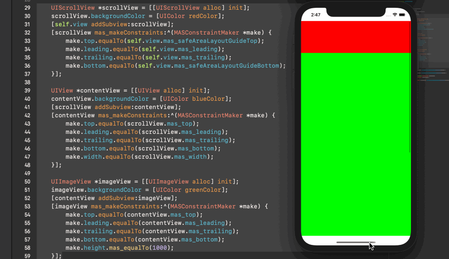
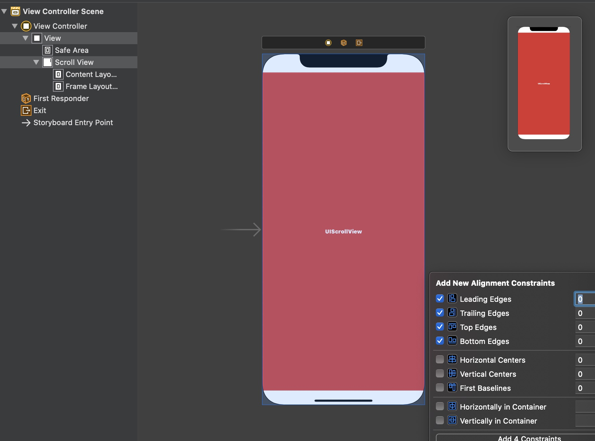
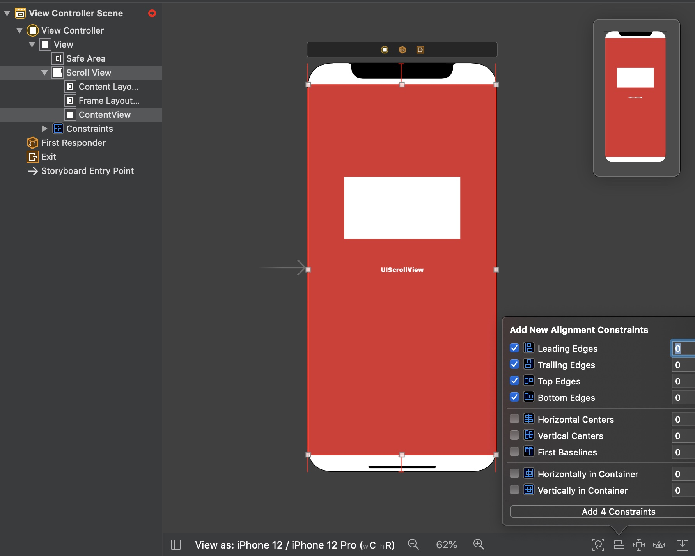
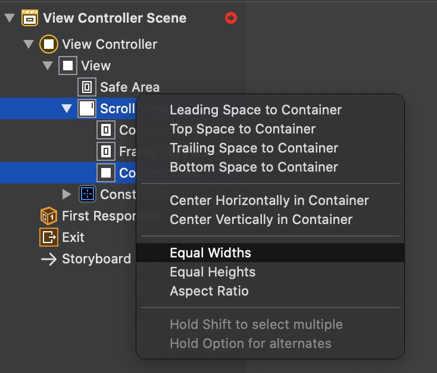
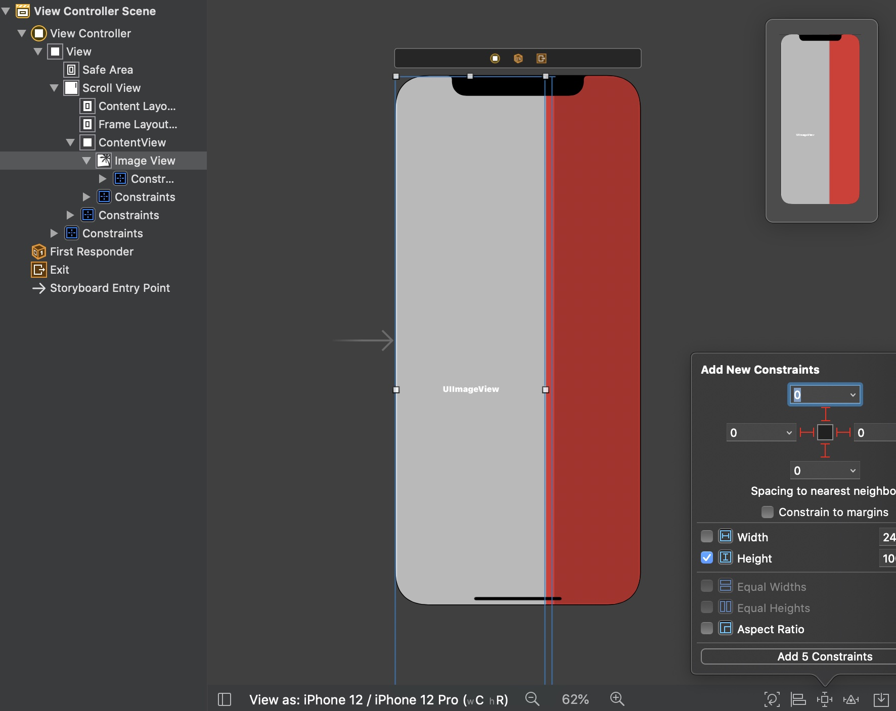

# 编码的方式实现

为了方便，使用第三方库`Masonry`建立约束。

以下是按照官方文档的介绍构建的，原文介绍在[WorkingwithScrollViews](https://developer.apple.com/library/archive/documentation/UserExperience/Conceptual/AutolayoutPG/WorkingwithScrollViews.html#//apple_ref/doc/uid/TP40010853-CH24-SW1)

```objective-c
UIScrollView *scrollView = [[UIScrollView alloc] init];
scrollView.backgroundColor = [UIColor redColor];
[self.view addSubview:scrollView];
[scrollView mas_makeConstraints:^(MASConstraintMaker *make) {
  make.top.equalTo(self.view.mas_safeAreaLayoutGuideTop);
  make.leading.equalTo(self.view.mas_leading);
  make.trailing.equalTo(self.view.mas_trailing);
  make.bottom.equalTo(self.view.mas_safeAreaLayoutGuideBottom);
}];

UIView *contentView = [[UIView alloc] init];
contentView.backgroundColor = [UIColor blueColor];
[scrollView addSubview:contentView];
[contentView mas_makeConstraints:^(MASConstraintMaker *make) {
  make.top.equalTo(scrollView.mas_top);
  make.leading.equalTo(scrollView.mas_leading);
  make.trailing.equalTo(scrollView.mas_trailing);
  make.bottom.equalTo(scrollView.mas_bottom);
  make.width.equalTo(scrollView.mas_width);
}];

UIImageView *imageView = [[UIImageView alloc] init];
imageView.backgroundColor = [UIColor greenColor];
[contentView addSubview:imageView];
[imageView mas_makeConstraints:^(MASConstraintMaker *make) {
  make.top.equalTo(contentView.mas_top);
  make.leading.equalTo(contentView.mas_leading);
  make.trailing.equalTo(contentView.mas_trailing);
  make.bottom.equalTo(contentView.mas_bottom);
  make.height.mas_equalTo(1000);
}];
```

<div align="center">    

</div>

# Interface Builder实现

按照上述的代码形式，在IB中实现，也很方便

首先添加`Scrollview`并且设置如下约束：

<div align="center">    

</div>

添加`Content View`，设置以下约束

<div align="center">    

</div>

设置`Scrollview`与`Content View`等宽

<div align="center">    

</div>

最后添加一个子视图`Image View`，并设置以下约束，确定`ScrollView`的内容区域

<div align="center">    

</div>

# 总结

快速构建的步骤如下：

* 创建`scrollview`，给它添加约束确定位置和大小
* 添加一个`view`，定义它为`Content View`，然后添加约束紧贴`scrollview`的四边，再按实际需求添加以下任一约束来确定`scrollview`滚动方向
  * 如何设置`Content View`与`scrollview`等宽，则禁止水平滚动
  * 如何设置`Content View`与`scrollview`等高，则禁止垂直滚动
* 接下来需要向`Content View`添加子视图，并添加**环环相扣**的约束，让子视图确定`scrollview`的内容区域(`contentSize`)

> 环环相扣的意思是，假如当前滚动方向为垂直，则所有子视图的上边缘、下边缘分别与相邻的兄弟视图有明确的约束，对于头尾的子视图，那么它们就是与`Content View`有约束关系

