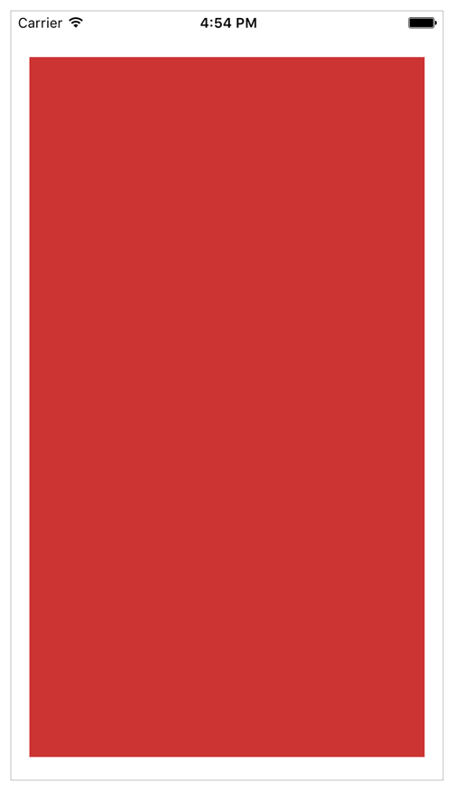
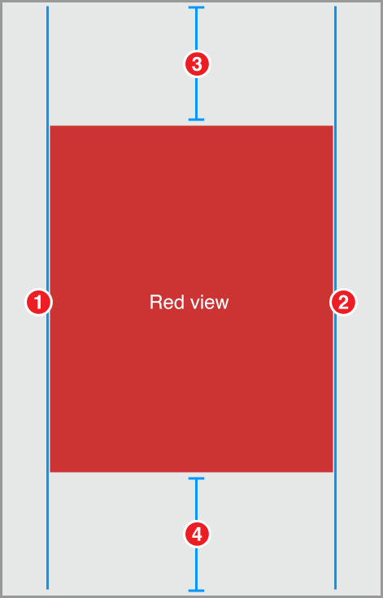
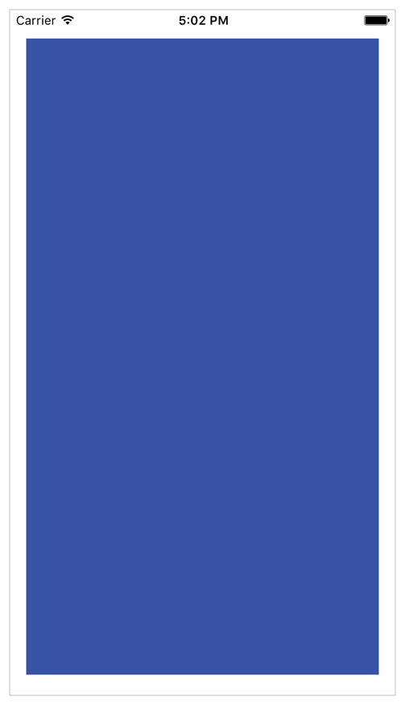
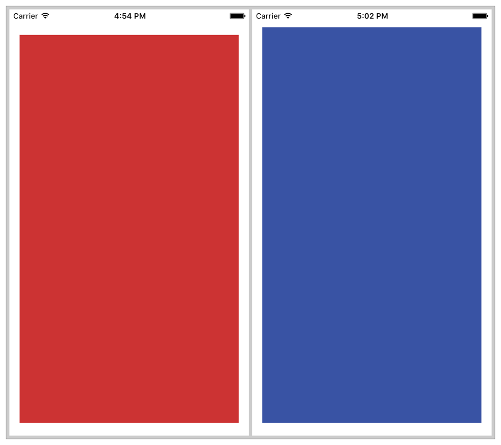
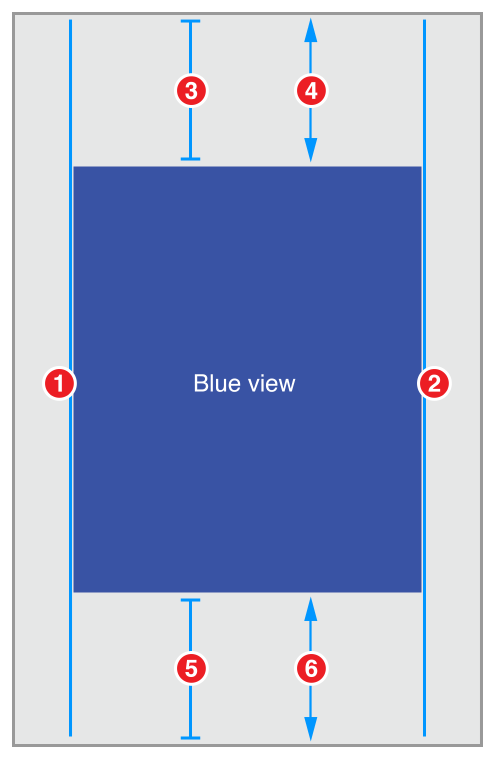
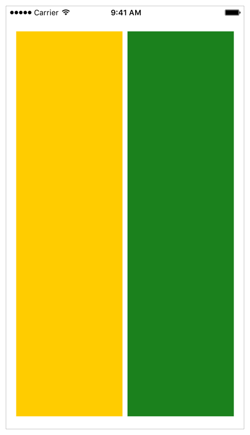
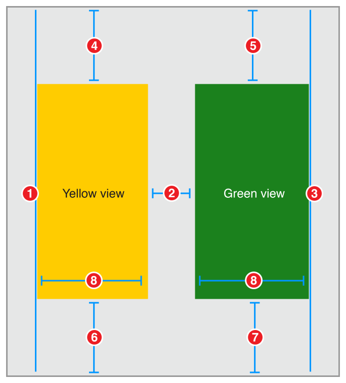
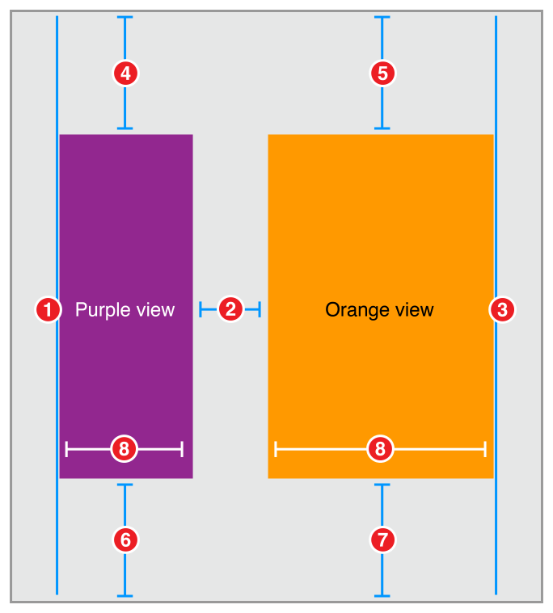
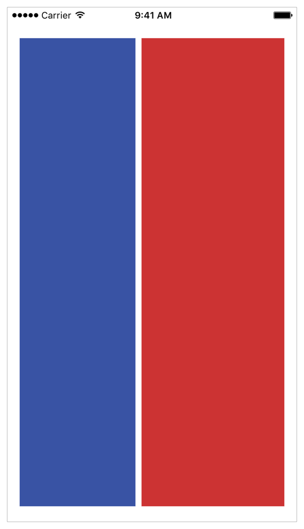
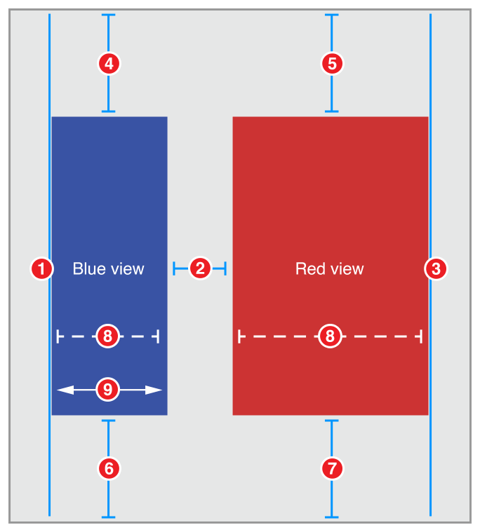

# Simple Constraints

接下来的案例展示如何使用相对简单的约束来创建常见的布局情况，按照这些案例的构建，可以创建更多更复杂的布局。

## Simple Single View

这个例子定位一个红色的视图，这样它就用**固定的边距**(`fixed margin`)填充它的父视图。

<div align="center">    

</div>

### Views and Constraints

在`Interface Builder`拖出一个`view`到场景中，调整它让它填充整个场景，使用`Interface Builder`的建议来选择相对于父视图边缘的正确位置。

> 注意 ：你不必担忧是否将view设置到正确的像素位置上，当设置适当的约束后，系统将计算其正确的大小和位置。

当view放置在对应位置上时，设置以下约束：

<div align="center">    

</div>

```
1. Red View.Leading = Superview.LeadingMargin
2. Red View.Trailing = Superview.TrailingMargin
3. Red View.Top = Top Layout Guide.Bottom + 20.0
4. Bottom Layout Guide.Top = Red View.Bottom + 20.0
```

### Attributes

要给视图一个红色的背景色，在`Attributes inspector`中设置以下属性:

| View     | Attribute  | Value |
| -------- | ---------- | ----- |
| Red View | Background | Red   |

### Discussion

这个例子中的约束使红色视图与父视图的边缘保持固定的距离(`margin`)。对于`leading`和`trailing`，把你的视图固定在父视图的边距(`margin`)上。对于`top`和`bottom`，将视图固定在`top、bottom layout guide`上。

> 注意：系统会自动设置root view的margin，使其有一个`leading`边距或`trailing`边距(16或20个屏幕点，取决于设备)，以及上下边距(0)，这可以让你轻松地在任何控制栏(状态栏，导航栏，标签栏，工具栏等)下显示`flow content`
>
> 但是，在这个例子中需要将内容放到控制栏下(如果有)，你可以固定红色视图的`leading`和`trailing`边到父视图`leading`和`trailing`边距上；但是，你必须自己设置`top`和`bottom`到`layout guides`的距离

默认情况下，`Interface Builder`的标准间距是视图和父视图边缘之间`20pt`，兄弟视图之间`8pt`。这意味着红色视图的顶部和状态栏的底部之间有一个`8pt`的空间。然而，当`iPhone`处于横向时，状态栏会消失，如果没有状态栏，`8pt`的空间看起来就太窄了。

选择最适合你的应用的布局，这个方法在顶部和底部都使用固定的`20pt`。这使约束逻辑尽可能地简单，并且在所有方向上看起来都是合理的，其他布局使用固定的`8pt`可能会更好。

如果你希望在是否有控制栏的情况下布局自动适应，请参阅[Adaptive Single View](https://developer.apple.com/library/archive/documentation/UserExperience/Conceptual/AutolayoutPG/WorkingwithSimpleConstraints.html#//apple_ref/doc/uid/TP40010853-CH12-SW4)

## Adaptive Single View

这个例子定位一个蓝色的视图，这样它填充到父视图的四边。

> This recipe positions a single, blue view so that it fills its superview with a margin around all four edges. 

与第一节的例子不同的是，这个例子的视图的`top margin`根据它的内容上下文来调整。如果有一个状态栏(`status bar`)，则视图被放置在状态栏下面8pt的位置，如果没有状态栏，视图会被放置在父视图边缘以下20.0点。

<div align="center">    

</div>

对比两个例子，你可以看到这一点:

<div align="center">    

</div>

### Views and Constraints

在`Interface Builder`中，将一个视图拖到你的场景中，并调整它的大小以填充场景，使其边缘与`guidelines`对齐。然后按如下所示设置约束：

<div align="center">    

</div>

```
1. Blue View.Leading = Superview.LeadingMargin
2. Blue View.Trailing = Superview.TrailingMargin
3. Blue View.Top = Top Layout Guide.Bottom + Standard (Priority 750)
4. Blue View.Top >= Superview.Top + 20.0
5. Bottom Layout Guide.Top = Blue View.Bottom + Standard (Priority 750)
6. Superview.Bottom >= Blue View.Bottom + 20.0
```

### Attributes

设置蓝色背景

| View      | Attribute  | Value |
| --------- | ---------- | ----- |
| Blue View | Background | Blue  |

### Discussion

这个例子为蓝色视图的顶部和底部创建自适应边距，如果有控制栏，视图的边缘被放置距离控制栏`8pt`的位置，如果没有控制栏，则边缘被定位在距离父视图边缘`20pt`的地方。

这个例子使用`layout guide`来正确定位它的内容，系统根据任何控制栏的存在和大小来确定这些`guide`的位置。`top layout guide`通常放在顶部栏（例如状态栏，导航栏）的底部边缘，也就是说会**紧贴着这些栏的底部**。而`bottom layout guide`通常放在底部栏(标签栏)的顶部边缘。如果没有控制栏，系统会沿着父视图的边缘放置这些`layout guides`。

这个例子使用一对约束来构建自适应行为，第一个约束是`required`的，大于等于的约束，这个约束保证蓝色视图的边缘与父视图的边缘至少要`20pt`的距离，实际上，它定义了一个最小`20pt`的距离。

接下来，一个可选的约束试图将视图定位到与相应的`layout guide`相距`8pt`的位置。因为这个约束是可选的，如果系统不能满足这个约束，它仍然会尝试尽可能接近它，而这个约束就像一个弹簧一样，将蓝色视图的边缘拉向它的`layout guide`。

如果系统没有显示一个`bar`，那么`layout guide`等于父视图的边缘。蓝色视图的边缘不能同时距离父视图`8pt`和`20pt`(或更多)。因此，系统不能满足可选约束。尽管如此，它仍试图尽可能地将距离设置为`20pt`。

如果有一个`bar`，那么两个约束条件都可以满足。所有`bar`的高度都在`20pt`以上，因此，如果系统将蓝色视图的边缘放置在距离`bar`边缘`8pt`的地方，它也保证了会比父视图的边缘多`20pt`。

这种技术通常用于创建自适应布局，它使用一对约束，作为向相反方向推进的力。当我们查看[Views with Intrinsic Content Size](https://developer.apple.com/library/archive/documentation/UserExperience/Conceptual/AutolayoutPG/ViewswithIntrinsicContentSize.html#//apple_ref/doc/uid/TP40010853-CH13-SW1)中的`content-hugging` 和 `compression-resistance` (`CHCR`) 优先级，你将再次看到这一点。

## Two Equal-Width Views

这个例子并排列出两个视图，无论父视图的`bounds`如何变化，视图的宽度总是相同的，它们都以固定的`margin`在各边填充了父视图，而两个视图之间有标准间距的边距。

<div align="center">    

</div>

### Views and Constraints

将两个`view`放置在相对位置上，然后设置以下约束：

<div align="center">    

</div>

```
1. Yellow View.Leading = Superview.LeadingMargin
2. Green View.Leading = Yellow View.Trailing + Standard
3. Green View.Trailing = Superview.TrailingMargin
4. Yellow View.Top = Top Layout Guide.Bottom + 20.0
5. Green View.Top = Top Layout Guide.Bottom + 20.0
6. Bottom Layout Guide.Top = Yellow View.Bottom + 20.0
7. Bottom Layout Guide.Top = Green View.Bottom + 20.0
8. Yellow View.Width = Green View.Width
```

###  Attributes

设置背景颜色属性

| View        | Attribute  | Value  |
| ----------- | ---------- | ------ |
| Yellow View | Background | Yellow |
| Green View  | Background | Green  |

### Discussion

该布局明确定义了两个视图的顶部和底部边距。只要这些边距相同，视图就会隐式地具有相同的高度。然而，这并不是这种布局的唯一可能解决方案。你可以将绿色视图的顶部和底部设置为黄色视图的顶部和底部，而不是将它们固定在父视图中。对齐顶部和底部边缘显式地使视图具有相同的垂直布局。

即使是这样一个相对简单的布局，也可以使用许多不同的约束来创建。每种方法都有自己的优点和缺点。这种方法有两个主要优点。首先(也是最重要的)，它很容易理解。第二，如果你删除其中一个视图，布局将保持基本完整。

从视图层次结构中删除一个视图也会删除该视图的所有约束。这意味着，如果你删除黄色视图，约束1、2、4、6和8都将被删除，然而，仍然有3个约束作用于绿色视图。你只需要再添加一个约束来定义绿色视图的`leading`，布局问题就被修复。

主要的缺点是你需要手动确保所有的顶部约束和底部约束都是相等的。改变其中一个的常数，视图变得明显不平衡。在实践中，当你使用`Interface Builder`的`Pin`工具创建约束时，设置一致的常量是相对容易的。如果你使用拖放来创建约束，它可能会变得更加困难。

当面对多个同样有效的约束集时，选择最容易理解和最容易在布局上下文中维护的约束集。例如，如果你正中心对齐许多不同大小的视图，最简单就是约束`Center X`属性。对于其他布局，可能更容易推断视图的边缘或其高度和宽度。

有关为布局选择最佳约束集的更多信息，请参阅 [Creating Nonambiguous, Satisfiable Layouts](https://developer.apple.com/library/archive/documentation/UserExperience/Conceptual/AutolayoutPG/AnatomyofaConstraint.html#//apple_ref/doc/uid/TP40010853-CH9-SW16)

## Two Different-Width Views

这个例子非常类似上一个例子，不同的是，两个`view`的宽度不一样

<div align="center">    

</div>

### Views and Constraints

设置如下约束：

<div align="center">    

</div>

```
1. Purple View.Leading = Superview.LeadingMargin
2. Orange View.Leading = Purple View.Trailing + Standard
3. Orange View.Trailing = Superview.TrailingMargin
4. Purple View.Top = Top Layout Guide.Bottom + 20.0
5. Orange View.Top = Top Layout Guide.Bottom + 20.0
6. Bottom Layout Guide.Top = Purple View.Bottom + 20.0
7. Bottom Layout Guide.Top = Orange View.Bottom + 20.0
8. Orange View.Width = 2.0 x Purple View.Width
```

### Attributes

设置背景色

| View        | Attribute  | Value  |
| ----------- | ---------- | ------ |
| Purple View | Background | Purple |
| Orange View | Background | Orange |

### Discussion

这个例子在宽度约束上使用了一个`multiplier`。`multiplier`只能用于对视图的高度或宽度的约束。它允许你设置两个不同视图的相对大小，或者，你可以在视图自己的高度和宽度之间设置一个约束，指定视图的宽高比。

`Interface Builder`允许你使用多种不同的格式来指定`multiplier`，`multiplier`可以写成小数(2.0)、百分比(200%)、分数(2/1)或比例(2:1)。

## Two Views with Complex Widths

这个例子几乎与上一例子相同，但是这里使用一对约束为视图宽度定义更复杂的行为，在这个例子中，红色视图的宽度是蓝色视图的两倍，但蓝色视图的最小宽度是`150pt`。在`iPhone`上，竖屏视图的宽度几乎相同，而在横屏视图，两个视图都更大，但红色视图的宽度是蓝色视图的两倍。

<div align="center">    

</div>

### Views and Constraints

设置如下约束 ：

<div align="center">    

</div>
```
1. Blue View.Leading = Superview.LeadingMargin
2. Red View.Leading = Blue View.Trailing + Standard
3. Red View.Trailing = Superview.TrailingMargin
4. Blue View.Top = Top Layout Guide.Bottom + 20.0
5. Red View.Top = Top Layout Guide.Bottom + 20.0
6. Bottom Layout Guide.Top = Blue View.Bottom + 20.0
7. Bottom Layout Guide.Top = Red View.Bottom + 20.0
8. Red View.Width = 2.0 x Blue View.Width (Priority 750)
9. Blue View.Width >= 150.0
```

### Attributes

设置背景颜色

| View      | Attribute  | Value |
| --------- | ---------- | ----- |
| Blue View | Background | Blue  |
| Red View  | Background | Red   |

### Discussion

这个例子使用一对约束来控制视图的宽度。可选的、比例的宽度约束(8)拉动视图，这样红色视图的宽度是蓝色视图的两倍。然而，`required`的大于或等于约束(9)为蓝色视图定义了一个恒定的最小宽度。

实际上，如果父视图的`leading`和`trailing`之间的距离是`458pt`或更大(150.0 + 300.0 + 8.0)，那么红色视图是蓝色视图的两倍大。如果边距之间的距离小于`458pt`，那么蓝色视图被设置为`150pt`，而红色视图填充剩余的空间(视图之间的边距为`8pt`)。

您可以认为这是[Adaptive Single View](https://developer.apple.com/library/archive/documentation/UserExperience/Conceptual/AutolayoutPG/WorkingwithSimpleConstraints.html#//apple_ref/doc/uid/TP40010853-CH12-SW4) 例子中引入的模式的另一种变体。

你可以通过添加额外的约束来扩展此设计——例如，通过使用三个约束，一个`required`约束来设置红色视图的最小宽度，一个高优先级可选约束来设置蓝色视图的最小宽度，一个低优先级可选约束来设置视图之间的首选大小比例。

# 源文档

[Simple Constraints](https://developer.apple.com/library/archive/documentation/UserExperience/Conceptual/AutolayoutPG/WorkingwithSimpleConstraints.html#//apple_ref/doc/uid/TP40010853-CH12-SW1)

