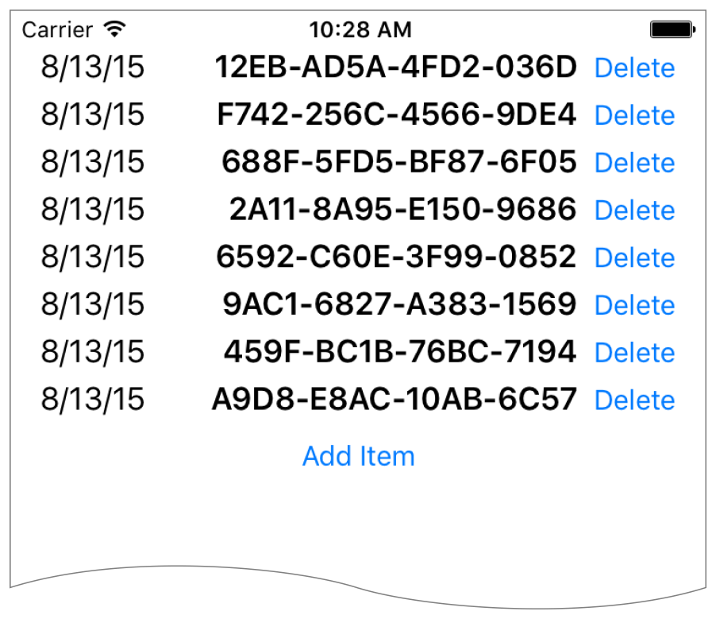

# Stack Views

下面的方法展示了如何使用`stack views `来创建越来越复杂的布局。`stack views`是一个强大的工具，可以快速和轻松地设计用户界面。可以通过它的属性来高度控制它内部排列的视图。你可以使用额外的自定义约束来扩展这些设置，但这会使布局变得复杂。

要查看这些介绍的源代码，请参见 [Auto Layout Cookbook](https://developer.apple.com/sample-code/xcode/downloads/Auto-Layout-Cookbook.zip)项目(很久了不建议查看，用的是`Swift3.x`)。

## Simple Stack View

本例采用一个简单的垂直布局的`stack view`来布局一个`label`、`image view`和`button`

<div align="center">    

</div>

### Views and Constraints

在`Interface Builder`中，首先拖出一个垂直的`stack view`，并添加`flowers` `label`、`image view`和编辑`button`，然后设置如下的约束条件。

<div align="center">    

</div>

```
1. Stack View.Leading = Superview.LeadingMargin
2. Stack View.Trailing = Superview.TrailingMargin
3. Stack View.Top = Top Layout Guide.Bottom + Standard
4. Bottom Layout Guide.Top = Stack View.Bottom + Standard
```

### Attributes

 在`Attributes inspector`中，设置以下` stack view`属性:

| Stack      | Axis     | Alignment | Distribution | Spacing |
| ---------- | -------- | --------- | ------------ | ------- |
| Stack View | Vertical | Fill      | Fill         | 8       |

接下来，在`Image View`上设置以下属性:

| View       | Attribute | Value                 |
| ---------- | --------- | --------------------- |
| Image View | Image     | (an image of flowers) |
| Image View | Mode      | Aspect Fit            |

最后，在`Size inspector`，设置`Image View`的`content-hugging`和`compression-resistance`(`CHCR`)优先级。

| Name       | Horizontal hugging | Vertical hugging | Horizontal resistance | Vertical resistance |
| ---------- | ------------------ | ---------------- | --------------------- | ------------------- |
| Image View | 250                | 249              | 750                   | 749                 |

### Discussion

你必须将`stack view`固定在父视图上，否则，`stack view`将在没有任何其他显式约束的情况下管理整个布局。

在这个例子中，`stack view`用一个小的标准边距填充它的父视图。排列的视图被调整大小以填充`stack view`的边界。水平方向上，每个视图被拉伸以匹配`stack view`的宽度。垂直方向上，视图是基于他们的`CHCR`优先级拉伸的。`image view`应该总是被压缩或被拉伸的，以填补可用的空间（因为它的`CHCR`优先级比默认的低）。

最后，将`image view`的模式设置为`Aspect Fit`。该设置强制`image view`调整图像的大小，使其符合`image view`的边界，同时保持图像的宽高比。这让`stack view`可以任意调整`image view`的大小，而不会扭曲图像。

有关固定一个视图以填充其父视图的更多信息，请参阅[Attributes](https://developer.apple.com/library/archive/documentation/UserExperience/Conceptual/AutolayoutPG/WorkingwithSimpleConstraints.html#//apple_ref/doc/uid/TP40010853-CH12-SW5)或[Adaptive Single View](https://developer.apple.com/library/archive/documentation/UserExperience/Conceptual/AutolayoutPG/WorkingwithSimpleConstraints.html#//apple_ref/doc/uid/TP40010853-CH12-SW4)

## Nested Stack Views

以下例子显示了一个由多层嵌套的`stack view`构建的复杂布局，然而，在这个例子中，`stack view`不能单独创建想要的行为。相反，需要额外的约束来进一步细化布局。

<div align="center">    

</div>

在构建视图层次结构之后，添加下一节中显示的约束

### Views and Constraints

当使用嵌套的`stack view`时，从内到外布局会更方便。首先在`Interface Builder`中布局`name`行，将`label`和`text field`放置在正确的相对位置，同时选中它们，然后点击`Editor > Embed In > Stack View` 菜单项，这就为一行创建了一个水平的`stack view`。

接下来，水平放置这些行，选择它们，并再次点击`Editor > Embed In > Stack View`菜单项,这将创建一个水平的行`stack view`。继续构建界面，如下所示。

<div align="center">    

</div>

```
1. Root Stack View.Leading = Superview.LeadingMargin
2. Root Stack View.Trailing = Superview.TrailingMargin
3. Root Stack View.Top = Top Layout Guide.Bottom + 20.0
4. Bottom Layout Guide.Top = Root Stack View.Bottom + 20.0
5. Image View.Height = Image View.Width
6. First Name Text Field.Width = Middle Name Text Field.Width
7. First Name Text Field.Width = Last Name Text Field.Width
```

仔细看上面这个图少了`Middle Name Text Field`，官方也有错误的时候...

### Attributes

每个`stack view`都有自己的一组属性，这些定义了`stack view`如何布局其内容，在`Attribute inspector`中设置以下属性:

| Stack       | Axis       | Alignment      | Distribution | Spacing |
| ----------- | ---------- | -------------- | ------------ | ------- |
| First Name  | Horizontal | First Baseline | Fill         | 8       |
| Middle Name | Horizontal | First Baseline | Fill         | 8       |
| Last Name   | Horizontal | First Baseline | Fill         | 8       |
| Name Rows   | Vertical   | Fill           | Fill         | 8       |
| Upper       | Horizontal | Fill           | Fill         | 8       |
| Button      | Horizontal | First Baseline | Fill Equally | 8       |
| Root        | Vertical   | Fill           | Fill         | 8       |

此外，给文本视图一个浅灰色的背景颜色，这使它更容易看到当方向改变时文本视图是如何调整大小的。

| View      | Attribute  | Value            |
| --------- | ---------- | ---------------- |
| Text View | Background | Light Gray Color |

最后，`CHCR`优先级定义哪些视图应该拉伸以填充可用空间，在`Size inspector`中，设置以下`CHCR`优先级:

| Name                                     | Horizontal hugging | Vertical hugging | Horizontal resistance | Vertical resistance |
| ---------------------------------------- | ------------------ | ---------------- | --------------------- | ------------------- |
| Image View                               | 250                | 250              | 48                    | 48                  |
| Text View                                | 250                | 249              | 250                   | 250                 |
| First, Middle, and Last Name Labels      | 251                | 251              | 750                   | 750                 |
| First, Middle, and Last Name Text Fields | 48                 | 250              | 749                   | 750                 |

### Discussion

在这个例子中，各个`stack views`一起工作来管理大部分的布局，然而，它们不能自己创造所有想要的行为，例如，当`image view`调整大小时，图像应该保持其宽高比，不幸的是，在第一节中使用的技术在这里不起作用。布局需要同时适应图像的`trailing`和`bottom` `edge`，使用`Aspect fit`模式将为其中一个维度添加额外的空白，幸运的是，在这个例子中，图像的长宽比总是正方形的，所以你可以让图像完全填充`image view`的边界，并将`image view`限制为`1:1`的长宽比

> 注意：在Interface Builder中，宽高比约束只是一个视图的高度和宽度之间的约束，Interface Builder还可以通过多种方式显示约束的乘数。通常，对于纵横比约束，它将它们显示为一个比例。所以,一个视图的宽度等于视图的高度限制可能以1:1的比例出现。（这注释是真的废话）

此外，所有的`text field`应该是相同的宽度。不幸的是，它们都在不同的`stack view`中，因此`stack view`无法管理这一点，相反，您必须显式地添加等宽约束。

与第一节的例子一样，你还必须修改一些`CHCR`优先级，这些优先级定义了视图如何随着父视图`bounds`的变化而压缩或拉伸。

垂直方向上，你希望`text view`展开以填充`upper stack` 和 `button stack`的控件。因此，`text view`的`vertical content hugging `优先级必须低于任何其他`vertical content hugging`优先级

水平方向上，`label`应该以其`intrinsic content size`显示，而`text field`调整大小以填充任何额外的空间。默认的`CHCR`优先级适用于`label`，`Interface Builder`已经将`content hugging`优先级设置为`251`，使其高于`text field`；但是，你仍然需要降低`text field`的`horizontal content hugging`和`horizontal compression resistance`。

`image view`应该缩小，以便与`Name row stack view`高度相同。然而，`stack view`只是松散地聚合它们的内容。这意味着`image view`的`vertical compression resistance`必须非常低，因此`image view`收缩而不是`stack view`扩展。此外，`image view`的宽高比约束使布局复杂化，因为它允许垂直和水平约束交互。这意味着`text fields`的`horizontal content hugging`也必须非常低，否则它们将防止`image view`收缩。在这两种情况下，将优先级设置为48或更低。(这一段很难懂，要好好理解)

## Dynamic Stack View

这个例子演示了在运行时动态地从`stack view`中添加和删除`item`，对`stack view`的所有更改都是动态的，此外，`stack view`如果被添加到`scroll view`中，可以显示过长的列表。

<div align="center">    

</div>

> 注意：这个例子是为了演示如何动态地使用stack view，以及如何在scrollview中使用stack view，在实际应用中，这个例子的行为应该使用UITableView来实现，通常，你不应该使用动态stack view来实现一个表视图，相反，使用它们来创建动态的而使用任何其他技术都无法轻松构建的用户界面。

### Views and Constraints

初始用户界面非常简单，在你的场景中放置一个`scrollview`，并调整它的大小以填充场景。然后，在`scrollview`中放置一个`stack view`，并在`stack view`中放置添加按钮。完成后，设置以下约束:

<div align="center">    

</div>

```
1. Scroll View.Leading = Superview.LeadingMargin
2. Scroll View.Trailing = Superview.TrailingMargin
3. Scroll View.Top = Superview.TopMargin
4. Bottom Layout Guide.Top = Scroll View.Bottom + 20.0
5. Stack View.Leading = Scroll View.Leading
6. Stack View.Trailing = Scroll View.Trailing
7. Stack View.Top = Scroll View.Top
8. Stack View.Bottom = Scroll View.Bottom
9. Stack View.Width = Scroll View.Width
```

### Attributes

在`Attributes inspector`中，设置以下属性:

| Stack      | Axis     | Alignment | Distribution  | Spacing |
| ---------- | -------- | --------- | ------------- | ------- |
| Stack View | Vertical | Fill      | Equal Spacing | 0       |

### Code

这个方法需要一些代码来向`stack view`添加`item`并从`stack view`中删除`item`，为你的场景创建一个自定义的视图控制器，同时带有滚动视图和堆栈视图的`outlet`。

```swift
class DynamicStackViewController: UIViewController {
    
    @IBOutlet weak private var scrollView: UIScrollView!
    @IBOutlet weak private var stackView: UIStackView!
    
    // Method implementations will go here...
    
}
```

接下来，重写`viewDidLoad`方法来设置`scrollview`的初始位置,您希望`scrollview`的内容从状态栏下面开始。

```swift
override func viewDidLoad() {
    super.viewDidLoad()
    
    // setup scrollview
    let insets = UIEdgeInsetsMake(20.0, 0.0, 0.0, 0.0)
    scrollView.contentInset = insets
    scrollView.scrollIndicatorInsets = insets
}
```

为`Add Item`添加一个`action`方法

```swift
// MARK: Action Methods
 
@IBAction func addEntry(sender: AnyObject) {
    
    let stack = stackView
    let index = stack.arrangedSubviews.count - 1
    let addView = stack.arrangedSubviews[index]
    
    let scroll = scrollView
    let offset = CGPoint(x: scroll.contentOffset.x,
                         y: scroll.contentOffset.y + addView.frame.size.height)
    
    let newView = createEntry()
    newView.hidden = true
    stack.insertArrangedSubview(newView, atIndex: index)
    
    UIView.animateWithDuration(0.25) { () -> Void in
        newView.hidden = false
        scroll.contentOffset = offset
    }
}
```

这个方法为`scroll view`计算一个新的偏移量，然后创建一个新的`item`视图，`item`视图被隐藏，并添加到`stack`中。隐藏的视图不影响`stack`的外观或布局——因此`stack`的外观保持不变。然后，在一个动画`block`中，视图被显示，滚动偏移被更新，使视图的外观动画化。

添加一个类似的方法来删除`item`；但是，与`addEntry`方法不同的是，该方法没有链接到`Interface Builder`中的任何控件。相反，当视图创建时，应用程序将以编程方式将每个`item`视图链接到这个方法。

```swift
func deleteStackView(sender: UIButton) {
    if let view = sender.superview {
        UIView.animateWithDuration(0.25, animations: { () -> Void in
            view.hidden = true
        }, completion: { (success) -> Void in
            view.removeFromSuperview()
        })
    }
}
```

这个方法将视图隐藏，动画完成后，它从视图层次结构中删除视图，这将自动从`stack view`的排列视图列表中删除视图。

尽管`item`视图可以是任何视图，但本例使用了一个包含日期`label`、一个包含随机十六进制字符串的`label`和一个`delete`按钮的`stack view`。

```swift
// MARK: - Private Methods
private func createEntry() -> UIView {
    let date = NSDateFormatter.localizedStringFromDate(NSDate(), dateStyle: .ShortStyle, timeStyle: .NoStyle)
    let number = "\(randomHexQuad())-\(randomHexQuad())-\(randomHexQuad())-\(randomHexQuad())"
    
    let stack = UIStackView()
    stack.axis = .Horizontal
    stack.alignment = .FirstBaseline
    stack.distribution = .Fill
    stack.spacing = 8
    
    let dateLabel = UILabel()
    dateLabel.text = date
    dateLabel.font = UIFont.preferredFontForTextStyle(UIFontTextStyleBody)
    
    let numberLabel = UILabel()
    numberLabel.text = number
    numberLabel.font = UIFont.preferredFontForTextStyle(UIFontTextStyleHeadline)
    
    let deleteButton = UIButton(type: .RoundedRect)
    deleteButton.setTitle("Delete", forState: .Normal)
    deleteButton.addTarget(self, action: "deleteStackView:", forControlEvents: .TouchUpInside)
    
    stack.addArrangedSubview(dateLabel)
    stack.addArrangedSubview(numberLabel)
    stack.addArrangedSubview(deleteButton)
    
    return stack
}
 
private func randomHexQuad() -> String {
    return NSString(format: "%X%X%X%X",
                    arc4random() % 16,
                    arc4random() % 16,
                    arc4random() % 16,
                    arc4random() % 16
        ) as String
}
}
```

### Discussion

正如这个例子所演示的，视图可以在运行时从`stack view`中添加或删除。`stack view`的布局自动调整，以补偿对其排列的视图数组的更改。然而，有几点需要记住:

* 隐藏的视图仍然在`stack view`的排列视图数组中，但是，它们不会被显示出来，也不会影响其他排列好的视图的布局。
* 将视图添加到`stack view`的排列视图数组中会自动将其添加到视图层次结构中。
* 从`stack view`的排列视图数组中移除一个视图不会自动从视图层次结构中移除它；然而，从视图层次结构中移除视图确实会从排列视图数组中移除它。
* 在iOS中，视图的`hidden`属性通常不是动画化的，然而，一旦视图被放置到`stack view`的视图数组中，这个属性就会变成动画，实际的动画是由`stack view`管理的，而不是视图。使用`hidden`属性可以将视图添加到`stack`或从`stack`中移除。

这个实例还介绍了使用`scrollview`自动布局的想法。在这里，`stack view`和`scrollview`之间的约束设置成`scrollview`内容区域的大小。等宽约束显式地设置`stack view`(以及内容大小)以水平填充`scrollview`，垂直方向，内容大小基于`stack view`的`fitting size`，当用户添加更多`item`时，`stack view`会增大，当有太多的内容需要显示到屏幕时，滚动自动启用。

更多信息，请参阅[Working with Scroll Views](https://developer.apple.com/library/archive/documentation/UserExperience/Conceptual/AutolayoutPG/WorkingwithScrollViews.html#//apple_ref/doc/uid/TP40010853-CH24-SW1)

# 源文档

[Stack Views](https://developer.apple.com/library/archive/documentation/UserExperience/Conceptual/AutolayoutPG/LayoutUsingStackViews.html#//apple_ref/doc/uid/TP40010853-CH11-SW1)

