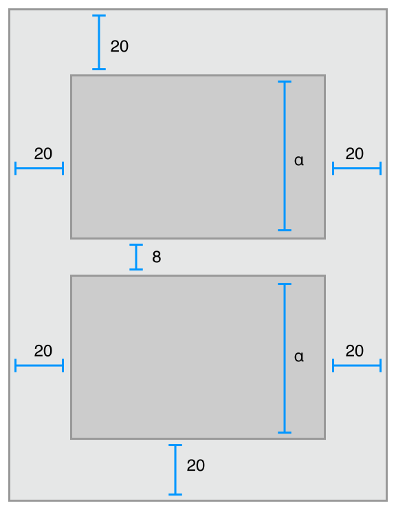

# Understanding Auto Layout

**自动布局**基于添加到视图的约束(`constraints`),动态计算视图层次结构中所有视图的大小和位置。例如，你可以约束一个`button`，使其与`Image view`水平居中，并使`button`的顶部边缘始终保持在`Image view`底部以下8个屏幕点。如果`Image view`的大小或位置发生变化，`button`的位置将自动调整适应。

这种基于约束的设计方法允许你构建**动态响应内部、外部变化**的用户界面。

## External Changes(外部变化)

当你的父视图的大小或形状发生变化时，外部变化就会发生。每次更改时，都必须更新视图层次结构的布局，以最好地利用可用空间。以下是一些外部变化的常见来源:

* 用户调整窗口大小(OS X)。
* 用户在iPad (iOS)上进入或离开分屏视图(**Split View**)。
* 设备旋转(iOS)。
* 当前通话和录音栏出现或消失(iOS)。
* You want to support different size classes.
* 你想要支持不同的屏幕尺寸。

大多数这些变化都可能发生在运行时，它们需要应用程序的动态响应。其他的，如支持不同的屏幕大小，表示应用程序适应不同的环境。即使在运行时屏幕大小通常不会改变，创建一个自适应界面可以让你的应用在iPhone 4S、iPhone 6 Plus甚至iPad上运行得同样好。自动布局也是iPad上支持`Slide Over`和`Split Views`的关键组件。

## Internal Changes(内部变化)

当用户界面中的视图或控件的大小发生更改时，就会发生内部更改。

以下是一些常见的内部变化来源:

* 应用程序显示的内容发生了变化。
* 该应用程序支持国际化。
* 应用程序支持动态类型(iOS)。

当应用程序的内容发生变化时，新内容可能需要与旧内容不同的布局。这通常发生在显示文本或图像的应用程序中。例如，新闻应用程序需要根据单个新闻文章的大小调整其布局。同样，照片拼贴必须处理各种图像尺寸和宽高比。

国际化是让你的应用能够适应不同语言、地区和文化的过程。国际化应用的布局必须考虑到这些差异，并正确显示在应用支持的所有语言和地区。

国际化对布局有三个主要影响。首先，当你将用户界面翻译成不同的语言时，`labels`需要不同的空间。例如，德语通常比英语需要更多的空间。日语通常要求的就少得多。

其次，用于表示日期和数字的格式可以因地区而改变，即使语言没有改变。尽管这些更改通常比语言更改更微妙，但用户界面仍然需要适应大小上的细微变化。

第三，改变语言不仅会影响文本的大小，还会影响布局的组织。不同的语言使用不同的布局方向。例如，英语使用从左到右的布局方向，而阿拉伯语和希伯来语使用从右到左的布局方向。一般来说，用户界面元素的顺序应该与布局方向相匹配。如果一个按钮在视图的右下角是英文的，它应该在左下角是阿拉伯语的。

第三，更改语言不仅会影响文本的大小，还会影响布局的组成。不同的语言使用不同的布局方向。例如，英语使用从左到右的布局方向，而阿拉伯语和希伯来语使用从右到左的布局方向。一般来说，用户界面元素的顺序应该与布局方向相匹配。如果一个按钮在视图的右下角是英文的，它应该在左下角是阿拉伯语的。

最后，如果你的iOS应用支持动态类型，用户可以改变应用中使用的字体大小。这可以改变用户界面中任何文本元素的高度和宽度。如果用户在应用运行时改变了字体大小，字体和布局都必须适应。

## Auto Layout Versus Frame-Based Layout(自动布局与基于Frame的布局)

有**三种主要的方法来布局用户界面**。你可以以编程方式布局用户界面，你可以使用`autoresizing masks`来自动响应外部更改，或者你可以使用自动布局。

传统的做法是，应用程序通过编程方式为视图层次结构中的每个视图设置`frame`来布局用户界面。这个`frame`在父视图的坐标系中定义了**视图的原点、高度和宽度**。

为了布局你的用户界面，你必须计算视图层次结构中每个视图的大小和位置。然后，如果发生了变化，你必须为所有受影响的视图重新计算`frame`。

在许多情况下，通过编程定义视图的`frame`提供了最大的灵活性和功能。当变更发生时，你可以做任何你想做的变更。**但是，因为你还必须自己管理所有的更改，所以规划一个简单的用户界面需要大量的工作来设计、调试和维护。创建一个真正自适应的用户界面会增加一个数量级的难度**。

你可以使用`autoresizing masks`来帮助减轻某些工作。`autoresizing masks`定义了当父视图的`frame`改变时，子视图的`frame`如何改变。这简化了适应外部变化的布局的创建。

然而，`autoresizing masks`只支持一个相对较小布局子集。对于复杂的用户界面，通常需要使用自己的编程更改来扩充`autoresizing masks`。**此外，`autoresizing masks`只适用于外部变化，它们不支持内部变化**。

`autoresizing masks`只是对编程布局的迭代改进，但自动布局使用一种全新的范式。**它的思想是与其考虑一个视图的`frame`,不如考虑视图之间的关系**。

自动布局使用一系列的约束来定义你的用户界面。约束通常表示两个视图之间的关系。然后自动布局根据这些约束计算每个视图的大小和位置。这会生成动态响应内部和外部变化的布局。

设计一组约束来创建特定行为的逻辑，与编写面向过程或面向对象的代码非常不同。幸运的是，掌握自动布局和掌握其他编程任务并没有什么不同。有两个基本步骤:**首先你需要理解基于约束的布局背后的逻辑，然后你需要学习相关的API**。在学习其他编程任务时，你已经执行过这些步骤。自动布局也不例外。

本教程的其余部分旨在帮助你轻松过渡到自动布局。

 [Auto Layout Without Constraints](https://developer.apple.com/library/archive/documentation/UserExperience/Conceptual/AutolayoutPG/AutoLayoutWithoutConstraints.html#//apple_ref/doc/uid/TP40010853-CH8-SW1)章节描述了一个高级抽象，它简化了自动布局支持的用户界面的创建。 

[Anatomy of a Constraint](https://developer.apple.com/library/archive/documentation/UserExperience/Conceptual/AutolayoutPG/AnatomyofaConstraint.html#//apple_ref/doc/uid/TP40010853-CH9-SW1)章节提供了你需要了解的理论，以便你与自动布局交互。

[Working with Constraints in Interface Builder](https://developer.apple.com/library/archive/documentation/UserExperience/Conceptual/AutolayoutPG/WorkingwithConstraintsinInterfaceBuidler.html#//apple_ref/doc/uid/TP40010853-CH10-SW1)描述了使用自动布局的工具

[Programmatically Creating Constraints](https://developer.apple.com/library/archive/documentation/UserExperience/Conceptual/AutolayoutPG/ProgrammaticallyCreatingConstraints.html#//apple_ref/doc/uid/TP40010853-CH16-SW1) 和 [Auto Layout Cookbook](https://developer.apple.com/library/archive/documentation/UserExperience/Conceptual/AutolayoutPG/LayoutUsingStackViews.html#//apple_ref/doc/uid/TP40010853-CH3-SW1)章节详细描述了相关的API。

 [Auto Layout Cookbook](https://developer.apple.com/library/archive/documentation/UserExperience/Conceptual/AutolayoutPG/LayoutUsingStackViews.html#//apple_ref/doc/uid/TP40010853-CH3-SW1)提供了各种复杂程度的布局案例，你可以在你自己的项目中学习和使用

 [Debugging Auto Layout](https://developer.apple.com/library/archive/documentation/UserExperience/Conceptual/AutolayoutPG/TypesofErrors.html#//apple_ref/doc/uid/TP40010853-CH22-SW1) 提供了在出现问题时修复问题的建议和工具。

# 源文档

[Understanding Auto Layout](https://developer.apple.com/library/archive/documentation/UserExperience/Conceptual/AutolayoutPG/index.html#//apple_ref/doc/uid/TP40010853-CH7-SW1)

