# View with Intrinsic Content Size

接下来的实例演示具有`intrinsic content size`的视图如何布局，通常地，`intrinsic content size`可以简化布局，减少你需要的约束的数量。但是，使用`intrinsic content size`通常需要设置视图的`content-hugging`和`compression-resistance`优先级（简称`CHCR`优先级），这可能会增加额外的复杂性。

## Simple Label and Text Field

以下例子演示布局一对简单的`label`和`text field`，在这个例子中，`label`的宽度基于它文字属性的尺寸，`text field`伸缩填充剩余的空间

<div align="center">    
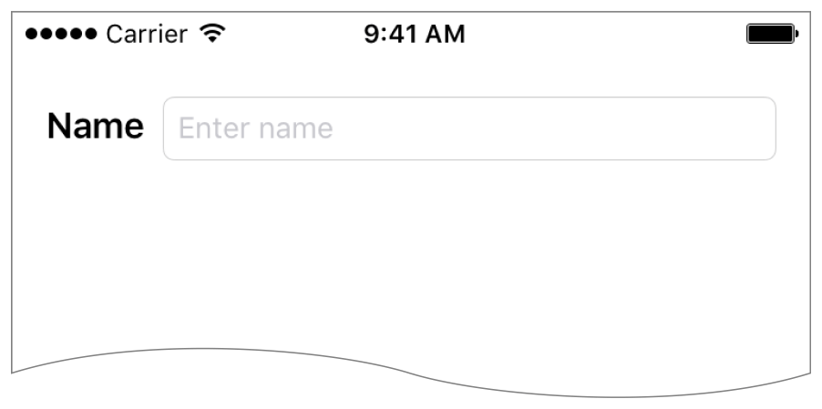
</div>

因为本例使用视图的`intrinsic content size`，所以你只需要5个约束来布局，但是，你必须确保设置正确的`CHCR`优先级来让系统布局。

更多有关`intrinsic content sizes`和`CHCR`优先级，请参阅[Intrinsic Content Size](https://developer.apple.com/library/archive/documentation/UserExperience/Conceptual/AutolayoutPG/AnatomyofaConstraint.html#//apple_ref/doc/uid/TP40010853-CH9-SW21)

### Views and Constraints

在`Interface Builder`中，设置以下约束：

<div align="center">    
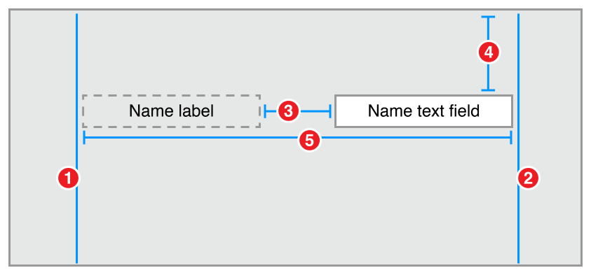
</div>

```
1. Name Label.Leading = Superview.LeadingMargin
2. Name Text Field.Trailing = Superview.TrailingMargin
3. Name Text Field.Leading = Name Label.Trailing + Standard
4. Name Text Field.Top = Top Layout Guide.Bottom + 20.0
5. Name label.Baseline = Name Text Field.Baseline
```

### Attributes

为了让`text field`拉伸占据剩余的空间，它的`content hugging `优先级必须低于`label`的`content hugging `优先级，默认地，`Interface Builder`会设置`label`的`content hugging `优先级为**251**，`text field`的为**250**，你可以在`Size inspector`中查看它们

| Name            | Horizontal hugging | Vertical hugging | Horizontal resistance | Vertical resistance |
| --------------- | ------------------ | ---------------- | --------------------- | ------------------- |
| Name Label      | 251                | 251              | 750                   | 750                 |
| Name Text Field | 250                | 250              | 750                   | 750                 |

### Discussion

注意，这个布局只使用两个约束(4和5)来定义垂直布局，使用三个约束(1、2和3)来定义水平布局。文章 [Creating Nonambiguous, Satisfiable Layouts](https://developer.apple.com/library/archive/documentation/UserExperience/Conceptual/AutolayoutPG/AnatomyofaConstraint.html#//apple_ref/doc/uid/TP40010853-CH9-SW16) 提及到每个视图在每个方向上需要两个约束确定布局，但是，`label`和`text field`的`intrinsic content size`提供了它们的高度和`label`的宽度，因此这3个约束没有必要了。

这个布局还有一个假设点，即`text field`总是比`label`高，并且它使用`text field`来定义到`top layout guide`的距离。因为`label`和`text field`都用于显示文本，所以本例使用文本的`baseline`对它们进行对齐。

水平方向上，你仍需确定哪个`view`需要延伸来填充剩余的空间，通过`CHCR`优先级来做这件事，在本例中，`Interface Builder`会设置`label`的`horizontal`和 ` vertical hugging priority`为 **251**，因为它比`text field`的**250**大，所以text field会拉伸来填充剩余的空间。（要理解还是挺费心思，`content hugging`优先级越大，那么这个视图的`intrinsic content size`会被优先确定，在这里的行为就是，`label`的宽度先被确认，这样一来`label`所占的空间就确定，所以剩下的空间全给`text field`（换句话说就是`text field`被拉伸了））

> 注意：如果布局需要显示在对于控件来说太小的空间中，你还需要修改compression resistances优先级的值，compression resistances定义了当没有足够空间时，哪些视图应该被截断。
>
> 在本例中，修改compression resistances留给读者练习，如果label的文字或字体足够大，屏幕没有足够空间放下，就会产生布局模糊的问题，然后，The system then selects a constraint to break，text field或label会被截断
>
> 理想情况下，你希望创建一个对于可用空间来说不会太大的布局——根据需要使用`size classes`来代替自动布局。设计支持多语言的应用时，很难准确预测label可能会变多大。以防万一，修改compression resistance是一个好的选择。

## Dynamic Height Label and Text Field

上一个例子假定`label`比`text field`高来简化布局逻辑，但是，这不一定总是正确的，如果你增加`label`的字体大小，它将扩展到`text field`上方。

本例在运行时根据最高的控件动态设置控件的垂直间距。使用常规的字体，这个例子看起来与上一例子一样（见截图），但是，如果你将`label`的字体大小增加到`36pt`，那么布局的垂直间距将改为从`label`的顶部开始。

<div align="center">    

</div>

> This is a somewhat contrived example. After all, if you increase the font size of a label, you would typically also increase the font size of the text field. However, given the extra, extra, extra large fonts available through the iPhone’s accessibility settings, this technique can prove useful when mixing dynamic type and fixed-sized controls (like images).

### Views and Constraints

设置与上述例子一样的约束，但添加几个更复杂的约束 ：

<div align="center">    
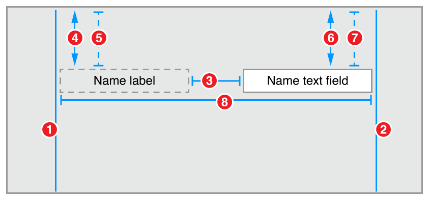
</div>

```
1. Name Label.Leading = Superview.LeadingMargin
2. Name Text Field.Trailing = Superview.TrailingMargin
3. Name Text Field.Leading = Name Label.Trailing + Standard
4. Name Label.Top >= Top Layout Guide.Bottom + 20.0
5. Name Label.Top = Top Layout Guide.Bottom + 20.0 (Priority 249)
6. Name Text Field.Top >= Top Layout Guide.Bottom + 20.0
7. Name Text Field.Top = Top Layout Guide.Bottom + 20.0 (Priority 249)
8. Name label.Baseline = Name Text Field.Baseline
```

### Attributes

同样设置以下优先级 ：

| Name            | Horizontal hugging | Vertical hugging | Horizontal resistance | Vertical resistance |
| --------------- | ------------------ | ---------------- | --------------------- | ------------------- |
| Name Label      | 251                | 251              | 750                   | 750                 |
| Name Text Field | 250                | 250              | 750                   | 750                 |

### Discussion

本例为每个控件都使用一对约束，一个`required`大于等于的约束定义了该控件和`layout guide`之间的最小距离，而一个可选的约束试图将控件拉到距离`layout guide`的`20pt`初。

两个约束都可以满足，所以系统将控件放置在距离`layout guide` `20pt`处。由于优先级的关系，允许自动布局系统在运行时控件的高度发生变化时动态地重新计算布局。

> 注意：确保将可选约束的优先级设置为低于默认content hugging constraint(250)的值。否则，系统会违反content hugging 约束，拉伸视图而不是重新定位它。
>
> 当使用baseline对齐的布局时，这可能会特别令人困惑，因为baseline对齐只有在文本视图在其内在内容高度显示时才有效。如果系统调整其中一个视图的大小，那么文本可能不会正确排列，尽管有必要的baseline约束。

## Fixed Height Columns

本例扩展第一节的例子，变成一列`label`和一列`text field`。在这里，所有`label`的`trailing`都是对齐的，`text field`的`leading`和`trailing`对齐，水平位置基于最长的`label`。这里假设与第一节的例子一样，`text field`总是比`label`高。

<div align="center">    
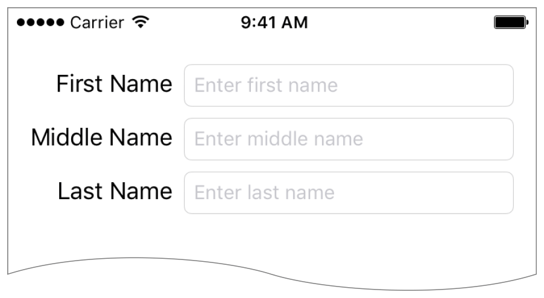
</div>

### Views and Constraints

布局`label`和`text field`，设置以下约束：

<div align="center">    
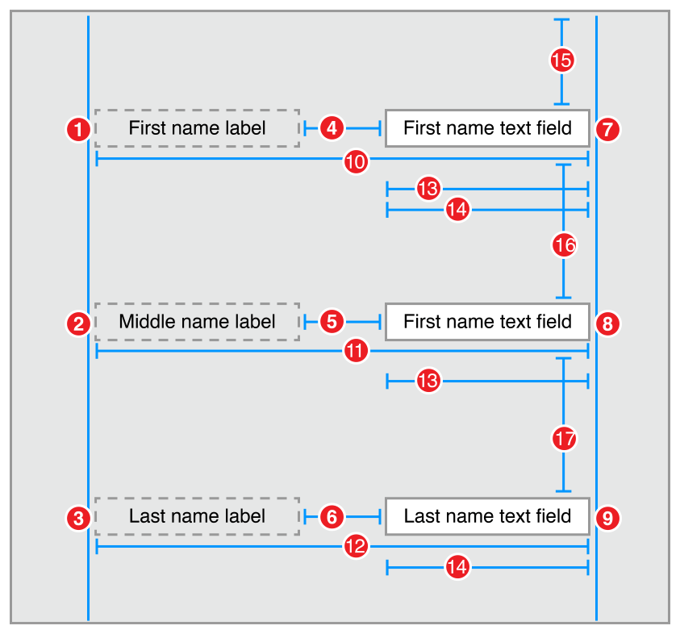
</div>

```
1. First Name Label.Leading = Superview.LeadingMargin
2. Middle Name Label.Leading = Superview.LeadingMargin
3. Last Name Label.Leading = Superview.LeadingMargin
4. First Name Text Field.Leading = First Name Label.Trailing + Standard
5. Middle Name Text Field.Leading = Middle Name Label.Trailing + Standard
6. Last Name Text Field.Leading = Last Name Label.Trailing + Standard
7. First Name Text Field.Trailing = Superview.TrailingMargin
8. Middle Name Text Field.Trailing = Superview.TrailingMargin
9. Last Name Text Field.Trailing = Superview.TrailingMargin
10. First Name Label.Baseline = First Name Text Field.Baseline
11. Middle Name Label.Baseline = Middle Name Text Field.Baseline
12. Last Name Label.Baseline = Last Name Text Field.Baseline
13. First Name Text Field.Width = Middle Name Text Field.Width
14. First Name Text Field.Width = Last Name Text Field.Width
15. First Name Text Field.Top = Top Layout Guide.Bottom + 20.0
16. Middle Name Text Field.Top = First Name Text Field.Bottom + Standard
17. Last Name Text Field.Top = Middle Name Text Field.Bottom + Standard
```

### Attributes

设置以下属性，特别是，所有`label`的文本右对齐，这允许你使用比文本更长的`label`，并且仍然在`text field`旁边对齐。

| View                   | Attribute   | Value             |
| ---------------------- | ----------- | ----------------- |
| First Name Label       | Text        | First Name        |
| First Name Label       | Alignment   | Right             |
| First Name Text Field  | Placeholder | Enter first name  |
| Middle Name Label      | Text        | Middle Name       |
| Middle Name Label      | Alignment   | Right             |
| Middle Name Text Field | Placeholder | Enter middle name |
| Last Name Label        | Text        | Last Name         |
| Last Name Label        | Alignment   | Right             |
| Last Name Text Field   | Placeholder | Enter last name   |

`content hugging`优先级还是一样，设置如下：

| Name                   | Horizontal hugging | Vertical hugging | Horizontal resistance | Vertical resistance |
| ---------------------- | ------------------ | ---------------- | --------------------- | ------------------- |
| First Name Label       | 251                | 251              | 750                   | 750                 |
| First Name Text Field  | 250                | 250              | 750                   | 750                 |
| Middle Name Label      | 251                | 251              | 750                   | 750                 |
| Middle Name Text Field | 250                | 250              | 750                   | 750                 |
| Last Name Label        | 251                | 251              | 750                   | 750                 |
| Last Name Text Field   | 250                | 250              | 750                   | 750                 |

### Discussion

本例就是第一节的例子，复制2个，然后排列，一个叠一个，但是你需要做一些添加，以便正确排列。

首先，通过右对齐每个`label`来简化这个问题，现在，你可以使所有的`label`具有相同的宽度，并且无论文本的长度如何，你都可以轻松地对齐它们的`trailing`，此外，由于`label`的`compression resistance`大于`content hugging`，所有`label`都会被拉伸而非压缩。对齐`Leading`和`trailing`，所有`label`都会自然拉伸到最长`label`的`intrinsic content size`。

类似地，`text field`的`trailing`和父视图的`trailing`对齐，你只需要将另外两条边中的一条对齐，因为所有行的宽度都是一样的，所以所有的东西都会对齐。

有很多方法可以做到这一点，这个例子是给每个`text field`相同的宽度。

## Dynamic Height Columns

本例结合第2、3节的例子，这个例子：

* 所有`label`的`trailing`对齐，基于最长的`label`
* `text field`等宽，即`leading`和`trailing`对齐
* `text field`拉伸填充父视图剩余空间
* 行与行之间的高度基于行中最高的元素
* 一切都是动态的，所以如果字体大小或标签文本发生变化，布局就会自动更新

<div align="center">    

</div>

### Views and Constraints

约束如下：

<div align="center">    
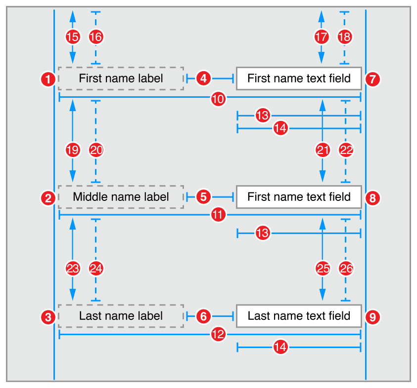
</div>

```
1. First Name Label.Leading = Superview.LeadingMargin
2. Middle Name Label.Leading = Superview.LeadingMargin
3. Last Name Label.Leading = Superview.LeadingMargin
4. First Name Text Field.Leading = First Name Label.Trailing + Standard
5. Middle Name Text Field.Leading = Middle Name Label.Trailing + Standard
6. Last Name Text Field.Leading = Last Name Label.Trailing + Standard
7. First Name Text Field.Trailing = Superview.TrailingMargin
8. Middle Name Text Field.Trailing = Superview.TrailingMargin
9. Last Name Text Field.Trailing = Superview.TrailingMargin
10. First Name Label.Baseline = First Name Text Field.Baseline
11. Middle Name Label.Baseline = Middle Name Text Field.Baseline
12. Last Name Label.Baseline = Last Name Text Field.Baseline
13. First Name Text Field.Width = Middle Name Text Field.Width
14. First Name Text Field.Width = Last Name Text Field.Width
15. First Name Label.Top >= Top Layout Guide.Bottom + 20.0
16. First Name Label.Top = Top Layout Guide.Bottom + 20.0 (Priority 249)
17. First Name Text Field.Top >= Top Layout Guide.Bottom + 20.0
18. First Name Text Field.Top = Top Layout Guide.Bottom + 20.0 (Priority 249)
19. Middle Name Label.Top >= First Name Label.Bottom + Standard
20. Middle Name Label.Top = First Name Label.Bottom + Standard (Priority 249)
21. Middle Name Text Field.Top >= First Name Text Field.Bottom + Standard
22. Middle Name Text Field.Top = First Name Text Field.Bottom + Standard (Priority 249)
23. Last Name Label.Top >= Middle Name Label.Bottom + Standard
24. Last Name Label.Top = Middle Name Label.Bottom + Standard (Priority 249)
25. Last Name Text Field.Top >= Middle Name Text Field.Bottom + Standard
26. Last Name Text Field.Top = Middle Name Text Field.Bottom + Standard (Priority 249)
```

### Attributes

设置以下属性，特别是，所有`label`的文本右对齐。右对齐`label`可以让你使用比文本更长的`label`，并且文本的边缘仍然排列在`text field`旁边。

| View                   | Attribute   | Value             |
| ---------------------- | ----------- | ----------------- |
| First Name Label       | Text        | First Name        |
| First Name Label       | Alignment   | Right             |
| First Name Text Field  | Placeholder | Enter first name  |
| Middle Name Label      | Text        | Middle Name       |
| Middle Name Label      | Alignment   | Right             |
| Middle Name Text Field | Placeholder | Enter middle name |
| Last Name Label        | Text        | Last Name         |
| Last Name Label        | Alignment   | Right             |
| Last Name Text Field   | Placeholder | Enter last name   |

优先级如下 : 

| Name                   | Horizontal hugging | Vertical hugging | Horizontal resistance | Vertical resistance |
| ---------------------- | ------------------ | ---------------- | --------------------- | ------------------- |
| First Name Label       | 251                | 251              | 750                   | 750                 |
| First Name Text Field  | 250                | 250              | 750                   | 750                 |
| Middle Name Label      | 251                | 251              | 750                   | 750                 |
| Middle Name Text Field | 250                | 250              | 750                   | 750                 |
| Last Name Label        | 251                | 251              | 750                   | 750                 |
| Last Name Text Field   | 250                | 250              | 750                   | 750                 |

### Discussion

本例结合了前两个例子，使用约束动态调整行与行之间的垂直间距。它在`label`中使用右对齐的文本，并显式地使用等宽约束对列进行排列。

> 注意：这个例子在视图和`top layout guide`之间使用了一个20pt的空间，在兄弟视图之间使用了一个8pt的空间。它的效果是设置一个固定的20pt的上边缘。如果你想要一个根据bar的存在与否自动调整的边距，你必须添加额外的约束。一般的技术在[Adaptive Single View](https://developer.apple.com/library/archive/documentation/UserExperience/Conceptual/AutolayoutPG/WorkingwithSimpleConstraints.html#//apple_ref/doc/uid/TP40010853-CH12-SW4) 中，然而，具体的实现留给读者一个挑战。

可以看到，布局逻辑变得越来越复杂，但是，有方法可以简化，首先，如前所述，你应该尽可能使用`stack view`。或者，你可以对控件进行分组，然后对组进行布局，这可以让你把一个单一的、复杂的布局分解成更小、更易于管理的块。

## Two Equal-Width Buttons

这个例子展示了两个大小相等的按钮。在垂直方向上，按钮与屏幕底部对齐。在水平方向上，它们被拉伸以填充所有可用的空间。

<div align="center">    
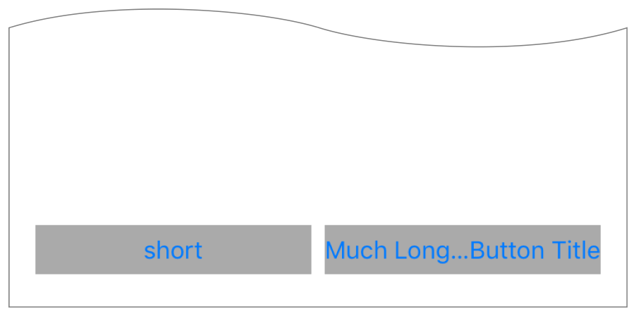
</div>

###  Views and Constraints

设置以下约束

<div align="center">    
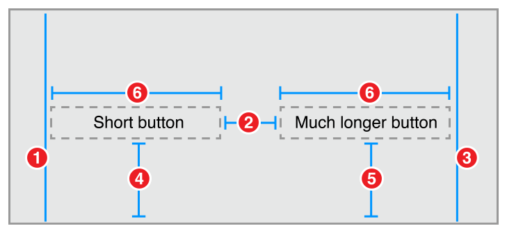
</div>

1. `Short Button.Leading = Superview.LeadingMargin`
2. `Long Button.Leading = Short Button.Trailing + Standard`
3. `Long Button.Trailing = Superview.TrailingMargin`
4. `Bottom Layout Guide.Top = Short Button.Bottom + 20.0`
5. `Bottom Layout Guide.Top = Long Button.Botton + 20.0`
6. `Short Button.Width = Long Button.Width`

### Attributes

为按钮设置一个可见的背景颜色，这样可以更容易地看到它们的`frame`是如何随着设备的旋转而变化的。此外，为按钮使用不同长度的标题，以表明按钮标题不影响按钮的宽度。

| View         | Attribute  | Value                    |
| ------------ | ---------- | ------------------------ |
| Short Button | Background | Light Gray Color         |
| Short Button | Title      | short                    |
| Long Button  | Background | Light Gray Color         |
| Long Button  | Title      | Much Longer Button Title |

### Discussion

这个例子在计算布局时使用按钮的`intrinsic height`，而不是`width`，在水平方向上，按钮被显示地调整大小，以便它们具有相同的宽度并填充空间，要查看按钮的`intrinsic height `如何影响布局，请与 [Two Equal-Width Views](https://developer.apple.com/library/archive/documentation/UserExperience/Conceptual/AutolayoutPG/WorkingwithSimpleConstraints.html#//apple_ref/doc/uid/TP40010853-CH12-SW17) 这个例子做比较，在本例中，只有两个垂直约束，而不是四个。

按钮的标题长度也有很大的不同，以帮助说明按钮的文本如何影响(或者在本例中，不影响)布局。

> 注意：按钮被赋予了浅灰色的背景色，让你看到它们的frame。通常，按钮和标签的背景是透明的，所以很难(如果不是不可能的话)看到它们frame的任何变化。

## Three Equal-Width Buttons

本例扩展上一例子，使用三个等宽的按钮

<div align="center">    
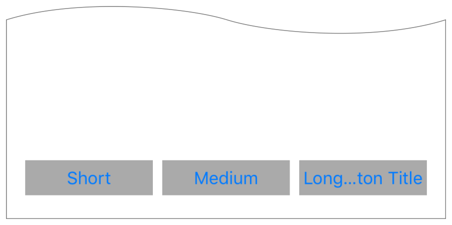
</div>

### Views and Constraints

设置以下约束：

<div align="center">    
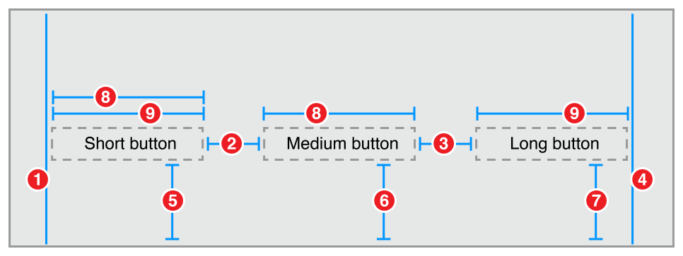
</div>

1. `Short Button.Leading = Superview.LeadingMargin`
2. `Medium Button.Leading = Short Button.Trailing + Standard`
3. `Long Button.Leading = Medium Button.Trailing + Standard`
4. `Long Button.Trailing = Superview.TrailingMargin`
5. `Bottom Layout Guide.Top = Short Button.Bottom + 20.0`
6. `Bottom Layout Guide.Top = Medium Button.Bottom + 20.0`
7. `Bottom Layout Guide.Top = Long Button.Bottom + 20.0`
8. `Short Button.Width = Medium Button.Width`
9. `Short Button.Width = Long Button.Width`

### Attributes

| Para          | View       | Attribute         |
| ------------- | ---------- | ----------------- |
| Short Button  | Background | Light Gray Color  |
| Short Button  | Title      | Short             |
| Medium Button | Background | Light Gray Color  |
| Medium Button | Title      | Medium            |
| Long Button   | Background | Light Gray Color  |
| Long Button   | Title      | Long Button Title |

### Discussion

添加额外的按钮需要添加三个额外的约束(两个水平约束和一个垂直约束)。请记住，你没有使用按钮的`intrinsic width`，因此需要至少两个水平约束来唯一地指定其位置和大小。但是，你使用的是按钮的`intrinsic height`，所以你只需要一个额外的约束来指定它的垂直位置。

> 注意：可以快速设置等宽约束，选择所有三个按钮，然后使用Interface Builder的Pin工具创建一个等宽约束，Interface Builder自动创建所有必需的约束。

## Two Buttons with Equal Spacing

从表面上看，这个例子类似于 [Two Equal-Width Buttons](https://developer.apple.com/library/archive/documentation/UserExperience/Conceptual/AutolayoutPG/ViewswithIntrinsicContentSize.html#//apple_ref/doc/uid/TP40010853-CH13-SW4)（见截图）。然而，在这个例子中，按钮的宽度基于最长的标题，如果有足够的空间，按钮只拉伸到它们都匹配较长的按钮的`intrinsic content size `。任何额外的空间都被均匀地划分在按钮周围。

<div align="center">    
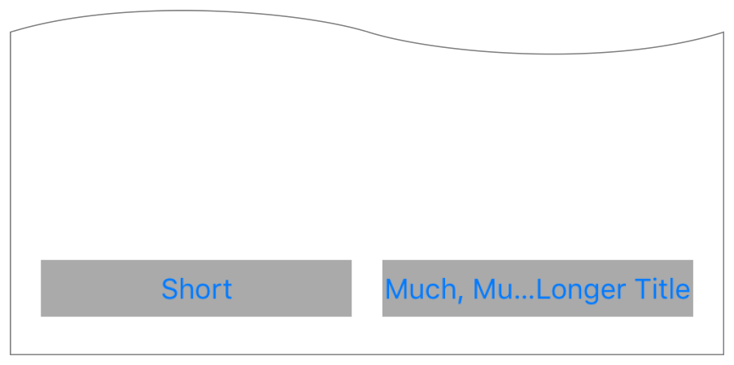
</div>

在iPhone上，两个宽度相等的按钮和两个间距相等的按钮在纵向上几乎相同。只有当你将设备旋转为横向(或使用更大的设备，如iPad)时，这种区别才会变得明显。

### Views and Constraints

在`Interface Builder`中，拖出并定位两个按钮和三个视图对象，在视图之间定位按钮，然后设置约束，如下所示。

<div align="center">    
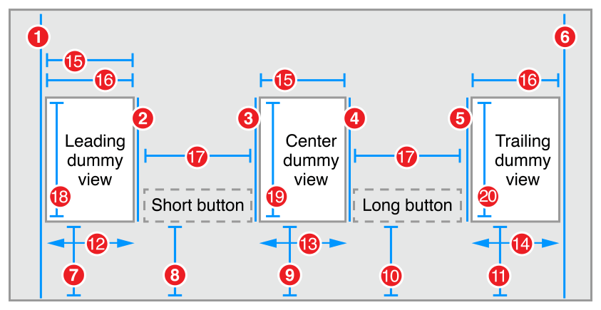
</div>

1. `Leading Dummy View.Leading = Superview.LeadingMargin`
2. `Short Button.Leading = Leading Dummy View.Trailing`
3. `Center Dummy View.Leading = Short Button.Trailing`
4. `Long Button.Leading = Center Dummy View.Trailing`
5. `Trailing Dummy View.Leading = Long Button.Trailing`
6. `Trailing Dummy View.Trailing = Superview.TrailingMargin`
7. `Bottom Layout Guide.Top = Leading Dummy View.Bottom + 20.0`
8. `Bottom Layout Guide.Top = Short Button.Bottom + 20.0`
9. `Bottom Layout Guide.Top = Center Dummy View.Bottom + 20.0`
10. `Bottom Layout Guide.Top = Long Button.Bottom + 20.0`
11. `Bottom Layout Guide.Top = Trailing Dummy View.Bottom + 20.0`
12. `Short Button.Leading >= Superview.LeadingMargin`
13. `Long Button.Leading >= Short Button.Trailing + Standard`
14. `Superview.TrailingMargin >= Long Button.Trailing`
15. `Leading Dummy View.Width = Center Dummy View.Width`
16. `Leading Dummy View.Width = Trailing Dummy View.Width`
17. `Short Button.Width = Long Button.Width`
18. `Leading Dummy View.Height = 0.0`
19. `Center Dummy View.Height = 0.0`
20. `Trailing Dummy View.Height = 0.0`

### Attributes

为按钮设置一个可见的背景颜色，这样可以更容易地看到它们的`frame`是如何随着设备的旋转而变化的。此外，为按钮使用不同长度的标题。按钮的大小应该基于最长的标题。

| View         | Attribute  | Value                    |
| ------------ | ---------- | ------------------------ |
| Short Button | Background | Light Gray Color         |
| Short Button | Title      | Short                    |
| Long Button  | Background | Light Gray Color         |
| Long Button  | Title      | Much Longer Button Title |

### Discussion

如你所见，约束集已经变得很复杂，虽然这个例子是为了演示一种特定的技术而设计的，但在真实的应用程序中，你应该考虑使用`stack view`。

在这个例子中，你想要空白的大小随着父视图`frame`的改变而改变。这意味着你需要一组等宽的约束来控制空白的宽度;但是，您不能在空的空间上创建约束，必须有某种大小可以约束的对象。

在这个例子中，你使用虚拟视图来表示空白空间，这些视图是`UIView`类的空实例，在这个例子中，它们被赋予一个0点的高度来最小化它们对视图层次结构的影响。

> 注意：虚拟视图会给你的布局增加很大的成本，所以你应该谨慎地使用它们，如果这些视图很大，它们的图形上下文可能会消耗相当多的内存，即使它们不包含任何有意义的信息。
>
> 此外，这些视图参与到**视图层次结构的响应链**中，这意味着它们会响应沿着响应链发送的消息，比如hit test。如果处理不当，这些视图就会拦截并响应这些消息，从而产生难以发现的bug。

或者，你可以使用`UILayoutGuide`类的实例来表示空格。这个轻量级类表示一个可以参与自动布局约束的矩形`frame`。`layout guide`没有图形上下文，它们不是视图层次结构的一部分。这使得`layout guide`非常适合分组`item`或定义空白。

不幸的是，你不能在`Interface Builder`中向场景添加`layout guide`，并且将以编程方式创建的对象与基于故事板的场景混合在一起会变得非常复杂。一般的经验法则是，使用`storyboards`和`Interface Builder`比使用自定义的`layout guide`更好。

本例使用大于等于的约束来设置按钮周围的最小边距，`required`约束保证了按钮总是相同的宽度，空白视图也总是等宽，布局的其余部分主要由按钮的`CHCR`优先级处理。如果没有足够的空间，空白视图将折叠为0点宽度，按钮将它们之间的可用空间分隔开(它们之间使用标准间距)。随着可用空间的增加，按钮开始扩展，直到它们达到较大按钮的`intrinsic width`，然后空白视图开始扩展，空白视图继续扩展以填充任何剩余的空间。

## Two Buttons with Size Class-Based Layouts

本例使用两组不同的约束，`One is installed for the Any-Any layout.` 这些约束定义一对等宽按钮，与[Two Equal-Width Buttons](https://developer.apple.com/library/archive/documentation/UserExperience/Conceptual/AutolayoutPG/ViewswithIntrinsicContentSize.html#//apple_ref/doc/uid/TP40010853-CH13-SW4) 例子相同

另一组约束配置在`Compact-Regular`布局上，这些约束定义了一对堆叠的按钮，如下所示

<div align="center">    
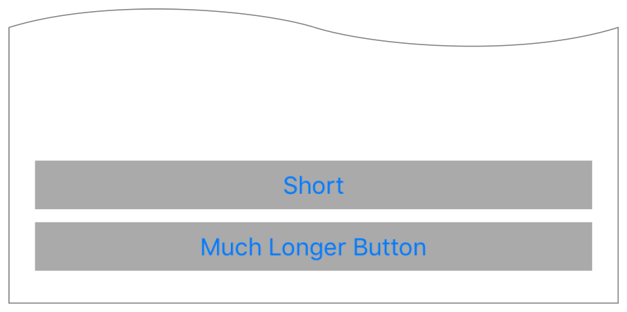
</div>

垂直堆叠的按钮在`iPhone`的纵向使用。水平的按钮行用于其他地方。

### Constraints

将按钮的布局设置成与`Two Equal-Width Buttons`一样，在`Any-Any size class`中，设置约束1到6。

接下来，切换 `Interface Builder`的`size class`到`Compact-Regular layout`

<div align="center">    
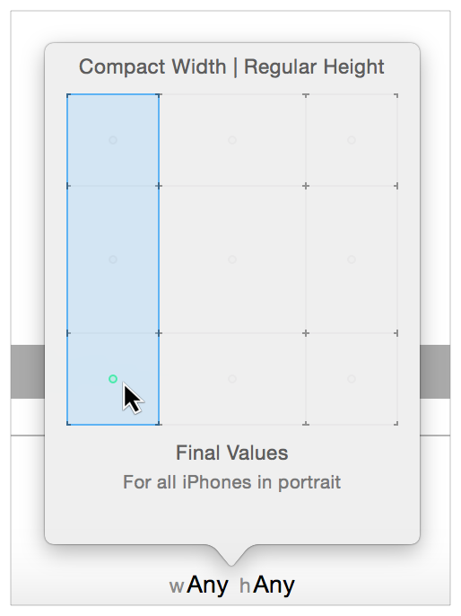
</div>

删除约束2和约束5，然后添加约束7、8、9，如下所示

<div align="center">    
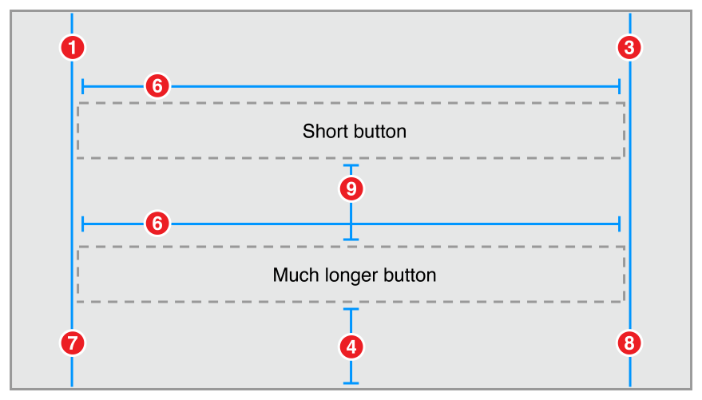
</div>

1. `Short Button.Leading = Superview.LeadingMargin`
2. `Long Button.Leading = Short Button.Trailing + Standard`
3. `Long Button.Trailing = Superview.TrailingMargin`
4. `Bottom Layout Guide.Top = Short Button.Bottom + 20.0`
5. `Bottom Layout Guide.Top = Long Button.Botton + 20.0`
6. `Short Button.Width = Long Button.Width`
7. `Long Button.Leading = Superview.LeadingMargin`
8. `Short Button.Trailing = Superview.TrailingMargin`
9. `Long Button.Top = Short Button.Bottom + Standard`

### Attributes

为按钮设置一个可见的背景颜色，这样可以更容易地看到它们的`frame`是如何随着设备的旋转而变化的。此外，为按钮使用不同长度的标题，以表明按钮标题不影响按钮的宽度。

| View         | Attribute  | Value                    |
| ------------ | ---------- | ------------------------ |
| Short Button | Background | Light Gray Color         |
| Short Button | Title      | short                    |
| Long Button  | Background | Light Gray Color         |
| Long Button  | Title      | Much Longer Button Title |

### Discussion

`Interface Builder`允许你设置特定于`size-class`的视图，视图属性和约束。它允许你为宽度和高度的三个不同大小的类(紧凑类、任意类或常规类)指定不同的选项，总共给出9个不同大小的类。其中四个对应于设备上使用的最终`size`类(`Compact-Compact`、`Compact-Regular`、`Regular-Compact`和R`egular-Regular`)，其余的是基本`size`类，或者两个或两个以上size`类`(`Compact-Any`、`Regular-Any`、`Any-Compact`、Any-Regular和`Any-Any`)的抽象表示。

当加载给定`size`类的布局时，系统加载该`size`类的最特定设置。这意味着`Any-Any` `size`类定义了所有视图使用的默认值，`Compact-Any `会影响宽度紧凑的所有视图，`Compact-Regular`仅用于宽度紧凑和高度常规的视图，当视图的`size`类发生变化时——例如，当iPhone从纵向旋转到横向时，系统会自动交换布局并使变化产生动画效果。

你可以使用这个功能为不同的iPhone方向创建不同的布局。你也可以用它来创建不同的iPad和iPhone布局。当然，你所做的更改越多，故事板就变得越复杂，设计和维护也就越困难。

请记住，你需要确保每个可能的`size`类都有一个有效的布局，包括所有的基本`size`类。一般来说，最简单的方法是选择一个布局作为默认布局，在`Any-Any ` `size`类中布局，根据需要修改，你可以在更具体的`size`类中添加和删除`item`。

对于更复杂的布局，你可能希望在开始之前绘制大小为9 x 9的网格类，用这些`size`类的布局填充四个角。然后，网格让您看到哪些约束是跨多个`size`类共享的，并帮助您找到布局和`size`类的最佳组合。

有关使用size类的更多信息，请参阅[Debugging Auto Layout](https://developer.apple.com/library/archive/documentation/UserExperience/Conceptual/AutolayoutPG/TypesofErrors.html#//apple_ref/doc/uid/TP40010853-CH22-SW1)

# 源文档

[Views with Intrinsic Content Size](https://developer.apple.com/library/archive/documentation/UserExperience/Conceptual/AutolayoutPG/ViewswithIntrinsicContentSize.html#//apple_ref/doc/uid/TP40010853-CH13-SW1)