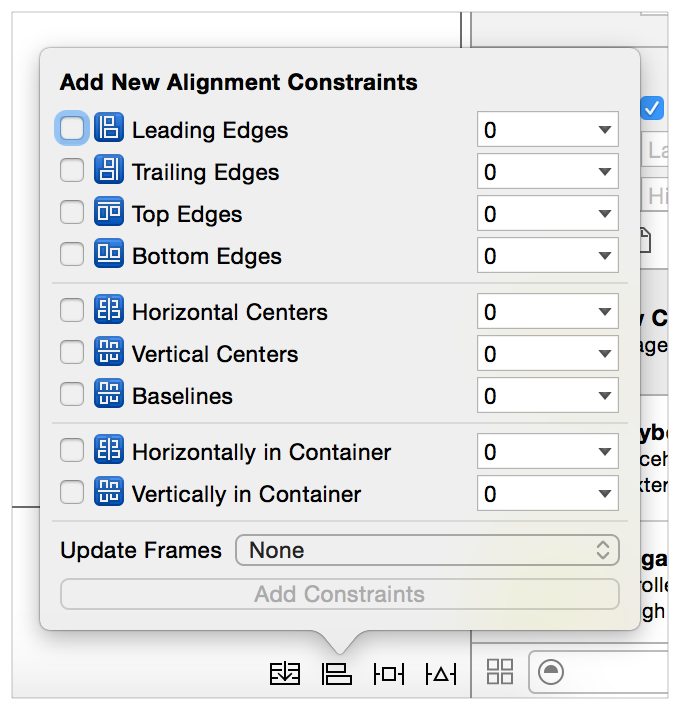
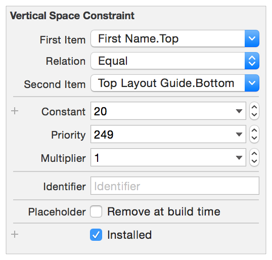

# 目录

   * [Working with Constraints in Interface Builder(可视化使用约束)](#working-with-constraints-in-interface-builder可视化使用约束)
      * [Control-Dragging Constraints(控件拖拽使用约束)](#control-dragging-constraints控件拖拽使用约束)
      * [Using the Stack, Align, Pin and Resolve Tools](#using-the-stack-align-pin-and-resolve-tools)
         * [Stack Tool](#stack-tool)
         * [Align Tool](#align-tool)
         * [Pin Tool](#pin-tool)
         * [Resolve Auto Layout Issues Tool](#resolve-auto-layout-issues-tool)
      * [Letting Interface Builder Create Constraints](#letting-interface-builder-create-constraints)
      * [Finding and Editing Constraints](#finding-and-editing-constraints)
         * [Viewing Constraints in the Canvas](#viewing-constraints-in-the-canvas)
         * [Listing Constraints in the Document Outline](#listing-constraints-in-the-document-outline)
         * [Finding Constraints in the Size Inspector](#finding-constraints-in-the-size-inspector)
         * [Examining and Editing Constraints](#examining-and-editing-constraints)
      * [Setting Content-Hugging and Compression-Resistance Priorities](#setting-content-hugging-and-compression-resistance-priorities)
      * [iOS-Only Features](#ios-only-features)
         * [Top and Bottom Layout Guides](#top-and-bottom-layout-guides)
         * [Layout Margins](#layout-margins)
         * [Readable Content Guides](#readable-content-guides)
         * [Semantic Content](#semantic-content)
      * [Rules of Thumb](#rules-of-thumb)
   * [源文档](#源文档)

# Working with Constraints in Interface Builder(可视化使用约束)

在`Interface Builder`中设置自动布局约束主要有三个方式:你可以在视图之间使用`control-drag`，你可以使用`Pin`和`Align`工具，你可以让`Interface Builder`为你设置约束，然后编辑或修改结果。每种方法都有自己的优缺点。大多数开发者发现他们更喜欢使用一种方法;但是，熟悉这三种方法可以让你根据手头的任务在工具之间快速切换。

对于这三个方法，首先要从对象库中拖动视图和控件到场景中。根据需要调整它们的大小和位置。当你把一个视图放在画布上时，`Interface Builder`会自动创建一组约束原型，这些约束定义了视图相对于左上角的当前大小和位置。

应用程序可以在原型约束下构建和运行。使用这些约束来快速可视化和测试用户界面，然后用你自己的显式约束替换隐式约束，永远不要发布带有原型约束的应用。

> 上面两段的意思是，拖出的控件会自动生成一些隐式约束，但是还没有生效，需要开发者显式指定

一旦你创建了第一个约束，系统就会从该约束所引用的视图中删除所有原型化约束。如果没有原型约束，你的布局将不再有足够的约束来确定所有视图的大小和位置，它变成了一个模糊的布局，受影响的约束会以以红色显示，`Xcode`会生成大量警告。

不要慌，只要不断添加约束条件，直到布局完成。**只要添加一个约束，就需要添加创建一个无二义性、可满足的布局所需的所有约束**。

有关修复布局警告和错误的更多信息，请参阅[Debugging Auto Layout](https://developer.apple.com/library/archive/documentation/UserExperience/Conceptual/AutolayoutPG/TypesofErrors.html#//apple_ref/doc/uid/TP40010853-CH22-SW1)。

## Control-Dragging Constraints(控件拖拽使用约束)

要在两个视图之间创建约束，单击其中一个视图并拖动到另一个视图。

    

当你释放鼠标时，`Interface Builder`将显示一个HUD菜单，其中包含可能的约束列表。

    

`Interface Builder` 基于约束项和拖动手势的方向智能地选择约束集,如果你水平或多或少地拖动，你将获得设置视图之间水平间距的选项，以及垂直对齐视图的选项。如果你垂直或多或少地拖动，你将获得设置垂直间距的选项，以及水平对齐视图的选项。这两种手势都可能包括其他选项(比如设置视图的相对大小)。

> 注意：你可以在画布上的item和Scene大纲中的图标上使用Control-drag手势,当试图为难以找到的item绘制约束时，如top或bottom layout guides，这通常是有用的，当拖动到或从大纲中拖动时，Interface Builder不会根据手势的方向过滤可能的约束列表。

`Interface Builder`基于视图的当前`frame`创建约束，因此，你需要在添加约束之前仔细定位视图，如果你根据`Interface Builder`的指引排列视图，你应该得到一组合理的约束，如果有必要，您总是可以在之后编辑约束。

控件拖动提供了一种快速设置约束的方法；然而，因为约束的值是从场景的当前布局推断出来的，所以很容易以一个点结束。如果你想要更精细的控制，请在创建约束后检查和编辑它们，或者使用`Pin`和`Align`工具。

## Using the Stack, Align, Pin and Resolve Tools

`Interface Builder`在编辑器窗口的右下角提供了四个自动布局工具，分别是`Stack`、`Align`、`Pin`和`Resolve Auto Layout Issues `工具(新版的工具可能有些变化了)。

    

当你想要在创建约束或同时创建多个约束时进行精细控制时，请使用`Pin`和`Align`工具。借用这些工具，你不需要在创建约束之前精确地放置视图，相反，你可以大致设置视图的相对位置，添加约束，然后更新`frames`，自动布局为你计算正确的位置。

### Stack Tool

`Stack Tool`允许你快速创建一个`stack view`,在布局中选择一个或多个`item`,然后单击`Stack Tool`，`Interface Builder`将选中的`item`嵌入到`stack view`中，并根据其内容调整为当前适合的大小。

> 注意：系统从视图的初始相对位置推断`stack`的轴和对齐方式。你可以使用Attributes inspector修改轴和对齐方式(并设置它的分布和间距)。

### Align Tool

对齐工具可以让你快速对齐布局中的项目，选择要对齐的项目，然后单击对齐工具。`Interface Builder`提供了一个弹出窗口视图，其中包含了许多可能的对齐方式。

    

选择对齐所选视图的选项，并单击`Add Constraints`按钮，`Interface Builder`创建确保这些对齐所需的约束，默认情况下，约束没有任何偏移(边缘或中心彼此对齐)，并且当约束添加时没有任何`frames`更新。您可以在创建约束之前更改这些设置中的任何一个。

在使用对齐工具之前，通常要选择两个或多个视图，然而，水平在容器或垂直在容器约束可以添加到单个视图，你可以使用弹出窗口一次创建任意数量的约束——尽管一次创建一个或两个以上的约束很少有意义。

### Pin Tool

`Pin`工具可以让你快速定义一个视图相对于它附近视图的位置或者快速定义它的大小，选择目标视图，然后点击`Pin`，`Interface Builder`提供了一个包含许多选项的弹出窗口视图。

    

在弹出窗口的顶部，你可以将选中的`item`的`Leading`、`Top`、`Trailing`或`Bottom`固定到它最近的邻居。关联的数字表示画布中`item`之间的当前间距，你可以输入自定义间距，或者单击下标箭头以设置它应该被限制到哪个视图，或者选择标准间距。"`Constrain to margins`"决定了约束是相对于父控件的`margins`还是`edges`(前者表示内边距，后者表示边线)。

    

弹出窗口的下部允许你设置`item`的宽度或高度，宽度和高度约束默认为当前画布大小，不过你可以输入不同的值。纵横比约束也使用`item`当前的纵横比；但是，如果你想要更改这个比例，您需要在创建约束之后检查和编辑它。

通常，你选择一个单一的视图添加约束；但是，你可以选择两个或更多的视图，并给它们相同的宽度或相同的高度。你还可以一次创建多个约束，或者在添加约束时更新`frames`。设置好所需的选项后，单击`Add Constraints`按钮来创建约束

### Resolve Auto Layout Issues Tool

`Resolve Auto Layout Issues tool`提供了一些选项来修复常见的自动布局问题，菜单上半部分的选项只影响当前选择的视图，下半部分的选项影响场景中的所有视图。

    

你可以使用这个工具根据当前的约束来更新视图的`frames`，或者你可以根据视图在画布中的当前位置来更新约束，你还可以添加缺失的约束、清除约束或将视图重置为`Interface Builder`推荐的一组约束

## Letting Interface Builder Create Constraints

`Interface Builder`可以为你创建部分或全部约束，当使用这种方法时，`Interface Builder`试图推断出给定视图当前大小和在画布中的位置的最佳约束。一定要小心地定位你的视图——间距上的微小差异会导致明显不同的布局。

要让`Interface Builder`创建所有的约束，点击`Resolve Auto Layout Issues tool ` > `Reset to Suggested Constraints`。

或者，你可以自己添加一些约束，然后单击`Resolve Auto Layout Issues tool ` >Add Missing Constraints，该选项添加了具有无二义性布局所需的约束。同样，你可以添加约束到被选中的视图或场景中的所有视图。

这种方法可以让你快速构建一个明确的、可满足的布局，但是除非用户界面非常简单，否则产生的布局可能不会按照你想要的方式运行。你需要不断测试用户界面并修改约束，直到得到预期的结果。

## Finding and Editing Constraints

在添加约束之后，你可以找到它、查看它并编辑它。有许多访问约束的方法，每一种都提供了一种独特的组织和呈现约束的方法。

### Viewing Constraints in the Canvas

编辑器将影响当前所选视图的所有约束显示为画布上的彩色线。形状、描边类型和线颜色可以告诉你许多有关约束的当前状态的信息:

* **I-bars (lines with T-shaped end-caps)** I-bars表示空间的大小，这个空间可以是两个`item`之间的距离，也可以是`item`的高度或宽度。
* **Plain lines (straight lines with no end-caps)** 普通线条表示边缘对齐的位置，例如，当对齐两个或多个视图的`leading`时，`Interface Builder`使用`Plain lines`。
* **Solid Lines** 实线表示`required`约束(优先级 = 1000)
* **Dashed Lines** 虚线表示可选的约束(优先级< 1000) 
* **Red Lines** 受此约束影响的其中一个`item`有错误，要么`item`的布局不明确，要么它的布局没有满足。有关更多信息，请参阅问题导航器或`Interface Builder`的大纲视图中的箭头。
* **Orange Lines** 橙色线表示受此约束影响的其中一个`item`的`frame`根据当前约束集不在正确位置，`Interface Builder`还将`frame`的计算位置显示为虚线轮廓，你可以使用`Resolve Auto Layout Issues tool` > `Update Frames command`将`item`移动到其计算位置。
* **Blue Lines** 受约束影响的`item`具有明确的、可满足的布局，并且`item`的`frame`处于自动布局引擎计算的正确位置。
* **Equal Badges** `Interface Builder`显示的约束为两个`item`提供了相等的宽度或高度，作为每个`item`的单独栏。两个栏都有一个蓝色的标记，里面有一个相等(=)的标记。
* **Greater-than-or-equal and less-than-or-equal badges** `Interface Builder`将所有表示大于或等于和小于或等于关系的约束标记为一个小的蓝色徽章，其中有一个`>=`或`<=`符号

    

### Listing Constraints in the Document Outline

`Interface Builder`列出了文档大纲中的所有约束，并将它们分组到保存它们的视图下，约束由最近的视图持有，该视图包含约束中的两个`item`，对于这个计算，每个视图包含它自己和它的所有子视图，`top`、`bottom layout guides`包含在场景的根视图中。

    

即使约束可以散布在大纲周围，大多数约束最终会在场景的根视图下结束，如果要确保找到所有约束，请展开整个视图层次结构。

约束以伪代码的形式列出，这些信息通常很长，而且它们通常从一组类似的视图开始，所以在看到有意义的信息之前，你可能必须增加大纲的宽度，在大纲中选择约束会在画布中突出显示该约束，使用此功能可帮助您快速识别要检查的约束。

对于简单的场景，大纲是一个很好的地方，可以浏览所有场景的约束条件。然而，随着布局变得越来越复杂，很快就很难找到特定的约束条件。你最好一次检查一个视图——要么在画布上选择视图，要么在`Size inspector`中检查视图。

### Finding Constraints in the Size Inspector

`Size inspector`列出了当前所选视图的所有约束,`required`类型的约束显示为实线轮廓，而可选约束显示为虚线轮廓。描述中列出了关于约束的重要信息，它始终包含受影响的属性和约束中的其他`item`，它还包括关系、常数值和乘数或比例。

    

上面屏幕截图顶部的图表表示了哪些属性受到约束的影响，你可以通过选择一个或多个图的属性来筛选约束列表，然后列表只显示那些影响所选属性的约束

### Examining and Editing Constraints

当你在画布或文档大纲中选择一个约束时，`Attribute inspector` 将显示约束的所有属性,这包括约束方程的所有值:`the first item, the relation, the second item, the constant, and the multiplier`。`Attribute inspector`还显示约束的优先级及其标识符。

    

> 注意:约束的identifier属性允许你提供一个描述性的名称，以便你可以更容易地在控制台日志和其他调试任务中识别约束。

还可以将约束标记为占位符，这些限制只在设计时存在，当应用程序运行时，它们不包括在布局中，当你计划在运行时动态添加约束时，通常会添加占位符约束。通过临时添加创建无歧义、可满足的布局所需的约束，你可以清除`Interface Builder`中的任何警告或错误。

你可以自由地修改常量、优先级、乘数、关系、标识符和占位符属性，然而，对于`item1`和`item2`，你的选择比较有限，你可以交换`item1`和`item2`(根据需要反转乘数和常数)，还可以更改`item`的属性，但不能更改`item`本身，如果需要将约束移动到完全不同的`item`上，请删除约束并使用新的约束替换它。

一些编辑也可以直接从`Size inspector`操作，单击任何约束中的`Edit`按钮都会弹出一个弹出窗口，您可以在其中更改约束的关系、常量、优先级或乘数。要做额外的更改，双击约束以选择它并在`Attribute inspector`中打开它。

    

## Setting Content-Hugging and Compression-Resistance Priorities

要设置视图的`content-hugging` 和 `compression-resistance` 优先级(`CHCR`优先级)，请在画布或文档大纲中选择视图，打开`Size inspector`向下滚动，直到找到`Content Hugging Priority` 和 `Compression Resistance Priority` 设置。

    

你也可以在`Interface Builder`中设置视图的`intrinsic size`，默认情况下，`Interface Builder`使用从视图的`intrinsicContentSize`方法返回的大小，但是，如果你在设计时需要不同的大小，你可以设置一个占位`intrinsic size`。这个占位只在`Interface Builder`中影响视图的大小，它在运行时对视图没有任何影响。

## iOS-Only Features

iOS添加了一些与自动布局交互的独特功能，包括`top and bottom layout guides`、视图的布局边距(`layout margins`)、视图的可读内容指南(`readable content guides`)和视图的语义内容(semantic content)。

### Top and Bottom Layout Guides

`top and bottom layout guides`代表当前活动的视图控制器**可见内容区域的上边缘和下边缘**，如果你不想让你的内容扩展到透明或半透明的UIKit栏下(例如，状态栏，导航栏，或标签栏)，使用`Auto Layout`将你的内容固定到相应的`layout guide`。

`layout guides`采用`UILayoutSupport`协议，给`guide`一个`length`属性，该属性度量`guide`和视图各自边缘之间的距离，具体地说：

* 对于`top layout guide`，`length`表示距离，用点表示，在视图控制器视图的顶部和覆盖该视图的最底部栏的底部之间
* 对于`bottom layout guide`，`length`表示距离，用点表示，在视图控制器视图的底部和顶部之间的覆盖视图的栏（例如`tab bar`）之间

这些`guide`还可以作为约束中的`item`，支持`top`、`bottom`和`height`属性，通常，你将视图约束到 `top layout guide`的`bottom`属性或`bottom layout guide`的`top`属性。这些`guide`还提供了`topAnchor`、`bottomAnchor`和`hightanchor`属性，以简化编程创建约束的过程。

当创建根视图的顶部或底部边缘的约束时，`Interface Builder`自动提供`top and bottom layout guides`选项。如果`layout guide`是视图最近的邻居，`Interface Builder`默认使用这个`layout guide`。当使用`Pin`工具时，你可以在`layout guide`和根视图的边缘之间切换。

### Layout Margins

自动布局为每个视图定义边距，这些边距描述了视图边缘及其子视图之间的首选间距。你可以使用`layoutMargins`或`layoutMarginsGuide`属性访问视图的边距，`layoutMargins`属性允许你获取和设置作为`UIEdgeInsets`结构的边距，`layoutMarginsGuide`属性作为`UILayoutGuide`对象提供对页边距的只读访问。另外，使用`preservesSuperviewLayoutMargins`属性来确定视图的边距如何与其父视图的边距交互。

**默认边距是每边8个屏幕点，你可以根据应用程序的需要修改这些边距**。

> 注意：系统设置和管理视图控制器的根视图的边距，顶部和底部的边距设置为0点，使它很容易扩展内容到各种bar下(如果有的话)。边距取决于控制器的呈现方式和位置，但可以是16屏幕点或20屏幕点，你不能改变这些边距。

当约束一个视图到它的父视图时，你通常使用` layout margins`而不是视图的边缘。在`UIKit`中，`NSLayoutAttribute`枚举定义了一些属性来表示`top`、`bottom`、`leading`、`trailing`、`left margins `和`right margins` ，它还包括相对于边距的`center X`和`center Y`的属性。

在`Interface Builder`中，控件在视图和它的父视图之间拖动约束时默认使用边距属性。当使用`Pin`工具时，你可以切换"`Constrain to margins`"复选框，如果勾选了，产生的约束将使用父视图的边距属性，如果未选中，它们会使用父视图的边缘。类似地，在`Attribute inspector`中编辑约束时，`item1`和`item2`弹出的菜单包括一个`Relative to margin`选项，效果与前者一样。

最后，当以编程方式创建父视图边距的约束时，使用`layoutMarginsGuide`属性并直接创建`layout guide`的约束。这使你使用`guide`的`layout anchors`来创建约束，从而提供易于阅读的简化API。

### Readable Content Guides

视图的`readableContentGuide`属性包含了一个`layout guide`，它定义了视图内**文本对象**的最大最佳宽度。理想情况下，内容足够窄，用户无需移动头部就能阅读。

这个`guide`总是在视图的`layout margin`中居中，并且永远不会超出这些边距。`guide`的大小也随系统动态类型的大小而变化，当用户选择更大的字体时，系统会创建更宽的`guide`，因为用户在阅读时通常会把设备拿得离自己更远。

在`Interface Builder`中，你可以设置视图的边距代表布局边距还是`readable content guide`。选择视图(通常是视图控制器的根视图)，并打开`Size inspector`，如果你选择`Follow Readable Width`复选框，视图边距上的任何约束都将使用`Readable content guide`。

> 注意：对于大多数设备来说，readable content guides和 layout margins之间几乎没有区别。只有在横向操作iPad时，这种差异才会变得明显。

### Semantic Content

如果你使用`leading`和`trailing`约束来布局视图，视图在从左到右语言(如英语)和从右到左语言(如阿拉伯语)之间切换时自动翻转位置，然而，一些界面元素不应该根据阅读方向改变它们的位置，例如，基于物理方向(上、下、左、右)的按钮应该始终保持相同的相对方向。

视图的`semanticContentAttribute`属性决定在从左到右和从右到左切换语言时，视图的内容是否应该翻转

在`Interface Builder`中，在属性检查器中设置语义选项，如果该值未指定，视图的内容将随读取方向翻转，如果将其设置为"`Spatial`"、"`Playback`"或"`Force Left-to-Righ`t"，则内容的布局总是`leading`在左侧，`trailing`在右侧。`Force Right-to-Left `总是将内容的`leading`向右，`trailing`向左布局。

## Rules of Thumb

下面的指引将帮助你成功使用自动布局，毫无疑问，这些规则都有一些合理的例外。然而，如果你决定改变他们，暂停和仔细考虑你的方法是否合理。

* 不要使用`frame`、`bounds`或`center`属性来指定视图的几何形状(这一点属实不懂)

* 尽可能使用`stack views`

  `stack views`管理其内容的布局，极大地简化了布局的其余部分所需的约束逻辑。只有当`stack views`不能提供你需要的行为时，才求助于自定义约束。

* 在视图和它最近的邻居之间创建约束

  如果有两个相邻的按钮，则将第二个按钮的`leading`约束为第一个按钮的`trailing`。第二个按钮通常不应该有跨越第一个按钮到视图边缘的约束。

* 避免给视图一个固定的高度或宽度

  自动布局的关键在于动态响应更改，设置固定大小会使视图失去适应的能力。但是，你可能想要为视图设置最小或最大的尺寸。

* 如果你在设置约束时有困难，尝试使用`Pin`和`Align`工具，尽管这些工具可能比拖拽控件慢一些，但是它们允许你在创建约束之前验证所涉及的精确值和项。这种额外的健全性检查很有帮助，特别是在你刚开始使用约束时

* 当自动更新`items`的`frame`时要小心，如果`item`没有足够的约束来完全指定其大小和位置，则未定义更新行为，视图经常消失，要么是因为它们的高度或宽度被设置为零，要么是因为它们被意外地定位在屏幕之外

* 确保布局中的所有视图都有有意义的名称，这使得在使用这些工具时更容易识别视图

  系统根据标签和按钮的文本或标题自动命名它们，对于其他视图，你可能需要在`Identity inspector`中设置一个`Xcode`特定的标签(或者在文档大纲中双击并编辑视图的名称)。

* 总是使用`leading`和`trailing`约束，而不是左右约束。

  你总是可以使用它的`semanticContentAttribute`属性(iOS)或`userInterfaceLayoutDirection`属性(OS X)来调整视图如何解释它的`leading`和`trailing`
  
* 在iOS中，当将一个`item`约束到视图控制器根视图的边缘时，使用以下约束:

  * **Horizontal constraints** 对于大多数控件，对布局边距使用零点约束。系统会根据设备是什么以及应用程序如何呈现视图控制器自动提供正确的间距。

    对于从页边距到页边距填满根视图的文本对象，使用`readable content guides `而不是` layout margins`。

    对于需要从边到边填充根视图的`item`(例如，背景图像)，使用视图的`leading`和`trailing`。

  * **Vertical constraints** 如果视图扩展到各种`bar`底部，使用`top and bottom margins`，这在滚动视图中特别常见，它允许内容在`bar`下滚动，但是请注意，你可能需要修改滚动视图的`contentInset`和`scrollIndicatorInsets`属性来正确设置内容的初始位置。如果视图没有在`bar`下展示，则将视图约束到`top and bottom layout guides`。

* 当以编程方式实例化视图时，请确保将它们的`translatesAutoresizingMaskIntoConstraints`属性设置为`NO`。默认情况下，系统会自动创建一组基于视图`frame`及其`autoresizing mask`的约束。当你添加自己的约束时，它们不可避免地会与自动生成的约束发生冲突，这就产生了一个无法令人满意的布局。

* 请注意OS X和iOS的布局计算方式不同。

  在OS X中，自动布局可以修改窗口的内容和窗口的大小。
  
  在iOS中，系统提供场景的大小和布局，自动布局只能修改场景的内容。
  
  这些差异看似微不足道，但却会对你的布局设计产生深远的影响，尤其是对你如何使用优先级的影响。
  
# 源文档

[Working with Constraints in Interface Builder](https://developer.apple.com/library/archive/documentation/UserExperience/Conceptual/AutolayoutPG/WorkingwithConstraintsinInterfaceBuidler.html#//apple_ref/doc/uid/TP40010853-CH10-SW1)

  

