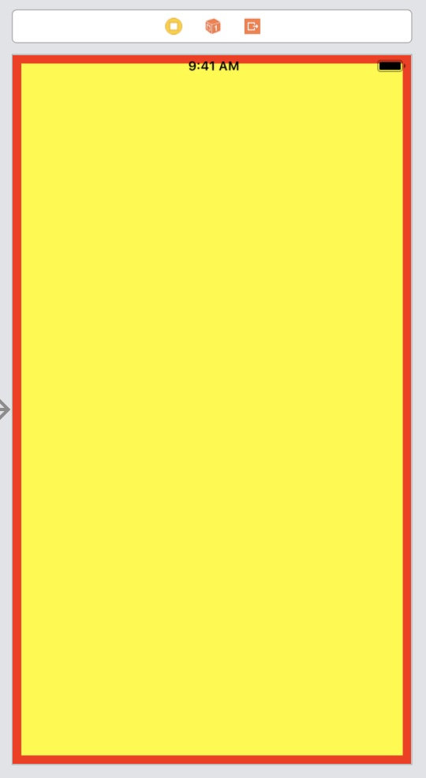
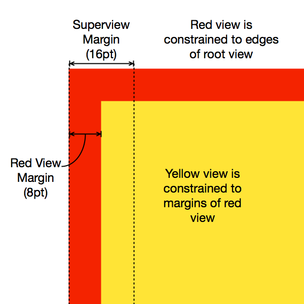
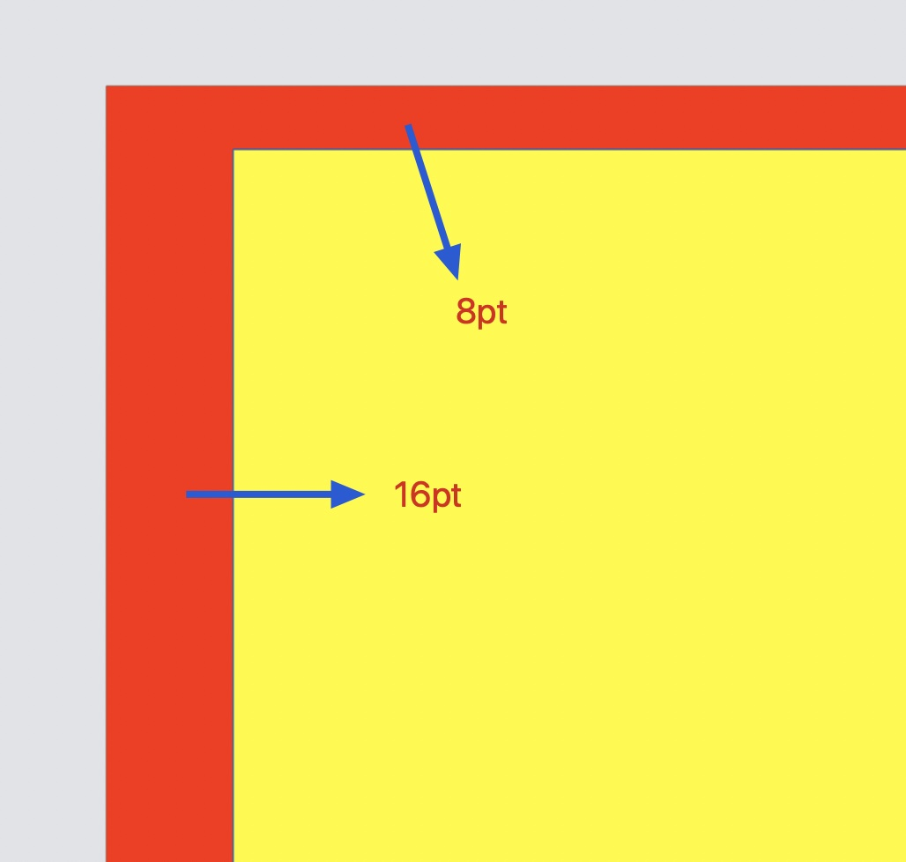
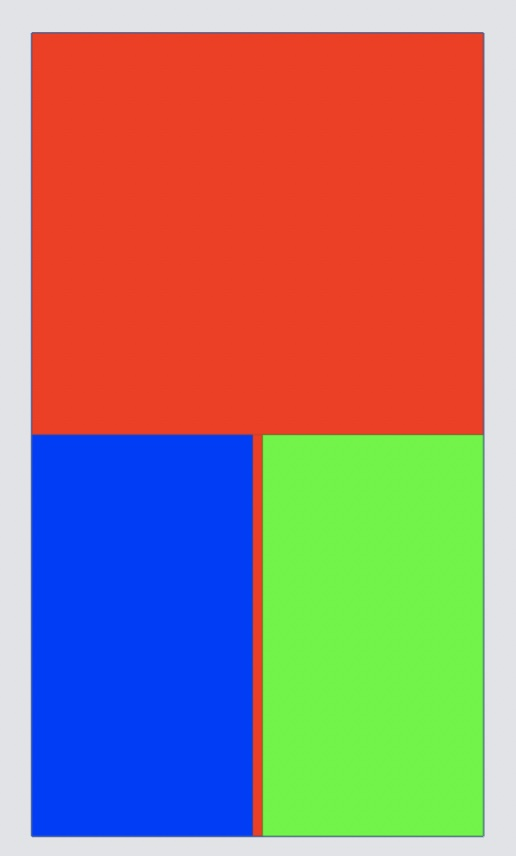

# 目录

   * [前言](#前言)
   * [Layout Margins](#layout-margins)
      * [研究实例](#研究实例)
   * [preservesSuperviewLayoutMargins](#preservessuperviewlayoutmargins)
   * [使用margins的stack view](#使用margins的stack-view)

# 前言

本文主要讲述`UIView`的`layout margins`属性和`preservesSuperviewLayoutMargins`属性

# Layout Margins

```objc
/* -layoutMargins returns a set of insets from the edge of the view's bounds that denote a default spacing for laying out content.
 If preservesSuperviewLayoutMargins is YES, margins cascade down the view tree, adjusting for geometry offsets, so that setting
 the left value of layoutMargins on a superview will affect the left value of layoutMargins for subviews positioned close to the
 left edge of their superview's bounds
   If your view subclass uses layoutMargins in its layout or drawing, override -layoutMarginsDidChange in order to refresh your 
 view if the margins change.
   On iOS 11.0 and later, please support both user interface layout directions by setting the directionalLayoutMargins property
 instead of the layoutMargins property. After setting the directionalLayoutMargins property, the values in the left and right
 fields of the layoutMargins property will depend on the user interface layout direction.
 */
@property (nonatomic) UIEdgeInsets layoutMargins NS_AVAILABLE_IOS(8_0);
```

将注释拆分出来解析：

> -layoutMargins returns a set of insets from the edge of the view's bounds that denote a default spacing for laying out content.
-layoutMargins 返回一组insets表示视图的边缘边界到布局内容之间的一个间距(空间)

实际上`layoutMargins`类似CSS的`padding`(填充)，即**视图内部上、左、下、右方会有一定空间大小的空白填充**。

可以理解为视图的**内边距**

>If preservesSuperviewLayoutMargins is YES, margins cascade down the view tree, adjusting for geometry offsets, so that setting the left value of layoutMargins on a superview will affect the left value of layoutMargins for subviews positioned close to the left edge of their superview's bounds
>
>如果视图的preservesSuperviewLayoutMargins属性为YES，边距会影响它的子视图树，自动调整子视图的几何偏移，例如设置superview的layoutMargins的左值会影响到子视图的layoutMargins的左值，而这些子视图是那些定位在贴近它们父视图bounds(边界)的视图。看不懂没关系，下面通过实例理解

后面两段注释就不描述了，跟本文主题不相关。

## 研究实例

使用3个`view`，分别为：

* `view controller`的`root view`
* `root view`的子视图`red view`，它是一个容器视图
* `red view`的子视图`yellow view`，它相当于日常的内容视图

它们的布局情况是：

* `red view`与`root view`的上左下右四边对齐
* `yellow view`与`red view`的`margins`对齐

视图的默认边距在四个方向(上、左、下、右)上均为8pt

根据以上条件，我们得到以下布局内容：

<div align="center">    

</div>

> 重要点：在iOS11前，系统会根据`size class`强制定死`root view`（视图控制器的`view`）的`margins`，顶部和底部的边距为0pt，`leading`和`trailing`边距为`16pt`或`20pt`(取决于`size class`)。

验证一下理论，将3个`view`在默认情况下打印它们的`layoutmargins` ：

```
root view layoutmargins : {0, 16, 0, 16}
red view layoutmargins : {8, 8, 8, 8}
yellow view layoutmargins : {8, 8, 8, 8}
```

结果是一致的

# preservesSuperviewLayoutMargins

从字面上的意思看是 ： **保留父视图的layoutMargins**

下面引用国外博文的一张放大边距图和案例来解释

<div align="center">    

</div>

* 水平方向上，`yellow view`与`red view`之间有8pt的`margin`，这个`margin`是`red view`的
* `red view`紧贴`root view`的边缘，`yellow view`紧贴`red view`的内边距周围
* `red view`的父视图`root view`具有16pt的左边距，因此`yellow view`叠放在`root view`的左边距部分8pt

在这种情况下，设置`preservesSuperviewLayoutMargins`属性就会产生影响，我们将`red view`的该属性设置成`YES`，效果如下：

<div align="center">    

</div>

```
root view layoutmargins : {0, 16, 0, 16}
red view layoutmargins : {8, 16, 8, 16}
yellow view layoutmargins : {8, 8, 8, 8}
```

可以看到`red view`的`leading`和`trailing`边距变成了与`root view`一样，并且影响到了`yellow view`的布局(x值变为了16)，对于顶部和底部边距来说，因为`red view`的默认边距8pt已经大于`root view`的0pt，因此在垂直方向上没有发生变化。

这个时候回头看第二段注释，应该很明确了：

1. "**边距会影响它的子视图树，自动调整子视图的几何偏移**"，在此处，就是`red view`影响了`yellow view`
2. "**设置superview的layoutMargins的左值会影响到子视图的layoutMargins的左值，而这些子视图是那些定位在贴近它们父视图bounds(边界)的视图**"，在此处，`superview`相当于`root view`，子视图相当于`red view`

因此，可以总结一下，如果我们在`red view`中设置该属性，它会增加`red view`的有效边距，以匹配父视图的边距，我们添加到`red view`中的任何子视图，并使用该边距进行约束，都不会与父视图边距重叠。

需要注意的是此属性起作用的具体情况：

* 容器视图(`red view`)填充它的父视图(`root view`)(约束对齐到视图边缘)
* 内容视图(`yellow view`)基于容器视图(`red view`)的`margins`布局
* 容器视图(`red view`)的边距比它父视图(`root view`)的边距小

如果内容视图`yellow view`是基于容器视图(`red view`)的边缘(`edge`)进行约束布局，意味着你不关心`red view`的边距，那么`preservesSuperviewLayoutMargins`就不会有什么影响。

# 使用margins的stack view

如果将上例的容器视图(`red view`)更改了`stack view`，情况会变得稍许复杂，请看以下效果：

<div align="center">    

</div>

上图展示的是，用一个`stack view`，布局在`root view`下半区域，`stack view`内水平排列两个等宽的`blue view`和`green view`，当设置`stack view`的`preservesSuperviewLayoutMargins`属性时，并**没有产生上例的效果**。原因是，默认情况下，`stack view`的排列子视图使用的约束是基于`stack view`的边缘(`edge`)，而非边距(`margins`)。幸运的是，`stack view`的`isLayoutMarginsRelativeArrangement`属性可让我们修改它，文档描述如下：

> If `YES`, the stack view will layout its arranged views relative to its layout margins. If `NO`, it lays out the arranged views relative to its bounds. The default is `NO`.

注释很简单，就不翻译了

