# 前言

本文是根据国外的一篇博文[Layout Guide, Margins, Insets and Safe Area demystified on iOS 10 & 11](https://blog.smartnsoft.com/layout-guide-margins-insets-and-safe-area-demystified-on-ios-10-11-d6e7246d7cb8)翻译的，其中穿插了自己的一些试验例子。

# 揭秘iOS10&11前后的Layout Guide，Margins，Insets和Safe_Area

<div align="center">    

</div>

<p align="center">iPhone X水平方向上的安全区域</p>

iOS11改进了很多关于视图如何布局用户界面的方法，同时也引入了新的屏幕尺寸设备`iPhone X`，所以iOS11是一个分水岭，新布局技术的出现，你可能会有点困惑，那么是时候回顾和揭开`margins`、`insets`、`scroll views`和`Safe Area`的神秘面纱了。

# Margins

`margin`译为边距或页边距，以下统一用中文**边距**表示。

## layoutMargins property

`layoutMargins`属性，苹果是在`iOS8`开始介绍并在`UIView`上使用它。

通过使用`layoutMargins`，你可以约束布局的所有内容，使其遵循边距。它避免将某些边距值通过手动方式作用于每个子视图(意思是我们可以统一设定边距值来影响子视图)。

```objective-c
/* -layoutMargins returns a set of insets from the edge of the view's bounds that denote a default spacing for laying out content.
 If preservesSuperviewLayoutMargins is YES, margins cascade down the view tree, adjusting for geometry offsets, so that setting
 the left value of layoutMargins on a superview will affect the left value of layoutMargins for subviews positioned close to the
 left edge of their superview's bounds
   If your view subclass uses layoutMargins in its layout or drawing, override -layoutMarginsDidChange in order to refresh your 
 view if the margins change.
   On iOS 11.0 and later, please support both user interface layout directions by setting the directionalLayoutMargins property
 instead of the layoutMargins property. After setting the directionalLayoutMargins property, the values in the left and right
 fields of the layoutMargins property will depend on the user interface layout direction.
 */
@property (nonatomic) UIEdgeInsets layoutMargins API_AVAILABLE(ios(8.0));
```

<p align="center">UIView.h中描述的layoutMargins</p>

先忽略该属性的注释内容，(因为初次看的时候，根本不知道是什么含义)

在iOS11之前，`View Controller`的`root view`有一个特性，自定义的边距可以作用于子视图，系统(iOS)会默认给`root view`设置一个边距，它的值基于`size class`(`compact`类型的为16pt，`regular`类型的为20pt)

下面的代码对`iOS < 11`的`root view`没有影响，但在`iOS >= 11`，设置的左右边距会生效:

```swift
self.view.layoutMargins = UIEdgeInsets(top: self.view.layoutMargins.top,
                                       left: 64,
                                       bottom: self.view.layoutMargins.bottom,
                                       right: 64)
```

<p align="center">layoutMargins作用于viewController的root view</p>

<div align="center">    
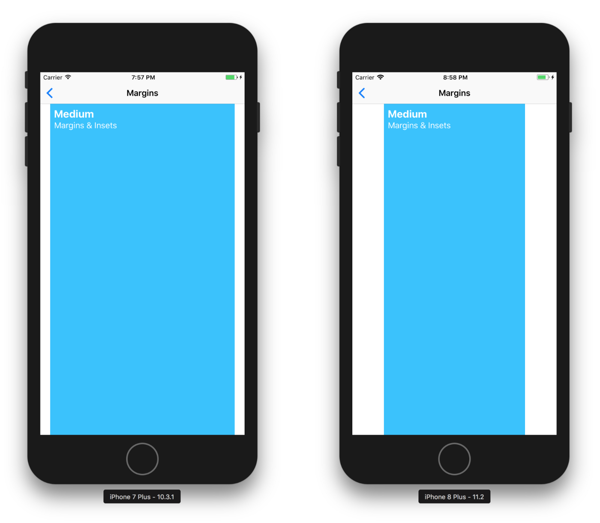
</div>

<p align="center">iOS在view controller的root view上为compact size class计算16pt边距，为regular size class计算20pt边距</p>

以下我们自己来做个试验，在`Interface Builder`中给控制器的`root view`添加一个蓝色的`ContentView`，并设置以下约束，注意勾选`Constrain to margins`：

<div align="center">    
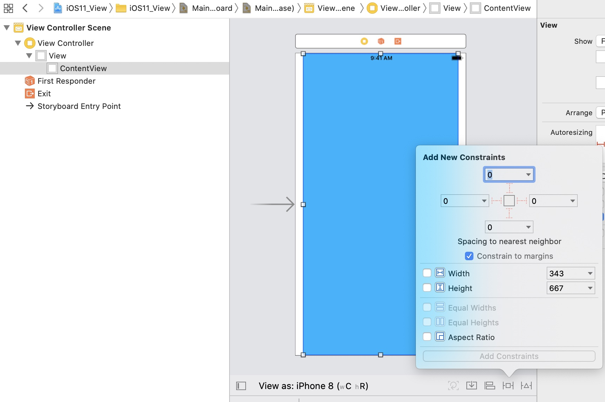
</div>

接下来运行在iOS10与iOS11以上的设备进行比较：

<div align="center">    
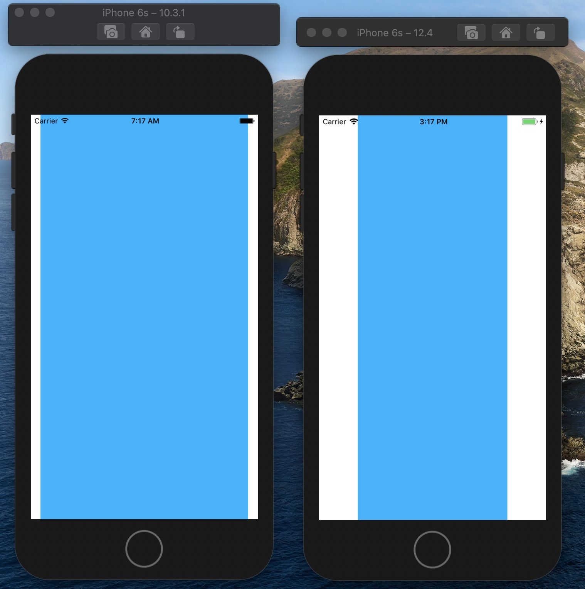
</div>

`ContentView`的`frame`分别为

```
左边 : contentView frame : {{16, 0}, {343, 667}}
右边 : contentView frame : {{64, 0}, {247, 667}}
```

根据结果显示，确实验证了上述的说法。

将设备方向设置成横屏，16pt就会变成20pt。

## directionalLayoutMargins property

`layoutMargins`属性在iOS11及之后不建议使用了，替代它的是`directionalLayoutMargins`属性，这个属性跟当前的语言阅读方向相关。

```swift
self.view.directionalLayoutMargins = NSDirectionalEdgeInsets(
top:self.view.directionalLayoutMargins.top,
                                                             leading: 16,
                                                             bottom:self.view.directionalLayoutMargins.bottom,
                                                             trailing: 64)
```

<p align="center">directionalLayoutMargins作用于vc的root view</p>

`directionalLayoutMargins`功能更强大，它可以让你在布局中使用更多的`margins`。

<div align="center">    
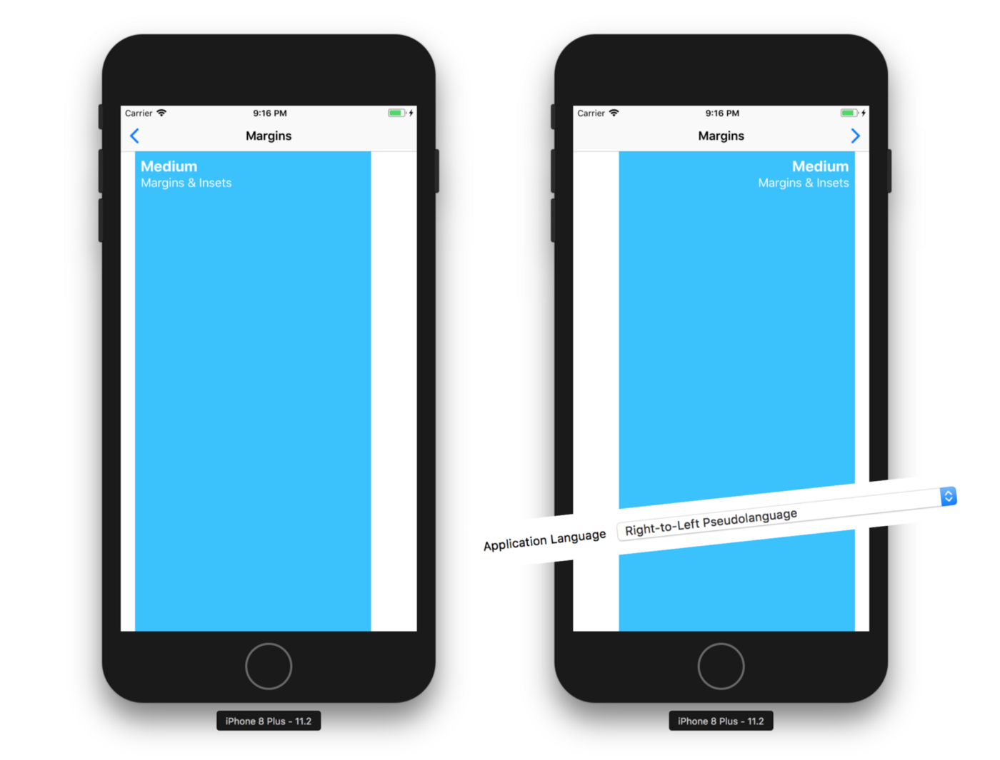
</div>

因为自然语言的原因，程序可能是从左往右或从右往左，当在`directionalLayoutMargins`属性中设置`leading`和`trailing`后，系统会根据应用的方向自动切换这两个边距。

## Margins did change

如果你想根据边距的变化做一些特定的操作，可以监听视图布局边距的变化通知：

* `layoutMarginsDidChange`(在`UIView`中定义)

  ```swift
  override func layoutMarginsDidChange() {
   super.layoutMarginsDidChange()
   
   if #available(iOS 11.0, *) {
     log.debug(“\(self.contentView.directionalLayoutMargins)”)
   } else {
     log.debug(“\(self.contentView.layoutMargins)”)
   }
  }
  ```

* `viewLayoutMarginsDidChange`(在`UIViewController`中定义)

  ```swift
  @available(iOS 11.0, *)
  override func viewLayoutMarginsDidChange() {
   super.viewLayoutMarginsDidChange()
   
   log.debug(“\(self.view.directionalLayoutMargins)”)
  }
  ```

## System minimum layout margins

需要重点注意的是，如果自定义边距小于系统的最小布局边距，在`UIViewController`中定义的`viewRespectsSystemMinimumLayoutMargins`属性，允许我们自定义最小布局边距，例如：

```swift
self.viewRespectsSystemMinimumLayoutMargins = false
self.view.directionalLayoutMargins = NSDirectionalEdgeInsets(top: self.view.directionalLayoutMargins.top,
                                                             leading: 0,
                                                             bottom: self.view.directionalLayoutMargins.bottom,
                                                             trailing: 8)
```

<p align="center">设置比系统默认值还要小的边距值</p>

系统最小的布局边距可以通过`vc`的`systemMinimumLayoutMargins`属性获取

## Reminder

自动布局的规范会考虑到(或者与它们相关)边距，而这些边距通常是由`layoutMarginsGuide`定义；还会配合`preservesSuperviewLayoutMargins`属性。可以在`Interface Builder`中看到`Constrain to margins`复选框 ：

<div align="center">    
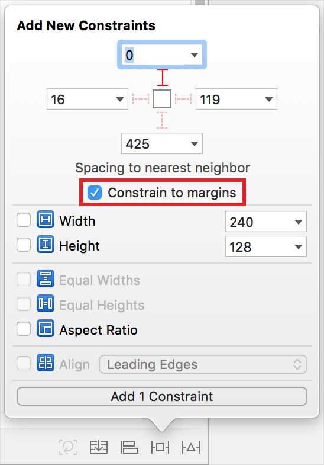
</div>

> iOS上的UIView边距计算是基于layout margins值，同时也和insetsLayoutMarginsFromSafeArea、preservesSuperviewLayoutMargins(如果为YES)属性有关。

# Safe Area

## A deprecated layout guide

苹果在早期的版本介绍使用`topLayoutGuide`和`bottomLayoutGuide`，这些`layout guide`可以指定显示内容的约束边界，避免它被顶部或底部的导航元素（状态栏、导航栏、标签栏）遮挡或隐藏。

有了`layout guides`和`margins`，我们可以将布局内容的位置限制在一个区域内:

<div align="center">    
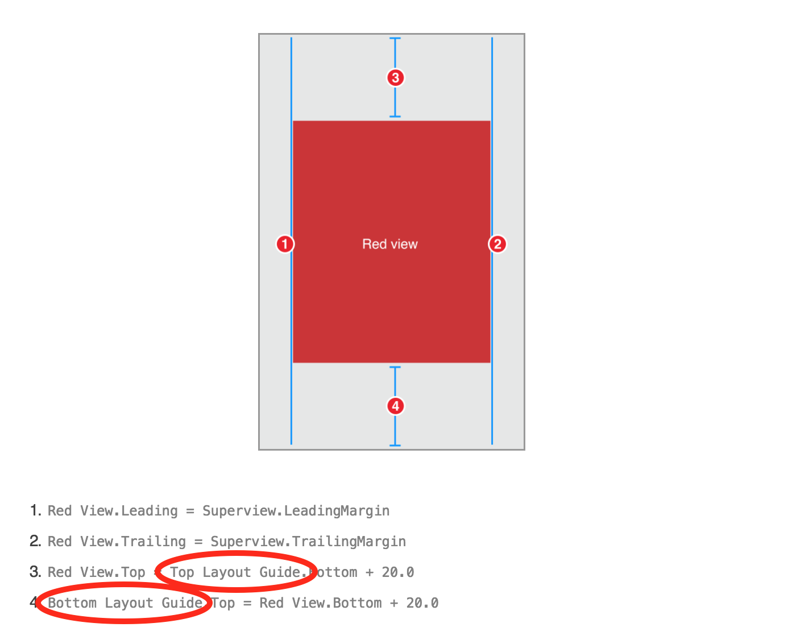
</div>

这些`UILayoutGuide`属性也可在`Interface Builder`中使用：

<div align="center">    
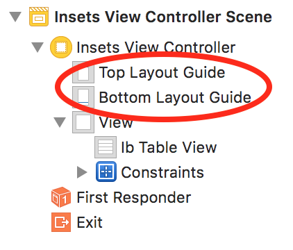
</div>

## A new layout guide called safeAreaLayoutGuide

前面说的`topLayoutGuide`和`bottomLayoutGuide`在iOS11之后不建议使用，取而代之的是**一个独特区域的单一`layout guide`，它被称为`Safe Area`**，它定义了整个界面的可见部分。

现在，**与单个可见区域交互**比**与多个定义顶部和底部导航区域的区域交互**更容易。

有了`Safe Area`，我们可以通过使用多个`Anchor`来控制我们的内容，比如`topAnchor`, `bottomAnchor`, `leadingAnchor`, `trailingAnchor`, `width`, `height`或`center anchor`。

<div align="center">    
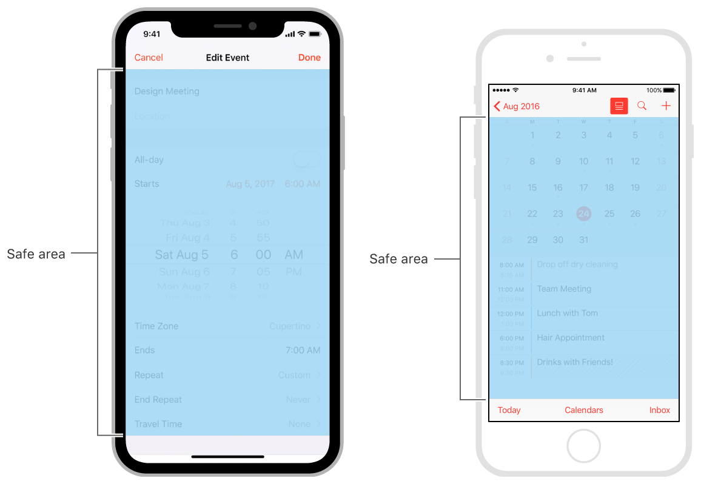
</div>

<p align="center">界面中的安全区域</p>

每一个`UIView`都有它自己的`Safe Area` `layout guide` ，可以通过`safeAreaLayoutGuide`属性获取。我们也可以从`Interface Builder`中使用这个`layout guide`来设置自动布局约束：

<div align="center">    
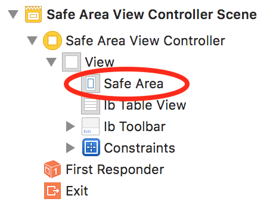
</div>

这个`guide`的位置是基于系统(iOS)计算的`Safe Area`的`insets`

这些`insets`可以通过`UIView`中定义的`safeAreaInsets`方法获取

如果你的布局中有自定义的内容，并且这些内容是跟iOS那些导航元素有类似位置大小的，你需要设置`additionalSafeAreaInsets`

想象以下场景，有一个自定义的底部内容我们需要放置在`UIKit tab bar`的位置或取代它，如下：

<div align="center">    
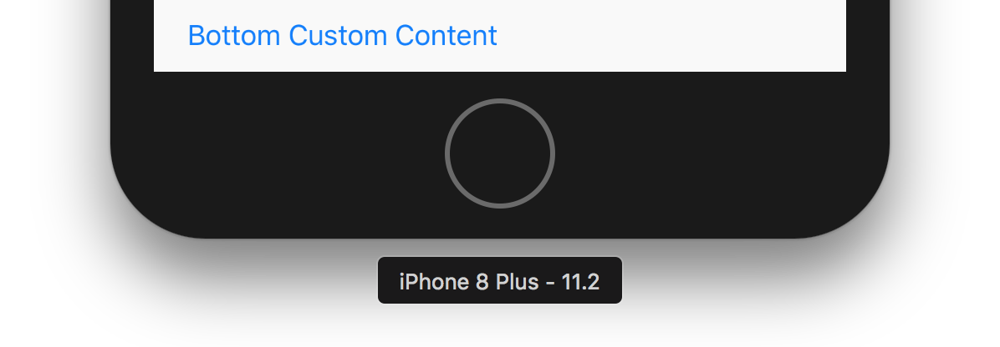
</div>

在这种情况下，我们需要通过`additionalSafeAreaInsets`指定额外的`insets`，如下：

`self.additionalSafeAreaInsets = UIEdgeInsets(top: 0, left: 0, bottom: self.ibToolbar.bounds.height, right: 0)`

接下来得到以下结果(垂直方向的滚动条的位置和`insets`会正确定位和自动计算)：

<div align="center">    
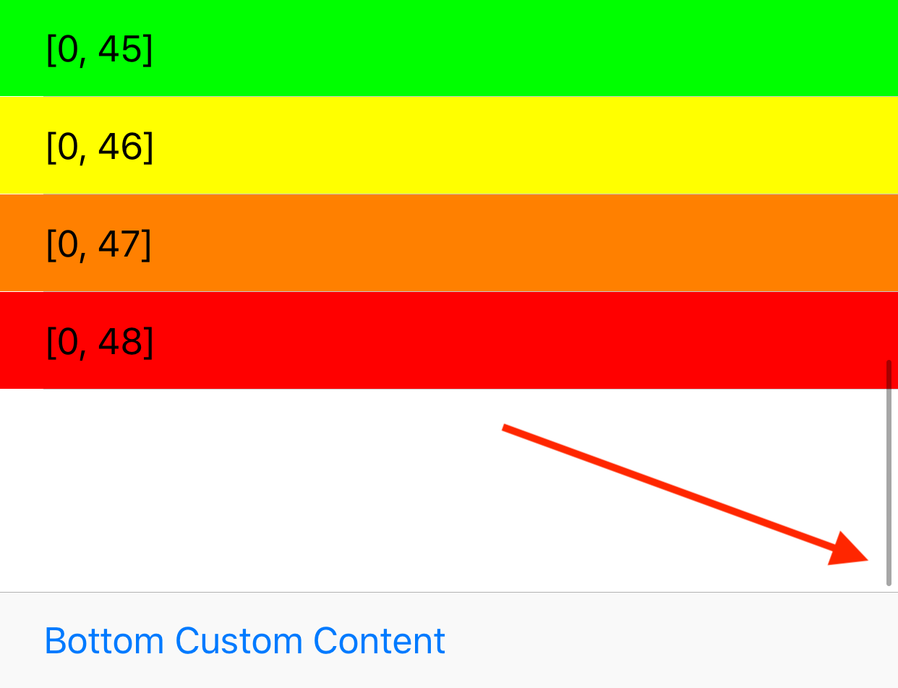
</div>

## Insets did change

可以监听`Safe Area` `insets`的变化来更改你的布局：

* `safeAreaInsetDidChange`(在`UIView`中)

  ```swift
  @available(iOS 11.0, *)
  override func safeAreaInsetsDidChange() {
   super.safeAreaInsetsDidChange()
   
   log.debug(“\(self.safeAreaInsets)”)
  }
  ```

* `viewSafeAreaInsetsDidChange`(在`UIViewController`中)

  ```swift
  @available(iOS 11.0, *)
  override func viewSafeAreaInsetsDidChange() {
   super.viewSafeAreaInsetsDidChange()
   
   log.debug(“safeAreaInsets: \(self.view.safeAreaInsets)”)
  }
  ```

  

# UIScrollView and Insets

## automaticallyAdjustsScrollViewInsets property

## contentInsetAdjustmentBehavior property

# Any pieces of advice or remarks?


