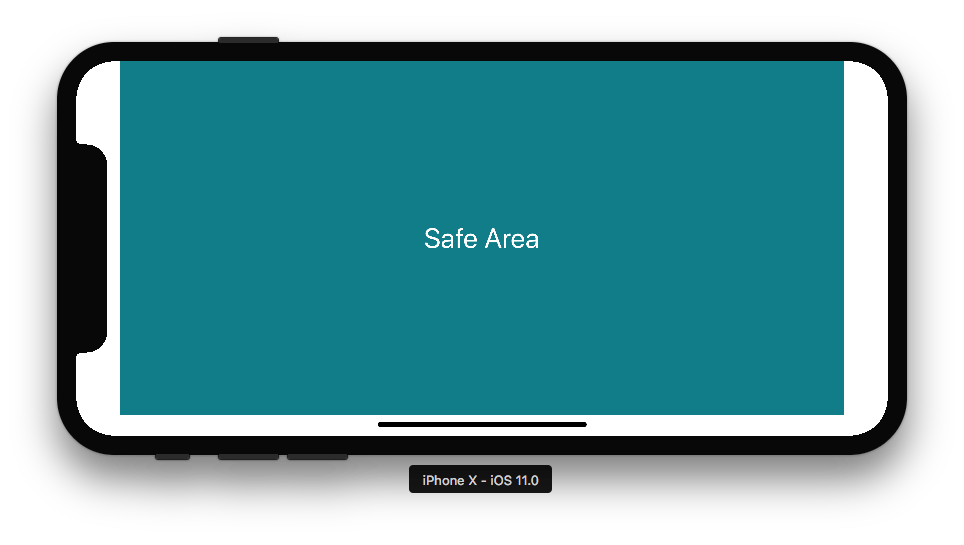

# 揭秘iOS10&11上的Layout Guide，Margins，Insets和Safe_Area

<div align="center">    

</div>
<center>iPhone X水平方向上的安全区域</center>

iOS11改进了很多关于视图如何布局用户界面的方法，同时也引入了新的屏幕尺寸设备`iPhone X`，新布局的出现，你可能会有点困惑，那么是时候回顾和揭开`margins`、`insets`、`scroll views`和`Safe Area`的神秘面纱了。

# Margins

`margin`译为边距或页边距，以下统一用中文**边距**表示。

## layoutMargins property

`layoutMargins`属性，苹果是在`iOS8`开始介绍并在`UIView`上使用它。

通过使用`layoutMargins`，你可以约束布局的所有内容，使其遵循边距。它避免将某些边距值通过手动方式作用于每个子视图(意思是我们可以统一设定边距值来影响子视图)。

```objective-c
/* -layoutMargins returns a set of insets from the edge of the view's bounds that denote a default spacing for laying out content.
 If preservesSuperviewLayoutMargins is YES, margins cascade down the view tree, adjusting for geometry offsets, so that setting
 the left value of layoutMargins on a superview will affect the left value of layoutMargins for subviews positioned close to the
 left edge of their superview's bounds
   If your view subclass uses layoutMargins in its layout or drawing, override -layoutMarginsDidChange in order to refresh your 
 view if the margins change.
   On iOS 11.0 and later, please support both user interface layout directions by setting the directionalLayoutMargins property
 instead of the layoutMargins property. After setting the directionalLayoutMargins property, the values in the left and right
 fields of the layoutMargins property will depend on the user interface layout direction.
 */
@property (nonatomic) UIEdgeInsets layoutMargins API_AVAILABLE(ios(8.0));
```

<center>UIView.h中描述的layoutMargins</center>


## directionalLayoutMargins property

## Margins did change

## System minimum layout margins

## Reminder

# Safe Area

## A deprecated layout guide

## A new layout guide called safeAreaLayoutGuide

## Insets did change

# UIScrollView and Insets

## automaticallyAdjustsScrollViewInsets property

## contentInsetAdjustmentBehavior property

# Any pieces of advice or remarks?


