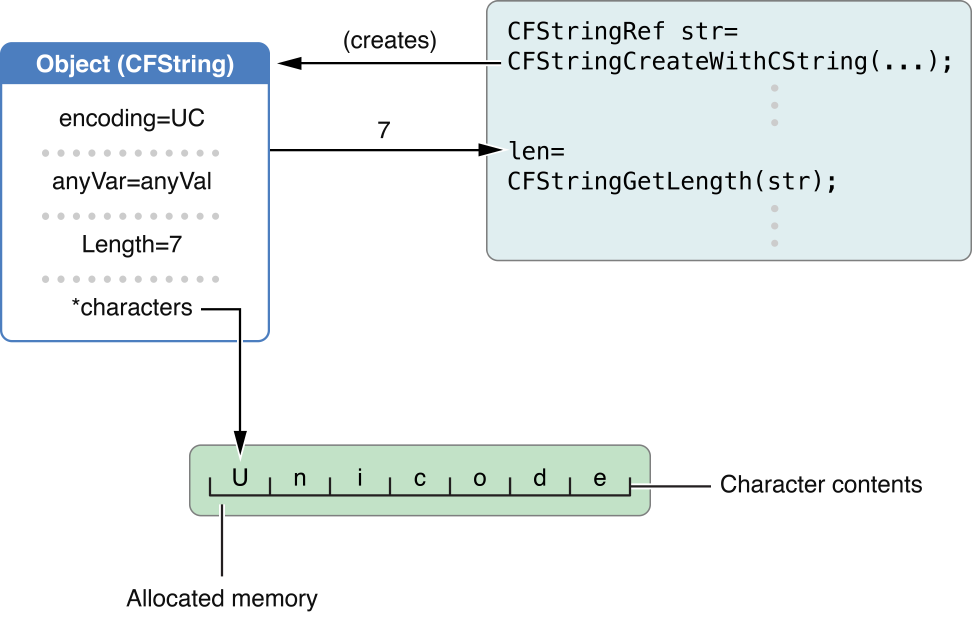

# 目录

   * [Introduction to Core Foundation Design Concepts](#introduction-to-core-foundation-design-concepts)
      * [文档内容](#文档内容)
   * [Opaque Types(不透明类型)](#opaque-types不透明类型)
      * [Advantages of Opaque Types(不透明类型的优点)](#advantages-of-opaque-types不透明类型的优点)
   * [Object References(对象引用)](#object-references对象引用)
   * [Polymorphic Functions(多态函数)](#polymorphic-functions多态函数)
   * [Varieties of Objects(对象变体或类型)](#varieties-of-objects对象变体或类型)
   * [Comparing Objects(对象比较)](#comparing-objects对象比较)
   * [Inspecting Objects](#inspecting-objects)
   * [Naming Conventions(命名约定)](#naming-conventions命名约定)
   * [Other Types](#other-types)
   * [Toll-Free Bridged Types(相互桥接的类型)](#toll-free-bridged-types相互桥接的类型)
      * [Casting and Object Lifetime Semantics(转换和对象生命周期语义)](#casting-and-object-lifetime-semantics转换和对象生命周期语义)
      * [Toll-Free Bridged Types](#toll-free-bridged-types)
   * [源文档](#源文档)

#  Introduction to Core Foundation Design Concepts

`Core Foundation`是C语言实现的编程接口库，这些接口从概念上源自基于`Objective-C`的`Foundation`框架。`Core Foundation`在C语言中实现了一个有限的对象模型。`Core Foundation`定义了封装数据和函数的`opaque types` ，以下称为"对象"。

`Core Foundation`对象的编程接口被设计为易于使用和重用。通常，`Core Foundation`:

* 支持在各种框架和库之间共享代码和数据
* 使某种程度上的操作系统独立性成为可能
* 使用Unicode字符串支持国际化
* 提供通用API和其他有用的功能，包括plug-in architecture、XML property lists和preferences

`Core Foundation`可以让OS X上的不同框架和库共享代码和数据。应用程序、库和框架可以定义C例程，将`Core Foundation`类型合并到外部接口中;因此，它们可以通过这些接口相互通信数据(作为`Core Foundation`对象)。

`Core Foundation`还在某些服务和`Cocoa`的`Foundation`框架之间提供了"`toll-free bridging`"。`toll-free bridging`使你能够在参数中用`Cocoa`对象替换`Core Foundataion`对象，反之亦然。

一些`Core Foundataion`类型和函数是在不同操作系统上具有特定实现的事物的抽象。因此，使用这些api的代码更容易移植到不同的平台上。

> Date and number types abstract time utilities and offers facilities for converting between absolute and Gregorian measures of time. It also abstracts numeric values and provides facilities for converting between different internal representations of those values.

`Core Foundation`给应用程序开发带来的主要好处之一是国际化支持。通过它的字符串对象，`Core Foundation`促进了跨所有OS X和`Cocoa`编程接口和实现简单、健壮和一致的国际化。这种支持的主要部分是一个`CFString`类型，它的实例表示一个16位`Unicode`字符数组。`CFString`对象足够灵活，可以容纳数兆字节的字符，而且足够简单和底层，可以在通信字符数据的所有编程接口中使用。它的性能与标准C字符串的性能相差无几。

你应该阅读这篇文档来了解`Core Foundation`的基本设计原则，以及`Core Foundation`对象如何与`Cocoa (Touch)`对象交互。

## 文档内容

这些概念和任务讨论了`Core Foundation`中使用的对象模型:

- [Opaque Types](https://developer.apple.com/library/archive/documentation/CoreFoundation/Conceptual/CFDesignConcepts/Articles/OpaqueTypes.html#//apple_ref/doc/uid/20001106-CJBEJBHH)
- [Object References](https://developer.apple.com/library/archive/documentation/CoreFoundation/Conceptual/CFDesignConcepts/Articles/ObjectReferences.html#//apple_ref/doc/uid/20001107-CJBEJBHH)
- [Polymorphic Functions](https://developer.apple.com/library/archive/documentation/CoreFoundation/Conceptual/CFDesignConcepts/Articles/PolymorphicFunctions.html#//apple_ref/doc/uid/20001108-CJBEJBHH)
- [Varieties of Objects](https://developer.apple.com/library/archive/documentation/CoreFoundation/Conceptual/CFDesignConcepts/Articles/VarietyOfObjects.html#//apple_ref/doc/uid/20001109-CJBEJBHH)
- [Comparing Objects](https://developer.apple.com/library/archive/documentation/CoreFoundation/Conceptual/CFDesignConcepts/Articles/Comparing.html#//apple_ref/doc/uid/20001112-CJBEHAAG)
- [Inspecting Objects](https://developer.apple.com/library/archive/documentation/CoreFoundation/Conceptual/CFDesignConcepts/Articles/Inspecting.html#//apple_ref/doc/uid/20001113-CJBEHAAG)

此外，在使用`Core Foundation`之前，你应该熟悉其他非对象类型和API约定:

- [Naming Conventions](https://developer.apple.com/library/archive/documentation/CoreFoundation/Conceptual/CFDesignConcepts/Articles/NamingConventions.html#//apple_ref/doc/uid/20001110-CJBEJBHH)
- [Other Types](https://developer.apple.com/library/archive/documentation/CoreFoundation/Conceptual/CFDesignConcepts/Articles/OtherTypes.html#//apple_ref/doc/uid/20001111-CJBEJBHH)
- [Toll-Free Bridged Types](https://developer.apple.com/library/archive/documentation/CoreFoundation/Conceptual/CFDesignConcepts/Articles/tollFreeBridgedTypes.html#//apple_ref/doc/uid/TP40010677-SW1)

# Opaque Types(不透明类型) 

`Opaque Types` 意思为不透明类型，意思是我们可以接触到该类型，但是不知道它内部是如何运作的。

`Core Foundation`对象模型支持封装和多态函数，是基于不透明类型的。

基于不透明类型的对象的各个字段对我们来说是隐藏的，但是该类型的函数提供了对这些字段的大多数值的访问。图1描述了它"隐藏"的数据和它呈现给我们的接口中的不透明类型。

> 注意："Class"并不是指不透明类型，尽管Class和不透明类型在概念上相似，许多人可能会发现这个术语令人困惑。是因为Core Foundation文档经常将这些类型的特定的、承载数据的实例称为"对象"。

`Core Foundation`有许多不透明的类型，这些类型的名称反映了它们的预期用途。例如，`CFString`是一种不透明类型，它代表并操作`Unicode`字符数组。(`CF`当然是`Core Foundation`的前缀。)`CFArray`是用于基于索引的集合功能的不透明类型。支持不透明类型的函数、常量和其他辅助数据类型通常在具有该类型名称的头文件中定义;例如，`CFArray.h`包含`CFArray`类型的符号定义。

图1 不透明类型



## Advantages of Opaque Types(不透明类型的优点)

**在某些情况下，不透明类型可能会阻止直接访问结构内容，从而似乎施加了不必要的限制**。似乎还会有与可能影响程序性能的不透明类型相关的开销。但不透明类型的好处超过了这些表面上的限制。

不透明类型为底层功能的实现提供了更好的抽象和更大的灵活性。通过隐藏细节(如结构的字段)，`Core Foundation`减少了在这些细节更改时客户端代码中可能发生错误的机会。而且，不透明类型允许进行优化，如果公开这些优化可能会造成混淆。例如，`CFString`表示`UniChar`类型的16位字符数组。但是，`CFString`可以选择将`ASCII`范围内的一段字符存储为8位值。复制一个不可变对象可能会(通常也会)导致对该对象的共享引用，而不是内存中的两个独立对象(参见[Memory Management Programming Guide for Core Foundation](https://developer.apple.com/library/archive/documentation/CoreFoundation/Conceptual/CFMemoryMgmt/CFMemoryMgmt.html#//apple_ref/doc/uid/10000127i))。

继续以`CFString`为例，使用不透明类型来存储字符似乎很重要。然而，事实证明，这种存储的CPU成本并不比使用简单的C字符数组高多少，内存成本通常更低。此外，不透明并不一定意味着不透明类型永远不能提供直接访问内容的机制。例如，`CFString`提供了`CFStringGetCStringPtr`函数来实现此目的。

最后，你可以在某种程度上自定义一些不透明类型。例如，集合类型允许你为集合中的元素添加回调。

# Object References(对象引用)

您可以通过`references`引用`Core Foundation`对象(不透明类型)。在每个不透明类型的头文件中，你会注意到一到两行类似下面的代码:

```objective-c
typedef const struct __CFArray * CFArrayRef;
typedef struct __CFArray * CFMutableArrayRef;
```

这样的声明是指向定义不透明类型的(私有)结构的不可变和可变版本的指针引用。许多`Core Foundation`函数的参数和返回值采用这些对象引用的类型，而不是私有结构的类型定义。例如:

`CFStringRef CFStringCreateByCombiningStrings(CFAllocatorRef alloc, CFArrayRef array, CFStringRef separatorString);`

有关不可变、可变和其他不透明类型对象的变体的更多信息，参见 [Varieties of Objects]() 

每个`Core Foundation` `opaque`类型都为它的对象定义了一个唯一的类型ID，就像上面`CFArrayRef`中的`CFArray`对象一样。类型ID是类型`CFTypeID`的整数，它标识`Core Foundation`对象"所属"的不透明类型。您可以在各种上下文中使用类型ID，例如在异类集合上进行操作时。`Core Foundation`提供了获取和计算类型ID的编程接口。

> Important: Because the value for a type ID can change from release to release, your code should not rely on stored or hard-coded type IDs nor should it hard-code any observed properties of a type ID (such as, for example, it being a small integer)

此外，`Core Foundation`定义了一个通用的对象引用类型`CFTypeRef`，类似于一些面向对象编程语言中的根类。这个泛型引用作为多态函数的参数和返回值的占位符类型，它可以接受对任何`Core Foundation`对象的引用(**相当于Cocoa里的id类型**)。有关这个主题的更多信息，参见[Polymorphic Functions]()。当使用对象引用时，有关内存管理的问题，参见 [Memory Management Programming Guide for Core Foundation](https://developer.apple.com/library/archive/documentation/CoreFoundation/Conceptual/CFMemoryMgmt/CFMemoryMgmt.html#//apple_ref/doc/uid/10000127i)。

# Polymorphic Functions(多态函数)

`Core Foundation`提供了几个多态函数。这些函数可以接受任何`Core Foundation`对象作为参数，并且(在一个实例中，`CFRetain`)可以返回任何`Core Foundation`对象。这些参数和返回值的类型为`CFTypeRef`，这是一种泛型对象引用类型。`CFType`类似于面向对象语言中的根类，因为它的函数可以被所有其他对象重用。

多态函数用于所有`Core Foundation`对象的通用操作:

* Reference counting(引用计数)

  `CFType`提供了几个多态函数来操作和获取对象的引用计数。有关这些函数的更多信息，参见 [Memory Management Programming Guide for Core Foundation](https://developer.apple.com/library/archive/documentation/CoreFoundation/Conceptual/CFMemoryMgmt/CFMemoryMgmt.html#//apple_ref/doc/uid/10000127i)。

* Comparing objects(对象比较)

  `CFEqual`函数比较任意两个`Core Foundation`对象(参见[Comparing Objects]())。相等的基础取决于被比较对象的类型。例如，如果两者都是`CFString`对象,则逐个字符进行比较。

* Hashing objects(对象哈希)

  `CFHash`函数返回一个标识`Core Foundation`对象的惟一哈希码(参见[Comparing Objects]())。可以将哈希码用作哈希表结构中的表地址。如果两个对象相等(由`CFEqual`函数决定)，它们具有相同的哈希码。

* Inspecting objects

  `CFType`提供了检查对象的方法，从而了解它们的内容和它们"所属"的类型。`CFCopyDescription`函数返回一个描述对象的字符串(更准确地说，是对`CFString`对象的引用)。`CFCopyTypeIDDescription`函数接受一个`CFTypeID`而不是`CFTypeRef`参数，它返回一个描述由类型ID标识的不透明类型的字符串引用。这些功能主要是为了辅助调试;有关这些函数的更多信息，参见[Inspecting Objects]()。

您还可以通过使用`CFGetTypeID`函数获取泛型类型对象的类型ID，然后将该值与已知类型ID进行比较，从而确定泛型类型对象所属的不透明类型。有关此任务的更多信息，参见[Inspecting Objects]()。

# Varieties of Objects(对象变体或类型)

不透明类型根据其对象中预期的可编辑性和可扩展性的特性，最多分为三个基本变体：

- immutable and fixed size
- mutable and fixed size
- mutable and variable size

可变对象是可编辑的，这意味着它们的内容可以更改。不可变对象是不可编辑的;一旦它们被创建，它们就不能被更改。任何更改不可变对象的尝试通常都会导致某种类型的错误。一个固定大小的对象有它可以增长到的最大限制;对于`CFString`，这将是字符的数量，对于集合，就是元素的数量。

一些不透明类型，如`CFString`和`CFArray`，可以创建所有三种类型的对象。大多数不透明类型都可以创建不可变的、大小固定的对象，并且通常至少有一个未限定的创建函数来完成这项工作(例如`CFArrayCreate`)。

> The determinant for mutable fixed-size versus variable-size is the value of the capacity or maximum-length parameter in the Type CreateMutable function; any positive value results in a fixed-size object, but a 0 specifies a variable-size object.

对可变对象的引用在类型名中包含" `mutable` "，例如，`CFMutableStringRef`。

# Comparing Objects(对象比较)

比较两个`Core Foundation`对象用`CFEqual`函数。如果两个对象本质上相等，函数返回一个布尔值`true`。本质上相等取决于被比较对象的类型。例如，当你比较两个`CFString`对象时，`Core Foundation`认为当它们逐个字符匹配时，它们本质上是相等的，而不管它们的编码或可变性属性是什么。当两个`CFArray`对象具有相同的元素个数，并且每个元素对象本质上相等，就认为它们相等。下面的代码片段展示了如何使用`CFEqual`函数来比较常量和传入的形参:

```c
void stringTest(CFStringRef myString) {
    Boolean equal = CFEqual(myString, CFSTR("Kalamazoo"));
    if (!equal) {
        printf(“They’re not equal!");
    }
    else {
        printf(“They’re equal!”):
    }
}
```

# Inspecting Objects

`Core Foundation`对象的一个主要特征是它们基于不透明(或私有)类型;因此，很难直接检查对象的内部数据。然而，`Base Services`提供了两个用于检查`Core Foundation`对象的函数。这些函数返回对象和对象类型的描述。

要找出`Core Foundation`对象的内容，在该对象上调用`CFCopyDescription`函数,然后在引用的字符串对象中打印出包含的字符序列:

```c
void describe255(CFTypeRef tested) {
    char buffer[256];
    CFIndex got;
    CFStringRef description = CFCopyDescription(tested);
    CFStringGetBytes(description,
        CFRangeMake(0, CFStringGetLength(description)),
        CFStringGetSystemEncoding(), '?', TRUE, buffer, 255, &got);
    buffer[got] = (char)0;
    fprintf(stdout, "%s", buffer);
    CFRelease(description);
}
```

这个例子只展示了打印描述的一种方法。除了`CFStringGetBytes`之外，您还可以使用`CFString`函数来获取实际的字符串。

要确定“未知”对象的类型，请使用`CFGetTypeID`函数获取其类型ID，并将该值与已知类型ID进行比较，直到找到匹配的对象。你可以使用`CFGetTypeID`函数获得对象的类型ID。每种不透明类型还定义了一个`CFTypeGetTypeID`形式的函数(例如，`CFArrayGetTypeID`);这个函数返回该类型的类型ID。因此，你可以通过如下方式测试`CFType`对象是否是特定不透明类型的成员:

```c
CFTypeID type = CFGetTypeID(anObject);
if (CFArrayGetTypeID() == type)
    printf(“anObject is an array.”);
else
    printf(“anObject is NOT an array.”);
```

要在调试器中显示关于`Core Foundation`对象类型的信息，请使用`CFGetTypeID`函数获取其类型ID，然后将该值传递给`CFCopyTypeIDDescription`函数:

```c
/* aCFObject is any Core Foundation object */
CFStringRef descrip = CFCopyTypeIDDescription(CFGetTypeID(aCFObject));
```

> 注意：String提供两个函数CFShow和CFShowStr，都在CFString.h中声明，你可以在支持的调试器中调用它来打印Core Foundation对象的描述

> 重要提示:CFCopyDescription和CFCopyTypeIDDescription函数仅用于调试。由于描述中的信息及其格式可能会发生变化，所以不要在代码中创建对它们的依赖关系。

# Naming Conventions(命名约定)

`Core Foundation`中主要的编程接口约定是使用与符号关系最密切的不透明类型的名称作为符号的前缀。对于函数，这个前缀不仅标识函数"所属"的类型，而且通常标识函数操作的目标对象的类型。(这种约定的一个例外是常量，它将"`k`"放在类型前缀之前。)下面是头文件中的一些例子:

```c
/* from CFDictionary.h */
CF_EXPORT CFIndex CFDictionaryGetCountOfKey(CFDictionaryRef dict, const void *key);
/* from CFString.h */
typedef UInt32 CFStringEncoding;
/* from CFCharacterSet.h */
typedef enum {
    kCFCharacterSetControl = 1,
    kCFCharacterSetWhitespace,
    kCFCharacterSetWhitespaceAndNewline,
    kCFCharacterSetDecimalDigit,
    kCFCharacterSetLetter,
    kCFCharacterSetLowercaseLetter,
    kCFCharacterSetUppercaseLetter,
    kCFCharacterSetNonBase,
    kCFCharacterSetDecomposable,
    kCFCharacterSetAlphaNumeric,
    kCFCharacterSetPunctuation,
    kCFCharacterSetIllegal
} CFCharacterSetPredefinedSet;
```

`Core Foundation`除了与不透明类型和内存管理相关的约定之外，还有一些编程接口约定。

* `Get`、`Copy`和`Create`之间有一个重要的区别，就是返回值的所有权。如果使用`Get`函数，则不能确定返回对象的生命周期。为了确保这样一个对象的持久性，您可以`retain`它(使用`CFRetain`函数)，或者在某些情况下复制它。如果使用`Copy`或`Create`函数，则需要负责释放对象(使用CFRelease函数)。要了解更多细节，请参见[Memory Management Programming Guide for Core Foundation](https://developer.apple.com/library/archive/documentation/CoreFoundation/Conceptual/CFMemoryMgmt/CFMemoryMgmt.html#//apple_ref/doc/uid/10000127i)。

* 一些`Core Foundation`对象有它们自己的命名约定，以使通用操作保持一致性。例如，集合在函数名中嵌入下列动词，表示对集合元素的特定操作:

  * "add"的意思是"如果没有就添加，有就啥也不做"(如果这个集合的元素是唯一性的)
  * "Replace"的意思是"存在即替换，没有该元素就忽略"
  * "Set"的意思是"没有则添加，有则替换"
  * "Remove"的意思是"存在即移除，没有该元素就忽略"

* `CFIndex`类型用于索引、计数、长度和大小参数和返回值。这种类型表示的整数值(目前为32位)(现在已经是64位)可以随着处理器地址大小的增长而增长。在指针大小不同的体系结构中，比如64位，`CFIndex`可以声明为64位，这与`int`的大小无关。

  > By using CFIndex for variables that interact with Core Foundation arguments of the same type, you ensure a higher degree of source compatibility for your code.

* 一些`Core Foundation`头文件似乎定义了不透明的类型，但实际上包含了与特定类型无关的便捷函数。一个典型的例子是`CFPropertyList.h`，`CFPropertyList`是任何属性列表类型的占位符类型:`CFString`、`CFData`、`CFBoolean`、`CFNumber`、`CFDate`、`CFArray`和`CFDictionary`。

* 除非另有说明，所有用于返回值的引用形参都可以接受NULL。这表明调用者对返回值不感兴趣。

# Other Types

`Core Foundation`定义了许多在函数中通用的数据类型。这些类型的目的是抽象可能必须随着处理器地址空间的变化而改变的原始值。例如，`CFIndex`类型用于`index`、`count`、`length`和`size`参数。`CFOptionFlags`类型用于bitfield参数，`CFHashCode`类型保存从`CFHash`函数和某些散列回调返回的散列结果。

其他基类型用于接受和返回比较值和范围值的函数中。

> CFRange is a structure that specifies any part of a linear sequence of items, from characters in a string to elements in a collection.

对于比较函数，CFComparisonResult类型定义了枚举常量来表示适当的返回值(等于、小于、大于)。一些`Core Foundation`函数采取回调比较器函数;如果需要自定义比较器，该函数必须符合`CFComparatorFunction`类型指定的签名。

> 重要提示:某些Core Foundation类型(特别是CFIndex和CFTypeID)的整数值会随着处理器地址大小的增长而增长。通过将基类型用于与相同类型的Core Foundation参数交互的变量，可以确保代码的源兼容性更高。

# Toll-Free Bridged Types(相互桥接的类型)

在`Core Foundation`框架和`Foundation`框架中有许多数据类型可以互换使用。可以互换使用的数据类型也称为`toll-free bridged`数据类型。这意味着你可以使用相同的数据结构作为`Core Foundation`函数调用的参数，或者作为`Objective-C`消息调用的接收者或参数。例如，`NSLocale`与其`Core Foundation`对等的`CFLocale`是可互换的。

并非所有的数据类型都是`toll-free bridged`的，即使它们的名称表明它们是`toll-free bridged`的。例如，`NSRunLoop`桥接到`CFRunLoop`不是`toll-free`的，`NSBundle`桥接到`CFBundle`不是`toll-free`的，`NSDateFormatter`桥接到`CFDateFormatter`不是`toll-free`的。表1列出了支持`toll-free bridged`的数据类型。

> 注意:如果你在你正在使用的Core Foundation集合上配置了一个自定义回调，包括一个空回调，那么当从Objective-C访问它时，它的内存管理行为是未定义的。

## Casting and Object Lifetime Semantics(转换和对象生命周期语义)

通过`toll-free`桥接，在一个你看到`NSLocale *`参数的方法中，你可以传递一个`CFLocaleRef`，而在一个你看到`CFLocaleRef`参数的函数中，你可以传递一个`NSLocale`实例。你还必须为编译器提供其他信息:**首先，您必须将一种类型转换为另一种类型;此外，你还必须指示对象生存期语义**。

编译器理解返回`Core Foundation`类型的`Objective-C`方法，并遵循`Cocoa`命名约定(参见 [Advanced Memory Management Programming Guide](https://developer.apple.com/library/archive/documentation/Cocoa/Conceptual/MemoryMgmt/Articles/MemoryMgmt.html#//apple_ref/doc/uid/10000011i))。例如，编译器知道，在iOS中，`UIColor`的`CGColor`方法返回的`CGColor`是不拥有(非持有)的。你仍然必须使用适当的类型转换，如本例所示:

```objective-c
NSMutableArray *colors = [NSMutableArray arrayWithObject:(id)[[UIColor darkGrayColor] CGColor]];
[colors addObject:(id)[[UIColor lightGrayColor] CGColor]];
```

**编译器不会自动管理Core Foundation对象的生存期**。你可以通过转换(定义在**objc/runtime.h**中)或者**Core foundation**风格的宏(定义在**NSObject.h**中)来告诉编译器对象的所有权语义:

* `__bridge`在`Objective-C`和`Core Foundation`之间转换指针，但不转移所有权

* `__bridge_retained`或`CFBridgingRetain`将一个`Objective-C`指针强制转换为`Core Foundation`指针，同时也将所有权转移给你。

  你要在合适时机调用`CFRelease`或一个相关的函数来放弃对象的所有权。

* `__bridge_transfer`或`CFBridgingRelease`将一个非`Objective-C`指针转换到`Objective-C`，同时也将所有权转移到`ARC`。
  `ARC`负责放弃对象的所有权。

下面是一些例子:

```c
NSLocale *gbNSLocale = [[NSLocale alloc] initWithLocaleIdentifier:@"en_GB"];
CFLocaleRef gbCFLocale = (__bridge CFLocaleRef)gbNSLocale;
CFStringRef cfIdentifier = CFLocaleGetIdentifier(gbCFLocale);
NSLog(@"cfIdentifier: %@", (__bridge NSString *)cfIdentifier);
// Logs: "cfIdentifier: en_GB"
 
CFLocaleRef myCFLocale = CFLocaleCopyCurrent();
NSLocale *myNSLocale = (NSLocale *)CFBridgingRelease(myCFLocale);
NSString *nsIdentifier = [myNSLocale localeIdentifier];
CFShow((CFStringRef)[@"nsIdentifier: " stringByAppendingString:nsIdentifier]);
// Logs identifier for current locale
```

下一个示例展示了`Core Foundation`内存管理函数的使用，这些函数由`Core Foundation`内存管理规则指定:

```c
- (void)drawRect:(CGRect)rect {
    CGContextRef ctx = UIGraphicsGetCurrentContext();
    CGColorSpaceRef colorSpace = CGColorSpaceCreateDeviceGray();
    CGFloat locations[2] = {0.0, 1.0};
    NSMutableArray *colors = [NSMutableArray arrayWithObject:(id)[[UIColor darkGrayColor] CGColor]];
    [colors addObject:(id)[[UIColor lightGrayColor] CGColor]];
    CGGradientRef gradient = CGGradientCreateWithColors(colorSpace, (__bridge CFArrayRef)colors, locations);
    CGColorSpaceRelease(colorSpace);  // Release owned Core Foundation object.
 
    CGPoint startPoint = CGPointMake(0.0, 0.0);
    CGPoint endPoint = CGPointMake(CGRectGetMaxX(self.bounds), CGRectGetMaxY(self.bounds));
    CGContextDrawLinearGradient(ctx, gradient, startPoint, endPoint,
                                kCGGradientDrawsBeforeStartLocation | kCGGradientDrawsAfterEndLocation);
    CGGradientRelease(gradient);  // Release owned Core Foundation object.
}
```
## Toll-Free Bridged Types

表1提供了`Core Foundation`和`Foundation`之间可互换的数据类型列表。对于每一对，该表还列出了OS X的版本，在该版本中它们之间可以使用` toll-free bridging`。

表1可以在`Core Foundation`和`Foundation`之间互换使用的数据类型

| **Core Foundation typ**                                      | **Foundation class**                                         | **Availability** |
| ------------------------------------------------------------ | ------------------------------------------------------------ | ---------------- |
| [CFArrayRef](https://developer.apple.com/documentation/corefoundation/cfarray) | [NSArray](https://developer.apple.com/library/archive/documentation/LegacyTechnologies/WebObjects/WebObjects_3.5/Reference/Frameworks/ObjC/Foundation/Classes/NSArrayClassCluster/Description.html#//apple_ref/occ/cl/NSArray) | OS X 10.0        |
| [CFAttributedStringRef](https://developer.apple.com/documentation/corefoundation/cfattributedstringref) | [NSAttributedString](https://developer.apple.com/library/archive/documentation/LegacyTechnologies/WebObjects/WebObjects_3.5/Reference/Frameworks/ObjC/Foundation/Classes/NSAttributedStrngClstr/Description.html#//apple_ref/occ/cl/NSAttributedString) | OS X 10.4        |
| [CFBooleanRef](https://developer.apple.com/documentation/corefoundation/cfbooleanref) | [NSNumber](https://developer.apple.com/documentation/foundation/nsnumber) | OS X 10.0        |
| [CFCalendarRef](https://developer.apple.com/documentation/corefoundation/cfcalendarref) | [NSCalendar](https://developer.apple.com/documentation/foundation/nscalendar) | OS X 10.4        |
| [CFCharacterSetRef](https://developer.apple.com/documentation/corefoundation/cfcharactersetref) | [NSCharacterSet](https://developer.apple.com/library/archive/documentation/LegacyTechnologies/WebObjects/WebObjects_3.5/Reference/Frameworks/ObjC/Foundation/Classes/NSCharacterSetClstr/Description.html#//apple_ref/occ/cl/NSCharacterSet) | OS X 10.0        |
| [CFDataRef](https://developer.apple.com/documentation/corefoundation/cfdata) | [NSData](https://developer.apple.com/library/archive/documentation/LegacyTechnologies/WebObjects/WebObjects_3.5/Reference/Frameworks/ObjC/Foundation/Classes/NSDataClassCluster/Description.html#//apple_ref/occ/cl/NSData) | OS X 10.0        |
| [CFDateRef](https://developer.apple.com/documentation/corefoundation/cfdateref) | [NSDate](https://developer.apple.com/library/archive/documentation/LegacyTechnologies/WebObjects/WebObjects_3.5/Reference/Frameworks/ObjC/Foundation/Classes/NSDateClassCluster/Description.html#//apple_ref/occ/cl/NSDate) | OS X 10.0        |
| [CFDictionaryRef](https://developer.apple.com/documentation/corefoundation/cfdictionaryref) | [NSDictionary](https://developer.apple.com/library/archive/documentation/LegacyTechnologies/WebObjects/WebObjects_3.5/Reference/Frameworks/ObjC/Foundation/Classes/NSDictionaryClassClstr/Description.html#//apple_ref/occ/cl/NSDictionary) | OS X 10.0        |
| [CFErrorRef](https://developer.apple.com/documentation/corefoundation/cferror) | [NSError](https://developer.apple.com/documentation/foundation/nserror) | OS X 10.5        |
| [CFLocaleRef](https://developer.apple.com/documentation/corefoundation/cflocale) | [NSLocale](https://developer.apple.com/documentation/foundation/nslocale) | OS X 10.4        |
| [CFMutableArrayRef](https://developer.apple.com/documentation/corefoundation/cfmutablearray) | [NSMutableArray](https://developer.apple.com/library/archive/documentation/LegacyTechnologies/WebObjects/WebObjects_3.5/Reference/Frameworks/ObjC/Foundation/Classes/NSArrayClassCluster/Description.html#//apple_ref/occ/cl/NSMutableArray) | OS X 10.0        |
| [CFMutableAttributedStringRef](https://developer.apple.com/documentation/corefoundation/cfmutableattributedstring) | [NSMutableAttributedString](https://developer.apple.com/library/archive/documentation/LegacyTechnologies/WebObjects/WebObjects_3.5/Reference/Frameworks/ObjC/Foundation/Classes/NSAttributedStrngClstr/Description.html#//apple_ref/occ/cl/NSMutableAttributedString) | OS X 10.4        |
| [CFMutableCharacterSetRef](https://developer.apple.com/documentation/corefoundation/cfmutablecharacterset) | [NSMutableCharacterSet](https://developer.apple.com/library/archive/documentation/LegacyTechnologies/WebObjects/WebObjects_3.5/Reference/Frameworks/ObjC/Foundation/Classes/NSCharacterSetClstr/Description.html#//apple_ref/occ/cl/NSMutableCharacterSet) | OS X 10.0        |
| [CFMutableDataRef](https://developer.apple.com/documentation/corefoundation/cfmutabledataref) | [NSMutableData](https://developer.apple.com/library/archive/documentation/LegacyTechnologies/WebObjects/WebObjects_3.5/Reference/Frameworks/ObjC/Foundation/Classes/NSDataClassCluster/Description.html#//apple_ref/occ/cl/NSMutableData) | OS X 10.0        |
| [CFMutableDictionaryRef](https://developer.apple.com/documentation/corefoundation/cfmutabledictionaryref) | [NSMutableDictionary](https://developer.apple.com/library/archive/documentation/LegacyTechnologies/WebObjects/WebObjects_3.5/Reference/Frameworks/ObjC/Foundation/Classes/NSDictionaryClassClstr/Description.html#//apple_ref/occ/cl/NSMutableDictionary) | OS X 10.0        |
| [CFMutableSetRef](https://developer.apple.com/documentation/corefoundation/cfmutableset) | [NSMutableSet](https://developer.apple.com/library/archive/documentation/LegacyTechnologies/WebObjects/WebObjects_3.5/Reference/Frameworks/ObjC/Foundation/Classes/NSSetClassCluster/Description.html#//apple_ref/occ/cl/NSMutableSet) | OS X 10.0        |
| [CFMutableStringRef](https://developer.apple.com/documentation/corefoundation/cfmutablestringref) | [NSMutableString](https://developer.apple.com/library/archive/documentation/LegacyTechnologies/WebObjects/WebObjects_3.5/Reference/Frameworks/ObjC/Foundation/Classes/NSStringClassCluster/Description.html#//apple_ref/occ/cl/NSMutableString) | OS X 10.0        |
| [CFNullRef](https://developer.apple.com/documentation/corefoundation/cfnullref) | [NSNull](https://developer.apple.com/documentation/foundation/nsnull) | OS X 10.2        |
| [CFNumberRef](https://developer.apple.com/documentation/corefoundation/cfnumberref) | [NSNumber](https://developer.apple.com/library/archive/documentation/LegacyTechnologies/WebObjects/WebObjects_3.5/Reference/Frameworks/ObjC/Foundation/Classes/NSNumber/Description.html#//apple_ref/occ/cl/NSNumber) | OS X 10.0        |
| [CFReadStreamRef](https://developer.apple.com/documentation/corefoundation/cfreadstream) | [NSInputStream](https://developer.apple.com/documentation/foundation/inputstream) | OS X 10.0        |
| [CFRunLoopTimerRef](https://developer.apple.com/documentation/corefoundation/cfrunlooptimerref) | [NSTimer](https://developer.apple.com/library/archive/documentation/LegacyTechnologies/WebObjects/WebObjects_3.5/Reference/Frameworks/ObjC/Foundation/Classes/NSTimer/Description.html#//apple_ref/occ/cl/NSTimer) | OS X 10.0        |
| [CFSetRef](https://developer.apple.com/documentation/corefoundation/cfset) | [NSSet](https://developer.apple.com/library/archive/documentation/LegacyTechnologies/WebObjects/WebObjects_3.5/Reference/Frameworks/ObjC/Foundation/Classes/NSSetClassCluster/Description.html#//apple_ref/occ/cl/NSSet) | OS X 10.0        |
| [CFStringRef](https://developer.apple.com/documentation/corefoundation/cfstringref) | [NSString](https://developer.apple.com/library/archive/documentation/LegacyTechnologies/WebObjects/WebObjects_3.5/Reference/Frameworks/ObjC/Foundation/Classes/NSStringClassCluster/Description.html#//apple_ref/occ/cl/NSString) | OS X 10.0        |
| [CFTimeZoneRef](https://developer.apple.com/documentation/corefoundation/cftimezone) | [NSTimeZone](https://developer.apple.com/library/archive/documentation/LegacyTechnologies/WebObjects/WebObjects_3.5/Reference/Frameworks/ObjC/Foundation/Classes/NSTimeZoneClassCluster/Description.html#//apple_ref/occ/cl/NSTimeZone) | OS X 10.0        |
| [CFURLRef](https://developer.apple.com/documentation/corefoundation/cfurl) | [NSURL](https://developer.apple.com/documentation/foundation/nsurl) | OS X 10.0        |
| [CFWriteStreamRef](https://developer.apple.com/documentation/corefoundation/cfwritestreamref) | [NSOutputStream](https://developer.apple.com/documentation/foundation/nsoutputstream) | OS X 10.0        |


# 源文档

[Introduction to Core Foundation Design Concepts](https://developer.apple.com/library/archive/documentation/CoreFoundation/Conceptual/CFDesignConcepts/CFDesignConcepts.html#//apple_ref/doc/uid/10000122-SW1)

