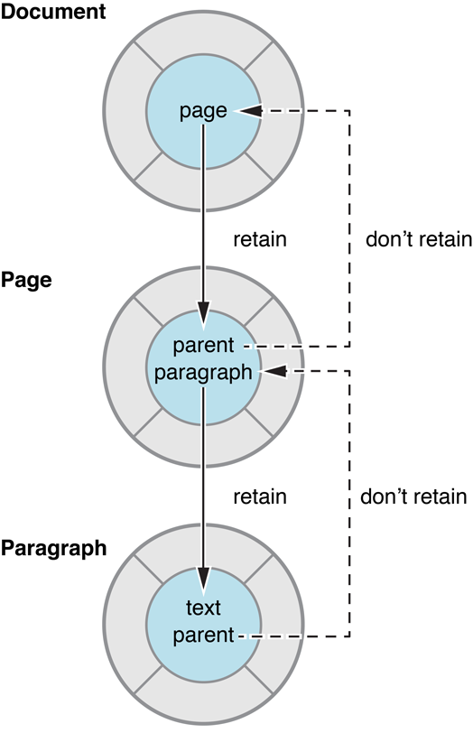

# 实用的内存管理技巧

尽管[Memory Management Policy](https://developer.apple.com/library/archive/documentation/Cocoa/Conceptual/MemoryMgmt/Articles/mmRules.html#//apple_ref/doc/uid/20000994-BAJHFBGH)中描述的基本概念很简单，但是你可以采取一些实际步骤来简化内存管理，并帮助确保你的程序保持可靠和健壮，同时最小化其资源需求。

# 使用访问器方法让内存管理更容易

如果你的类有属性是对象类型，那么必须确保任何被赋值的对象在使用时都不会是已经释放的了。因此，当进行对象类型赋值时，你必须声明对它的所有权。你还必须确保你随后放弃所有当前持有的对象的所有权。

这有可能看起来非常乏味，但如果始终使用访问器方法，出现内存管理问题的可能性就会大大降低。如果在整个代码中对实例变量使用`retain`和`release`，则几乎可以肯定这是错误的。

考虑以下`Counter`对象，假设你要给`count`赋值

```objective-c
@interface Counter : NSObject
@property (nonatomic, retain) NSNumber *count;
@end;
```

该属性会由编译器自动合成两个访问器方法(`set/get`),看一下它们是如何实现的是非常有意义的。

在`get`方法中，你只需要返回自动生成的实例变量,所以不需要`retain`或`release`

```objc
- (NSNumber *)count {
    return _count;
}
```

在`set`方法中，如果其他所有人都遵循相同的规则，对象的所有权可能随时被其他操作放弃，因此你必须通过向它发送`retain`消息来获得对象的所有权，以确保它不会被丢弃。你还必须通过向旧的`count`对象发送一个`release`消息来放弃它的所有权。(在`Objective-C`中，发送消息给`nil`是允许的，所以即使`_count`还没有赋值，这样操作也是没问题的)**你必须将它发送到[newCount retain]之后，以防这两个是同一个对象——您不想无意中导致它被释放。**

**你必须在`[newCount retain]`之后调用对旧值的`release`，因为假如新旧值是同一个对象，先`release`会导致该对象被你无意地释放了**。

```objective-c
- (void)setCount:(NSNumber *)newCount {
    [newCount retain];
    [_count release];
    // Make the new assignment.
    _count = newCount;
}
```

## 使用访问器方法设置属性值

假设您想实现一个方法来重置`count`。你有几个选择,第一种实现使用`alloc`创建`NSNumber`实例，因此需要用一个`release`来平衡它。

```objective-c
- (void)reset {
    NSNumber *zero = [[NSNumber alloc] initWithInteger:0];
    [self setCount:zero];
    [zero release];
}
```

第二种实现使用一个便利构造函数来创建一个新的`NSNumber`对象。因此，不需要`retain`或`release`

```objective-c
- (void)reset {
    NSNumber *zero = [NSNumber numberWithInteger:0];
    [self setCount:zero];
}
```

注意，两者都使用`set`访问器方法。

以下这种做法可能在某些情况下工作正常，这里没有使用访问器方法，但这样做会导致在某些阶段导致错误（例如，你忘记`retain`或`release`,或者实例变量的内存管理语义发生了改变）

> The following will almost certainly work correctly for simple cases, but as tempting as it may be to eschew accessor methods, doing so will almost certainly lead to a mistake at some stage (for example, when you forget to retain or release, or if the memory management semantics for the instance variable change).

```objective-c
- (void)reset {
    NSNumber *zero = [[NSNumber alloc] initWithInteger:0];
    [_count release];//释放旧值
    _count = zero;	 //赋值新值，但是需要在合适的时机对_count进行release
}
```

还要注意，如果您使用`KVO`，那么以这种方式更改变量是不会触发`KVO`的。

## 不要在初始化方法和dealloc中使用访问器方法

唯一不应该使用访问器方法来设置实例变量的地方是**初始化方法和dealloc**。要用`zero`初始化`count`，你可以这样实现`Counter`的`init`方法：

```objective-c
- init {
    self = [super init];
    if (self) {
        _count = [[NSNumber alloc] initWithInteger:0];
    }
    return self;
}
```

为了允许用非0的计数初始化`count`，你可以实现一个`initWithCount:`方法，如下所示:

```objective-c
- initWithCount:(NSNumber *)startingCount {
    self = [super init];
    if (self) {
        _count = [startingCount copy];
    }
    return self;
}
```

因为`Counter`类有一个对象实例变量，所以您还必须实现一个`dealloc`方法。它应该通过发送一个`release`消息来放弃任何实例变量的所有权，并且最终调用父类`super`的实现:

```objective-c
- (void)dealloc {
    [_count release];
    [super dealloc];
}
```

# 使用弱引用避免循环引用

`retain`一个对象会创建对该对象的强引用。一个对象的所有强引用被解除之前，这个对象不会被释放。如果两个对象彼此之间有强引用（要么直接引用，要么通过其他对象链），就会出现所谓的循环引用问题。

图1中表示的对象关系说明了一个循环引用问题。`Document`对象有一个`Page`对象，`Page`对象有`parent`属性表示它所属的Document。如果`Document`对象对`Page`对象有强引用，而`Page`对象又对`Document`对象有强引用，那么这两个对象都不能被释放，简而言之，两个对象都在等待对方的引用计数变为0。

图1 循环引用示例



