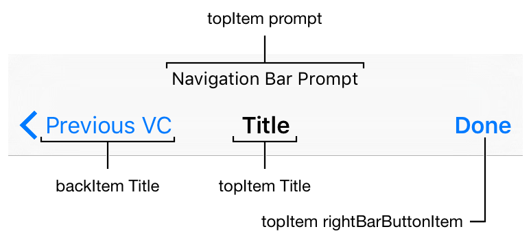
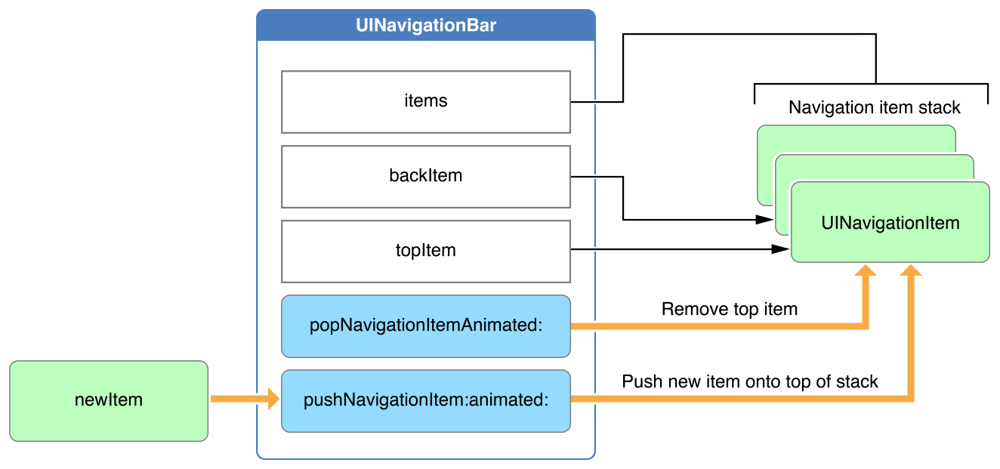
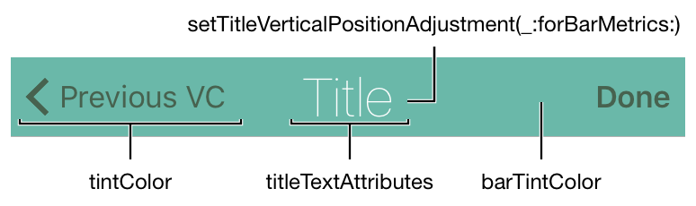
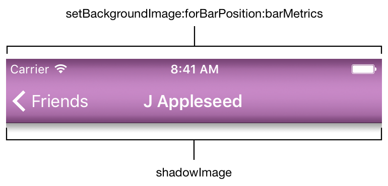

# 导航栏

显示在屏幕顶部的条，导航控件，通常与导航控制器一起使用

UINavigationBar对象是一个栏，通常显示在窗口的顶部，包含用于在屏幕层次结构中导航的按钮
主要组件是一个左(返回)按钮、一个中心标题和一个可选的右按钮

可以将导航栏作为独立对象使用，也可以将其与导航控制器对象结合使用

    

导航栏最常用于导航控制器中。UINavigationController对象创建、显示和管理其关联的导航栏，并使用添加的视图控制器的属性来控制导航栏中显示的内容

使用导航控制器控制导航栏时，需要执行以下步骤:

* 在Interface Builder或代码中创建导航控制器
* 使用`UINavigationController`对象上的`navigationBar`属性配置导航栏的`appearance`
* 通过设置你`push`到导航控制器栈的每个`UIViewController`上的标题和`navigationItem`属性来控制导航栏的内容

您还可以使用独立的导航栏，而无需使用导航控制器。在界面中添加导航栏，需要执行以下步骤:

* 设置自动布局规则来控制界面中导航栏的位置
* 创建`root navigation item`以提供初始标题
* 配置`delegate`对象以处理用户与导航栏的交互
* 自定义导航栏的外观
* 配置你的应用程序，当用户通过分层屏幕导航时，`push`和`pop`相关`navigation items`

# 在导航控制器中使用导航栏

如果您使用导航控制器来管理不同内容屏幕之间的导航，导航控制器会自动创建导航栏，并在适当的时候`push`和`pop `对应`navigation items` 

在导航一个视图控制器到栈时，导航控制器使用`UIViewController`上的`navigationItem`属性为它的导航栏提供模型对象

默认的`navigation item`使用视图控制器的标题，但是你可以重写`UIViewController`子类上的`navigationItem`来获得对导航栏内容的完全控制

**导航控制器自动将自己配置为其导航栏对象的delegate。因此，在使用导航控制器时，不要将自定义delegate对象分配给相应的导航栏**

# 向独立的导航栏添加内容

在绝大多数情况下，您将使用导航栏作为导航控制器的一部分。但是，在某些情况下，您可能希望使用导航栏UI并实现您自己的内容导航方法。在这些情况下，您可以使用独立的导航栏

当您将导航栏作为独立对象使用时，您需要负责提供它的内容。与其他类型的视图不同，您不能直接向导航栏添加子视图。相反，您可以使用`navigation item`(`UINavigationItem`类的一个实例)来指定您想要显示的按钮或自定义视图。`navigation item`具有指定导航栏左侧、右侧和中心视图的属性，以及指定自定义提示字符串的属性

> 下面navigation item省略为item

导航栏管理一个存放`UINavigationItem`对象的栈，**栈中最上面的item表示当前由导航栏显示其内容的navigation item**（与导航控制器显示视图控制器原理一致）

使用`pushNavigationItem:animated:`方法将新的`item` `push`到栈，使用`popNavigationItemAnimated:`方法将`item` `pop`出栈

为了方便用户，这两个更改都可以动画化

除了`push`和`pop` `item`，你还可以使用`items`属性或`setItems:animated:`方法直接设置栈中的内容。您可以在启动时使用此方法将界面恢复到以前的状态，或者一次`push`或`pop`多个`item`。下图展示了`UINavigationBar API`中负责管理item栈的部分：

    

如果您将导航栏作为独立对象使用，请将自定义`delegate`对象设置给`delegate`属性，并使用该对象拦截来自导航栏的消息。`delegate`对象必须实现`UINavigationBarDelegate`协议方法。`delegate`通知可以让您跟踪`item`何时被`push`进或`pop`出栈。你可以使用这些通知来更新应用程序的用户界面

# 自定义导航栏外观

导航栏有两种标准的外观样式:**白色带黑色文本**或**黑色带浅色文本**。使用`barStyle`属性选择样式。对其他**导航栏外观属性**所做的任何更改都会覆盖从`barStyle`推断出来的属性

**导航栏默认是半透明的;也就是说，它们的底色是半透明的**。**通过将`translucent`属性设置为`NO`，可以使导航栏不透明**

你可以使用`barTintColor`属性为导航栏背景指定一个自定义颜色。设置此属性将覆盖从`barStyle`推断的默认颜色。**和所有UIView子类一样，你可以使用tintColor属性控制导航栏中交互元素的颜色，包括按钮图像和标题**

`titleTextAttributes`属性指定显示栏标题文本的属性，你可以分别使用`NSFontAttributeName`, `NSForegroundColorAttributeName`和`NSShadowAttributeName` 等**key**在文本属性字典中为标题指定字体，文本颜色，文本阴影颜色和文本阴影偏移量等属性

使用`setTitleVerticalPositionAdjustment:forBarMetrics:`方法来调整标题的垂直位置。这个方法允许您指定依赖于导航栏高的调整，这是由`UIBarMetrics enum`枚举表示的。下图显示了一个具有自定义颜色、标题文本属性和栏颜色的导航栏：

    

**为了允许完全自定义导航栏的外观，您可以另外提供自定义背景和阴影图像**。要提供一个自定义的背景图像，使用`setBackgroundImage:forBarPosition:barMetrics:`方法，提供一个`UIImage`对象，用于适当的`bar`位置和指标值

为`bar position`参数使用`UIBarPosition`值来指定是在窗口底部还是顶部使用提供的图像，如果它出现在顶部，是否在状态栏下向上扩展它

类似地，您可以通过向`bar metrics`参数提供一个`UIBarMetrics`值来指定图像应该用于`紧凑`的或默认的`bar metrics`，无论是否有`prompt`提示

要添加阴影，请为`shadowImage`属性提供一个可调整大小的`UIImage`。要使用自定义阴影图像，您需要指定一个自定义背景图像。下图展示了一个带有自定义背景图像的导航栏，使用`setBackgroundImage:forBarPosition:barMetrics:`带有`UIBarPositionTopAttached`的`position`值和`UIBarMetricsDefault`的指标值

    

自定义图像也被提供给`shadowImage`属性

