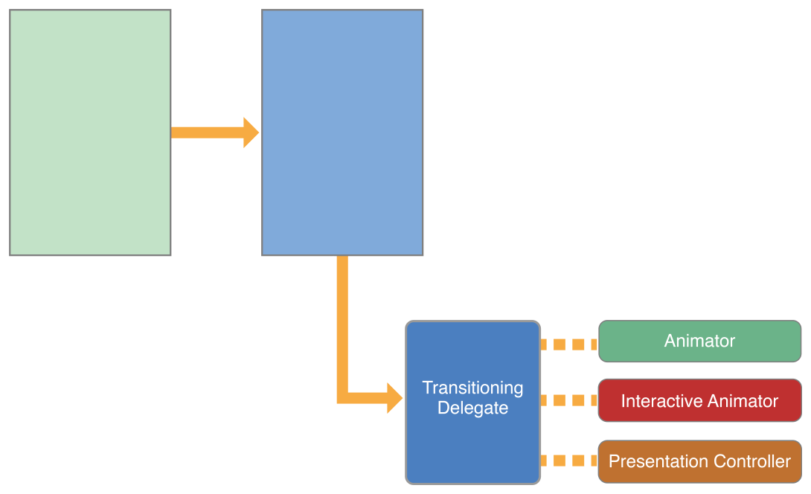

# Customizing the Transition Animations(自定义转换动画)

视图控制器的转换动画，`UIKit`提供了一套标准，除此之外，可以自定义转换动画。

> 以下Transition Animations翻译为转换动画，也就是视图控制器之间切换时的动画

## The Transition Animation Sequence(转换动画的序列)

一个转换动画就是交换视图控制器内容，有两种类型的转换：`presentations`和`dismissals`，分别称为**展示**与**移除**

* 展示会添加新的视图控制器到应用程序的视图控制器层次结构中
* 移除则从层次结构中移除一个或多个视图控制器

需要多个对象来实现一个自定义的转换动画，`UIKit`定义了所有这些对象的标准版本，你可以自定义所有这些对象，也可以只定义其中的一个子集。选择了适当的对象集后，你只需用少量的代码来创建动画，如果你利用`UIKit`提供的现有代码，即使是包含交互的动画也可以很容易地实现。

### The Transitioning Delegate(转换的delegate)

转换`delegate`是转换动画和自定义`presentations`的起点，转换`delegate`是你定义的对象，它应该实现`UIViewControllerTransitioningDelegate`协议方法，它的工作是为`UIKit`提供以下对象：

* **Animator对象**，一个`animator`对象负责创建用于显示或隐藏视图控制器的视图的动画，转换的`delegate`可以为视图控制器提供单独的`animator`对象，`animator`对象遵循`UIViewControllerAnimatedTransitioning`协议

* **Interactive animator**对象，该对象使用触摸事件或手势识别器来驱动自定义动画的计时，该对象遵循`UIViewControllerInteractiveTransitioning`协议

  创建该对象的最简单的方法时子类化`UIPercentDrivenInteractiveTransition`，并在子类中添加事件处理代码，该类控制`animator`对象创建的动画的时间，如果你创建了自己的**Interactive animator**，你必须自己渲染动画的每一帧

* **Presentation controller**，当视图控制器在屏幕上时，`presentation controller` 管理`presentation`样式，系统为内置的`presentation`样式提供这些视图控制器，你可以为自己的`presentation`样式提供自定义的`presentation controller` ，有关创建自定义`presentation controller` 的更多信息，请参阅[Creating Custom Presentations](https://developer.apple.com/library/archive/featuredarticles/ViewControllerPGforiPhoneOS/DefiningCustomPresentations.html#//apple_ref/doc/uid/TP40007457-CH25-SW1)

向视图控制器的`transitioningDelegate`属性设置一个`delegate`，表示你要执行一个自定义的转换，`delegate`可以选择它提供的对象，如果你没有提供`animator`对象，`UIKit`在视图控制器的`modalTransitionStyle`属性中使用标准的过渡动画。

图10-1展示了`delegate`和`animator`对象到`presented`视图控制器的关系，`presentation`控制器仅当视图控制器的`modalPresentationStyle`属性设置为`UIModalPresentationCustom`时使用。

图10-1 自定义`presentation`和`animator`对象

    

如何实现转换`delegate`的更多信息，请参阅 [Implementing the Transitioning Delegate](https://developer.apple.com/library/archive/featuredarticles/ViewControllerPGforiPhoneOS/CustomizingtheTransitionAnimations.html#//apple_ref/doc/uid/TP40007457-CH16-SW15)

`delegate`具体的协议方法请参阅`UIViewControllerTransitioningDelegate`协议

### The Custom Animation Sequence

### The Transitioning Context Object

### The Transition Coordinator

## Presenting a View Controller Using Custom Animations

## Implementing the Transitioning Delegate

## Implementing Your Animator Objects

### Getting the Animation Parameters

### Creating the Transition Animations

### Cleaning Up After the Animations

## Adding Interactivity to Your Transitions

## Creating Animations that Run Alongside a Transition

## Using a Presentation Controller with Your Animations

