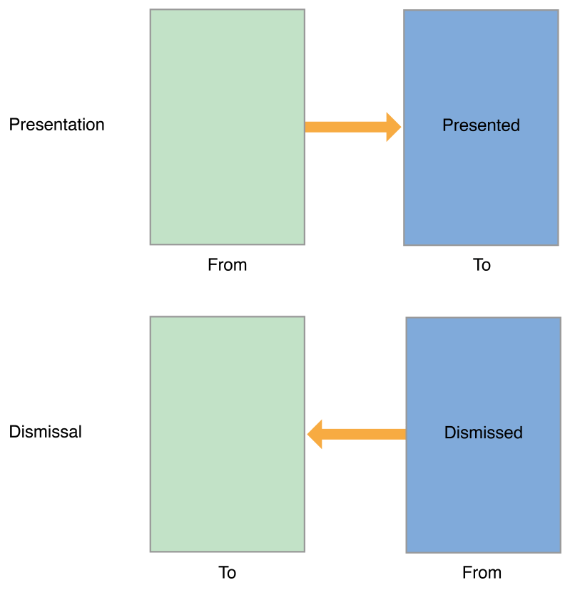

# 目录

   * [Customizing the Transition Animations](#customizing-the-transition-animations)
      * [The Transition Animation Sequence](#the-transition-animation-sequence)
         * [The Transitioning Delegate](#the-transitioning-delegate)
         * [The Custom Animation Sequence](#the-custom-animation-sequence)
         * [The Transitioning Context Object](#the-transitioning-context-object)
         * [The Transition Coordinator](#the-transition-coordinator)
      * [Presenting a View Controller Using Custom Animations](#presenting-a-view-controller-using-custom-animations)
      * [Implementing the Transitioning Delegate](#implementing-the-transitioning-delegate)
      * [Implementing Your Animator Objects](#implementing-your-animator-objects)
         * [Getting the Animation Parameters](#getting-the-animation-parameters)
         * [Creating the Transition Animations](#creating-the-transition-animations)
         * [Cleaning Up After the Animations](#cleaning-up-after-the-animations)
      * [Adding Interactivity to Your Transitions](#adding-interactivity-to-your-transitions)
      * [Creating Animations that Run Alongside a Transition](#creating-animations-that-run-alongside-a-transition)
      * [Using a Presentation Controller with Your Animations](#using-a-presentation-controller-with-your-animations)
   * [源文档](#源文档)

# Customizing the Transition Animations

视图控制器的转换动画，`UIKit`提供了一套标准，除此之外，可以自定义转换动画。

> 以下Transition Animations翻译为转换动画，也就是视图控制器之间切换时的动画

## The Transition Animation Sequence

一个转换动画就是交换视图控制器内容，有两种类型的转换：`presentations`和`dismissals`，分别称为**展示**与**移除**

* 展示会添加新的视图控制器到应用程序的视图控制器层次结构中
* 移除则从层次结构中移除一个或多个视图控制器

需要多个对象来实现一个自定义的转换动画，`UIKit`定义了所有这些对象的标准版本，你可以自定义所有这些对象，也可以只定义其中的一个子集。选择了适当的对象集后，你只需用少量的代码来创建动画，如果你利用`UIKit`提供的现有代码，即使是包含交互的动画也可以很容易地实现。

### The Transitioning Delegate

转换`delegate`是转换动画和自定义`presentations`的起点，转换`delegate`是你定义的对象，它应该实现`UIViewControllerTransitioningDelegate`协议方法，它的工作是为`UIKit`提供以下对象：

* **Animator对象**，一个`animator`对象负责创建用于显示或隐藏视图控制器的视图的动画，转换的`delegate`可以为视图控制器提供单独的`animator`对象，`animator`对象遵循`UIViewControllerAnimatedTransitioning`协议

* **Interactive animator**对象，该对象使用触摸事件或手势识别器来驱动自定义动画的计时，该对象遵循`UIViewControllerInteractiveTransitioning`协议

  创建该对象的最简单的方法时子类化`UIPercentDrivenInteractiveTransition`，并在子类中添加事件处理代码，该类控制`animator`对象创建的动画的时间，如果你创建了自己的**Interactive animator**，你必须自己渲染动画的每一帧

* **Presentation controller**，当视图控制器在屏幕上时，`presentation controller` 管理`presentation`样式，系统为内置的`presentation`样式提供这些视图控制器，你可以为自己的`presentation`样式提供自定义的`presentation controller` ，有关创建自定义`presentation controller` 的更多信息，请参阅[Creating Custom Presentations](https://developer.apple.com/library/archive/featuredarticles/ViewControllerPGforiPhoneOS/DefiningCustomPresentations.html#//apple_ref/doc/uid/TP40007457-CH25-SW1)

向视图控制器的`transitioningDelegate`属性设置一个`delegate`，表示你要执行一个自定义的转换，`delegate`可以选择它提供的对象，如果你没有提供`animator`对象，`UIKit`在视图控制器的`modalTransitionStyle`属性中使用标准的过渡动画。

图10-1展示了`delegate`和`animator`对象到`presented`视图控制器的关系，`presentation`控制器仅当视图控制器的`modalPresentationStyle`属性设置为`UIModalPresentationCustom`时使用。

图10-1 自定义`presentation`和`animator`对象

<div align="center">    

</div>

如何实现转换`delegate`的更多信息，请参阅 [Implementing the Transitioning Delegate](https://developer.apple.com/library/archive/featuredarticles/ViewControllerPGforiPhoneOS/CustomizingtheTransitionAnimations.html#//apple_ref/doc/uid/TP40007457-CH16-SW15)

`delegate`具体的协议方法请参阅`UIViewControllerTransitioningDelegate`协议

### The Custom Animation Sequence

当`presented`视图控制器的`transitioningDelegate`属性包含一个有效的对象时，`UIKit`使用你提供的自定义动画器对象`present`那个视图控制器。当准备触发一个`presentation`时，`UIKit`调用`animationControllerForPresentedController:presentingController:sourceController:` `delegate`方法来取得你自定义的`animator`对象，如果对象有效，`UIKit`执行以下步骤：

1. `UIKit`调用`transitioning delegate`的 `interactionControllerForPresentation:`方法查看是否有一个可用的`interactive animator`对象，如果该方法返回`nil`，`UIKit`在没有用户交互的情况下执行动画

2. `UIKit`调用`animator`对象的 `transitionDuration:` 方法来获取动画的持续时间

3. `UIKit`调用适当的方法来启动动画：

   * 对于`non-interactive animations`，`UIKit`调用`animator`对的`animateTransition:`方法
   * 对于` interactive animations`，`UIKit`调用` interactive animation`对象的`startInteractiveTransition:`方法

4. `UIKit`等待一个`animator`对象调用`context transition` 对象的`completeTransition:`方法

   你的自定义``animator``在动画完成后调用这个方法，通常是在动画的`completion block`中，调用这个方法结束转换，让`UIKit`知道它可以调用`presentViewController:animated:completion:`方法的`completion handler`，并调用`animator`对象自己的`animationEnded:`方法

当需要出一个视图控制器，`UIKit`调用`animationControllerForDismissedController:` `delegate`方法，并执行以下步骤：

1. `UIKit`调用` transitioning delegate`的`interactionControllerForDismissal: `方法来查看是否有一个`interactive animator`对象可用，如果该方法返回`nil`, `UIKit`在没有用户交互的情况下执行动画

2. `UIKit`调用`animator`对象的 `transitionDuration:` 方法来获取动画的持续时间

3. `UIKit`调用适当的方法来启动动画：

   * 对于`non-interactive animations`，`UIKit`调用`animator`对的`animateTransition:`方法
   * 对于` interactive animations`，`UIKit`调用` interactive animation`对象的`startInteractiveTransition:`方法

4. `UIKit`等待一个`animator`对象调用`context transition` 对象的`completeTransition:`方法

   你的自定义``animator``在动画完成后调用这个方法，通常是在动画的`completion block`中，调用这个方法结束转换，让`UIKit`知道它可以调用`presentViewController:animated:completion:`方法的`completion handler`，并调用`animator`对象自己的`animationEnded:`方法

   >在动画结束时调用completeTransition:方法是必需的，在调用该方法之前，UIKit不会结束过渡过程，因此不会将控制权返回给你的应用程序。

### The Transitioning Context Object

在一个过渡动画开始之前，`UIKit`创建一个过渡上下文对象，它包含了如何执行动画的信息，转换上下文对象是十分重要的一部分，它实现了`UIViewControllerContextTransitioning`协议方法，并在转换中引用那些视图控制器和视图，`animator`对象需要这些信息来设置和执行实际的动画。

> 当使用自定义动画时，总是使用转换上下文对象中的对象和数据，而不是任何你自己管理的缓存信息，转换可以发生在各种情况下，其中一些可能会改变动画参数，转换上下文对象保证拥有执行动画所需的正确信息，而缓存的信息可能在animator的方法被调用时就过时了

图10-2展示了转换上下文对象如何与其他对象交互，你的`animator`对象在它的`animateTransition:`方法中接收对象，你创建的动画应该发生在提供的容器视图中，例如，当`present`一个视图控制器时，添加它的视图作为容器视图的子视图，容器视图可能是窗口或常规视图，但它总是被配置来运行你的动画。

图10-2 转换上下文对象

<div align="center">    

</div>

有关更多转换上下文的信息，请参阅 [UIViewControllerContextTransitioning Protocol Reference](https://developer.apple.com/documentation/uikit/uiviewcontrollercontexttransitioning)

### The Transition Coordinator

对于内置的转换和自定义的转换，`UIKit`创建一个转换协调器对象来促进任何你可能需要执行的额外动画，除了视图控制器的`presentation`和`dismissal`之外，当界面旋转发生或当视图控制器的`frame`改变时，转换也会发生，所有这些转换都表示对视图层次结构的更改，转换协调器负责跟踪这些更改并同时使你自己的内容动画化，要访问转换协调器，在受影响的视图控制器的`transitionCoordinator`属性中获取，转换协调器仅在转换期间存在。

图10-3显示了一个`presentation`中涉及到的转换协调器与视图控制器的关系，使用转换协调器来获取有关转换的信息，并注册希望与转换动画同时执行的`animation blocks `，转换协调器对象遵循`UIViewControllerTransitionCoordinatorContext`协议，它提供了时间信息，关于动画当前状态的信息，以及涉及转换的视图和视图控制器，当你的`animation blocks`被执行时，它们同样接收到一个具有相同信息的`context`对象。

图10-3 转换协调器对象

<div align="center">    

</div>

有关转换协调器对象的更多信息，请参阅 [UIViewControllerTransitionCoordinator Protocol Reference](https://developer.apple.com/documentation/uikit/uiviewcontrollertransitioncoordinator)

有关如何配置你的动画上下文信息，请参阅[UIViewControllerTransitionCoordinatorContext Protocol Reference](https://developer.apple.com/documentation/uikit/uiviewcontrollertransitioncoordinatorcontext)

## Presenting a View Controller Using Custom Animations

要使用自定义动画`present`一个视图控制器，在你现有的视图控制器的`action`方法中执行以下操作：

1. 创建你需要展示的视图控制器
2. 创建你的自定义`transitioning delegate`对象，然后设置给需要展示的视图控制器的`transitioningDelegate`属性，需要时，你的`transitioning delegate`对象实现的`delegate`方法应该创建并返回你的自定义`animator`对象
3. 调用 `presentViewController:animated:completion:`方法展示视图控制器

当你调用`presentViewController:animated:completion:`方法时，`UIKit`会启动`presentation`过程，`presentation`会在下一次的`runloop`迭代中开始，然后一直持续，直到你自定义的`animator`对象调用`completeTransition:`方法，`Interactive transitions`允许你在转换进行时处理触摸事件，但`noninteractive transitions`在`animator`对象指定的持续时间内运行。

## Implementing the Transitioning Delegate

`Transitioning Delegate`的目的是创建并返回自定义对象，清单10-1展示了转换方法的实现是多么简单，这个例子创建并返回一个自定义`animator`对象，大多数实际工作是由`animator`对象本身处理的。

清单10-1 创建`animator`对象

```objective-c
- (id<UIViewControllerAnimatedTransitioning>)
    animationControllerForPresentedController:(UIViewController *)presented
                         presentingController:(UIViewController *)presenting
                             sourceController:(UIViewController *)source {
    MyAnimator* animator = [[MyAnimator alloc] init];
    return animator;
}
```

`transitioning delegate`的其他方法可以像前面清单中的方法一样简单，你还可以结合自定义逻辑，根据应用程序的当前状态返回不同的`animator`对象，有关`transitioning delegate`方法的更多信息，请参阅 [UIViewControllerTransitioningDelegate Protocol Reference](https://developer.apple.com/documentation/uikit/uiviewcontrollertransitioningdelegate)

## Implementing Your Animator Objects

`animator`对象是实现`UIViewControllerAnimatedTransitioning`协议方法的对象，`animator`对象创建的动画在固定的时间内执行，`animator`对象的关键是它的`animateTransition:`方法，你可以用它来创建实际的动画，动画过程大致分为以下几个部分：

1. 获取动画参数
2. 使用`Core Animation`或`UIView Animation`方法创建动画
3. 清理和完成转换

### Getting the Animation Parameters

传递给`animateTransition:`方法的上下文转换对象包含执行动画时使用的数据，当你能从上下文转换对象中获得更多最新的信息时，不要使用你自己缓存的信息或从你的视图控制器中获取信息，`present`和`dismiss`视图控制器有时涉及到视图控制器之外的对象，例如，自定义的`presentation`控制器可能会添加一个背景视图作为`presentation`的一部分，上下文转换对象考虑了额外的视图和对象，并为你提供了正确的视图来进行动画。

* 调用两次`viewControllerForKey:`方法来获取转换中涉及的"`from`"和"`to`"视图控制器，不要假设你知道哪些视图控制器正在参与转换，`UIKit`可能会改变视图控制器，同时适应一个新的特征环境或响应来自你的应用程序的请求
* 调用`containerView`方法来获取动画的父视图，向该视图添加所有关键子视图，例如，在`presentation`期间，添加`presented`视图控制器的视图到这个视图
* 调用`viewForKey:`方法来获取要添加或删除的视图，一个视图控制器的视图可能不是唯一一个在转换期间被添加或删除的，`presentation`控制器可能会向层次结构中插入视图，这些视图也必须被添加或删除，`viewForKey:`方法返回包含你需要添加或删除的所有内容的根视图
* 调用`finalFrameForViewController:`方法来获得被添加或删除的视图的最终`frame`矩形

上下文转换对象使用"`from`"和"`to`"命名法来识别视图控制器、视图和在转换中涉及的`frame`矩形，"`from`"视图控制器总是在转换开始时它的视图在屏幕上，而"`to`"视图控制器是在转换结束时它的视图将是可见的。正如你在图10-4中所看到的，"`from`"和"`to`"视图控制器在`presentation`和`dismissal`之间交换位置。

图10-4 `from` 、`to`对象

<div align="center">    

</div>

通过交换这些值，可以更容易地编写一个`animator`来同时处理`presentation`和`dismissal`，当你设计你的`animator`时，你所要做的就是包含一个属性来表示它是`presentation`动画还是`dismissal`动画，两者之间唯一需要的区别如下:

* `presentation`，将"`to`"`view`添加到容器视图层次结构中
* `dismissal`，将"`from"`view`从容器视图中移除

### Creating the Transition Animations

在一个`presentation`过程中，`presented`视图控制器的视图会动画化地将其放到适当的位置，其他视图可能作为`presentation`的一部分动画，但动画的主要目标始终是添加到视图层次结构中的视图。

在给主视图设置动画时，配置动画所采取的基本操作是相同的，你可以从转换上下文对象中获取所需的对象和数据，并使用该信息来创建实际的动画。

* `Presentation`动画：

  * 使用`viewControllerForKey:`和`viewForKey:`方法来获取转换中涉及的视图控制器和视图
  * 设置"`to`"视图的起始位置，也将任何其他属性设置为其初始值
  * 从转换上下文对象的`finalFrameForViewController:`方法中获取"`to`"视图的最终位置
  * 添加"`to`"`view`到容器视图中
  * 创建动画
    * 在`animation block`中，将`to` `view`动画化到容器视图中的最终位置，也将任何其他属性设置为它们的最终值
    * 在`completion block`中，调用`completeTransition:`方法，以及进行一些清理工作

* `Dismissal`动画

  * 使用`viewControllerForKey:`和`viewForKey:`方法来获取转换中涉及的视图控制器和视图

  * 计算"`from`"`view`的最终位置，这个视图属于现在被移除的`presented`视图控制器

  * 添加"`to`"`view`到容器视图中

    在`presentation`情况下，属于`presenting`视图控制器的视图在转换完成时被移除，因此，你必须在移除操作期间将该视图添加回容器中

  * 创建动画：

    * 在`animation block`中，将`from` `view`动画化到容器视图中的最终位置，也将任何其他属性设置为它们的最终值
    * 在`completion block`中，从容器视图控制器中移除"`from`"`view`，调用`completeTransition: `方法，以及进行一些清理工作

图10-5展示了一个自定义的`presentation`和`dismissal`转换，视图以对角线的方式进行动画，在`presentation`过程中，所展示的视图从屏幕外开始，并沿对角线向上和向左移动，直到可见为止；在`dismissal`过程中，视图会反转它的方向并向下和向右移动，直到它再次离开屏幕。

图10-5 自定义`presentation` 和 `dismissal`

<div align="center">    

</div>

清单10-2展示了如何实现图10-5中所示的转换，获取动画所需的对象后，`animateTransition:`方法计算受影响视图的`frame`矩形，在`presentation`过程中，所展示的视图由`toView`变量表示，在`dismissal`中，被移除的视图由`fromView`变量表示，`presenting`属性是`animator`对象本身的一个自定义属性，当创建`animator`时，`transitioning delegate`将其设置为一个合适的值。

清单10-2 实现对角线`presentation`和`dismissal`的动画

```objective-c
- (void)animateTransition:(id<UIViewControllerContextTransitioning>)transitionContext {
    // Get the set of relevant objects.
    UIView *containerView = [transitionContext containerView];
    UIViewController *fromVC = [transitionContext
            viewControllerForKey:UITransitionContextFromViewControllerKey];
    UIViewController *toVC   = [transitionContext
            viewControllerForKey:UITransitionContextToViewControllerKey];
 
    UIView *toView = [transitionContext viewForKey:UITransitionContextToViewKey];
    UIView *fromView = [transitionContext viewForKey:UITransitionContextFromViewKey];
 
    // Set up some variables for the animation.
    CGRect containerFrame = containerView.frame;
    CGRect toViewStartFrame = [transitionContext initialFrameForViewController:toVC];
    CGRect toViewFinalFrame = [transitionContext finalFrameForViewController:toVC];
    CGRect fromViewFinalFrame = [transitionContext finalFrameForViewController:fromVC];
 
    // Set up the animation parameters.
    if (self.presenting) {
        // Modify the frame of the presented view so that it starts
        // offscreen at the lower-right corner of the container.
        toViewStartFrame.origin.x = containerFrame.size.width;
        toViewStartFrame.origin.y = containerFrame.size.height;
    }
    else {
        // Modify the frame of the dismissed view so it ends in
        // the lower-right corner of the container view.
        fromViewFinalFrame = CGRectMake(containerFrame.size.width,
                                      containerFrame.size.height,
                                      toView.frame.size.width,
                                      toView.frame.size.height);
    }
 
    // Always add the "to" view to the container.
    // And it doesn't hurt to set its start frame.
    [containerView addSubview:toView];
    toView.frame = toViewStartFrame;
 
    // Animate using the animator's own duration value.
    [UIView animateWithDuration:[self transitionDuration:transitionContext]
                     animations:^{
                         if (self.presenting) {
                             // Move the presented view into position.
                             [toView setFrame:toViewFinalFrame];
                         }
                         else {
                             // Move the dismissed view offscreen.
                             [fromView setFrame:fromViewFinalFrame];
                         }
                     }
                     completion:^(BOOL finished){
                         BOOL success = ![transitionContext transitionWasCancelled];
 
                         // After a failed presentation or successful dismissal, remove the view.
                         if ((self.presenting && !success) || (!self.presenting && success)) {
                             [toView removeFromSuperview];
                         }
 
                         // Notify UIKit that the transition has finished
                         [transitionContext completeTransition:success];
                     }];
 
}
```

### Cleaning Up After the Animations

在一个转换动画的结尾，调用`completeTransition:`方法是至关重要的，调用那个方法告诉`UIKit`转换完成并且用户可能开始使用`presented`视图控制器，调用这个方法还会触发一系列其他的`completion handlers`，包括`presentViewController:animated:completion:`方法和`animator`对象自己的`animationEnded:`方法，调用`completeTransition:`方法的最佳位置是在你的`animation block`的`completion handler`中。

因为转换可以取消，所以你应该使用转换上下文对象的`transitionWasCancelled`方法的返回值来确定需要进行哪些清理，当`presentation`被取消时，`animator`必须撤销它对视图层次结构所做的任何修改，一个完成的`dismissal`需要采取类似的操作。

## Adding Interactivity to Your Transitions

让动画具有交互性的最简单方法是使用`UIPercentDrivenInteractiveTransition`对象，`UIPercentDrivenInteractiveTransition`对象与你现有的`animator`对象一起工作，以控制它们动画的时间，它使用你提供的进度百分比值来实现这一点，你所需要做的就是设置事件处理代码，以计算进度百分比值，并在每个新事件到来时对其进行更新。

你可以使用一个带有或不带子类的`UIPercentDrivenInteractiveTransition`类，如果子类化，则使用子类的`init`方法(或`startInteractiveTransition:`方法)来执行事件处理代码的一次性设置，之后，使用自定义事件处理代码计算一个新的进度百分比值，并调用`updateInteractiveTransition:`方法，当你的代码确定应该完成转换时，调用`finishInteractiveTransition`方法。

清单10-3显示了`startInteractiveTransition`的自定义实现：`UIPercentDrivenInteractiveTransition`子类的方法，这个方法创建了一个`pan`手势识别器来跟踪触摸事件，并在动画的容器视图中添加这个手势识别器，它还保存对转换上下文的引用以供以后使用。

清单10-3 `Configuring a percent-driven interactive animator`

```objective-c
- (void)startInteractiveTransition:(id<UIViewControllerContextTransitioning>)transitionContext {
   // Always call super first.
   [super startInteractiveTransition:transitionContext];
 
   // Save the transition context for future reference.
   self.contextData = transitionContext;
 
   // Create a pan gesture recognizer to monitor events.
   self.panGesture = [[UIPanGestureRecognizer alloc]
                        initWithTarget:self action:@selector(handleSwipeUpdate:)];
   self.panGesture.maximumNumberOfTouches = 1;
 
   // Add the gesture recognizer to the container view.
   UIView* container = [transitionContext containerView];
   [container addGestureRecognizer:self.panGesture];
}
```

手势识别器会为每一个到达的新事件调用它的`action`方法，`action`方法的实现可以使用手势识别器的状态信息来确定手势是否成功、失败或仍在进行中，同时，你可以使用最新的触摸事件信息来计算手势的新百分比值。

清单10-4展示了清单10-3中配置的`pan`手势识别器调用的方法，当新的事件到达时，该方法使用垂直移动距离来计算动画的完成率，当手势结束时，该方法完成转换。

清单10-4 使用事件来更新动画进度

```objective-c
-(void)handleSwipeUpdate:(UIGestureRecognizer *)gestureRecognizer {
    UIView* container = [self.contextData containerView];
 
    if (gestureRecognizer.state == UIGestureRecognizerStateBegan) {
        // Reset the translation value at the beginning of the gesture.
        [self.panGesture setTranslation:CGPointMake(0, 0) inView:container];
    }
    else if (gestureRecognizer.state == UIGestureRecognizerStateChanged) {
        // Get the current translation value.
        CGPoint translation = [self.panGesture translationInView:container];
 
        // Compute how far the gesture has travelled vertically,
        //  relative to the height of the container view.
        CGFloat percentage = fabs(translation.y / CGRectGetHeight(container.bounds));
 
        // Use the translation value to update the interactive animator.
        [self updateInteractiveTransition:percentage];
    }
    else if (gestureRecognizer.state >= UIGestureRecognizerStateEnded) {
        // Finish the transition and remove the gesture recognizer.
        [self finishInteractiveTransition];
        [[self.contextData containerView] removeGestureRecognizer:self.panGesture];
    }
}
```

> 计算的值代表整个动画长度的完成百分比，对于交互式动画，你可能希望避免非线性影响，如初始速度、阻尼值和动画本身的非线性完成曲线，这样的效果倾向于使事件的触摸位置与任何基础视图的移动分离开来。

## Creating Animations that Run Alongside a Transition

涉及到转换的视图控制器可以在任何`presentation`或转换动画之上执行额外的动画，例如，一个`presented`视图控制器可能会在转换期间动画化它自己的视图层次结构，并在转换发生时添加运动效果或其他视觉反馈。任何对象都可以创建动画，只要它能够访问`presenting`或`presented`视图控制器的`transitionCoordinator`属性，只有在进行转换时，才存在转换协调器(`transition coordinator`)。

要创建动画，调用转换协调器的`animateAlongsideTransition:completion:`或`animateAlongsideTransitionInView:animation:completion:`方法，你提供的`block`将一直存储到转换动画开始，它们将与其余的转换动画一起执行。

## Using a Presentation Controller with Your Animations

对于自定义`presentations`，你可以提供你自己的`presentation`控制器来给`presented`视图控制器一个自定义外观，`presentation`控制器管理所有与视图控制器及其内容分离的自定义`chrome`，例如，放置在视图控制器的视图后面的调光视图将由`presentation`控制器管理，它不管理特定视图控制器的视图这一事实意味着你可以将同一`presentation`控制器与应用程序中的任何视图控制器一起使用。

你可以从`presented`视图控制器的`transitioning delegate`中提供一个自定义的`presentation`控制器(视图控制器的`modalTransitionStyle`属性必须是`UIModalPresentationCustom`) `presentation`控制器与任何`animator`对象并行运行，当`animator`对象将视图控制器的视图移动到合适的位置时，`presentation`控制器将任何额外的视图移动到合适的位置，在转换结束时，`presentation`控制器有机会对视图层次结构执行任何最终调整。

有关更多如何创建自定义`presentation`控制器，请参阅[Creating Custom Presentations](https://developer.apple.com/library/archive/featuredarticles/ViewControllerPGforiPhoneOS/DefiningCustomPresentations.html#//apple_ref/doc/uid/TP40007457-CH25-SW1)

# 源文档

[Customizing the Transition Animations](https://developer.apple.com/library/archive/featuredarticles/ViewControllerPGforiPhoneOS/CustomizingtheTransitionAnimations.html#//apple_ref/doc/uid/TP40007457-CH16-SW1)

