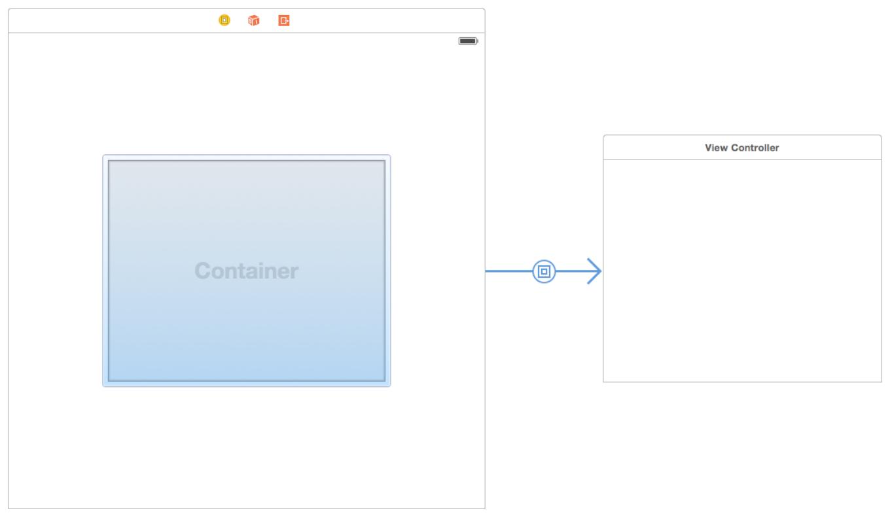

# 目录

   * [简述](#简述)
      * [Designing a Custom Container View Controller (设计自定义容器视图控制器)](#designing-a-custom-container-view-controller-设计自定义容器视图控制器)
         * [Example: Navigation Controller](#example-navigation-controller)
         * [Example: Split View Controller](#example-split-view-controller)
      * [Configuring a Container in Interface Builder (在IB中配置视图控制器容器)](#configuring-a-container-in-interface-builder-在ib中配置视图控制器容器)
      * [Implementing a Custom Container View Controller (实现自定义容器视图控制器)](#implementing-a-custom-container-view-controller-实现自定义容器视图控制器)
         * [Adding a Child View Controller to Your Content](#adding-a-child-view-controller-to-your-content)
         * [Removing a Child View Controller](#removing-a-child-view-controller)
         * [Transitioning Between Child View Controllers](#transitioning-between-child-view-controllers)
         * [Managing Appearance Updates for Children](#managing-appearance-updates-for-children)
      * [Suggestions for Building a Container View Controller](#suggestions-for-building-a-container-view-controller)
      * [Delegating Control to a Child View Controller](#delegating-control-to-a-child-view-controller)
   * [源文档](#源文档)

# 简述

容器视图控制器是一种将多个视图控制器的内容组合到单个用户界面的方法。它通常用于方便导航以及基于现有内容创建新的用户界面。`UIKit`中的容器视图控制器的例子包括`UINavigationController`, `UITabBarController`和`UISplitViewController`，所有这些都有助于在用户界面的不同部分之间导航。

## Designing a Custom Container View Controller (设计自定义容器视图控制器)

大多数情况下，容器视图控制器都像其他内容视图控制器一样，它管理一个根视图和一些内容。不同之处在于容器视图控制器从其他视图控制器获得它的部分内容。它获取的内容仅限于其他视图控制器的视图，这些视图嵌入在自己的视图层次结构中。容器视图控制器负责设置任何嵌入视图的大小和位置，但是**原始的视图控制器仍然管理那些视图内的内容**。

当设计你自己的容器视图控制器时，总是**要理解容器和被包含的视图控制器之间的关系**。视图控制器之间的关系可以帮助通知它们的内容应该如何显示在屏幕上，以及你的容器如何在内部管理他们，在在设计过程中，思考以下问题:

* 容器的角色是什么，它的子视图控制器扮演什么角色?
* 同时显示多少个子视图控制器?
* 兄弟视图控制器之间的关系是什么(如果有的话)?
* 子视图控制器如何添加到容器或从容器中移除?
* 子视图控制器的大小或位置可以改变吗?这些变化是在什么条件下发生的?
* 容器是否提供了自己的任何装饰性或与导航相关的视图?
* 容器和它的子视图控制器之间需要什么样的通信?除了`UIViewController`类定义的标准事件之外，容器是否需要向其子视图控制器报告特定事件？
* 容器的外观可以用不同的方式配置吗?如果可以，该怎么进行?

在定义了各种对象的角色之后，容器视图控制器的实现是相对简单的，`UIKit`的唯一要求是你在容器视图控制器和任何子视图控制器之间建立一个正确的父子关系，父子关系确保子节点接收到任何相关的系统消息。除此之外，大多数实际工作发生在所包含视图的布局和管理期间，这对于每个容器都是不同的。你可以将视图放置在容器内容区域的任何位置，并根据需要调整视图的大小。你还可以向视图层次结构添加自定义视图，以提供装饰或帮助导航。

### Example: Navigation Controller

`UINavigationController`对象支持通过层次化数据集进行导航，导航界面每次显示一个子视图控制器，界面顶部的导航条显示数据层次结构中的当前位置，并显示一个后退按钮以向后移动一级。继续导航到数据层次结构是留给子视图控制器的，可以使用`tables`或`buttons`

视图控制器之间的导航是由导航控制器及其子控制器共同管理的。**当用户与子视图控制器的`buttons`或`tables`行交互时，子视图控制器会请求导航控制器将一个新的视图控制器推入当前视图**。**子控制器处理新视图控制器内容的配置，但是导航控制器管理过渡动画**。导航控制器也管理导航栏，它显示一个后退按钮来移除最顶层的视图控制器。

导航控制器及其视图的结构如图5-1所示，**大部分内容区域被最顶层的子视图控制器填满，只有一小部分被导航条占据**。

图5-1 导航界面结构

<div align="center">    

</div>

在`compact`和`regular`的环境中，导航控制器一次只显示一个子视图控制器，导航控制器调整子视图控制器的大小以适应可用空间。

### Example: Split View Controller

译为分屏视图控制器

一个`UISplitViewController`对象以`master-detail`的方式显示两个视图控制器的内容。在这个排列中，一个视图控制器(`master`)的内容决定了哪些细节被另一个视图控制器(`detail`)显示。这两个视图控制器的可见性是可配置的，但也受当前环境的控制。在一个`regular`的水平环境中，分屏视图控制器可以同时显示两个子视图控制器，或者它可以隐藏主视图控制器并根据需要显示它。在`compact`的环境中，分屏视图控制器一次只显示一个视图控制器。

图5-2展示了分屏视图控制器的界面结构以及在`regular`水平环境下分屏视图控制器的视图结构。在默认情况下，分屏视图控制器本身只有它自己的容器视图。在这个例子中，两个子视图并排显示，子视图的大小是可配置的，就像主视图的可见性一样。

图5-2 分屏视图控制器界面

<div align="center">    

</div>

## Configuring a Container in Interface Builder (在IB中配置视图控制器容器)

在设计时创建父子容器关系，在`storyboard`中添加一个容器视图对象，如图5-3所示，一个容器视图对象是一个占位符对象，它表示子视图控制器的内容，使用该视图来确定子视图控制器的`root view`

图5-3 添加容器视图

<div align="center">    

</div>

当你用一个或多个容器视图加载视图控制器时，`Interface Builder`也会加载与这些视图相关联的子视图控制器，子对象必须与父对象同时实例化，这样才能创建适当的父子关系。

如果你不使用`Interface Builder`来建立你的父子容器关系，你必须通过将每个子容器添加到容器视图控制器来编程创建这些关系，如[Adding a Child View Controller to Your Content](https://developer.apple.com/library/archive/featuredarticles/ViewControllerPGforiPhoneOS/ImplementingaContainerViewController.html#//apple_ref/doc/uid/TP40007457-CH11-SW13)所述。

## Implementing a Custom Container View Controller (实现自定义容器视图控制器)

为了实现一个容器视图控制器，你必须在你的视图控制器和它的子视图控制器之间建立关系，**在你试图管理任何子视图控制器的视图之前，需要建立这些父子关系**，这样做让UIKit知道你的视图控制器正在管理子对象的大小和位置，你可以在`Interface Builder`中创建这些关系，也可以通过编程方式创建它们。**当以编程方式创建父子关系时，作为视图控制器配置的一部分，你要显式地添加和删除子视图控制器**。

### Adding a Child View Controller to Your Content

要以编程的方式将子视图控制器合并到你的内容中，通过以下步骤在相关的视图控制器之间创建父子关系:

1. 调用你的容器视图控制器的`addChildViewController:`方法

   这个方法告诉`UIKit`你的容器视图控制器现在管理子视图控制器的视图

2. 添加子视图控制器的`root view`到当前容器的视图层次结构中

   在这个过程，要记得设置子视图控制器的`root view`的`frame`来确定大小和位置

3. 添加约束来管理子根视图的大小和位置(和上一步不是重复了吗？官方文档是这么写...)

4. 调用子视图控制器的`didMoveToParentViewController:`方法

清单5-1展示了容器如何在其容器中嵌入子视图控制器，在建立父子关系之后，容器会设置子对象的`frame`，并将子对象的视图添加到自己的视图层次结构中，设置子视图的`frame`大小很重要，它可以确保视图在容器中正确显示，在添加视图之后，容器调用子视图控制器的`didMoveToParentViewController:`方法来给子视图控制器一个机会来响应视图所有权的变更。

清单5-1 添加子视图控制器到容器中

```objective-c
- (void) displayContentController: (UIViewController*) content {
   [self addChildViewController:content];
   content.view.frame = [self frameForContentController];
   [self.view addSubview:self.currentClientView];
   [content didMoveToParentViewController:self];
}
```

在前面的例子中，注意，你只需要调用子对象的`didMoveToParentViewController:`方法，这是因为`addChildViewController:`方法会为你调用子对象的`willMoveToParentViewController:`方法，你必须自己手动调用`didMoveToParentViewController:`方法的原因是你必须先将子视图嵌入到你的容器的视图层次结构之后，才能调用该方法。

当使用自动布局时，**在将子容器添加到容器的视图层次结构之后，在容器和子容器之间设置约束**，**你的约束应该只影响子对象根视图的大小和位置，不要改变根视图或子视图层次结构中的任何其他视图的内容**。

### Removing a Child View Controller

要从你的内容中移除一个子视图控制器，通过以下步骤移除视图控制器之间的父子关系:

1. 调用子视图控制器的` willMoveToParentViewController:`，参数传入`nil`
2. 删除为子视图控制器的根视图配置的任何约束
3. 从容器的视图层次结构中移除子视图控制器的根视图
4. 调用子视图控制器的`removeFromParentViewController`方法来结束父子关系

移除子视图控制器将永久地切断父视图控制器和子视图控制器之间的关系，只有当你不再需要引用它时，才移除子视图控制器，例如，**当一个新的控制器被`push`到导航控制器的堆栈上时，导航控制器不会移除它当前的子视图控制器，只有当它们从堆栈中被**
**`pop`出时，才会删除它们**。

清单5-2展示了如何从它的容器中移除子视图控制器，调用参数为`nil`的`willMoveToParentViewController:`方法会给子视图控制器一个为更改做准备的机会。`removeFromParentViewController`方法也会调用子视图控制器的`didMoveToParentViewController:`方法，并给这个方法传递一个`nil`值，将父视图控制器设置为nil以结束从容器中移除子视图。

清单5-2 从容器中移除子视图控制器

```objective-c
- (void) hideContentController: (UIViewController*) content {
   [content willMoveToParentViewController:nil];
   [content.view removeFromSuperview];
   [content removeFromParentViewController];
}
```

### Transitioning Between Child View Controllers

当你要动画化一个子视图控制器替换为另一个子视图控制器时，将子视图控制器的添加和删除合并到过渡动画过程中。在动画之前，确保两个子视图控制器都是你内容的一部分，但要让当前子控制器知道它将要消失，在你的动画过程中，移动新的子视图到合适的位置，并移除旧的子视图，动画完成后，完成子视图控制器的移除。

清单5-3展示了如何使用过渡动画来切换一个子视图控制器，在这个例子中，新的视图控制器被动画化到现有的子视图控制器当前占用的矩形，旧的被移动到屏幕外，动画完成后，`completion`回调从容器中移除子视图控制器，在这个例子中，`transitionFromViewController:toViewController:duration:options:animations:completion:`方法会自动更新容器的视图层次结构，所以你不需要自己添加和删除视图。

清单5-3 两个子视图控制器之间的转换

```objective-c
- (void)cycleFromViewController: (UIViewController*) oldVC
               toViewController: (UIViewController*) newVC {
   // Prepare the two view controllers for the change.
   [oldVC willMoveToParentViewController:nil];
   [self addChildViewController:newVC];
 
   // Get the start frame of the new view controller and the end frame
   // for the old view controller. Both rectangles are offscreen.
   newVC.view.frame = [self newViewStartFrame];
   CGRect endFrame = [self oldViewEndFrame];
 
   // Queue up the transition animation.
   [self transitionFromViewController: oldVC toViewController: newVC
        duration: 0.25 options:0
        animations:^{
            // Animate the views to their final positions.
            newVC.view.frame = oldVC.view.frame;
            oldVC.view.frame = endFrame;
        }
        completion:^(BOOL finished) {
           // Remove the old view controller and send the final
           // notification to the new view controller.
           [oldVC removeFromParentViewController];
           [newVC didMoveToParentViewController:self];
        }];
}
```

### Managing Appearance Updates for Children

向容器添加一个子对象后，容器会自动将与外观相关的消息转发给该子对象，这通常是你想要的行为，因为它确保所有事件都能被正确发送，然而，有时默认行为可能会以对容器没有意义的顺序发送这些事件，例如，如果多个子对象同时更改它们的视图状态，你可能希望合并这些更改，以便`appearance callback`以更符合逻辑的顺序同时发生。 (这一段有点难理解)

要接管`appearance callback`，重写**容器视图控制器**的`shouldAutomaticallyForwardAppearanceMethods`方法，返回**NO**，如清单5-4所示，返回**NO**告诉`UIKit`你的容器视图控制器负责通知它的子控制器在外观上的变化。

清单5-4 取消自动转发`appearance`

```objective-c
- (BOOL) shouldAutomaticallyForwardAppearanceMethods {
    return NO;
}
```

当一个`appearance transition`发生时，会调用子对象的`beginAppearanceTransition:animated:`或`endAppearanceTransition`方法，例如，如果你的容器有一个由`childe`属性引用的子对象，那么你的容器将把这些消息转发给子对象，如清单5-5所示。

清单5-5 转发`appearance`消息

```objective-c
-(void) viewWillAppear:(BOOL)animated {
    [self.child beginAppearanceTransition: YES animated: animated];
}
 
-(void) viewDidAppear:(BOOL)animated {
    [self.child endAppearanceTransition];
}
 
-(void) viewWillDisappear:(BOOL)animated {
    [self.child beginAppearanceTransition: NO animated: animated];
}
 
-(void) viewDidDisappear:(BOOL)animated {
    [self.child endAppearanceTransition];
}
```

## Suggestions for Building a Container View Controller

设计、开发和测试一个新的容器视图控制器需要时间，尽管单个行为很简单，但控制器作为一个整体可能相当复杂，在实现自己的容器类时，考虑以下技巧:

* **只访问子视图控制器的根视图**，容器应该只访问每个子控制器的根视图，即子控制器的`view`属性返回的视图，它不应该访问任何子视图的其他视图。
* **子视图控制器应该对它们的容器有尽可能少的了解**，子视图控制器应该关注它自己的内容，如果容器允许其子对象影响其行为，则应该使用`delegation`设计模式来管理这些交互。
* **首先使用常规视图设计容器**，使用常规视图(而不是子视图控制器中的视图)让你有机会在一个简化的环境中测试布局约束和动画转换，当常规视图按预期工作时，把它们换成你的子视图控制器的视图。

## Delegating Control to a Child View Controller

一个容器视图控制器可以把它自己外观的某些设置委托给它的一个或多个子控制器，你可以通过以下方式委托:

* **让子视图控制器决定状态栏样式**，要把状态栏外观委托给一个子对象，重写你的容器视图控制器中的`childViewControllerForStatusBarStyle`和`childViewControllerForStatusBarHidden`方法中的一个或两个
* **让子视图控制器指定自己的首选大小**，具有灵活布局的容器可以使用子对象自己的`preferredContentSize`属性来帮助确定子对象的大小

# 源文档

[Implementing a Container View Controller](https://developer.apple.com/library/archive/featuredarticles/ViewControllerPGforiPhoneOS/ImplementingaContainerViewController.html#//apple_ref/doc/uid/TP40007457-CH11-SW1)