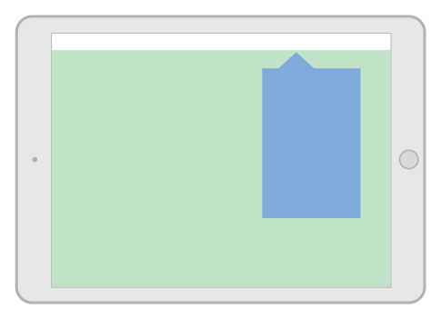
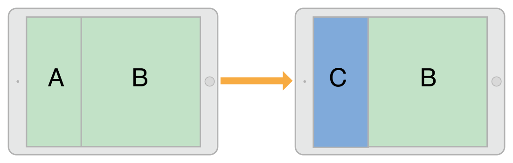
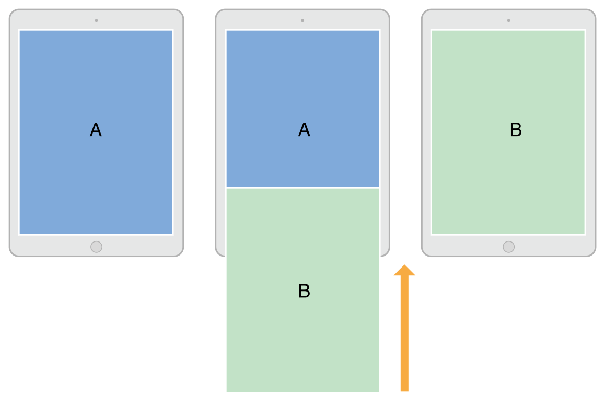

# 目录

   * [Presenting a View Controller](#presenting-a-view-controller)
      * [The Presentation and Transition Process (展示与过渡)](#the-presentation-and-transition-process-展示与过渡)
         * [Presentation Styles (展示样式)](#presentation-styles-展示样式)
            * [Full-Screen Presentation Styles (全屏覆盖)](#full-screen-presentation-styles-全屏覆盖)
            * [The Popover Style (弹窗样式)](#the-popover-style-弹窗样式)
            * [The Current Context Styles (覆盖部分样式)](#the-current-context-styles-覆盖部分样式)
            * [Custom Presentation Styles (自定义样式)](#custom-presentation-styles-自定义样式)
         * [Transition Styles (过渡样式)](#transition-styles-过渡样式)
         * [Presenting Versus Showing a View Controller](#presenting-versus-showing-a-view-controller)
      * [Presenting a View Controller](#presenting-a-view-controller-1)
         * [Showing View Controllers](#showing-view-controllers)
         * [Presenting View Controllers Modally](#presenting-view-controllers-modally)
         * [Presenting a View Controller in a Popover](#presenting-a-view-controller-in-a-popover)
      * [Dismissing a Presented View Controller](#dismissing-a-presented-view-controller)
      * [Presenting a View Controller Defined in a Different Storyboard](#presenting-a-view-controller-defined-in-a-different-storyboard)
   * [源文档](#源文档)

# Presenting a View Controller

**有两种方法在屏幕上展示示视图控制器:将它嵌入到容器视图控制器或present它**，容器视图控制器提供应用程序的主要导航，但`presenting`视图控制器也是一个重要的导航工具，你使用直接的`presentation`在当前的视图控制器上展示一个新的视图控制器，通常，当你想实现`modal`用户界面时，你可以`present`视图控制器，但你也可以将它们用于其他目的。

`presenting`视图控制器在`UIViewController`类是内建支持的，并且它对所有视图控制器对象可用。你可以从任何一个视图控制器`present`任何一个视图控制器，尽管UIKit可能会重新路由请求到一个不同的视图控制器。**`present`一个视图控制器会在原始的视图控制器(称为`presenting`视图控制器)和被显示的新视图控制器(称为`presented`视图控制器)之间创建一个关系**。**这种关系形成了视图控制器层次结构的一部分，并保持在适当的位置，直到`presented`视图控制器被移除**。

## The Presentation and Transition Process (展示与过渡)

`presenting`一个视图控制器可以快速而简单地将新内容以动画方式展示到屏幕上，`UIKit`实现的`presentation`让你可以使用内置或自定义的动画来展示一个新的视图控制器，内置的`presentations`和动画你只需要写很少的代码就可以使用，因为`UIKit`处理处理大部分工作，你也可以自定义`presentations`和动画，并应用到你的视图控制器上。

你可以通过编程或使用`segue`来使用视图控制器的`presentation`，如果你在设计时就知道应用程序的导航跳转，那么你可以直接使用`segue`来建立`presentation`。对于动态性较强的用户界面，或者在没有专门的界面来定义`segue`时，可以以编程的方式使用`UIViewController`类的方法来`present`你的视图控制器。

### Presentation Styles (展示样式)

`presentation style `控制视图控制器展示在屏幕上的外观，`UIKit`定义了许多标准样式，每一种都有特定的外观和意义，你还可以定义自己的样式。当设计你自己的应用程序时，考虑选择能够恰当表达你的意图的展示样式，并为想要`present`的视图控制器的`modalPresentationStyle`属性设置合适的值。

#### Full-Screen Presentation Styles (全屏覆盖)

该样式表示新的视图控制器将覆盖整个屏幕，这样可以防止与上一层的内容发生交互，在水平`regular`环境下，只有一种`full-screen styles`完全覆盖上一层的内容

> The rest incorporate dimming views or transparency to allow portions of the underlying view controller to show through. 

在水平`compact`环境下，`full-screen presentations`自动适应`UIModalPresentationFullScreen`样式，并覆盖所有上一层的内容。

图8-1展示了在水平`regular`环境中使用`UIModalPresentationFullScreen`、`UIModalPresentationPageSheet`和`UIModalPresentationFormSheet`样式。在图中，左上角的绿色视图控制器显示了右上方的蓝色视图控制器，每种表示样式的结果如下所示。**对于一些表示样式，`UIKit`在两个视图控制器的内容之间插入一个暗层视图**。

图8-1 全屏展示样式

<div align="center">    

</div>

>当使用UIModalPresentationFullScreen样式呈现一个视图控制器时，UIKit通常在过渡动画完成后删除上一层视图控制器的视图，你可以通过指定UIModalPresentationOverFullScreen样式来阻止移除这些视图，当被`present`的视图控制器有让上一层内容显示的透明区域时，你可能会使用那个样式。

**当使用一种全屏展示样式时，表示视图控制器本身必须覆盖整个屏幕，如果`presenting`视图控制器(上一层视图控制器)没有覆盖屏幕，`UIKit`沿着视图控制器层次结构向上走，直到它找到一个那样做的，如果它不能找到一个视图控制器是填充整个屏幕的，`UIKit`使用`Window`的根视图控制器**。

#### The Popover Style (弹窗样式)

`UIModalPresentationPopover`样式表示在弹出窗口视图中显示视图控制器。`Popovers`用于展示选定项目的一个小列表额外信息。在水平`regular`的环境中，弹出窗口只覆盖屏幕的一部分，如图8-2所示。在水平`compact`的环境中，弹出窗口默认适应为`UIModalPresentationOverFullScreen`的显示样式，在弹出窗口视图外点击，弹出窗口自动消失。

图8-2 `Popover`样式

<div align="center">    

</div>

因为弹窗自动适应于水平`compact`环境中的全屏显示，所以通常需要修改弹窗代码来处理这种适应。在全屏模式下，你需要一种方法来`dismiss`弹出窗口，你可以添加一个按钮，将弹出窗口嵌入到一个`dismissible`的容器视图控制器中，或者改变自适应行为本身。

如何配置一个`popover presentation`，请参阅[Presenting a View Controller in a Popover](https://developer.apple.com/library/archive/featuredarticles/ViewControllerPGforiPhoneOS/PresentingaViewController.html#//apple_ref/doc/uid/TP40007457-CH14-SW13)

#### The Current Context Styles (覆盖部分样式)

`UIModalPresentationCurrentContext`样式在你的界面中覆盖了一个特定的视图控制器，当使用该样式时，你通过设置`definesPresentationContext`属性为**YES**来指定哪个视图控制器被覆盖，图8-3展示使用该样式，它覆盖了`split view controller`的其中一个视图控制器。

图8-3 

<div align="center">    

</div>


> 当使用UIModalPresentationFullScreen样式呈现一个视图控制器时，UIKit通常在过渡动画完成后删除上一层视图控制器的视图，你可以通过指定UIModalPresentationOverCurrentContext样式来阻止移除这些视图，当被`present`的视图控制器有让上一层内容显示的透明区域时，你可能会使用那个样式。

设置`definesPresentationContext`的视图控制器也可以定义过渡动画，通常地，`UIKit`使用`presented`视图控制器的 `modalTransitionStyle`属性值来使其动画化，如果设置`definesPresentationContext`的视图控制器设置了`providesPresentationContextTransitionStyle`为**YES**，`UIKit`使用这个视图控制器的`modalTransitionStyle`属性中的值代替。

当转换到水平`compact`的环境时，当前的`context`样式自适应为`UIModalPresentationFullScreen`样式，

要更改这种行为，请使用`adaptive presentation delegate`来指定不同的`presentation`样式或视图控制器。

#### Custom Presentation Styles (自定义样式)

`UIModalPresentationCustom`样式让你使用你定义的自定义样式来呈现一个视图控制器，创建一个自定义样式包括子类化`UIPresentationController`和使用它的方法动画化任何自定义视图到屏幕上，并设置`presented`视图控制器的大小和位置。子类化控制器还需要处理由于`presented`视图控制器的特征改变而发生的任何调整。

有关如何定义自定义`presentation`控制器的信息，请参阅 [Creating Custom Presentations](https://developer.apple.com/library/archive/featuredarticles/ViewControllerPGforiPhoneOS/DefiningCustomPresentations.html#//apple_ref/doc/uid/TP40007457-CH25-SW1)

###  Transition Styles (过渡样式)

过渡样式决定了用于显示一个`presented`视图控制器的动画类型，对于内置的过渡样式，你分配一个标准的过渡样式给你想要显示的视图控制器的`modalTransitionStyle`属性，当你`present`视图控制器时，`UIKit`会创建对应于那个样式的动画，例如，图8-4说明了标准的上滑过渡(`UIModalTransitionStyleCoverVertical`)是如何在屏幕上动画化视图控制器的，视图控制器B在屏幕底部开始，并向上动画到视图控制器A的顶部，当视图控制器B被移除时，动画反转以便B滑下显示A。

图8-4 视图控制器的过渡动画

<div align="center">    

</div>

你可以使用`animator`对象和`transitioning delegate`来创建自定义的过渡，`animator`对象创建用于在屏幕上放置视图控制器的过渡动画，`transitioning delegate`在适当的时候将`animator`对象提供给`UIKit`。有关如何实现自定义过渡的信息，请参阅[Customizing the Transition Animations](https://developer.apple.com/library/archive/featuredarticles/ViewControllerPGforiPhoneOS/CustomizingtheTransitionAnimations.html#//apple_ref/doc/uid/TP40007457-CH16-SW1)

### Presenting Versus Showing a View Controller

`UIViewController`类提供了两种方式来展示一个视图控制器：

* `showViewController:sender:`和`showDetailViewController:sender:`方法提供了最具适应性和最灵活的方式来显示视图控制器。这些方法让`presenting`视图控制器决定如何最好地处理`presentation`，例如，一个容器视图控制器可能将视图控制器合并为子控制器，而不是以`modally`方式展示它，`present`的默认行为是以`modally`方式展示视图控制器。
* `presentViewController:animated:completion:`方法总是以`modally`方式显示视图控制器，调用这个方法的视图控制器可能不会最终处理`presentation`，但`presentation`总是`modal`的。此方法适用于水平`compact`的环境`presentation`样式。

`showViewController:sender:`和`showDetailViewController:sender:`方法是首选的发起`presentations`的方式，视图控制器可以调用它们，而不需要知道视图控制器层次结构的其余部分或当前视图控制器在那个层次结构中的位置，这些方法也使它更容易在你的应用程序的不同部分重用视图控制器，而无需编写条件代码。

## Presenting a View Controller

有几种方法可以发起视图控制器的`presentation` ：

* 使用一个`segue`来自动`present`视图控制器，`segue`使用你在`Interface Builder`中指定的信息实例化并`present`视图控制器。有关如何配置`segue`的更多信息，请参阅[Using Segues](https://developer.apple.com/library/archive/featuredarticles/ViewControllerPGforiPhoneOS/UsingSegues.html#//apple_ref/doc/uid/TP40007457-CH15-SW1)
* 使用`showViewController:sender:`或`showDetailViewController:sender:`方法来显示视图控制器，在自定义视图控制器中，你可以改变这些方法的行为，使之更适合你的视图控制器
* 调用 `presentViewController:animated:completion:`方法以`modally`方式`present`一个视图控制器

关于如何移除你的`presented`视图控制器，请参阅[Dismissing a Presented View Controller](https://developer.apple.com/library/archive/featuredarticles/ViewControllerPGforiPhoneOS/PresentingaViewController.html#//apple_ref/doc/uid/TP40007457-CH14-SW10)

### Showing View Controllers

当使用`showViewController:sender:`和`showDetailViewController:sender:`方法时，在屏幕上获取新视图控制器的过程很简单:

1. 创建你需要展示的视图控制器对象，当创建视图控制器时，你需要用任务所需的任何数据来初始化它
2. 为它设置`modalPresentationStyle`属性作为首选的展示样式，但这个样式在最终的`presentation`中可能不会使用
3. 为它设置`modalTransitionStyle`属性指定过渡动画样式，但这个样式在最终的`presentation`中可能不会使用
4. 在当前视图控制器调用`showViewController:sender:`和`showDetailViewController:sender`方法

`UIKit`将对`showViewController:sender:`和`showDetailViewController:sender:`方法的调用转发给适当的`presenting`视图控制器，这个视图控制器然后可以决定如何最好地执行`presentation`，并可以根据需要改变展示和过渡动画的样式，例如，一个导航控制器可能把视图控制器`push`到它的导航堆栈上。

### Presenting View Controllers Modally

当直接`present`一个视图控制器时，你告诉`UIKit`你想要新视图控制器如何显示，以及它应该如何在屏幕上动画化：

1. 创建你需要`present`的视图控制器对象
2. 为它设置`modalPresentationStyle`属性
3. 为它设置`modalTransitionStyle`
4. 在当前视图控制器调用`presentViewController:animated:completion:`方法

**调用`presentViewController:animated:completion:`方法的视图控制器可能不是实际执行`modal presentation`的那个**,`presentation style`决定了视图控制器如何被`present`，包括`presenting`视图控制器的特征，例如，一个`full-screen presentation`必须在一个全屏的视图控制器上执行，如果当前呈现的视图控制器不合适，UIKit会遍历视图控制器层次结构，直到它找到一个合适的。完成一个`modal presentation`后，`UIKit`更新受影响的视图控制器的`presentingViewController`和`presenttedviewcontroller`属性。

清单8-1演示了如何以编程方式`present`视图控制器

```objective-c
- (void)add:(id)sender {
   // Create the root view controller for the navigation controller
   // The new view controller configures a Cancel and Done button for the
   // navigation bar.
   RecipeAddViewController *addController = [[RecipeAddViewController alloc] init];
 
   addController.modalPresentationStyle = UIModalPresentationFullScreen;
   addController.transitionStyle = UIModalTransitionStyleCoverVertical;
   [self presentViewController:addController animated:YES completion: nil];
}
```

### Presenting a View Controller in a Popover

弹出窗口需要额外的配置才能显示它们，将样式设置为`UIModalPresentationPopover`后，配置以下与弹出窗口相关的属性:

* 设置`preferredContentSize`属性(需要展示的视图控制器)来指定尺寸
* 使用相关的`UIPopoverPresentationController`对象设置弹窗`anchor`，它是从视图控制器的`popoverPresentationController`属性访问的，只需设置下列之一:
  * 将`barButtonItem`属性设置为一个`bar button item`
  * 将`sourceView`和`sourceRect`属性设置为某个视图中的特定区域

你可以使用`UIPopoverPresentationController`对象根据需要对弹出窗口的外观进行其他调整，弹出窗口控制器还有一个`delegate`对象，你可以使用它来响应`presentation`过程中的变化，例如，当弹出窗口出现、消失或在屏幕上重新定位时，你可以使用`delegate`进行响应。

## Dismissing a Presented View Controller

要移除一个`presented`视图控制器，调用`presenting`视图控制器的`dismissViewControllerAnimated:completion:`方法，你也可以在`presented`视图控制器本身上调用这个方法，当你在`presented`视图控制器上调用这个方法时，`UIKit`会自动把请求转发给`presenting`视图控制器。

在移除视图控制器之前，需要保存任何重要的信息，移除一个视图控制器会将它从视图控制器层次结构中移除。如果你在其他任何地方没有对该视图控制器进行强引用，移除它意味着跟它相关联的内存会被释放。

如果`presented`视图控制器必须返回数据给`presenting`视图控制器，使用`Delegation`设计模式来辅助传输，`Delegation`使得在应用程序的不同部分重用视图控制器更容易，使用`Delegation`，`presented`视图控制器存储了一个对`delegate`对象的引用，该对象实现了协议的方法，当它需要传输或通知时，`presented`视图控制器在它的`delegate`对象上调用这些协议方法。在一个典型的实现中，`presenting`视图控制器将自己设置为`presented`视图控制器的的`delegate`。

## Presenting a View Controller Defined in a Different Storyboard

虽然你可以在同一个`storyboard`的视图控制器之间创建`segue`，但你不能在`storyboard`之间创建`segue`，当你想要展示存储在不同`storyboard`中的视图控制器时，你必须在`present`它之前显式地实例化它，如清单8-2所示。这个例子以`modal`的方式`present`视图控制器，但是你可以把它`push`到导航控制器上或以其他方式展示它。

清单8-2 从`storyboard`中加载一个视图控制器

```objective-c
UIStoryboard* sb = [UIStoryboard storyboardWithName:@"SecondStoryboard" bundle:nil];
MyViewController* myVC = [sb instantiateViewControllerWithIdentifier:@"MyViewController"];
 
// Configure the view controller.
 
// Display the view controller
[self presentViewController:myVC animated:YES completion:nil];
```

在应用程序中创建多个`storyboard`是可选的，在这些请款改下，你可以考虑创建多个`storyboard`：

* 你有一个大型的编程团队，用户界面的不同部分分配给团队的不同人员，每个人员在不同的故事板文件中拥有自己的用户界面部分
* 你购买或创建了一个预定义视图控制器类型集合的库；这些视图控制器的内容在库提供的`storyboard`中定义
* 你需要在外部屏幕上显示内容，在这种情况下，你可以将所有与备用屏幕相关联的视图控制器保存在一个单独的故事板中。同样场景的另一种模式是编写一个自定义`segue`。

# 源文档

[Presenting a View Controller](https://developer.apple.com/library/archive/featuredarticles/ViewControllerPGforiPhoneOS/PresentingaViewController.html#//apple_ref/doc/uid/TP40007457-CH14-SW4)