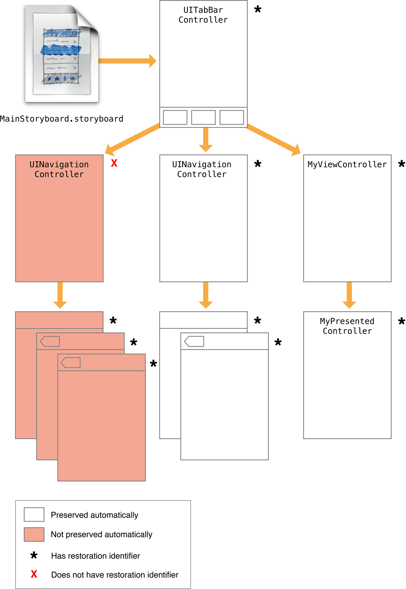

# 目录

   * [Preserving and Restoring State](#preserving-and-restoring-state)
      * [Tagging View Controllers for Preservation (标记控制器以保存)](#tagging-view-controllers-for-preservation-标记控制器以保存)
         * [Choosing Effective Restoration Identifiers (选择有效的恢复标识符)](#choosing-effective-restoration-identifiers-选择有效的恢复标识符)
         * [Excluding Groups of View Controllers](#excluding-groups-of-view-controllers)
         * [Preserving a View Controller’s Views](#preserving-a-view-controllers-views)
      * [Restoring View Controllers at Launch Time (在启动时恢复视图控制器)](#restoring-view-controllers-at-launch-time-在启动时恢复视图控制器)
      * [Encoding and Decoding Your View Controller’s State](#encoding-and-decoding-your-view-controllers-state)
      * [Tips for Saving and Restoring Your View Controllers](#tips-for-saving-and-restoring-your-view-controllers)
   * [源文档](#源文档)

# Preserving and Restoring State

主题 ： **视图控制器的状态保存与恢复**

视图控制器在状态保存和恢复过程中扮演着重要的角色，状态保存记录你的应用程序挂起之前的配置，以便在随后的应用程序启动时可以恢复配置，将应用程序恢复到之前的配置可以为用户节省时间，并提供更好的用户体验。

保存和恢复状态过程大多是自动的，但你需要告诉iOS保存应用的哪些部分，保存应用程序视图控制器的步骤如下:

* (必要)给你想要保留配置的视图控制器分配恢复标识符，请参阅[Tagging View Controllers for Preservation](https://developer.apple.com/library/archive/featuredarticles/ViewControllerPGforiPhoneOS/PreservingandRestoringState.html#//apple_ref/doc/uid/TP40007457-CH28-SW2)
* (必要)告诉iOS如何在启动时创建或定位新的视图控制器对象，请参阅[Restoring View Controllers at Launch Time](https://developer.apple.com/library/archive/featuredarticles/ViewControllerPGforiPhoneOS/PreservingandRestoringState.html#//apple_ref/doc/uid/TP40007457-CH28-SW5)
* (可选)对于每个视图控制器，存储使该视图控制器恢复其原始配置所需的任何特定配置数据，请参阅[Encoding and Decoding Your View Controller’s State](https://developer.apple.com/library/archive/featuredarticles/ViewControllerPGforiPhoneOS/PreservingandRestoringState.html#//apple_ref/doc/uid/TP40007457-CH28-SW6)

保存和恢复过程，请参阅 [App Programming Guide for iOS](https://developer.apple.com/library/archive/documentation/iPhone/Conceptual/iPhoneOSProgrammingGuide/Introduction/Introduction.html#//apple_ref/doc/uid/TP40007072)

## Tagging View Controllers for Preservation (标记控制器以保存)

`UIKit`只保存你告诉它需要保存的视图控制器，每个视图控制器都有一个`restationidentifier`属性，它的值默认为`nil`，设置这个属性为一个有效的字符串告诉`UIKit`视图控制器和它的视图应该被保存，你可以通过编程方式或在`storyboard`文件中分配恢复标识符。

当分配恢复标识符时，请记住，视图控制器层次结构中的所有父视图控制器也必须有恢复标识符，**在保存过程中，UIKit从窗口的根视图控制器开始并遍历视图控制器层次结构，如果哪个层次结构中的一个视图控制器没有恢复标识符，视图控制器和它的所有子视图控制器以及被`presented`的视图控制器都会被忽略**。

### Choosing Effective Restoration Identifiers (选择有效的恢复标识符)

`UIKit`使用你的恢复标识符字符串来重新创建视图控制器，所以选择那些容易被你的代码识别的字符串，如果`UIKit`不能自动创建你的一个视图控制器，它会要求你创建它，并为你提供视图控制器及其所有父视图控制器的恢复标识符，该标识符链表示视图控制器的恢复路径，是确定请求哪个视图控制器的方式

> The restoration path starts at the root view controller and includes every view controller up to and including the one that was requested

恢复标识符通常只是视图控制器的类名，如果你在许多地方使用同一个类，你可能希望分配更有意义的值，例如，你可能会根据视图控制器管理的数据分配一个字符串。

每个视图控制器的恢复路径必须是唯一的，如果一个容器视图控制器有两个子控制器，容器必须为每个子控制器分配一个唯一的恢复标识符，一些容器视图控制器自动消除它们的子视图控制器的歧义，允许你为每个子视图使用相同的恢复标识符，例如，`UINavigationController`类根据每个子对象在导航堆栈中的位置向其添加信息。

有关如何使用恢复标识符和恢复路径来创建视图控制器的更多信息，请参阅[Restoring View Controllers at Launch Time](https://developer.apple.com/library/archive/featuredarticles/ViewControllerPGforiPhoneOS/PreservingandRestoringState.html#//apple_ref/doc/uid/TP40007457-CH28-SW5)

### Excluding Groups of View Controllers

为了从恢复过程中排除整个视图控制器组，设置父视图控制器的恢复标识符为`nil`，图7-1显示了将恢复标识符设置为`nil`对视图控制器层次结构的影响。

> The lack of preservation data prevents that view controller from being restored later

图7-1 从自动保存过程排除视图控制器

<div align="center">    

</div>

排除一个或多个视图控制器不会在随后的恢复过程中完全移除它们，在启动时，作为应用程序默认设置的一部分的任何视图控制器仍然会被创建，如图7-2所示，这样的视图控制器在它们的默认配置中被重新创建，但它们仍然被创建。

图7-2 加载默认的视图控制器集

<div align="center">    

</div>

从自动保存过程中排除视图控制器并不会阻止你手动保存它，在恢复存档中保存对视图控制器的引用将保留视图控制器及其状态信息，例如，如果图7-1中的`app delegate`保存了导航控制器的三个子节点，它们的状态将被保存，在恢复过程中，`app delegate`可以重新创建那些视图控制器，并把它们`push`到导航控制器的堆栈上。

### Preserving a View Controller’s Views

一些视图有附加的与视图相关的状态信息，但不与父视图控制器相关，例如，一个滚动视图有一个你可能想要保留的滚动位置，当视图控制器负责提供滚动视图的内容时，滚动视图本身负责保存它的可视状态。

要保存视图的状态，请执行以下操作:

* 为视图的`restationidentifier`属性设置一个有效的字符串
* 从视图控制器中使用同样具有有效恢复标识符的视图
* 对于`table view`和`collection view`，设置一个遵循`UIDataSourceModelAssociation`协议的数据源

给视图分配一个恢复标识符告诉UIKit它应该把那个视图的状态写入保存存档，当视图控制器后来被恢复，UIKit也恢复任何有恢复标识符的视图的状态。

## Restoring View Controllers at Launch Time (在启动时恢复视图控制器)

在启动时，`UIKit`试图将你的应用恢复到它先前的状态，那时，`UIKit`要求你的应用程序创建(或定位)视图控制器对象，组成你保存的用户界面，当试图定位视图控制器时，`UIKit`按照以下顺序搜索:

1. **如果视图控制器有一个恢复类，UIKit要求这个类提供视图控制器**，`UIKit`调用关联恢复类的`viewControllerWithRestorationIdentifierPath:coder:`方法来检索视图控制器，如果这个方法返回`nil`，意味着应用程序不希望重新构建视图控制器，`UIKit`停止搜索它
2. **如果视图控制器没有一个恢复类，UIKit要求`app delegate`提供视图控制器**，`UIkit`调用`app delegate`的`application:viewControllerWithRestorationIdentifierPath:coder:`方法来寻找没有恢复类的视图控制器，如果那个方法返回`nil`，`UIKit`会尝试隐式地找到视图控制器
3. **如果一个带有正确恢复路径的视图控制器已经存在，UIKit就会使用那个对象**，如果你的应用程序在启动时创建视图控制器(通过编程或从`storyboard`加载它们)，那些视图控制器有恢复标识符，`UIKit`会根据它们的恢复路径隐式地找到它们
4. **如果视图控制器最初是从一个storyboard文件加载的，UIKit使用保存的`storyboard`信息来定位和创建它**，`UIKit`在恢复存档中保存关于视图控制器的`storyboard`信息，在恢复时，如果视图控制器没有被任何其他方法找到，`UIKit`使用该信息来定位相同的`storyboard`文件，并实例化相应的视图控制器。

给视图控制器分配一个恢复类会阻止`UIKit`隐式地搜索那个视图控制器，使用恢复类可以让你更好地控制你是否真的想要创建一个视图控制器，例如，如果你的类确定视图控制器不应该被重新创建，你的`viewControllerWithRestorationIdentifierPath:coder:`方法可以返回`nil`，当没有恢复类存在时，`UIKit`会尽其所能去寻找或创建视图控制器并恢复它。

当使用恢复类时，`viewControllerWithRestorationIdentifierPath:coder:`方法应该创建该类的新实例，执行最小初始化，并返回结果对象，清单7-1展示了如何使用这个方法从`storyboard`加载视图控制器的示例，因为视图控制器最初是从一个`storyboard`加载的，所以这个方法使用`UIStateRestorationViewControllerStoryboardKey`关键字来从存档中获取`storyboard`，注意，这个方法不会尝试配置视图控制器的数据字段，当视图控制器的状态被解码时，这个步骤会在后面发生。

清单7-1 在恢复过程中创建一个新的视图控制器

```objective-c
+ (UIViewController*) viewControllerWithRestorationIdentifierPath:(NSArray *)identifierComponents
                      coder:(NSCoder *)coder {
   MyViewController* vc;
   UIStoryboard* sb = [coder decodeObjectForKey:UIStateRestorationViewControllerStoryboardKey];
   if (sb) {
      vc = (PushViewController*)[sb instantiateViewControllerWithIdentifier:@"MyViewController"];
      vc.restorationIdentifier = [identifierComponents lastObject];
      vc.restorationClass = [MyViewController class];
   }
    return vc;
}
```

当手动重新创建视图控制器时，重新分配恢复标识符和恢复类是一个好习惯，`restore`恢复标识符最简单的方法是获取`identifierComponents`数组中的最后一项，并将它分配给你的视图控制器。

对于那些在启动时从应用程序的`main storyboard`文件中创建的对象，不要为每个对象创建新的实例，`UIKit`隐式地找到这些对象，或者使用`app deleagte`的`application: viewcontrollerwithrestationidentifierpath:coder:`方法来找到现有的对象。

## Encoding and Decoding Your View Controller’s State

对于每个需要保存的对象，`UIKit`调用对象的`encodeRestorableStateWithCoder:`方法给它一个机会来保存它的状态，在恢复过程中，`UIKit`调用匹配的`decodeRestorableStateWithCoder:`方法来解码状态并将其应用到对象，对于你的视图控制器，这些方法的实现是可选的，但推荐使用。你可以使用它们来保存和恢复以下类型的信息:

* 对显示的任何数据的引用(不是数据本身)
* 对于一个容器视图控制器，对它的子视图控制器的引用
* Information about the current selection
* 对于带有用户可配置视图的视图控制器，关于该视图的当前配置的信息

在`encode`和decode方法中，可以对对象和编码器支持的任何数据类型进行编码，对于除了视图和视图控制器之外的所有对象，对象必须遵循`NSCoding`协议并使用该协议的方法来写入它的状态，对于视图和视图控制器，编码器不使用`NSCoding`协议来保存对象的状态，相反，编码器保存对象的恢复标识符并将其添加到可保存对象列表中，这将导致该对象的`encodeRestorableStateWithCoder:`方法被调用。

你的视图控制器的`encodeRestorableStateWithCoder:`和`decodeRestorableStateWithCoder:`方法必须在它们的实现中的某个点调用父类的实现，调用父类的实现使父类有机会保存和恢复任何附加信息，清单7-2展示了这些方法的示例实现，这些方法保存一个用于标识指定视图控制器的数值。

清单7-2 编码和解码一个视图控制器状态

```objective-c
- (void)encodeRestorableStateWithCoder:(NSCoder *)coder {
   [super encodeRestorableStateWithCoder:coder];
 
   [coder encodeInt:self.number forKey:MyViewControllerNumber];
}
 
- (void)decodeRestorableStateWithCoder:(NSCoder *)coder {
   [super decodeRestorableStateWithCoder:coder];
 
   self.number = [coder decodeIntForKey:MyViewControllerNumber];
}
```

`Coder`对象不会在编码和解码过程中共享，每个具有可保存状态的对象接收自己的`coder`对象，使用唯一`coder`意味着你不必担心`key`之间的名称空间冲突。但是，不要自己使用`UIApplicationStateRestorationBundleVersionKey`、`UIApplicationStateRestorationUserInterfaceIdiomKey`和`UIStateRestorationViewControllerStoryboardKey`关键字，那些关键字被`UIKit`用来存储关于视图控制器状态的附加信息。

关于实现视图控制器的`encode`和`decode`方法的更多信息，请参阅[UIViewController Class Reference](https://developer.apple.com/documentation/uikit/uiviewcontroller)

## Tips for Saving and Restoring Your View Controllers

当你需要为你的视图控制器添加状态保存与恢复功能，考虑以下原则：

* **你可能并不想保存所有的视图控制器**，在某些情况下，保存一个视图控制器可能没有意义，例如，如果应用程序正在展示变化更改，你可能想取消操作，并恢复应用程序到上一个屏幕，在这种情况下，你将不会保存请求新密码信息的视图控制器。
* **避免在恢复过程中交换视图控制器类**，状态保存系统对它保存的视图控制器的类进行编码，在恢复过程中，如果你的应用程序返回一个对象，它的类不匹配(或不是原始对象的子类)，系统不会要求视图控制器解码任何状态信息，因此，将旧的视图控制器换为一个完全不同的并不会恢复对象的完整状态。
* **状态保存系统希望你像预期的那样使用视图控制器**，恢复过程依赖于你的视图控制器的包含关系来重建你的界面，如果你没有正确地使用容器视图控制器，系统将无法找到你的视图控制器，例如，永远不要将一个视图控制器的视图嵌入到一个不同的视图中，除非在相应的视图控制器之间有一个包含关系

# 源文档

[Preserving and Restoring State](https://developer.apple.com/library/archive/featuredarticles/ViewControllerPGforiPhoneOS/PreservingandRestoringState.html#//apple_ref/doc/uid/TP40007457-CH28-SW1)

