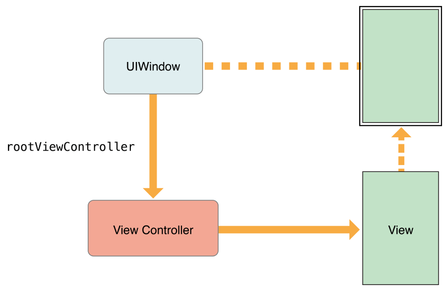
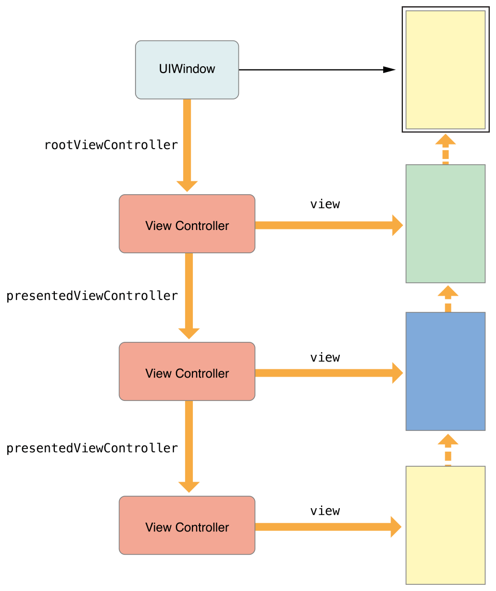

# 目录 

   * [The View Controller Hierarchy](#the-view-controller-hierarchy)
      * [The Root View Controller (根视图控制器)](#the-root-view-controller-根视图控制器)
      * [Container View Controllers (容器类视图控制器)](#container-view-controllers-容器类视图控制器)
      * [Presented View Controllers (呈现视图控制器)](#presented-view-controllers-呈现视图控制器)
   * [源文档](#源文档)

# The View Controller Hierarchy

你的应用程序的视图控制器之间的关系定义了每个视图控制器所需的行为。`UIKit`希望你以规定的方式使用视图控制器，维护正确的视图控制器关系可以确保**自动行为**在需要时被传递给正确的视图控制器。如果你打破了规定的包含和呈现关系，你的应用程序的部分内容将停止预期的行为。

> 概括，需要遵守规定的视图控制器层次结构，否则一些系统的默认处理会受影响，然后出现难预估的结果

## The Root View Controller (根视图控制器)

根视图控制器是视图控制器层次结构的`anchor`。每个窗口(`window`)都有一个根视图控制器，它的内容填充那个窗口，根视图控制器定义用户看到的初始内容，根视图控制器与窗口的关系如图2-1所示，因为窗口没有它自己的可见内容，**视图控制器的视图提供了所有的内容**。

图2-1 根视图控制器

    

根视图控制器可以从`UIWindow`对象的`rootViewController`属性访问。当你使用`storyboards`来配置你的视图控制器时，`UIKit`会在启动时自动设置该属性的值。对于以编程方式创建的`windows`，你必须自己设置根视图控制器。

## Container View Controllers (容器类视图控制器)

容器视图控制器允许你从更易于管理和可重用的部件中组装复杂的用户界面。容器视图控制器将一个或多个子视图控制器的内容与可选的自定义视图混合在一起，以创建它的最终界面，例如，`UINavigationController`对象显示了来自**子视图控制器的内容**以及**导航栏**(`navigation bar`)和可选**工具栏**(`toolbar`)，这些都是由导航控制器管理的。`UIKit`有多种容器视图控制器，包括`UINavigationController`, `UISplitViewController`和`UIPageViewController`。

容器视图控制器的视图总是填满给它的空间，**容器视图控制器通常作为根视图控制器配置给Window**(如图2-2所示)，但它们也可以以`modally`方式呈现或作为其他容器的子视图控制器。

图2-2 作为根视图控制器的容器视图控制器

    

一个容器视图控制器管理它的子对象，`UIKit`定义了你如何在自定义容器控制器中管理这些子对象的规则。有关如何创建自定义容器视图控制器的更多信息，请参阅 [Implementing a Container View Controller](https://developer.apple.com/library/archive/featuredarticles/ViewControllerPGforiPhoneOS/ImplementingaContainerViewController.html#//apple_ref/doc/uid/TP40007457-CH11-SW1)

## Presented View Controllers (呈现视图控制器)

`Presenting`一个视图控制器，表示用一个新视图控制器的内容替换当前视图控制器的内容，通常隐藏先前的视图控制器的内容。`Presentations`通常以`modally`方式显示新内容，例如，你可能`present`一个视图控制器来收集来自用户的输入，你也可以将它们作为应用程序界面的一般构建块。

当你`present`一个视图控制器时，`UIKit`在`presenting`视图控制器和`presented`视图控制器之间创建了一个关系，如图2-3所示(从`presented`视图控制器到它的`presenting`视图控制器也有一个反向关系。)。这些关系形成了视图控制器层次结构的一部分，并且是在运行时定位其他视图控制器的一种方式。

图2-3 `Presented`视图控制器

    

>`presenting`视图控制器表示当前视图控制器
>
>`presented`视图控制器表示新的被呈现的视图控制器

当涉及到容器视图控制器时，`UIKit`可能会修改**presentation 链**来简化你必须编写的代码。不同的`presentation`样式对于如何显示在屏幕上有不同的规则——例如，`full-screen presentation`表示总是覆盖整个屏幕。当你`present`一个视图控制器，`UIKit`寻找一个视图控制器，它为`presentation`提供了一个合适的上下文。在很多情况下，`UIKit`选择最邻近的容器视图控制器，但它也可能选择`window`的根视图控制器。在某些情况下，你还可以告诉`UIKit`哪个视图控制器定义了`presentation`上下文并应该处理本次`presentation`。

图2-4展示了为什么容器视图控制器通常为`presentation`提供上下文，当执行全屏显示时，新的视图控制器需要覆盖整个屏幕，容器视图控制器决定是否处理`presentation`，而不是要求子视图控制器来获取容器的`bounds`。因为在这个例子中的导航控制器覆盖了整个屏幕，它作为`presenting`视图控制器并触发`presentation`。

图2-4 容器视图控制器和`presented`视图控制器

    

有关更多`presentations`的信息，请参阅[The Presentation and Transition Process](https://developer.apple.com/library/archive/featuredarticles/ViewControllerPGforiPhoneOS/PresentingaViewController.html#//apple_ref/doc/uid/TP40007457-CH14-SW7)

# 源文档

[The View Controller Hierarchy](https://developer.apple.com/library/archive/featuredarticles/ViewControllerPGforiPhoneOS/TheViewControllerHierarchy.html#//apple_ref/doc/uid/TP40007457-CH33-SW1)

