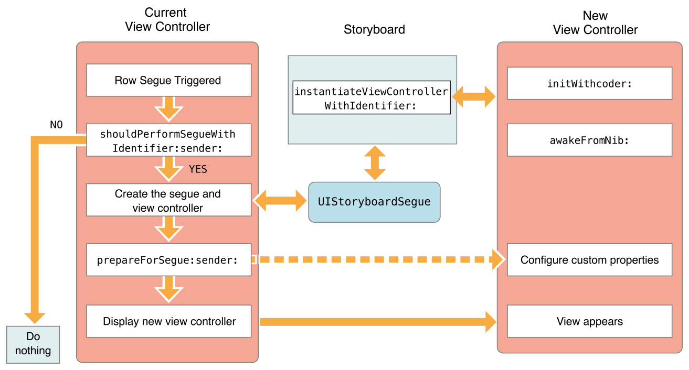

# 目录

   * [Using Segues](#using-segues)
      * [Creating a Segue Between View Controllers (建立segue)](#creating-a-segue-between-view-controllers-建立segue)
      * [Modifying a Segue’s Behavior at Runtime](#modifying-a-segues-behavior-at-runtime)
      * [Creating an Unwind Segue](#creating-an-unwind-segue)
      * [Initiating a Segue Programmatically (编程方式实现segue)](#initiating-a-segue-programmatically-编程方式实现segue)
      * [Creating a Custom Segue (自定义segue)](#creating-a-custom-segue-自定义segue)
         * [The Life Cycle of a Segue](#the-life-cycle-of-a-segue)
         * [Implementing a Custom Segue](#implementing-a-custom-segue)
   * [源文档](#源文档)

# Using Segues

可以使用`segue`来定义应用程序界面的跳转，`segue`定义了应用程序`storyboard`文件中两个视图控制器之间的转换，`segue`的源点可以是按钮、`table`行或手势识别器，终点是需要显式的视图控制器，`segue`总是`present`一个新的视图控制器，但你也可以使用`unwind segue`来移除一个视图控制器。

图9-1 两个视图控制器间的`segue`

<div align="center">    

</div>

你不需要通过编程方式触发`segue`，在运行时，`UIKit`加载与视图控制器相关的`segue`，并将它们连接到相应的元素上，当用户与元素交互时，`UIKit`加载对应的视图控制器，通知你的应用程序`segue`即将触发，并执行转换，你可以使用`UIKit`发送的通知来传递数据到新的视图控制器。

## Creating a Segue Between View Controllers (建立segue)

为了在同一个`storyboard`文件中的视图控制器之间创建一个`segue`，在第一个视图控制器中按住`control`并点击一个适当的元素，拖动到目标视图控制器，`segue`的起点必须是一个带有定义动作的视图或对象，比如控件、`bar button item`或手势识别器，你也可以从那些带有`cell`的视图(`tableview`、`collectionview`)中创建`segue`。图9-2展示一个`segue`的创建，当`table`的一行被点击时，展示一个新的视图控制器。

图9-2 建立`segue`

<div align="center">    

</div>

>一些元素支持多个`segues`，比如，一个table行可以让你配置多个`segue`，分别在不同的控件上配置，例如accessory button等

当你释放按住的手势时，`Interface Builder`会提示你选择你想要在两个视图控制器之间创建的关系类型，如图9-3所示，选择你想要的对应的`segue`。

图9-3 选择`segue`类型

<div align="center">    

</div>

为`segue`选择关系类型时，尽可能选择`adaptive`类的`segue`，它会根据当前环境自动调整它们的行为，例如，`show segue`的行为会根据`presenting`视图控制器而改变，`Non-Adaptive`的`segue`是为那些必须在iOS7上运行的应用提供的，因为iOS7不支持`adaptive`类`segue`。表9-1列出了`adaptive`类`segue`，以及它们在应用中的行为。

表9-1 `adaptive` `segue`类型

| Segue 类型            | 行为                                                         |
| --------------------- | ------------------------------------------------------------ |
| Show (Push)           | 这个`segue`使用目标视图控制器的` showViewController:sender: `方法来显示新内容，对于大多数视图控制器，这个`segue`以`modal`方式在源视图控制器上展示新内容，一些视图控制器专门重写这个方法并使用它来实现不同的行为，例如，导航控制器将新的视图控制器`push`到它的导航堆栈上，`UIKit`使用`targetViewControllerForAction:sender:`方法来定位源视图控制器。 |
| Show Detail (Replace) | 这个`segue`使用目标视图控制器的`showDetailViewController:sender: `方法来显示新内容，这个`segue`只与嵌入在`UISplitViewController`对象中的视图控制器相关，在这个`segue`中，分屏视图控制器用新的内容替换它的第二个子视图控制器(`detail`控制器)，大多数其他视图控制器以`modal`方式展示新内容，`UIKit`使用`targetViewControllerForAction:sender:`方法来定位源视图控制器。 |
| Present Modally       | 这个`segue`使用指定的`presentation`和`transition`样式`modally`显示视图控制器。定义`appropriate presentation context`的视图控制器处理最终的`presentation`。 |
| Present as Popover    | 在水平`regular`的环境中，视图控制器出现在弹出窗口中，在水平`compact`的环境中，视图控制器使用全屏模式显示。 |

创建`segue`之后，选择`segue`对象，并使用`Attributes inspector`为它分配一个标识符，在一个`segue`中，你可以使用标识符来确定哪个`segue`被触发了，这在你的视图控制器支持多个`segue`时特别有用，这个标识符包含在`UIStoryboardSegue`对象中，当`segue`执行时，它被传递给你的视图控制器。

## Modifying a Segue’s Behavior at Runtime

图9-4展示了当一个`segue`被触发时会发生什么，大多数工作发生在`presenting`视图控制器中，它管理如何转换到新的视图控制器。新视图控制器的配置没什么好说的，直接按需创建。因为`segue`是从`storyboard`配置的，`segue`中涉及的两个视图控制器必须在同一个`storyboard`中。

图9-4 使用`segue`展示视图控制器

<div align="center">    

</div>

在`segue`进行期间，`UIKit`调用当前视图控制器的方法给你机会去影响`segue`的结果:

* `shouldPerformSegueWithIdentifier:sender:`方法给了你一个阻止`segue`发生的机会，从这个方法返回**NO**会取消该`segue`，但不会阻止其他动作的发生，例如，在`table`行中点击仍然会触发`table`调用相关的`delegate`方法
* 源视图控制器的`prepareForSegue:sender:`方法允许你将数据从源视图控制器传递到目标视图控制器，传递给这个方法的`UIStoryboardSegue`对象包含了一个指向目标视图控制器的引用以及其他与`segue`相关的信息


## Creating an Unwind Segue

`Unwind segue`让你移除`presented`视图控制器，在`Interface Builder`中，你可以通过链接按钮或其他合适的对象到当前视图控制器的`Exit`对象来创建`unwind segue`，当用户点击按钮或与适当的对象交互时，`UIKit`会在视图控制器层次结构中搜索能够处理`unwind segue`的对象，它会移除当前视图控制器以及任何中间视图控制器。

> It then dismisses the current view controller and any intermediate view controllers to reveal the target of the unwind segue.

创建一个`unwind segue`，可以根据以下步骤：

1. 选择在`unwind segue`结束时应该出现在屏幕上的视图控制器

2. 在你选择的视图控制器上定义一个`unwind`动作方法

   `Swift`语法

   - `@IBAction func myUnwindAction(unwindSegue: UIStoryboardSegue) `

   `Objective-C`语法:

   - `- (IBAction)myUnwindAction:(UIStoryboardSegue*)unwindSegue`

3. 导航到开始`unwind`动作的视图控制器

4. `Control-click`(按住`control`键点选)应该发起`unwind segue`的按钮(或其他对象)，通常在需要移除的视图控制器中

5. 拖动到视图控制器场景顶部的`Exit`对象

   <div align="center">    
   
   </div>

6. 从`relationship`面板中选择`unwind`操作方法

在`Interface Builder`中创建相应的`unwind segue`之前，你必须在一个视图控制器中定义一个`unwind` `action`方法，这个方法是必需的，它告诉`Interface Builder` ` unwind segue`有一个有效的目标。

使用你的`unwind` `action`方法来执行任何你需要的任务，你自己不需要移除`segue`中涉及的任何视图控制器；`UIKit`会帮你做，相反，使用`segue`对象来获取被移除的视图控制器这样你就可以从其中获取你需要的数据，你还可以用该方法在`unwind segue` 结束之前更新当前视图控制器。

## Initiating a Segue Programmatically (编程方式实现segue)

`segue`通常是由你在`storyboard`文件中创建的连接触发的，然而，有时你可能无法在`storyboard`中创建`segue`，这可能是因为目标视图控制器还不知道，例如，游戏应用可能会根据游戏结果切换到不同的屏幕，在这些情况下，你可以使用当前视图控制器的`performSegueWithIdentifier:sender:`方法从你的代码中以编程方式触发`segue`。

清单9-1演示了一个`segue`，它在从纵向旋转到横向时`present`特定的视图控制器，因为`notification`对象在这里没有提供执行`segue`命令的有用信息，视图控制器指定自己为`segue`的发送者。

清单9-1 以编程方式触发`segue`

```objc
- (void)orientationChanged:(NSNotification *)notification {
    UIDeviceOrientation deviceOrientation = [UIDevice currentDevice].orientation;
    if (UIDeviceOrientationIsLandscape(deviceOrientation) &&
             !isShowingLandscapeView) {
        [self performSegueWithIdentifier:@"DisplayAlternateView" sender:self];
        isShowingLandscapeView = YES;
    }
// Remainder of example omitted.
}
```

## Creating a Custom Segue (自定义segue)

`Interface Builder`为从一个视图控制器过渡到另一个视图控制器的所有标准方式提供了`segue`——从`presenting`视图控制器到在弹出窗口中展示视图控制器。

### The Life Cycle of a Segue

要理解自定义`segue`是如何工作的，你需要理解`segue`对象的生命周期，`Segue`对象是`UIStoryboardSegue`类的实例或它的子类之一，你的应用程序不应该直接创建`segue`对象；`UIKit`在`segue`被触发时创建它们，流程如下：

1. 创建和实例化需要展示的新视图控制器
2. `segue`对象被创建，并调用它的`initWithIdentifier:source:destionation`方法，标识符是你在**IB**中提供的唯一字符串，另外两个参数是视图控制器对象
3. `presenting`视图控制器的`prepareForSegue:sender:`方法被调用，参阅 [Modifying a Segue’s Behavior at Runtime](https://developer.apple.com/library/archive/featuredarticles/ViewControllerPGforiPhoneOS/UsingSegues.html#//apple_ref/doc/uid/TP40007457-CH15-SW11)
4. `segue`对象的`perform`方法会被调用，该方法执行转换，让新的视图控制器展示到屏幕上
5. 对`segue`对象的引用被释放

### Implementing a Custom Segue

要实现自定义的`segue`，子类化`UIStoryboardSegue`并实现以下方法：

* 重写`initWithIdentifier:source:destination:`方法，并使用它来初始化你的自定义`segue`对象，**必须先调用父类的实现**
* 实现`perform`方法并配置你的转换(过渡)动画

> 如果你的实现添加了属性来配置segue，你就不能在Interface Builder中配置这些属性。相反，可以在触发segue的源视图控制器的prepareForSegue:sender:方法中配置自定义segue的附加属性。

清单9-2显示了一个非常简单的自定义`segue`，这个例子只是简单地`present`了目标视图控制器，没有任何类型的动画，但是你可以根据需要扩展你自己的动画。

清单9-2 一个自定义`segue`

```objective-c
- (void)perform {
    // Add your own animation code here.
 
    [[self sourceViewController] presentViewController:[self destinationViewController] animated:NO completion:nil];
}
```

# 源文档

[Using Segues](https://developer.apple.com/library/archive/featuredarticles/ViewControllerPGforiPhoneOS/UsingSegues.html#//apple_ref/doc/uid/TP40007457-CH15-SW1)


