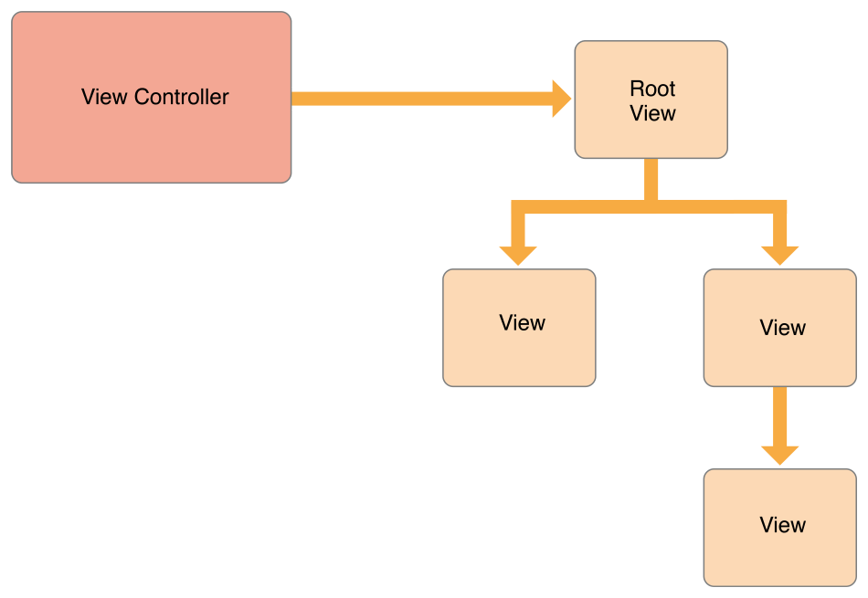

# 目录

   * [The Role of View Controllers](#the-role-of-view-controllers)
      * [View Management (管理视图)](#view-management-管理视图)
      * [Data Marshaling (数据调度)](#data-marshaling-数据调度)
      * [User Interactions (用户交互)](#user-interactions-用户交互)
      * [Resource Management (资源管理)](#resource-management-资源管理)
      * [Adaptivity (自适应性)](#adaptivity-自适应性)
   * [源文档](#源文档)

# The Role of View Controllers

`View controllers`(以下称视图控制器)是应用程序内部结构的基础，每个应用程序至少有一个视图控制器，大多数应用程序有多个。每个视图控制器管理应用程序的用户界面，以及该界面和底层数据之间的交互。视图控制器还具备了用户界面不同部分之间的转换。

它们在你的应用中扮演重要的角色，视图控制器几乎是你做任何事情的核心。`UIViewController`类定义方法和属性来管理你的视图，处理事件，从一个视图控制器转换到另一个，并与应用程序的其他部分协调。你子类化`UIViewController`(或它的子类之一)，并添加自定义代码实现你的应用程序的行为。

主要有两种类型的`view controllers`：

* **内容视图控制器**(*`Content view controllers`* )管理你的应用程序的内容的一个离散的片段，它是你创建的视图控制器的主要类型
* **容器视图控制器**(`Container view controllers`)从其他视图控制器(称为子视图控制器)收集信息，并以方便导航或以不同的方式显示那些视图控制器的内容来呈现它。

大多数App混合使用这两种类型

## View Management (管理视图)

视图控制器最重要的角色是管理视图的层次结构，每个视图控制器都有一个单独的根视图，它包含了视图控制器的所有内容，在根视图中，添加显示内容所需的视图。图1-1说明了视图控制器和它的视图之间的内置关系。**视图控制器总是有一个对它的根视图的引用，而每个视图都有对它的子视图的强引用**。

图1-1 视图控制器和它的视图之间关系

    

> 使用outlet访问视图控制器的视图层次结构中的其他视图是一种常见的做法。因为视图控制器管理它所有视图的内容，所以outlet允许你存储对你需要的视图的引用。当从`storyboard`加载视图时，outlet本身会自动连接到实际的视图对象。

内容视图控制器自己管理它所有的视图，一个容器视图控制器管理它自己的视图以及来自它的一个或多个子视图控制器的根视图。容器不管理其子容器的内容，它只管理根视图，根据容器的设计调整大小并放置它。图1-2说明了分屏视图控制器(`split view controller`)及其子控制器之间的关系，分屏视图控制器管理它的子视图的总体大小和位置，但子视图控制器管理那些视图的实际内容。

图1-2 视图控制器可以管理来自其他视图控制器的内容

    

有关管理视图控制器的视图的信息，请参阅[Managing View Layout](https://developer.apple.com/library/archive/featuredarticles/ViewControllerPGforiPhoneOS/DefiningYourSubclass.html#//apple_ref/doc/uid/TP40007457-CH7-SW6)

## Data Marshaling (数据调度)

视图控制器充当它管理的**视图和应用程序数据之间的中介**。`UIViewController`类的方法和属性让你管理应用程序的视觉呈现。当你子类化`UIViewController`时，你添加任何你需要在子类中管理数据的变量。添加自定义变量会创建一个如图1-3所示的关系，其中**视图控制器引用了你的数据和用来显示数据的视图**。你需要在两者之间传递(调度)数据。

图1-3 视图控制器是数据对象和视图之间的中介

    

你应该始终在你的视图控制器和数据对象之间保持清晰的职责分离。大多数用于确保数据结构完整性的逻辑属于数据对象本身。视图控制器可能验证来自视图的输入，然后以你的数据对象需要的格式打包那个输入，但你应该最小化视图控制器在管理实际数据中的角色。

`UIDocument`对象可以管理你的数据，并从你的视图控制器独立开来。文档对象是知道如何向持久存储读写数据的控制器对象。当你子类化时，你添加任何你需要的逻辑和方法来提取数据并将它传递给视图控制器或应用程序的其他部分。视图控制器可能会存储它接收到的任何数据的副本，以使它更容易更新视图，但文档仍然拥有真正的数据。

## User Interactions (用户交互)

视图控制器是`responder`对象，能够处理响应器链下的事件，尽管视图控制器能够这样做，但它们很少直接处理触摸事件，相反，视图通常处理它们自己的触摸事件，并将结果报告给关联的`delegate`或`target`对象的方法，这通常是视图控制器。视图控制器中的大多数事件都是使用`delegate`方法或`action`方法处理的。

有关在视图控制器中实现`action`方法的更多信息，请参阅 [Handling User Interactions](https://developer.apple.com/library/archive/featuredarticles/ViewControllerPGforiPhoneOS/DefiningYourSubclass.html#//apple_ref/doc/uid/TP40007457-CH7-SW11)

## Resource Management (资源管理)

视图控制器为它创建的视图和任何对象承担所有责任，`UIViewController`类自动处理视图管理的大部分内容，例如，`UIKit`会自动释放任何不再需要的视图相关资源，在你的`UIViewController`子类中，你负责管理你显式创建的任何对象。

当可用的空闲内存不足时，`UIKit`要求应用程序释放它们不再需要的任何资源，一种方法是调用你的视图控制器的`didreceivemorywarning`方法，使用该方法可以删除对你不再需要或稍后可以轻松重新创建的对象的引用，例如，你可以使用该方法删除缓存的数据，当出现内存不足的情况时，尽可能多地释放内存是很重要的，占用过多内存的应用程序可能会被系统直接终止以恢复内存。

## Adaptivity (自适应性)

视图控制器负责其视图的表示，并调整呈现的内容以匹配不同的环境，每个iOS应用程序都应该能够在iPad和不同尺寸的iPhone上运行，与其为每个设备提供不同的视图控制器和视图层次结构，不如使用单一的视图控制器来适应不断变化的空间需求更简单。

在iOS中，视图控制器需要处理粗粒度的变化和细粒度的变化，当视图控制器的特征发生变化时，粗粒度的变化就会发生，特征是描述整体环境的属性，比如显示比例，两个最重要的特征是视图控制器的水平和垂直`size class`，它们表示在给定的维度中视图控制器有多少空间。你可以使用`size class`变化来更改你布局视图的方式，如图1-4所示，当水平`size class`是`regular`时，视图控制器利用额外的水平空间来排列它的内容，当水平`size class`是`compact`的，视图控制器会垂直地排列它的内容。

图1-4 调整视图以适应`size class`变化

    

在给定的`size class`中，随时都可能发生更细粒度的大小更改，当用户将iPhone从纵向旋转到横向时，`size class`可能不会改变，但屏幕尺寸通常会改变，当你使用自动布局时，UIKit会自动调整视图的大小和位置以匹配新的尺寸，视图控制器可以根据需要做额外的调整。

更多关于自适应的信息，请参阅[The Adaptive Model](https://developer.apple.com/library/archive/featuredarticles/ViewControllerPGforiPhoneOS/TheAdaptiveModel.html#//apple_ref/doc/uid/TP40007457-CH19-SW1)

# 源文档

[The Role of View Controllers](https://developer.apple.com/library/archive/featuredarticles/ViewControllerPGforiPhoneOS/index.html#//apple_ref/doc/uid/TP40007457-CH2-SW1)

