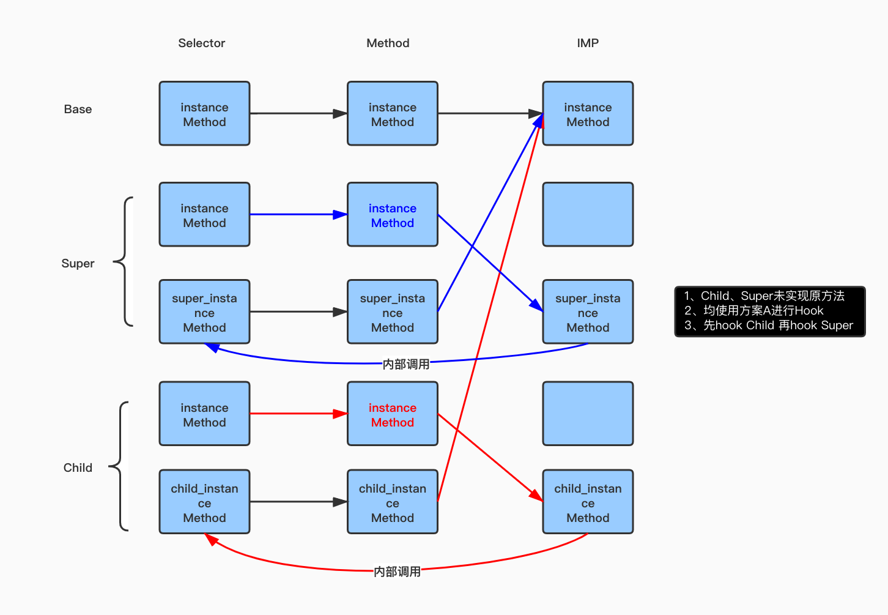

# 两种方案对比
方案A :

```objc
+ (void)a_swizzleTargetCls:(Class)targetClass withClass:(Class)cls withOriginalSEL:(SEL)oriSEL withSwizzleSEL:(SEL)swizzleSEL {
    Method originalMethod = class_getInstanceMethod(targetClass, oriSEL);
    Method swizzledMethod = class_getInstanceMethod(cls, swizzleSEL);
    BOOL didAddMethod =
    class_addMethod(targetClass,
                    oriSEL,
                    method_getImplementation(swizzledMethod),
                    method_getTypeEncoding(swizzledMethod));

    if (didAddMethod) {
        class_replaceMethod(cls,
                            swizzleSEL,
                                           method_getImplementation(originalMethod),
                                           method_getTypeEncoding(originalMethod));
    } else {
        method_exchangeImplementations(originalMethod, swizzledMethod);
    }
}
```

方案B :

```objc
+ (void)b_swizzleTargetCls:(Class)targetClass withClass:(Class)cls withOriginalSEL:(SEL)oriSEL withSwizzleSEL:(SEL)swizzleSEL {
    Method originalMethod = class_getInstanceMethod(targetClass, oriSEL);
    Method swizzledMethod = class_getInstanceMethod(cls, swizzleSEL);
    method_exchangeImplementations(originalMethod, swizzledMethod);
}
```

# 研究前提

* 有3个类，分别为Child、Super、Base,继承关系为Child->Super->Base
* Base默认实现实例方法`instanceMethod`,子类根据情况可选实现该实例方法
* 实现的方法内容为，打印当前调用方法和调用父类的方法，即**[super ...]**
* 根据Hook Child和Super不同顺序、方法是否实现、使用方案A/B三个维度组合测试

# 先Hook Child 再Hook Super

## Child、Super均未实现方法

以下为原始结构图:


### Child用方案A_Super用方案A



**红色为Child类经过方案A Hook之后的指向图，蓝色为Super类经过方案A Hook之后的指向图，后同。**

# 先Hook Super 再Hook Child