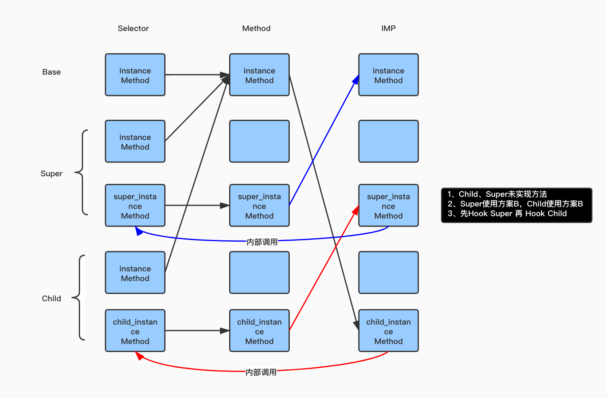

# 两种方案对比
方案A :

```objc
+ (void)a_swizzleTargetCls:(Class)targetClass withClass:(Class)cls withOriginalSEL:(SEL)oriSEL withSwizzleSEL:(SEL)swizzleSEL {
    Method originalMethod = class_getInstanceMethod(targetClass, oriSEL);
    Method swizzledMethod = class_getInstanceMethod(cls, swizzleSEL);
    BOOL didAddMethod =
    class_addMethod(targetClass,
                    oriSEL,
                    method_getImplementation(swizzledMethod),
                    method_getTypeEncoding(swizzledMethod));

    if (didAddMethod) {
        class_replaceMethod(cls,
                            swizzleSEL,
                                           method_getImplementation(originalMethod),
                                           method_getTypeEncoding(originalMethod));
    } else {
        method_exchangeImplementations(originalMethod, swizzledMethod);
    }
}
```

方案B :

```objc
+ (void)b_swizzleTargetCls:(Class)targetClass withClass:(Class)cls withOriginalSEL:(SEL)oriSEL withSwizzleSEL:(SEL)swizzleSEL {
    Method originalMethod = class_getInstanceMethod(targetClass, oriSEL);
    Method swizzledMethod = class_getInstanceMethod(cls, swizzleSEL);
    method_exchangeImplementations(originalMethod, swizzledMethod);
}
```

# 研究前提

* 有3个类，分别为Child、Super、Base,继承关系为Child->Super->Base
* Base默认实现实例方法`instanceMethod`,子类根据情况可选实现该实例方法
* 实现的方法内容为，打印当前调用方法和调用父类的方法，即`[super ...]`
* 根据Hook Child和Super不同顺序、方法是否实现、使用方案A/B三个维度组合测试

# 先Hook Child 再Hook Super

## Child、Super均未实现方法

以下为原始结构图:


### Child用方案A_Super用方案A


**红色为Child类经过方案A Hook之后的指向图，蓝色为Super类经过方案A Hook之后的指向图，后同。**

调试执行顺序

```
=====Child实例调用方法=====
-[Child child_instanceMethod]
-[Base instanceMethod]
=====Super实例调用方法=====
-[Super super_instanceMethod]
-[Base instanceMethod]
=====Base实例调用方法=====
-[Base instanceMethod]
```

可以看到顺序与指向图一致

### Child用方案A_Super用方案B


```
=====Child实例调用方法=====
-[Child child_instanceMethod]
-[Base instanceMethod]
=====Super实例调用方法=====
-[Super super_instanceMethod]
-[Base instanceMethod]
=====Base实例调用方法=====
-[Super super_instanceMethod]
2021-02-15 16:05:26.994133+0800 MethodSwizzling[11456:925811] -[Base super_instanceMethod]: unrecognized selector sent to instance 0x6000003805c0
```

1. Child、Super实例执行方法路径正常
1. 当Base实例调用方法，因为Method的IMP指向了super_instanceMethod，所以出现
`unrecognized selector`错误

这种错误出现的场景:

1. 要Hook的当前类没有实现目标方法，而父类实现了
2. 在当前类的类别中直接使用`method_exchangeImplementations `操作
3. 在替换方法内部进行了自调用

当方法执行到替换方法内部自调用，就会出现**父类调用子类的SEL，从而出现错误**

### Child用方案B_Super用方案A


```
=====Child实例调用方法=====
-[Super super_instanceMethod]
-[Child child_instanceMethod]
-[Base instanceMethod]
=====Super实例调用方法=====
-[Super super_instanceMethod]
-[Child child_instanceMethod]
2021-02-15 16:19:31.611100+0800 MethodSwizzling[11787:935586] -[Super child_instanceMethod]: unrecognized selector sent to instance 0x6000021f8380
```

### Child用方案B_Super用方案B


```
=====Child实例调用方法=====
-[Super super_instanceMethod]
-[Child child_instanceMethod]
-[Base instanceMethod]
=====Super实例调用方法=====
-[Super super_instanceMethod]
-[Child child_instanceMethod]
2021-02-15 16:21:13.590470+0800 MethodSwizzling[11811:937081] -[Super child_instanceMethod]: unrecognized selector sent to instance 0x600002498440
```

## Child实现方法，Super未实现方法


因为Child实现了方法，方案A和方案B作用于Child类，效果是一致的，因为只需对Super操作，后续哪个类实现方法，与这个相同处理。


### Super用方案A


```
=====Child实例调用方法=====
-[Child instanceMethod]
-[Super super_instanceMethod]
-[Base instanceMethod]
=====Super实例调用方法=====
-[Super super_instanceMethod]
-[Base instanceMethod]
=====Base实例调用方法=====
-[Base instanceMethod]
```

### Super用方案B


```
=====Child实例调用方法=====
-[Child instanceMethod]
-[Super super_instanceMethod]
-[Base instanceMethod]
=====Super实例调用方法=====
-[Super super_instanceMethod]
-[Base instanceMethod]
=====Base实例调用方法=====
-[Super super_instanceMethod]
2021-02-15 16:29:17.997290+0800 MethodSwizzling[11881:944639] -[Base super_instanceMethod]: unrecognized selector sent to instance 0x6000034f48c0
```

## Child未实现方法、Super实现方法


### Child用方案A


```
=====Child实例调用方法=====
-[Child child_instanceMethod]
-[Super instanceMethod]
-[Base instanceMethod]
=====Super实例调用方法=====
-[Super instanceMethod]
-[Base instanceMethod]
=====Base实例调用方法=====
-[Base instanceMethod]
```

### Child用方案B


```
=====Child实例调用方法=====
-[Child child_instanceMethod]
-[Super instanceMethod]
-[Base instanceMethod]
=====Super实例调用方法=====
-[Child child_instanceMethod]
2021-02-15 16:33:53.477300+0800 MethodSwizzling[11929:949184] -[Super child_instanceMethod]: unrecognized selector sent to instance 0x600001df8340
```

## Child、Super均实现方法

这个情况就是简单的交换了自己本类的方法


# 先Hook Super 再Hook Child

## Child、Super均未实现方法


### Child用方案A_Super用方案A


```
=====Child实例调用方法=====
-[Child child_instanceMethod]
-[Super super_instanceMethod]
-[Base instanceMethod]
=====Super实例调用方法=====
-[Super super_instanceMethod]
-[Base instanceMethod]
=====Base实例调用方法=====
-[Base instanceMethod]
```

### Child用方案A_Super用方案B


```
=====Child实例调用方法=====
-[Child child_instanceMethod]
-[Super super_instanceMethod]
-[Base instanceMethod]
=====Super实例调用方法=====
-[Super super_instanceMethod]
-[Base instanceMethod]
=====Base实例调用方法=====
-[Super super_instanceMethod]
2021-02-15 16:45:55.205639+0800 MethodSwizzling[12188:959547] -[Base super_instanceMethod]: unrecognized selector sent to instance 0x6000025204d0
```

### Child用方案B_Super用方案A


```
=====Child实例调用方法=====
-[Child child_instanceMethod]
-[Super super_instanceMethod]
-[Base instanceMethod]
=====Super实例调用方法=====
-[Child child_instanceMethod]
2021-02-15 16:47:16.002628+0800 MethodSwizzling[12203:961156] -[Super child_instanceMethod]: unrecognized selector sent to instance 0x600002b18310
```

### Child用方案B_Super用方案B




```
=====Child实例调用方法=====
-[Child child_instanceMethod]
-[Super super_instanceMethod]
-[Base instanceMethod]
=====Super实例调用方法=====
-[Child child_instanceMethod]
2021-02-15 16:48:58.560954+0800 MethodSwizzling[12224:962935] -[Super child_instanceMethod]: unrecognized selector sent to instance 0x600003704110
```

## Child实现方法，Super未实现方法


### Super用方案A


```
=====Child实例调用方法=====
-[Child instanceMethod]
-[Super super_instanceMethod]
-[Base instanceMethod]
=====Super实例调用方法=====
-[Super super_instanceMethod]
-[Base instanceMethod]
=====Base实例调用方法=====
-[Base instanceMethod]
```

### Super用方案B


```
=====Child实例调用方法=====
-[Child instanceMethod]
-[Super super_instanceMethod]
-[Base instanceMethod]
=====Super实例调用方法=====
-[Super super_instanceMethod]
-[Base instanceMethod]
=====Base实例调用方法=====
-[Super super_instanceMethod]
2021-02-15 16:52:30.561850+0800 MethodSwizzling[12273:967017] -[Base super_instanceMethod]: unrecognized selector sent to instance 0x600000730790
```

## Child未实现方法、Super实现方法


### Child用方案A


```
=====Child实例调用方法=====
-[Child child_instanceMethod]
-[Super instanceMethod]
-[Base instanceMethod]
=====Super实例调用方法=====
-[Super instanceMethod]
-[Base instanceMethod]
=====Base实例调用方法=====
-[Base instanceMethod]
```

### Child用方案B


```
=====Child实例调用方法=====
-[Child child_instanceMethod]
-[Super instanceMethod]
-[Base instanceMethod]
=====Super实例调用方法=====
-[Child child_instanceMethod]
2021-02-15 16:58:00.866237+0800 MethodSwizzling[12315:971512] -[Super child_instanceMethod]: unrecognized selector sent to instance 0x6000022fc240
```

## Child、Super均实现方法


# 总结

1. 方案A明显优于方案B
2. 从调用顺序（执行路径来看），先Hook Super再Hook Child更安全，再某些情况下先Hook Child再Hook Super，Super的方法会被忽略
3. MethodSwizzling需要注意的是检查Hook后类的Method结构体SEL、IMP指向，是否指向了一个实例能够响应的SEL

# REF

[Objective-C Method Swizzling](http://yulingtianxia.com/blog/2017/04/17/Objective-C-Method-Swizzling/#%E7%A0%94%E7%A9%B6%E8%83%8C%E6%99%AF)
