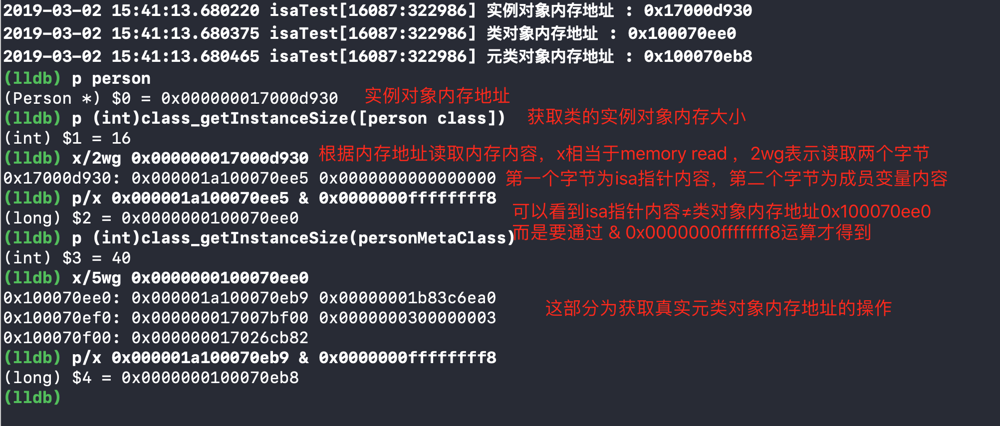
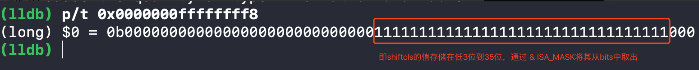
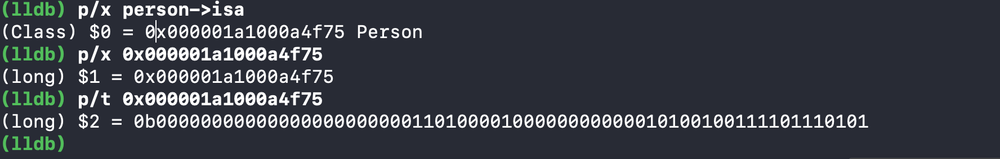
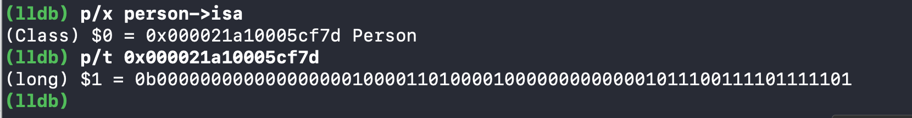
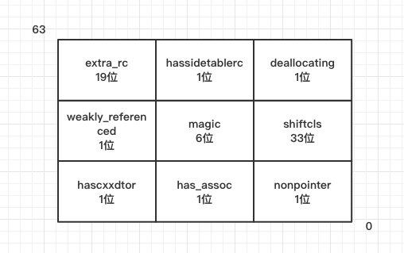

# 一、isa指针优化
OC对象都含有一个`isa`指针，在`arm64`架构之前，`isa`仅仅是一个指针，保存类对象或元类对象的内存地址，而在`arm64`架构之后，苹果对`isa`指针进行了优化，`isa`指针的类型采用联合（共用体`union`）,同时使用位域来存储更多信息，看懂优化后的isa指针，需要先了解前置知识[位域、联合、结构体](https://github.com/kinkenyuen/Learning-Notes/blob/main/C%26C%2B%2B/%E4%BD%8D%E5%9F%9F.md)

# 二、isa & ISA_MASK

我们知道OC对象的`isa`指针并没有直接指向类对象或元类对象，而是需要通过位运算(这里为按位与，&ISA_MASK)得到真实的类对象或元类对象内存地址。

下面通过一个实例验证,注意运行环境为真机，架构为`arm64`

```objc
@interface Person : NSObject
@property (nonatomic, copy) NSString *name;

@end

- (void)touchesBegan:(NSSet<UITouch *> *)touches withEvent:(UIEvent *)event {
    Person *person = [[Person alloc] init];
    NSLog(@"实例对象内存地址 : %p",person);
    
    Class personClass = [person class];
    NSLog(@"类对象内存地址 : %p",personClass);
    
    Class personMetaClass = object_getClass(personClass);
    NSLog(@"元类对象内存地址 : %p",personMetaClass);
}
```

通过LLDB断点调试,得到以下验证分析结果



从动态调试结果可以看出，对象或类对象的`isa`指针保存的不是真实类对象或元类对象地址，而要通过`& 0x0000000ffffffff8`位运算来获取。

# 三、isa数据结构分析
**以下分析均针对`arm64`**
#### 3.1、数据结构
从runtime的源码objc4-723入手，找到`struct objc_object`中的`isa`定义，如下

```c++
struct objc_object {
private:
    isa_t isa;

public:

    // ISA() assumes this is NOT a tagged pointer object
    Class ISA();

    // getIsa() allows this to be a tagged pointer object
    Class getIsa();

    //一些省略的方法
    

private:
    
	//一些省略的方法
	
	
};
```

接着查看`isa_t`类型定义,以下为省略部分，只列出了`arm64`架构

```c++
union isa_t 
{
    isa_t() { }
    isa_t(uintptr_t value) : bits(value) { }

    Class cls;
    uintptr_t bits;

# if __arm64__

#   define ISA_MASK        0x0000000ffffffff8ULL

#   define ISA_MAGIC_MASK  0x000003f000000001ULL

#   define ISA_MAGIC_VALUE 0x000001a000000001ULL

    struct {
        uintptr_t nonpointer        : 1;
        uintptr_t has_assoc         : 1;
        uintptr_t has_cxx_dtor      : 1;
        uintptr_t shiftcls          : 33; // MACH_VM_MAX_ADDRESS 0x1000000000
        
        uintptr_t magic             : 6;
        uintptr_t weakly_referenced : 1;
        uintptr_t deallocating      : 1;
        uintptr_t has_sidetable_rc  : 1;
        uintptr_t extra_rc          : 19;
#       define RC_ONE   (1ULL<<45)

#       define RC_HALF  (1ULL<<18)

    };
# endif

};
```
`isa_t`是`union`类型，`cls`是没有启用`Tagged Pointer`时使用，目前64位系统都是使用`bits`,`bits`的长度为8字节（64位）。可以看到`union`里有一个结构体，**结构体内部定义了多个无符号类型的变量，变量后面紧跟的数字表示占用多少个二进制位**，也就是采用了**位域**技术

结构体中的各字段的含义如下表

|字段|占位|含义|
|---|---|---|
|nonpointer|1|值为0表示普通isa指针，存储类对象或元类对象真实内存地址，值为1表示使用位域优化、可以存储更多信息|
|has_assoc|1|是否有设置关联对象，如果没，对象释放时会更快|
|has_cxx_dtor|1|是否有C++析构函数，如果没，对象释放时会更快|
|shiftcls|33|存储着类对象、元类对象的内存地址|
|magic|6|用于在调试时分辨对象是否未完成初始化|
|weakly_referenced|1|对象被指向或者曾经指向一个ARC的弱变量,没有弱引用的对象可以更快释放|
|deallocating|1|对象是否正在释放|
|has_sidetable_rc|1|判断该对象的引用计数是否过大，如果过大则需要其他散列表来进行存储|
|extra_rc|19|存放该对象的引用计数值减一后的结果|

注意到`shiftcls`存储着类对象、元类对象的内存地址,且占用33位，我们将`ISA_MASK`的值转化为二进制得到



不难发现，`ISA_MASK`的后三位为0，那么做了按位与操作后，得到的每一个类对象、元类对象内存地址结尾只能为0或8（16进制）

#### 3.2、bits分析

从上图的`shiftcls`分析中，我们已经知道它在bits中的位置，那么对于其他字段的信息，我们以下简单分析几个字段

**1. extra_rc**

通过对比引用计数为1和2的情况得出，如下

```objc
- (void)touchesBegan:(NSSet<UITouch *> *)touches withEvent:(UIEvent *)event {
    Person *person = [[Person alloc] init];
    NSLog(@"实例对象内存地址 : %p",person);
}
```



```objc
- (void)touchesBegan:(NSSet<UITouch *> *)touches withEvent:(UIEvent *)event {
    Person *person = [[Person alloc] init];
    NSLog(@"实例对象内存地址 : %p",person);
    self.person = person;	//增加控制器对person对象的引用
}
```



对比两次`bits`的值，查找19位长度可知，高19位为`extra_rc`的位置

**2. magic**

该字段的值可以通过掩码`ISA_MAGIC_VALUE(0x000001a000000001)`获取,对应二进制的低37位到42位，此时的值为`011010`，表示对象已经完成初始化

剩余的几个字段由于是一位，就不一一分析，对`bits`的位置信息图总结如下




