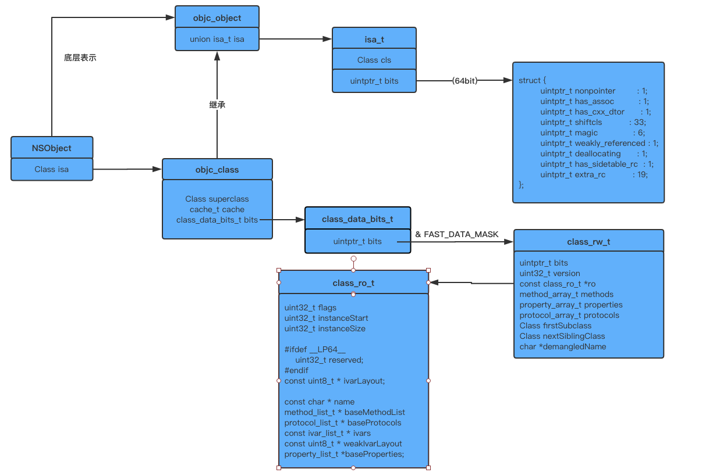

# 一、什么是runtime
提到Objective-C底层，大多数人都会说`runtime`

OC是一门动态语言，与C、C++这种静态语言不同，静态语言的各种数据结构在编译期就已经确定，不能够修改。而OC却可以在程序运行期间，动态修改一个类的结构，如修改方法实现，添加关联对象等

要想赋予Objective-C动态特性，单靠编译器难以做到，因此需要一个运行时系统,也就是`runtime`，`runtime`则是由C、C++、汇编实现一套为Objective-C提供动态功能的框架（库），它是Objective-C的一大核心。

分析`runtime`可以从以下三方面入手：

**1.Objective-C runtime源码** : 我们日常使用的OC语言、OC类、对象、属性、方法、方法调用、消息机制等，这一切都是由`runtime`实现，对应着底层的C、C++、汇编实现

**2.NSObject** : Cocoa Class大部分均继承于`NSObject`，因此大多数类都继承了它提供的方法，在其中有部分方法是运行时动态执行的，执行的背后其实是`runtime`系统的动态处理机制。如`isKindOfClass`和`isMemberOfClass`检查类是否属于指定的Class的继承体系中；`responderToSelector`检查对象是否能响应指定的消息；`conformsToProtocol`检查对象是否遵循某个协议；`methodForSelector`返回指定方法实现的地址;还有令人闻风丧胆的`resolveClassMethod`、`resolveInstanceMethod`、`forwardingTargetForSelector`、`forwardInvocation`、`methodForSelector`等等

**3.runtime提供的API** : runtime是一个由一系列数据结构、函数组成的具有公共接口的动态共享库，头文件位于`/usr/include/objc`目录下。许多函数允许你用纯C代码来重复实现 Objc 中同样的功能。虽然有一些方法构成了NSObject类的基础，但是你在写 Objc 代码时一般不会直接用到这些函数的，除非是写一些 Objc 与其他语言的桥接或是底层的debug工作。相关接口的描述在[Objective-C Runtime](https://developer.apple.com/documentation/objectivec/objective-c_runtime?preferredLanguage=occ)给出

# 二、NSObject、Class

从基类`NSObject`入手，查看其定义

```objc
@interface NSObject <NSObject> {
    Class isa  OBJC_ISA_AVAILABILITY;
}
```

去掉编译器相关的语句，可以看到仅有一个实例变量`Class isa`,根据`Class`我们跳到其定义

```objc
/// An opaque type that represents an Objective-C class.
typedef struct objc_class *Class;
```

注释:它是一个代表着Objective-C类的不透明的类型.

从类型定义来看，`Class`是一个`struct objc_class *`指针类型，它指向`struct objc_class`结构体实例，继续根据`struct objc_class`跳转,得到

```objc
struct objc_class {
    Class _Nonnull isa  OBJC_ISA_AVAILABILITY;

#if !__OBJC2__
    Class _Nullable super_class                              OBJC2_UNAVAILABLE;
    const char * _Nonnull name                               OBJC2_UNAVAILABLE;
    long version                                             OBJC2_UNAVAILABLE;
    long info                                                OBJC2_UNAVAILABLE;
    long instance_size                                       OBJC2_UNAVAILABLE;
    struct objc_ivar_list * _Nullable ivars                  OBJC2_UNAVAILABLE;
    struct objc_method_list * _Nullable * _Nullable methodLists                    OBJC2_UNAVAILABLE;
    struct objc_cache * _Nonnull cache                       OBJC2_UNAVAILABLE;
    struct objc_protocol_list * _Nullable protocols          OBJC2_UNAVAILABLE;
#endif

} OBJC2_UNAVAILABLE;
```

请注意，代码中的显眼声明，该结构体定义在`Objective-C 2.0`下不适用，也就是说目前OC已不用它来表示。其实`runtime`分为两个版本，上面的结构体定义适用于`Legacy`版，另外一个版本也就是目前使用中的`Modern`版本，具体在[Objective-C Runtime Programming Guide](https://developer.apple.com/library/archive/documentation/Cocoa/Conceptual/ObjCRuntimeGuide/Articles/ocrtVersionsPlatforms.html#//apple_ref/doc/uid/TP40008048-CH106-SW1)描述

回到我们的分析处，结构体`objc_class`，在哪里？我们可以在苹果的`runtime`源码中找到，`runtime`源码即为[objc4](https://opensource.apple.com/tarballs/objc4/),以下使用`objc4-818.2`学习分析

在源码中全局搜索`struct objc_class`，可以在`objc-runtime-new.h`中找到其具体定义，我们发现它是一个`C++`结构体，继承于`objc_object`结构体，因此我们先分析`objc_object`

# 三、objc_object
根据上一章的分析，先查看`objc_object`，全局搜索，可以发现它具体定义在`objc-private.h`文件中

```objc
struct objc_object {
private:
    isa_t isa;

public:

    // ISA() assumes this is NOT a tagged pointer object
    Class ISA();

    // getIsa() allows this to be a tagged pointer object
    Class getIsa();

    //省略一系列方法
    
    
private:

	//省略一系列方法
	
	
};
```

从大体上看`objc_object`,其包含一个`isa_t isa`实例变量，剩余的均为一些函数。这里的定义与`NSObject`相比很类似，都是`isa`,只是`objc_object`中会处理更多的事情，包括**初始化ISA**、**访问ISA**、**检查一些对象相关的信息**等等。有关`isa_t`类型以及`isa`，可以参考先前的学习笔记[objc_object中的isa](https://github.com/kinkenyuen/Learning-Notes/blob/main/runtime/isa%E6%8C%87%E9%92%88.md)

分析到此，我们可以知道,**OC中的实例对象，实际上在内存中以结构体实例的形式存在**，日常编码中创建OC对象，实际上就是创建`struct objc_object *`类型的结构体指针指向**对象结构体实例**

# 四、objc_class
对`objc_object`有了初步了解后，再回到`objc_class`，我们知道`objc_class`继承于`objc_object`,即`objc_class`也存在`isa`指针，并且继承了相关方法、函数，那么就可以说Objective-C类也被看作是一种对象，查看其定义

```objc
struct objc_class : objc_object {
    // Class ISA;
    Class superclass;
    cache_t cache;             // formerly cache pointer and vtable
    class_data_bits_t bits;    // class_rw_t * plus custom rr/alloc flags

    class_rw_t *data() { 
        return bits.data();
    }
    void setData(class_rw_t *newData) {
        bits.setData(newData);
    }

    //省略了一系列函数

};
```

在其内部主要有三个数据成员:

**1.Class superclass** : 同样是`Class`类型，表示当前类的父类，很好理解

**2.cache_t cache** : cache缓存先前调用过的方法，用于优化方法调用，提高性能

**3.class_data_bits_t bits** : 类结构中的核心部分，它的作用类似于优化过的`isa`指针，可以通过不同的掩码(`MASK`)取出不同的数据

#### 4.1、class_data_bits_t bits

`class_data_bits_t bits`含有一个成员`uintptr_t bits`,`uintptr_t`实际上是`unsigned long`类型，在`arm64`为8字节（64位），我们可以将`uintptr_t bits`理解为一个64位的存储域，里面存储的不仅包含指针，而且可以同时包含类的一些信息，这些信息通过对应的掩码获取，比如在类结构中非常重要的`class_rw_t*`就是通过(`bits & FAST_DATA_MASK`)来获取，具体见`struct class_data_bits_t`内部的`data()`函数。

以下列出`FAST_`掩码

```objc
/// Values for class_rw_t->flags (RW_*), cache_t->_flags (FAST_CACHE_*),
// or class_t->bits (FAST_*).
//
// FAST_* and FAST_CACHE_* are stored on the class, reducing pointer indirection.

#if __LP64__

// class is a Swift class from the pre-stable Swift ABI
#define FAST_IS_SWIFT_LEGACY    (1UL<<0)
// class is a Swift class from the stable Swift ABI
#define FAST_IS_SWIFT_STABLE    (1UL<<1)
// class or superclass has default retain/release/autorelease/retainCount/
//   _tryRetain/_isDeallocating/retainWeakReference/allowsWeakReference
#define FAST_HAS_DEFAULT_RR     (1UL<<2)
// data pointer
#define FAST_DATA_MASK          0x00007ffffffffff8UL

#if __arm64__
// class or superclass has .cxx_construct/.cxx_destruct implementation
//   FAST_CACHE_HAS_CXX_DTOR is the first bit so that setting it in
//   isa_t::has_cxx_dtor is a single bfi
#define FAST_CACHE_HAS_CXX_DTOR       (1<<0)
#define FAST_CACHE_HAS_CXX_CTOR       (1<<1)
// Denormalized RO_META to avoid an indirection
#define FAST_CACHE_META               (1<<2)
#else
// Denormalized RO_META to avoid an indirection
#define FAST_CACHE_META               (1<<0)
// class or superclass has .cxx_construct/.cxx_destruct implementation
//   FAST_CACHE_HAS_CXX_DTOR is chosen to alias with isa_t::has_cxx_dtor
#define FAST_CACHE_HAS_CXX_CTOR       (1<<1)
#define FAST_CACHE_HAS_CXX_DTOR       (1<<2)
#endif
```

可以看到`FAST_DATA_MASK`占用的位数非常多,那么我们来学习分析与这个掩码相关的`class_rw_t`结构

```objc
struct class_rw_t {
    // Be warned that Symbolication knows the layout of this structure.
    
    uint32_t flags;
    uint32_t version;
    
    //类不可修改的部分，由编译器编译时确定,我们可以将OC类通过clang编译器转化查看得知
	
    const class_ro_t *ro;	
	
    //下面三个数据结构分别用于存储由runtime扩展的method、property、protocol等，如Category
	
    method_array_t methods;
    property_array_t properties;
    protocol_array_t protocols;

    //与继承相关的指针

    Class firstSubclass;
    Class nextSiblingClass;

    //Class对应的符号名称
	
    char *demangledName;

#if SUPPORT_INDEXED_ISA
    uint32_t index;
#endif

    //省略部分函数
    
};
```

我们的关注点放在`const class_ro_t *ro`,这是一个**常量指针**，也就是说`ro`指向的内容是只读不可修改的。对于`struct class_ro_t`的定义，如下

```objc
struct class_ro_t {
    uint32_t flags;
    uint32_t instanceStart;
    uint32_t instanceSize;
#ifdef __LP64__
    uint32_t reserved;
#endif

    const uint8_t * ivarLayout;
    
    const char * name;
    method_list_t * baseMethodList;
    protocol_list_t * baseProtocols;
    const ivar_list_t * ivars;

    const uint8_t * weakIvarLayout;
    property_list_t *baseProperties;

    method_list_t *baseMethods() const {
        return baseMethodList;
    }
};
```

该结构包含的成员不多，其中`instanceStart`、`instanceSize`、`ivarLayout`与`Modern runtime`的新特性`Non-fragile ivars`有关。接下来就是类名、类定义的方法列表、协议、成员变量、属性等。**这些信息是我们定义一个类后，经过编译器编译就确定了，如果需要修改了，则需要重新编译，所以不能动态修改**。

做个小结：`objc_class`包含`class_data_bits_t`,`class_data_bits_t`中的`bits`通过`& FAST_DATA_MASK`获得指向`class_rw_t`类型的指针，而在`class_rw_t`中主要保存了`runtime`扩展的类信息以及**原始类**的`const`信息

#### 4.2、realizeClass

在分类定义的各种方法还没有附加到`class_rw_t`时，`objc_class`结构中的`data()`方法返回的是`const class_ro_t *`类型，也就是类的原始信息，因为在调用`realizeClass`的时候，内部才将分类中定义的扩展附加到class上，同时修改`data()`的返回值为`class_rw_t *`类型，核心代码如下

```objc
ro = (const class_ro_t *)cls->data();
if (ro->flags & RO_FUTURE) {
    // This was a future class. rw data is already allocated.
    /**
     当前类有附加信息，而且class_rw_t结构已经初始化完成
     取出rw、ro用于修改一些信息标记，并且修改cls的一些标记
     */
    rw = cls->data();
    ro = cls->data()->ro;
    cls->changeInfo(RW_REALIZED|RW_REALIZING, RW_FUTURE);
} else {
    // Normal class. Allocate writeable class data.
    /**
     普通的类，即没有用runtime扩展，如分类
     只是单纯创建一个rw结构，将ro链接到rw上，并且修改一些标记
     */
    rw = (class_rw_t *)calloc(sizeof(class_rw_t), 1);
    rw->ro = ro;
    rw->flags = RW_REALIZED|RW_REALIZING;
    cls->setData(rw);
}
```

可以知道，在没有调用`realizeClass`之前，`class`不是真正完整的类

# 五、总结

上述从大体上认识到了`runtime`下的对象、类的底层结构，下面通过结构图总结加深理解



