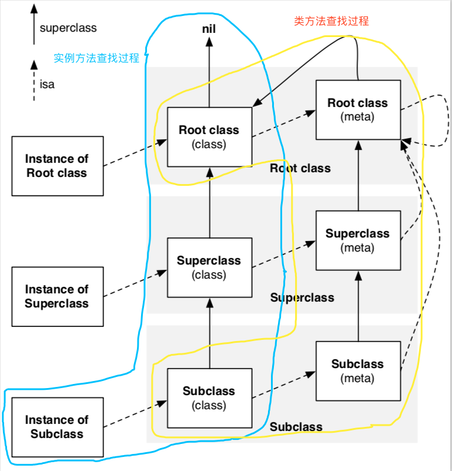

# 实例对象、类、元类

翻译自[[objc explain]: Classes and metaclasses](http://www.sealiesoftware.com/blog/archive/2009/04/14/objc_explain_Classes_and_metaclasses.html)

Objective-C是一个基于类的对象系统。所有实例对象（以下简称**对象**）都是一些类的实例；对象的`isa`指针指向它的类，此类描述了对象的一些信息：初始化大小、成员变量类型以及布局等。类同样描述对象的行为：对象可以响应的`selectors`和类实现的**实例方法**。

类中的方法列表是一个存储**实例方法**(对象可以响应的`selectors`)的集合，当你发送一个消息给一个对象，`objc_msgSend()`查找对象对应类的方法列表（以及父类，如果有），然后决定调用哪个方法

所有的OC类实际上也是一个对象（以下称**类对象**），它也有一个`isa`指针和其他数据，同样能够响应`selectors`，当你调用一个类方法像：`[NSObject alloc]`,实际上是发送一个消息给类对象。

因为OC类也是一个对象，那么类对象也一定是某个类的实例，而这个类就是**元类**(`metaclass`),像类描述它的实例对象一样，元类描述了类对象的一些信息，特别地，元类中的方法列表是一个存储**类方法**（类对象可以响应的`selectors`）的集合。当你向一个类（元类的实例）发送消息时，`objc_msgSend()`查找类对应的元类的方法列表（以及元类的父类，如果有），然后决定调用哪个方法。在这里，元类代替类对象描述类方法，就像类代表实例对象描述实例方法一样。

那么元类是啥?会类似类对象这样的走位吗？不，**所有元类是根元类（root metaclass）的实例对象**，而这个根元类是根类`NSObject`（root class）的元类，它本身就是自己的一个实例（根元类是根元类的实例），`isa`指针链条在这里以一个环结束，从`实例对象`到`类对象`到`元类对象`到`根元类`到`根元类自身`，元类的`isa`指针实际上作用很小，因为现实中没有人会向元类对象发送消息。

对于元类对象来说,`superclass`指针更为重要，**元类的`superclass`指针链与类的`superclass`指针链并行**，意味着，类方法与实例方法并行继承。注意到，**根元类（root metaclass）的`superclass`指针指向根类`NSObject`(root class),所以所有类对象都可以响应根类`NSObject`的实例方法**，因此可以说，一个类对象可以是根类`NSObject`的实例或子类。

看完可能会疑惑，配合这张到处都能搜索到的关于实例对象、类对象、元类对象的图，大概就能明明白白

关于类与元类的描述，引用
>In proper computer science language theory, a class and metaclass hierarchy can be more free-form, with deeper metaclass chains and multiple classes instantiated from any single metaclass. Objective-C uses metaclasses for practical goals like class methods, but otherwise tends to hide metaclasses. For example, [NSObject class] is identical to [NSObject self], even though in formal terms it ought to return the metaclass that NSObject->isa points to. The Objective-C language is a set of practical compromises; here it limits the class schema before it gets too, well, meta.

