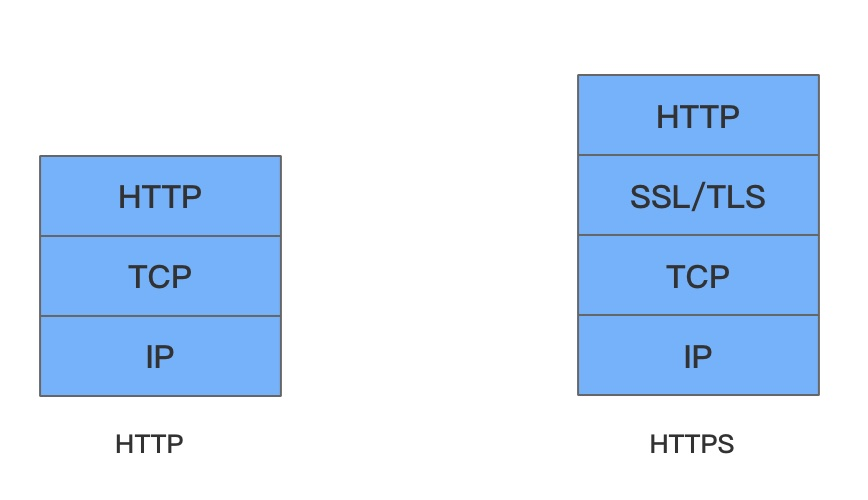
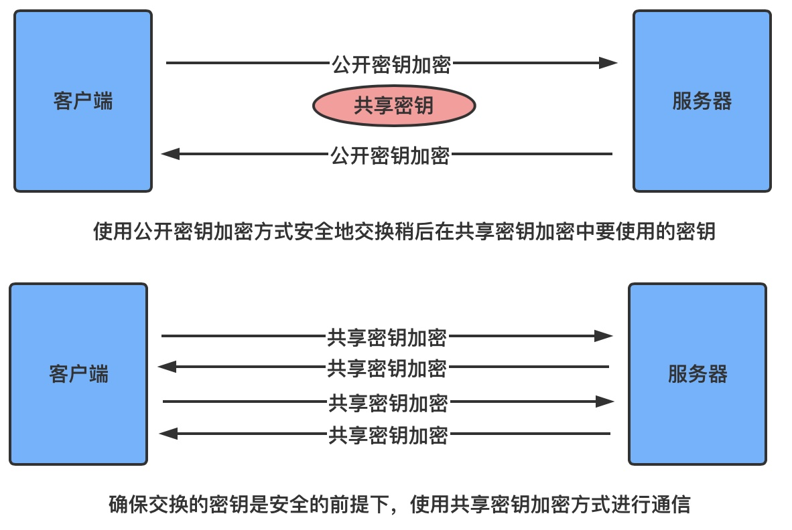
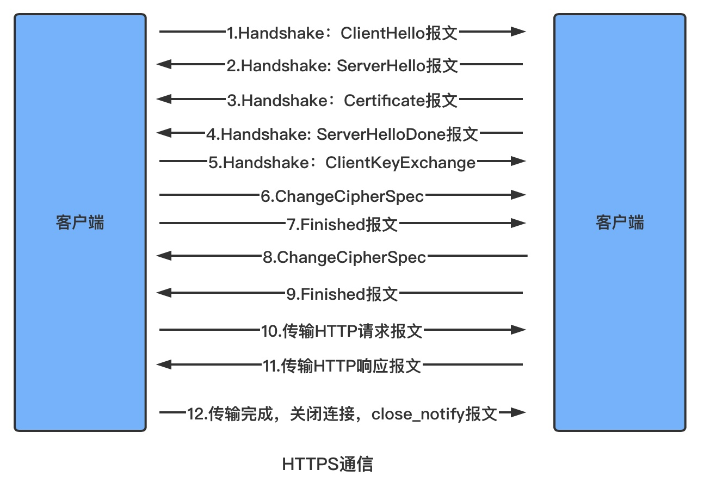

# 目录

   * [HTTP缺陷](#http缺陷)
      * [通信使用明文可能会被窃听](#通信使用明文可能会被窃听)
      * [不验证通信方的身份就可能遭遇伪装](#不验证通信方的身份就可能遭遇伪装)
      * [无法证明报文完整性，可能已遭篡改](#无法证明报文完整性可能已遭篡改)
   * [HTTPS](#https)
      * [相互交换密钥的公开密钥加密技术](#相互交换密钥的公开密钥加密技术)
         * [共享密钥加密的困境](#共享密钥加密的困境)
         * [使用两把密钥的公开密钥加密](#使用两把密钥的公开密钥加密)
         * [HTTPS采用混合加密机制](#https采用混合加密机制)
      * [证明公开密钥正确性的证书](#证明公开密钥正确性的证书)
         * [用以确认客户端的客户端证书](#用以确认客户端的客户端证书)
         * [由自认证机构颁发的证书称为自签名证书](#由自认证机构颁发的证书称为自签名证书)
      * [HTTPS的安全通信机制](#https的安全通信机制)
      * [HTTPS问题](#https问题)

# HTTP缺陷

了解过HTTP的都知道，它设计得相对简单、方便，然而HTTP并非只有好的一面，它也有不足之处：

* **通信使用明文（不加密），内容可能会被窃听**
* **不验证通信方的身份，因此有可能遭遇伪装**
* **无法证明报文的完整性，所以有可能已遭篡改**

## 通信使用明文可能会被窃听

由于HTTP本身不具备加密的功能，所以无法对通信数据进行加密，即HTTP报文使用明文方法发送

HTTP基于TCP/IP运作，所以通信内容在所有的通信线路上都有可能遭到窥视

互联网由全世界的网络组成，而这些网络由各种各样的非个人网络设备组成，所以不排除某个环节中会遭到恶意窥视行为

## 不验证通信方的身份就可能遭遇伪装

HTTP协议中的请求和响应不会对通信方进行身份确认，例如，服务器是否就是发送请求中URI真正指定的主机；返回的响应是否真的返回到实际提出请求的客户端

HTTP协议的实现本身非常简单，不论是谁发送过来的请求都会返回响应，因此如果不确认通信方身份，会存在以下隐患：

* **无法确定请求发送至目标的Web服务器是否是按真实意图返回响应的那台服务器。该服务器有可能是已伪装的Web服务器**
* **无法确定响应返回到的客户端是否是按真实意图接收响应的那个客户端。该客户端是已伪装的客户端**
* **无法确定正在通信的对方是否具备访问权限。因为某些Web服务器上保存着重要的信息，只想发给特定用户通信的权限**
* **无法判定请求是来自何方、出自谁手**
* **即使是无意义的请求也会照单全收。无法阻止海量请求下的Dos攻击(Denial of Service，拒绝服务攻击)**

## 无法证明报文完整性，可能已遭篡改

HTTP本身无法证明通信报文的完整性，因此，请求或响应在通信线路上传输这段时间，内容可能遭到篡改，并且客户端和服务器端无法获悉

像这样，请求或响应在传输途中，遭攻击者拦截并篡改内容的攻击称为中间人攻击(Man-in-the-Middle attack，MITM)

# HTTPS

HTTP有效缓解了HTTP的缺陷，针对以上的三大问题，HTTPS在HTTP的基础上提供了加密、认证和完整性保护，可以说

**HTTPS = HTTP + 加密 + 认证 + 完整性保护**

**HTTPS是身披SSL外壳的HTTP，HTTPS并非是应用层的一种新协议，只是HTTP通信接口部分用 SSL (Secure Socket Layer) 和 TLS (Transport Layer Security) 协议代替**

**通常，HTTP直接和TCP通信。当使用SSL时，则转变成先和SSL通信，再由SSL和TCP通信**

    

SSL是独立于HTTP的协议，不光是HTTP协议，其他运行在应用层的SMTP和Telnet等协议均可配合SSL协议使用，SSL是当今世界上应用最为广泛的网络安全技术

## 相互交换密钥的公开密钥加密技术

SSL采用一种叫做公开密钥加密(Public-key cryptography)的加密处理方式

加密算法是公开的，但是密钥是保密的

**加密和解密都会用到密钥，没有密钥就无法对密码解密，反过来说，任何人只要持有密钥就能解密。如果密钥被攻击者取得，那么加密就失去了意义**

### 共享密钥加密的困境

**加密和解密同用一个密钥的方式称为共享密钥加密(Common key crypto system)，也称为对称密钥加密**

以共享密钥的方式加密时必须将密钥也发给对方。那么"如何将密钥安全地转交"成为一个需要被解决的问题，在互联网上转发密钥时，如果通信被监听，那么密钥就会落入攻击者之手，同时也就失去了加密的意义。除此之外，还需要设法安全地保管接收到的密钥

### 使用两把密钥的公开密钥加密

公开密钥加密使用一对非对称的密钥，一把叫做私有密钥(private key)，另一把叫做公开密钥(public key)

顾名思义，私有密钥不能泄露给任何人，而公开密钥可以随意发布

**使用公开密钥加密方式，发送密文的一方使用对方的公开密钥进行加密处理，对方收到被加密的信息后，再使用自己的私有密钥进行解密。利用这种方式，不需要发送用来解密的私有密钥，也不用担心密钥被攻击者窃听而盗走**

单纯根据密文和公开密钥，恢复出信息原文是异常困难的，因为解密过程就是在对离散对数进行求值，这并非轻而易举就能办到。退一步讲，如果能对一个非常大的整数做到快速因式分解，那么密码破解还是存在可能的，但从目前的技术来看不太现实

### HTTPS采用混合加密机制

了解以上两种加密方式后，接着了解HTTP的加密机制，HTTPS采用这两种加密的混合方案

为什么不仅使用公开密钥加密？因为**公开密钥加密**与**共享密钥加密**相比，其处理速度要慢

**简而言之，在交换密钥过程使用公开密钥加密方式，在建立通信后交换报文阶段则使用共享密钥加密方式**

    

## 证明公开密钥正确性的证书

以上的公开密钥加密方式是存在一定问题的，那就是无法证明公开密钥本身就是货真价实的公开密钥。比如，正准备和某台服务器建立公开密钥加密方式下的通信时，**如何证明收到的公开密钥就是原本预想的那台服务器发行的公开密钥**。或者在公开密钥传输过程中，真正的公开密钥已经被攻击者替换掉

为了解决上述问题，可以使用由**数字证书认证机构(CA，Certificate Authority)**和其相关机关颁发的**公开密钥证书**

数字证书认证机构处于客户端与服务器双方都可信赖的第三方机构的立场上。威瑞信(VeriSign)就是其中一家非常有名的数字证书认证机构，数字证书认证机构的业务流程如下：

1. 服务器的运营人员向数字证书认证机构提出公开密钥的申请
2. 数字证书认证机构在判明申请者的身份之后，对已申请的公开密钥做数字签名，将已签名的公开密钥放入公钥证书（公钥证书也可叫做数字证书或直接称为证书）后绑定在一起，返回给服务器人员
3. 客户端请求时，服务器会将这份由数字证书认证机构颁发的公钥证书发送给客户端，以进行公开密钥加密通信
4. 接收到证书的客户端可使用数字证书认证机构的公开密钥，对那张证书上的数字签名进行验证，一旦验证通过，客户端便可明确两件事情：
   * 认证服务器的公开密钥的，是真实有效的数字证书认证机构
   * 服务器的公开密钥是值得信赖的

数字证书认证机关的公开密钥必须安全地转交给客户端，使用通信方式做转交是一件很困难的事情，因此，多数浏览器开发商发布版本时，会事先在内部植入常用认证机关的公开密钥

### 用以确认客户端的客户端证书

**上述的数字认证机构颁发的数字证书，可以有效地认证服务器的身份，相应地，HTTPS中还可以使用客户端证书**

**以客户端证书进行客户端认证，证明服务器正在通信的对方始终是预料之内的客户端，其作用跟服务器证书如出一辙**

但客户端证书存在几处问题点，其中的一个问题点是证书的获取及发布，想获取证书时，用户得自行安装客户端证书，但由于客户端证书时要付费购买的，且每张证书对应到每位用户也就意味着需支付和用户数对等的费用。另外，要让知识层次不同的用户们自行安装证书，这件事本身也充满了各种挑战。

现状是，安全性极高的认证机构可颁发客户端证书，但仅用于特殊用途的业务。比如那些可支撑客户端证书支出费用的业务。例如，银行的网上银行就要采用客户端证书，在登录网银时不仅要求用户确认输入ID和密码，还会要求用户的客户端证书，以确认用户是否从特定的终端访问网银

客户端证书存在的另一个问题是，客户端证书毕竟只能用来证明客户端实际存在，而不能用来证明用户本人的真实有效性。也就是说，只要获得了安装有客户端证书的计算机的使用权限，也就意味着同时拥有了客户端证书的使用权限

### 由自认证机构颁发的证书称为自签名证书

使用OpenSSL开源框架，每个人都可以构建一套属于自己的认证机构，从而自己给自己颁发服务器证书，但该服务器证书在互联网上不可作为证书使用，似乎没什么帮助

独立构建的认证机构叫做自认证机构，由自认证机构颁发的"无用"证书也被戏称为自签名证书

由自认证机构颁发的服务器证书之所以不起作用，是因为它无法消除伪装的可能性，自认证机构能够产生的作用顶多也就是自己对外宣称"我是XX"的这种程度，即使采用自签名证书，通过SSL加密之后，可能偶尔还会看见通信处在安全状态的提示，可那也是有问题的。因为就算加密通信，也不能排除正在和已经伪装过的假服务器保持通信

值得信赖的第三方机构介入认证，才能让已植入在浏览器内的认证机构颁布的公开密钥发挥作用，并借此证明服务器的真实性

## HTTPS的安全通信机制

    

1. 客户端发送Client Hello报文开始SSL通信，报文包含客户端支持的SSL版本、加密组件列表（所使用的加密算法及密钥长度）
2. 服务器可进行SSL通信时，回应一个Server Hello报文作为应答，与客户端一样，报文包含SSL版本以及加密组件，内容是从客户端加密组件列表筛选的
3. 之后服务器发送Certificate报文，包含公开密钥证书
4. 最后服务器发送Server Hello Done报文通知客户端，最初阶段的SSL握手协商部分结束
5. SSL第一次握手之后，客户端以Client Key Exchange报文作为回应，报文中包含通信加密中使用的一种被称为Pre-master secret的随机密码串。该报文已用第3步中的公开密钥进行加密
6. 接着客户端继续发送Change Cipher Spec报文，该报文提示服务器，在此报文之后的通信会采用Pre-master secret密钥加密
7. 客户端发送Finished报文，该报文包含连接至今全部报文的整体校验值。这次握手协商是否能够成功，要以服务器是否能够正确解密该报文作为判定标准
8. 服务器同样发送Change Cipher Spec报文
9. 服务器同样发送Finished报文
10. 服务器和客户端的Finished报文交换完毕之后，SSL连接就算建立完成。从此开始，通信会受到SSL的保护，开始进行应用层协议的通信，即发送HTTP请求
11. 应用层协议通信，发送HTTP响应
12. 客户端断开连接，断开连接时，发送close_notify报文，上图省略了部分，这步之后再发送TCP FIN报文来关闭与TCP的通信

## HTTPS问题

HTTPS虽然增加了安全性，但也存在一些性能方面的问题，当使用SSL时，处理速度会变慢，主要在两个方面：

* 通信慢

  除去和TCP连接、发送HTTP请求、响应之外，还必须进行SSL通信，整体上的通信量增加

* 加密处理

  服务器和客户端都需要进行加密和解密的运算处理

> 虽然HTTPS安全可靠，但也不会一直使用，一个原因是，与纯文本通信相比，加密通信会消耗更多的CPU及内存资源。另一方面，HTTPS必须使用证书，而证书需要购买的开销也是原因之一。
>
> 如果是非敏感信息则使用HTTP通信，只有在包含个人信息等敏感数据时，才利用HTTPS加密通信

