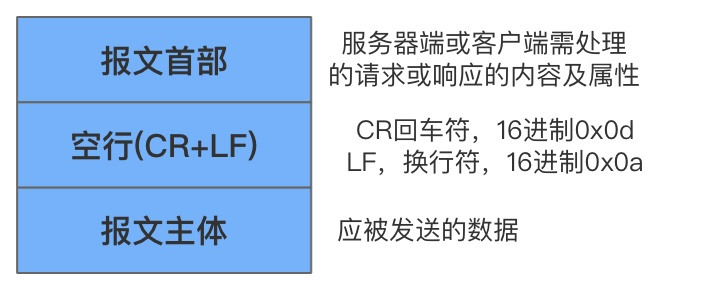
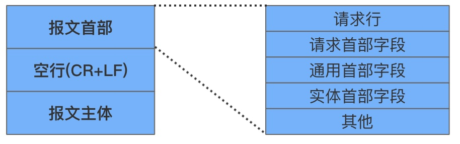
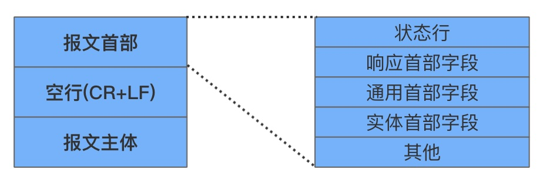

# 目录

* [报文结构](#报文结构)
* [编码传输](#编码传输)
	* [报文主体和实体的差异](#报文主体和实体的差异)
	* [内容编码](#内容编码)
	* [分块传输(Chunked Transfer Coding](#分块传输chunked-transfer-coding)
* [多部分对象集合](#多部分对象集合)
* [范围请求](#范围请求)
* [内容协商](#内容协商)

HTTP协议交互传输的信息称为HTTP报文

HTTP报文本身是由多行(用CR+LF作换行符)数据构成的字符串文本

HTTP报文分为**报文首部**(header)和**报文主体**(body)，由空行(CR+LF)来划分

    

## 报文结构

    

    

* 请求行：包含请求方法，请求URI和HTTP版本
* 状态行：包含表明响应结果的状态码，原因短语和HTTP版本
* 首部字段：包含表示请求和响应的各种条件和属性的各类首部

一般有4种首部，分别是通用首部、请求首部、响应首部和实体首部

## 编码传输

HTTP在传输数据时可以按照数据原文直接传输，也可以以特定的编码方式提升传输效率

### 报文主体和实体的差异

* 报文

  是HTTP通信的基本单位，由8位比特的字节流组成，通过HTTP通信传输

* 实体

  作为请求或响应的有效载荷数据被传输，其内容由实体首部和实体主体组成

HTTP报文的主体用于传输请求或响应的实体主体

通常，报文主体等于实体主体，只有当传输中进行编码操作时，实体主体的内容发生变化，才导致它和报文主体产生差异

通俗理解：以传输一张图片为例，图片本身被称为实体主体，在传输时，图片经过编码称为报文主体。

### 内容编码

内容编码指明应用在实体内容上的编码格式，并保持实体信息原样进行压缩，**内容编码后的实体由客户端接收并负责解码**

常用的内容编码有以下:

* gzip (GNU zip)
* compress (UNIX系统的标准压缩)
* deflate（zlib）

* identity（不进行编码）

### 分块传输(Chunked Transfer Coding)

在HTTP通信过程中，请求的编码实体资源尚未全部传输完成之前，浏览器无法显示请求的内容。在分块传输大容量数据时，可以通过将数据分割成多块，让浏览器逐步显示页面

分块传输编码将实体主体分成多个部分(块)，每一块用十六进制来标记块的长度，最后一块使用"0(CR+LF)"来标记

使用分块传输编码的实体主体会由接收到的客户端负责解码，恢复到编码前的实体主体

## 多部分对象集合

HTTP协议采用了多部分对象集合，即发送的一份报文主体内可含有多类型实体，通常是在图片或文本文件上传时使用

多部分对象集合包含以下：

* multipart/form-data 

  在Web表单文件上传时使用

* multipart/byteranges

  状态码206(Partial Content，部分内容)响应报文包含了多个范围的内容时使用

在HTTP报文中使用多部分对象集合时，需要在首部字段里加上Content-type

使用boundary字符串划分多部分对象集合指明的各类实体，在boundary字符串指定的各个实体的起始行之前插入"--"标记，同样也在对应的字符串最后插入"--"标记作为结束

多部分对象集合的每个部分类型中，都可以含有首部字段

可以在某个部分中嵌套使用多部分对象集合

## 范围请求

范围请求指的是HTTP请求获取部分内容，它为实现可恢复的机制提供支持

如，对一份10000字节大小的资源使用范围请求，可以只请求5001~10000字节内的资源

对于范围请求，响应会返回状态码为206的响应报文

对于多重范围的范围请求，响应会在首部字段Content-type标明multipart/byteranges后返回响应报文

如果服务器无法响应范围请求，则会返回状态码200 OK和完整的实体内容

## 内容协商

内容协商表示希望返回最合适的内容

它根据语言、字符集、编码等作为基准来判断响应返回的资源

例如，包含在请求报文中的字段：

* Accept
* Accept-Charset
* Accept-Encoding
* Accept-Language
* Content-Language

