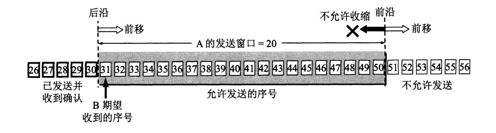
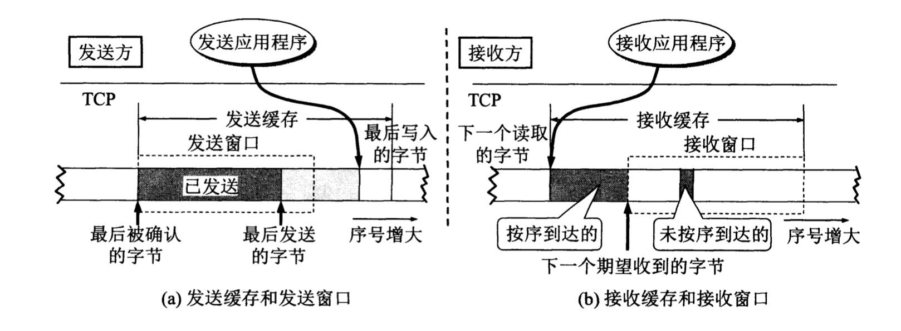
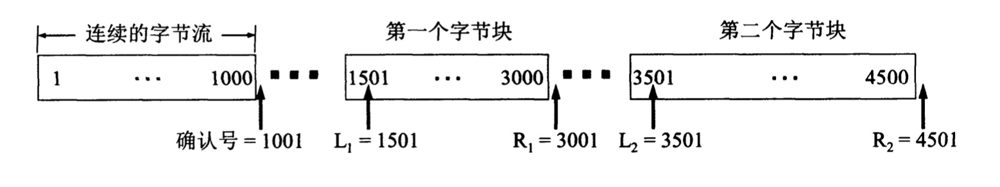

# 以字节为单位的滑动窗口

TCP的滑动窗口是以字节为单位的，**假定数据传输只有一个方向进行，即A发送数据，B给出确认**

现在假定A收到了B发来的确认报文段，其中窗口大小是20字节，而确认号是31(表明B期望收到的下一个序号是31，而序号30为止的数据已经收到了)。根据这两个数据，A构造自己的发送窗口，如下图所示

    

A的发送窗口表示：在没有收到B的确认情况下，A可以连续把窗口内的数据都发送出去。凡是已经发送过的数据，在未收到确认之前都必须暂时保留，以便在超时重传时使用

发送窗口里面的序号表示允许发送的序号。窗口越大，发送方就可以在收到对方确认之前连续发送更多的数据，因而获得较高的传输效率。接收方会把自己的接收窗口数值放在窗口字段中发给发送方，因此A的发送窗口一定不能超过B的接收窗口数值。除此之外，发送窗口大小还要受当时网络拥塞程度的制约

发送窗口的前沿可能向后收缩。这发生在对方通知的窗口缩小了。但TCP的标准强烈不赞成这样做。因为很可用发送方在收到这个通知以前已经发送了窗口中的许多数据，现在又要收缩窗口，不让发送这些数据，这样就会产生一些错误

先前有一个概念描述：发送方的应用进程把字节流写入TCP的发送缓存，接收方的应用进程从TCP的接收缓存中读取字节流。下面进一步讨论**窗口和缓存**的关系。下图描述了发送方维持的发送缓存和发送窗口，以及接收方维持的接收缓存和接收窗口

    

明确两点：

* 缓存空间和序号空间都是有限的，并且都是循环使用的。这里只是为了画图方便，将它们画成长条状
* 由于实际上缓存或窗口中的字节数是非常之大的，因此上图仅仅是个示意图，没有标出具体的数值

先看发送方的情况，发送缓存用来暂时存放：

1. 发送应用程序传送给发送方TCP准备发送的数据
2. TCP已发送出但尚未收到确认的数据

发送窗口通常只是发送缓存的一部分。已被确认的数据应当从发送缓存中删除，因此发送缓存和发送窗口的后沿是重合的。

再看接收方的情况，接收缓存用来暂时存放：

1. 按序到达的、但尚未被接收应用程序读取的数据
2. 未按序到达的数据

如果收到的分组被检测出有差错，则要丢弃。如果接收应用程序来不及读取收到的数据，接收缓存最终会被填满，使接收窗口减小到零。

需要强调以下三点：

* 虽然A的发送窗口是根据B的接收窗口设置的，但在同一时刻，由于网络传送窗口值需要经历一定的时间滞后，A的发送窗口并不总是和B的接收窗口一样大。另一方面，发送方A还可能根据网络当时的拥塞情况适当减小自己的发送窗口数值
* 对于不按序到达的数据应如何处理，TCP标准并无明确规定。如果接收方把不按序到达的数据一律丢弃，那么接收窗口的管理将会比较简单，但那样做对网络资源的利用不利(因为发送方会重复传送较多的数据)。因此TCP通常对不按序到达的数据是先临时存放在接收窗口中，等到字节流中所缺少的字节收到后，再按序交付上层的应用进程
* TCP要求接收方必须有累积确认的功能，这样可以减小传输开销。接收方可以在合适的时候发送确认，也可以在自己有数据要发送时把确认信息顺便**捎带**上。但要注意两点：一是接收方不应该过分推迟发送确认，否则会导致发送方不必要的重传，这反而浪费了网络的资源。TCP规定，确认推迟的时间不应超过0.5秒。如果收到一连串具有最大长度的报文段，则必须每隔一个报文段就发送一个确认。二是捎带确认实际上并不经常发生，因为大多数应用程序很少同时在两个方向上发送数据

最后强调，TCP通信是全双工通信，即通信中的每一方都在发送和接收报文段

# 超时重传时间的选择

重传时间的选择是TCP最复杂的问题之一，因为TCP下层的互联网环境是非常复杂的，它可能是高速率的环境，也可能是低速率的网络

**TCP采用一种自适应算法，它记录一个报文段发出的时间，以及收到相应的确认的时间**。这两个时间之差就是**报文段的往返时间RTT**。TCP保留了RTT的一个**加权平均往返时间RTTs**(又称为平滑的往返时间，S表示Smoothed)。简单来说就是一个平均值。RTTs根据每次新的RTT来更新。显然，超时计时器设置的超时重传时间RTO应略大于RTTs

# 选择确认SACK

若收到的报文段无差错，只是未按序号，中间还缺少一些序号的数据，那么能否设法只传送缺少的数据而不重传已经正确到达接收方的数据？是可以的，选择确认就是一种可行的处理方法

TCP的接收方在接收对方发送过来的数据字节流的序号不连续，结果就形成了一些不连续的字节块。如下图，序号1~1000收到了，但序号1001~1500没有收到。接下来的字节流又收到了，可是又缺少了3001~3500。再后面从序号4501起又没有收到。也就是说，接收方收到了和前面的字节流不连续的两个字节块。如果这些字节的序号都在接收窗口之内，那么接收方就先收下这些数据，但要把这些信息准确地告诉发送方，使发送方不要再重复发送这些已收到的数据

    

从图可看出，和前后不连续的每一个字节块都有两个边界：左边界和右边界。因此在图中用4个指针标记这些边界。需要注意的是，左边界指出字节块的第一个字节的序号，但有边界减1才是字节块中的最后一个序号

TCP如果要使用选择确认SACK，那么在建立TCP连接时，就要在TCP首部的选项中加上"允许SACK"的选项，而双方必须都事先商定好。如果使用选择确认，那么原来首部中的"确认号字段"的用法仍然不变。只是以后在TCP报文段的首部都增加了SACK选项，以便报告收到的不连续的字节块的边界。由于首部选项的长度最多只有40个字节，而指明一个边界就要用掉4字节(因为序号有32位，需要使用4个字节表示)，因此在选项中最多只能指明4个字节块的边界信息。这是因为4个字节块共8个边界，因而需要用32个字节来描述。另外需要两个字节，一个用来指明SACK选项，另一个用来指明这个选项要占用多少字节

然而，SACK文档并没有指明发送方应当怎样响应SACK，因此大多数的实现还是重传所有未被确认的数据块

