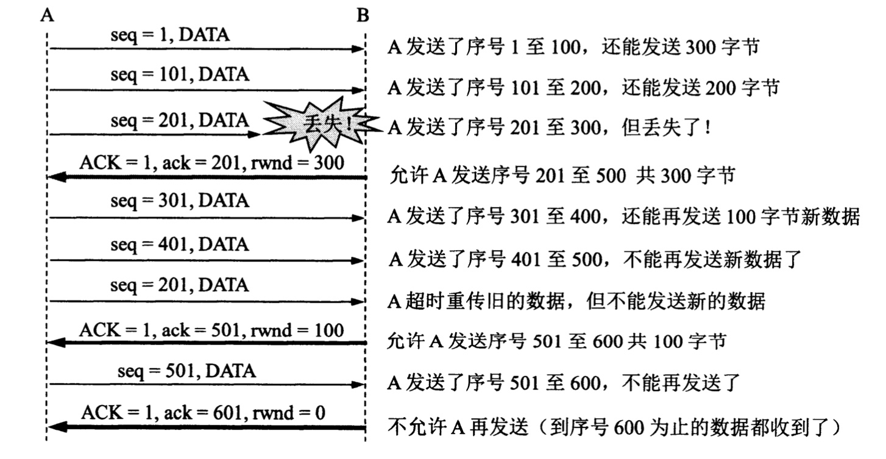

一般来说，我们总希望数据数据传输得更快一些。但如果发送方把数据发送得太快，接收方就可能来不及接收，这就会造成数据的丢失。所谓**流量控制(flow control)**就是让发送方的发送速率不要太快，要让接收方来得及接收

利用滑动窗口机制可以很方便地在TCP连接上实现对发送方的流量控制

    

假设A向B发送数据，在连接建立时，B告诉A："我的接收窗口rwnd = 400"（rwnd表示receiver window）。**发送方的发送窗口不能超过接收方给出的接收窗口的数值**。请注意，**TCP的窗口单位是字节，不是报文段**。TCP连接建立时的窗口协商过程在途中没有显示出来。再假设每一个报文段为100字节长，而数据报文段序号的初始值设为1(上图第一个箭头seq=1)。ACK表示首部中的确认位ACK，小写ack表示确认字段的值。可以看到，接收方的主机B进行了三次流量控制，第一次把窗口减小到rwnd = 300，第二次又捡到rwnd = 100，最后减到rwnd = 0，不允许发送方再发送数据。

考虑一种情况，B向A发送了零窗口的报文段后不久，B的接收缓存又有了一些存储空间。于是B向A发送了rwnd = 400的报文段。然而这个报文段在传送过程中丢失了。A一直等待收到B发送的非零窗口的通知，而B也一直等待A发送的数据。如果没有其他措施，这种相互等待的死锁局面将一直延续下去

为了解决该问题，TCP为每一个连接设有一个**持续计时器(persistence timer)**。只要TCP连接的一方收到对方的零窗口通知，就启动持续计时器。若持续计时器设置的时间到期，就发送一个零窗口**探测报文段**(仅携带1字节的数据)，而对方就在确认这个探测报文段时给出了现在的窗口值。如果窗口仍然是零，那么收到这个报文段的一方就重新设置持续计时器。如果窗口不是零，那么死锁的僵局就可以打破了。

