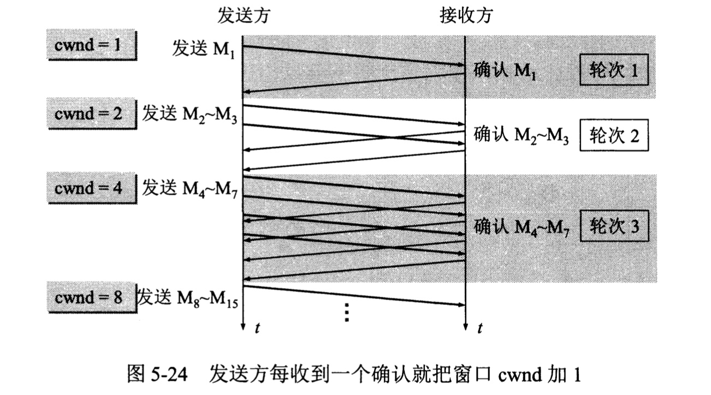
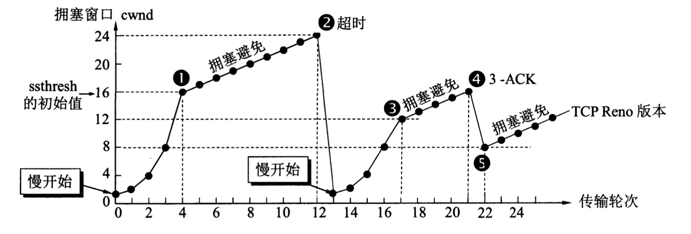
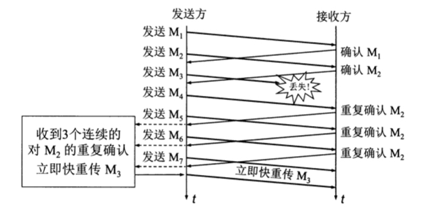
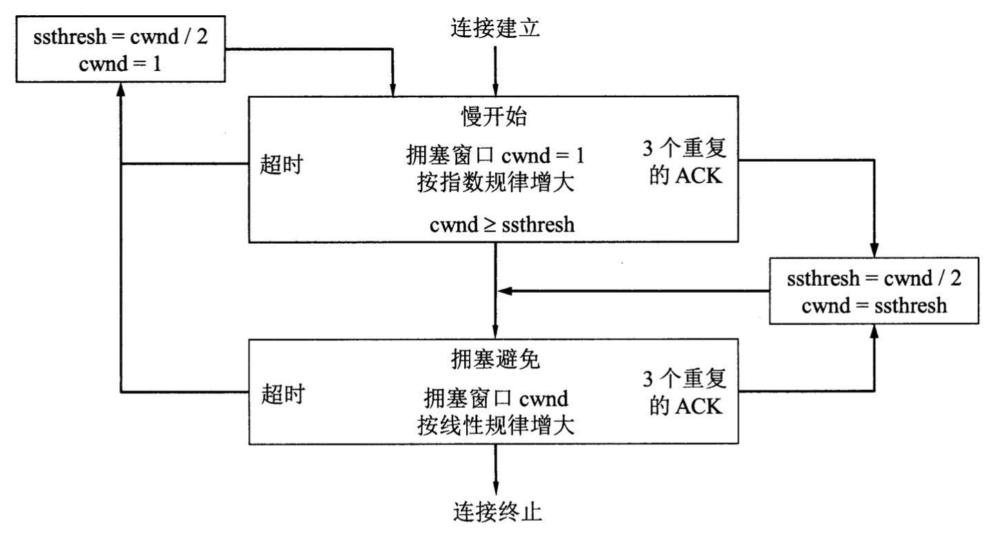

# 目录
   *    * [TCP的拥塞控制方法](#tcp的拥塞控制方法)
      * [慢开始和拥塞避免](#慢开始和拥塞避免)
      * [快重传和快恢复](#快重传和快恢复)
      * [总结图](#总结图)
      * [白话文](#白话文)

---

在计算机网络中的链路容量(即带宽)、交换结点中的缓存和处理机等，都是网络的资源。在某段时间内，若对网络中某一资源的需求超过了该资源所能提供的可用部分，网络的性能就要变坏。这种情况就叫做**拥塞**

拥塞控制与流量控制的关系密切，但也存在一些差别。**拥塞控制**是需要**防止过多的数据注入到网络中，这样可以使网络中的路由器或链路不致过载**。拥塞控制所要做的都有一个前提，就是**网络能够承受现有的网络负荷**。拥塞控制是一个**全局性的过程**，涉及到所有的主机、所有的路由器，以及与降低网络传输性能有关的所有因素

相反，**流量控制往往是指点对点通信量的控制，是个端到端的问题**(接收端控制发送端)。流量控制所要做的就是抑制发送端发送数据的速率，以便接收端来得及接收。

# TCP的拥塞控制方法

TCP进行拥塞控制的算法有四种，即**慢开始**、**拥塞避免**、**快重传**和**快恢复**

为了讨论，假定：

* 数据是单向传送的，对方只传送确认报文
* 接收方总是有足够大的缓存空间，因而发送窗口的大小由网络的拥塞程度决定

## 慢开始和拥塞避免

拥塞控制也叫做**基于窗口**的拥塞控制。发送方维持一个叫做**拥塞窗口**cwnd的状态变量。拥塞窗口的大小取决于网络的拥塞程度，并且动态地变化。**发送方让自己的发送窗口等于拥塞窗口**

发送方控制拥塞窗口的原则是：只要网络没有出现拥塞，拥塞窗口就可以再增大一些，以便把更多的分组发送出去，这样就可以提高网络利用率。但只要网络出现拥塞或可能出现拥塞，就把拥塞窗口缩小，减少分组注入到网络，以缓解网络出现的拥塞

发送方如何知道网络发生了拥塞？当网络出现拥塞时，路由器就要丢弃分组。因此发送方没有接收到确认报文时，就可以判断网络出现了拥塞。**判断网络拥塞的依据就是出现了超时**

慢开始的算法思路：当主机开始发送数据时，由于并不清楚网络的负荷情况，所以如果立即把大量数据字节注入到网络，那么就有可能引起网络发生拥塞。经验证明，较好的方法时先探测一下，**即由小到大逐渐增大发送窗口**，也就是说，**由小到大逐渐增大拥塞窗口数值**

**初始拥塞窗口**cwnd设置为不超过2至4个SMSS(最大报文段)的数值。具体的规定如下：

* 若SMSS > 2190字节

  则设置初始拥塞窗口cwnd = 2 x SMMS字节，且不得超过2个报文段

* 若SMSS > 1095字节且SMSS <= 2190字节

  则设置初始拥塞窗口cwnd = 3 x SMSS字节，且不得超过3个报文段

* 若SMSS <= 1095字节

  则设置初始拥塞窗口cwnd = 4 x SMSS字节，且不得超过4个报文段

慢开始规定，在每收到一个对新的报文段的确认后，可以把拥塞窗口增加最多一个SMSS的数值。具体来说就是

拥塞窗口cwnd每次的增加量 = min(N，SMSS)

其中N是原先未被确认的、但现在被刚收到的确认报文段所确认的字节数。不难看出，当N < SMSS时，拥塞窗口每次的增加量要小于SMSS

用这样的方法逐步增大发送方的拥塞窗口cwnd，可以使分组注入到网络的速率更加合理

下面通过例子说明慢开始算法的原理，要注意，实际上TCP是用字节数作为窗口大小的单位。但为叙述方便起见，我们用**报文段的个数作为窗口大小的单位**，这样就可以用较小的数字来阐明拥塞控制的原理

在一开始，发送方先设置cwnd = 1，发送第一个报文段M1，接收方收到后确认M1。发送方收到对M1的确认后，把cwnd从1增大到2，于是发送方接着发送M2和M3两个报文段。接收方收到后发回对M2和M3的确认。**发送方每收到一个对新报文的确认(重传的不算在内)就使发送方的拥塞窗口加1**，因此发送方在收到两个确认后，cwnd就从2增大到4，并可发送M4~M7共4个报文段。**因此使用慢开始算法后，每经过一个传输轮次，拥塞窗口cwnd就加倍**

> 一个传输轮次所经历的时间其实就是往返时间RTT(RTT并非是恒定的数值)。使用传输轮次更加强调：把拥塞窗口cwnd所允许发送的报文段都连续发送出去，并收到了对已发送的最后一个字节的确认。例如，拥塞窗口cwnd的大小是4个报文段，那么这时的往返时间就是发送方连续发送4个报文段，并收到这4个报文段的确认，总共经历的时间

    

慢开始的"慢"并不是指cwnd的增长速率慢，而是指TCP开始发送报文段时先设置cwnd = 1，使得发送方在开始时只发送一个报文段(目的是试探一下网络的拥塞情况)，然后再逐渐增大cwnd。这当然要比设置大的cwnd值一下子把许多报文段注入到网络中要"慢得多"。这对防止网络出现拥塞是一个非常好的方法

在TCP的实际运行中，发送方只要收到一个对新报文段的确认，其拥塞窗口cwnd就立即加1，并可以立即发送新的报文段，而不需要等这个轮次中所有的确认都收到后再发送新的报文段

为了防止拥塞窗口cwnd增长过快引起网络拥塞，还需要设置一个**慢开始门限ssthresh**状态变量，它的用法如下：

* 当cwnd < ssthresh时，使用上述的慢开始算法
* 当cwnd > ssthresh时，停止使用慢开始算法而改用拥塞避免算法
* 当cwnd = ssthresh时，既可使用慢开始算法，也可使用拥塞避免算法

**拥塞避免**算法的思路是让拥塞窗口cwnd缓慢地增大，**即每经过一个往返时间RTT就把发送方的拥塞窗口cwnd加1，而不是像慢开始阶段那样加倍增长**。因此在拥塞避免阶段就有"加法增大"AI（Additive Increase）的特点。这表明在拥塞避免阶段，拥塞窗口cwnd**按线性规律缓慢增长**，比慢开始算法的拥塞窗口增长速率缓慢得多

下面的例子说明了在拥塞控制的过程中，TCP的拥塞窗口cwnd是怎样变化的

现假定TCP的发送窗口等于拥塞窗口，当TCP连接进行初始化时，把拥塞窗口cwnd置为1。为了便于理解，图中的窗口单位不使用字节而使用报文段的个数。在本例中，慢开始门限的初始值设置为16个报文段，即ssthresh  = 16。在执行**慢开始算法**时，发送方每收到一个对新报文段的确认ACK，就把拥塞窗口值加1，然后开始下一轮的传输。**因此拥塞窗口cwnd随着传输轮次按指数规律增长**。当拥塞窗口cwnd增长到慢开始门限值ssthresh时(图中的点1，此时拥塞窗口cwnd = 16)，就改为执行**拥塞避免算法**，拥塞窗口按线性规律增长

拥塞避免并非完全能够避免拥塞，拥塞避免是说把拥塞窗口控制为按线性规律增长，**使网络比较不容易出现拥塞**

    

当拥塞窗口cwnd = 24时，网络出现了超时(图中的点2)，发送方判断为网络拥塞。于是调整门限值ssthresh = cwnd / 2 = 12，同时设置拥塞窗口cwnd = 1，进入慢开始阶段

按照慢开始算法，发送方每收到一个对新报文段的确认ACK，就把拥塞窗口值加1。当拥塞窗口cwnd = ssthresh = 12时(图中的点3，这是新的ssthresh值)，改为执行拥塞避免算法，拥塞窗口按线性规律增大

当拥塞窗口cwnd = 16时(图中的点4)，出现了一个新的情况，就是发送方一连收到3个对同一报文段的重复确认(图中记为3-ACK)。关于这个问题解释：**有时，个别报文段会在网络中丢失，但实际上网络并未发生拥塞。如果发送方迟迟收不到确认，就会产生超时，就会误认为网络发生了拥塞，导致发送方错误地启动慢开始，把拥塞窗口cwnd又设置为1，因而降低了传输效率**

## 快重传和快恢复

采用快重传算法可以让发送方尽早知道发生了个别报文段的丢失。**快重传算法首先要求接收方不要等待自己发送数据时才进行捎带确认，而是要立即确认，即使收到了失序的报文段也要立即发出对已收到的报文段的重复确认**。如下图所示，接收方收到了M1和M2后都分别及时发出了确认。现假定接收方没有收到M3但却收到了M4。本来接收方可以什么都不做。但按照快重传算法，接收方**必须立即发送对M2的重复确认**，以便让发送方及早知道接收方没有收到报文段M3。发送方接着发送M5和M6。接收方收到后也仍要再次分别发出对M2的重复确认。这样，发送方共收到了接收方的4个对M2的确认，其中后3个都是重复确认。快重传算法规定，发送方只要**一连收到3个重复确认**，就知道接收方确实没有收到报文段M3，因而应当**立即进行重传**(即"快重传")，这样就不会出现超时，发送方也就不会误认为出现了网络拥塞。使用快重传可以使整个网络的吞吐量提高约20%

    

因此，在上面的拥塞窗口变化图中的点4，发送方知道现在只是丢失了个别的报文段。于是不启动慢开始，而是执行**快恢复算法**。这时，发送方调整门限值ssthresh = cwnd / 2 = 8，同时设置拥塞窗口cwnd = ssthresh = 8(拥塞窗口变化图中的点5)，并开始执行拥塞避免算法

> 也有的快恢复实现是把快恢复开始时的拥塞窗口cwnd值再增大一些(增大3个报文段的长度)，即等于ssthresh + 3 x MSS。这样做的理由是：既然发送方收到3个重复的确认，就表明有3个分组已经离开了网络。这3个分组不再消耗网络的资源而是停留在接收方的缓存中(接收方发送出3个重复的确认就证明了这个事实)。可见现在网络中并不是堆积了分组而是减少了3个分组。因此可以适当把拥塞窗口扩大些

在拥塞避免阶段，拥塞窗口是按照线性规律增大的，这常称为**加法增大AI**(Additive Increase)。而一旦出现超时或3个重复确认，就要把门限值设置为当前拥塞窗口值的一半，并大大减小拥塞窗口的数值。这常称为**乘法减小MD**(Multiplicative Decrease)。两者合在一起就是所谓的AIMD算法

我们一开始假定了接收方总是有足够大的缓存空间，因而发送窗口的大小仅由网络的拥塞程度来决定。但实际上接收方的缓存空间总是有限的。接收方根据自己的接收能力设定了接收方窗口rwnd，并把这个窗口值写入TCP首部中的窗口字段，传送给发送方。因此，**接收方窗口又称为通知窗口**(advertised window)。因此，从接收方对发送方的流量控制的角度考虑，**发送方的发送窗口一定不能超过对方给出的接收方窗口值rwnd**

如果把拥塞控制和接收方对发送方的流量控制一起考虑，那么显然，发送方的窗口的上限值应当取为接收方窗口rwnd和拥塞窗口cwnd这两个变量中较小的一个：

`发送方窗口的上限值 = Min[rwnd, cwnd]`

## 总结图

根据以上描述，TCP的拥塞控制可以归纳为以下流程图

    

## 白话文

1. 怎么知道网络发生了拥塞？

答： 网络拥塞的时候，路由器丢失分组，发送方发出的分组收不到确认报文，可以判断出网络出现了拥塞，判断依据就是出现了超时

2. TCP拥塞控制是怎样的？

答：总的来说，TCP维护一个拥塞窗口，然后根据网络拥塞情况动态调整这个拥塞窗口的大小来发送数据，避免过多地将数据注入到网络环境中

   1. 详细来说，一开始，先将发送窗口尽量调小，比如设置为1，然后发送报文，每收到一个确认，发送窗口就增加1，这个阶段是成倍增长；
      (这个阶段称为慢开始)
   2. 为了避免窗口大小增长过快，会设置一个阈值(也叫慢开始门限)，当窗口大小超过这个值，就让窗口大小线性增长，每次都只增大1

      (这个阶段称为拥塞避免阶段)

   3. 由于窗口一直增大，将来肯定会出现超时，出现超时就将阈值缩小一半，窗口值重置为1，重新进入慢开始阶段，重复这个过程
   4. 如果在某个时刻收到3个或以上的对同一报文的确认ACK，则执行快重传，立即重传ACK下一个包，然后执行快恢复算法，将发送窗口大小缩小一半，同时将阈值设置为窗口的大小，接着进入拥塞避免阶段
