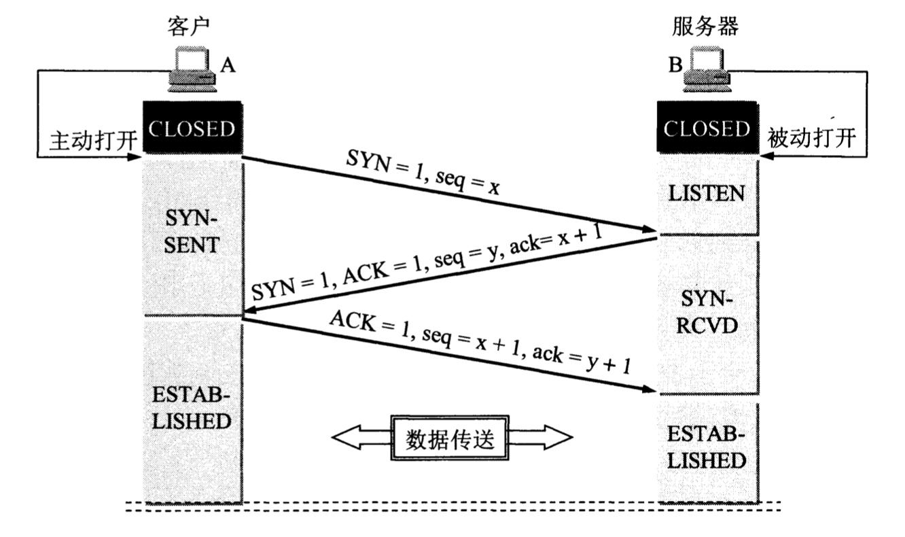
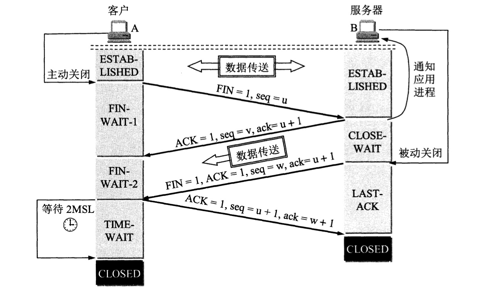
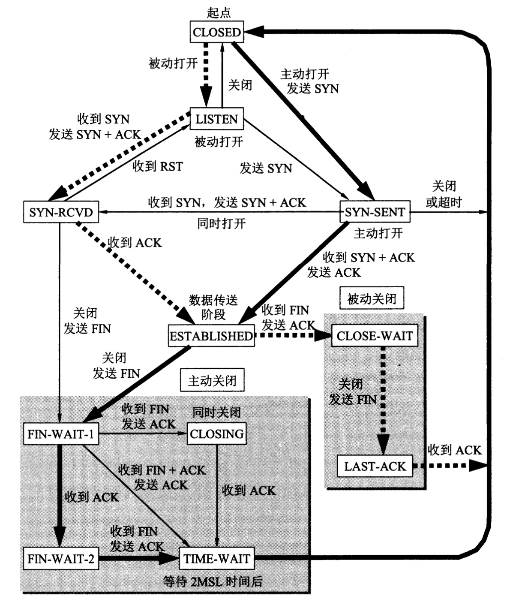

TCP运输连接的建立和释放是每一次面向连接的通信中必不可少的过程。因此，运输连接就有三个阶段，即：**连接建立**、**数据传送**和**连接释放**。运输连接的管理就是使运输连接的建立和释放都能正常地进行。

# TCP的连接建立

TCP连接建立过程中要解决以下三个问题：

1. 要使每一方能够确知对方的存在
2. 要允许双方协商一些参数(如最大窗口值、是否使用窗口扩大选项和时间戳选项以及服务质量等)
3. 能够对运输实体资源(如缓存大小、连接表中的项目等)进行分配

TCP连接的建立采用客户服务器方式。主动发起连接建立的应用进程叫做**客户**(client)，而被动等待连接建立的应用进程叫做**服务器**(server)

TCP建立连接的过程叫做握手，**握手需要在客户和服务器之间交换三个TCP报文段**

    

> RFC 973中使用的名称是three way handshake，很多教材都使用"三次握手"这个广为流行的译名。其实这是在**一次握手**过程中交换了三个报文，而并不是进行了三次握手

假定主机A运行的是TCP客户程序，而B运行TCP服务器程序。最初两端的TCP进程都处于CLOSED(关闭)状态。

一开始，B的TCP服务器进程先创建**传输控制块TCB**，准备接受客户进程的连接请求。然后服务器进程就处于LISTEN(收听)状态，等待客户的连接请求。

> 传输控制块TCB存储了每一个连接中的一些重要信息，如：TCP连接表，指向发送和接收缓存的指针，指向重传队列的指针，当前的发送和接收序号，等等

A的TCP客户进程也是首先创建**传输控制模块TCB**。然后，在打算建立TCP连接时，向B发出连接请求报文段，这时首部中的同步位**SYN = 1**，同时选择一个初始序号**seq = x**。TCP规定，SYN报文段(即SYN = 1的报文段)不能携带数据，但要**消耗掉一个序号**。这时，TCP客户进程进入SYN-SENT(同步已发送)状态

B收到连接请求报文段后，如果同意建立连接，则向A发送确认。在**确认报文段中应把SYN位和ACK位都置1**，确认号是**ack = x + 1**，同时也为自己选择一个初始序号**seq = y**。这个报文段也不能携带数据，但**同样要消耗掉一个序号**。这时TCP服务器进程进入SYN-RCVD(同步收到)状态

A的TCP客户进程收到B的确认后，还要向B给出确认。**确认报文段的ACK置为1**，确认号**ack = y + 1**，而自己的序号**seq = x + 1**。TCP的标准规定，该ACK报文段可以携带数据，**如果不携带数据则不消耗序号**，在这种情况下，下一个数据报文段的序号仍是seq = x + 1。这时，TCP连接已经建立，A进入ESTABLISHED(已建立连接)状态

当B收到A的确认后，也进入ESTABLISHED状态

上面给出的连接建立过程叫做**三报文握手**。在上图中，B发送给A的报文段，也可拆成两个报文段。可以先发送一个确认报文段(ACK = 1，ack = x + 1)，然后再发送一个同步报文段(SYN = 1，seq = y)。这样的过程就变成了**四报文握手**，但效果是一样的

---

为什么A最后还要发送一次确认呢？**这主要是为了防止已失效的连接请求报文段突然又传到到了B，因而产生错误**

所谓"已失效的连接请求报文段"是这样产生的。考虑一种正常情况，A发出连接请求，但因连接请求报文丢失而未收到确认。于是A再重传一次连接请求。后来收到了确认，建立了连接。数据传输完毕后，就释放了连接。A共发送了两个连接请求报文段，其中第一个丢失，第二个到达了B，没有"已失效的连接请求报文段"

现假定出现一种异常情况，**即A发出的第一个连接请求报文段并没有消失，而是在某些网络结点长时间滞留了**，以致延误到连接释放以后的某个时间才到达B。本来这事一个早已失效的报文段。但B收到此失效的连接请求报文段后，就误认为是A又发出一次新的连接请求。于是就向A发出确认报文段，同意建立连接。**假如不采用报文握手，那么只要B发出确认，新的连接就建立了**

**由于现在A并没有发出建立连接的请求，因此不会理睬B的确认，也不会向B发送数据。但B却以为新的运输连接已经建立了，并一直等待A发来数据。B的许多资源就这样白白浪费了**

采用三报文握手的办法，可以防止上述现象的发生。例如在刚才的异常情况下，A不会向B的确认发出确认，那么B由于收不到确认，就知道A并没有要求建立连接

---

如果第3个报文丢包了，怎么处理？

**这个时候，服务器因为没收到客户端的ACK报文，没办法进入ESTABLISHED状态。这个时候肯定不能传输数据的，不论客户端主动发送数据与否，服务器都会有定时器重新发送第二个SYN+ACK报文段，如果客户端再次发送ACK成功，则建立连接**

**如果一直不成功，服务器肯定会有超时设置，超时之后会给客户端发送RST报文强制关闭TCP连接，进入CLOSED状态，这个时候客户端也会关闭连接**

# TCP的连接释放

TCP连接释放过程比较复杂，我们仍结合双方状态的改变来阐明连接释放的过程

数据传输结束后，通信的双方都可释放连接。现在A和B都处于ESTABLISHED状态。A的应用进程先向其TCP发出连接释放报文段，并停止再发送数据，主动关闭TCP连接。

A把连接释放报文段首部的终止控制位FIN置1，其序号**seq = u**，它等于前面已传送过的数据的最后一个字节的序号加1。这时A进入**FIN-WAIT-1**(终止等待1)状态，等待B的确认。TCP规定，FIN报文段即使不携带数据，它也消耗掉一个序号

    

B收到连接释放报文段后立即发出确认，确认号是**ack = u + 1**，而这个报文段自己的序号是v，等于B前面已传送过的数据的最后一个字节的序号加1。然后B就进入**CLOSE-WAIT**(关闭等待)状态。TCP服务器进程这时应通知高层应用进程，因而从A到B这个方向的连接就释放了，这时的TCP连接处于**半关闭**(half-close)状态，即A已经没有数据要发送了，但B若发送数据，A仍要接收。也就是说，从B到A这个方向的连接并未关闭，这个状态可能会持续一段时间

A收到来自B的确认后，就进入**FIN-WATI-2**(终止等待2)状态，等待B发出的连接释放报文段

若B已经没有要向A发送的数据，其应用进程就通知TCP释放连接。这时B发出的连接释放报文段必须使**FIN = 1**。现假定B的序号为**w**(在半关闭状态B可能又发送了一些数据)。B还必须重复上次已发送过的确认号**ack = u + 1**。这时B就进入**LAST-ACK**(最后确认)状态，等待A确认

A收到B的连接释放报文段后，必须对此发出确认，在确认报文段中把ACK置1，确认号**ack = w + 1**，而自己的序号是**seq = u + 1**(根据TCP标准，前面发送过的FIN报文段要消耗一个序号)。然后进入**TIME-WAIT**(时间等待)状态。注意，现在TCP连接还没有释放掉。必须经过**时间等待计时器**(TIME-WAIT timer)设置的时间**2MSL**后，A才进入到CLOSED状态。时间**MSL**叫做**最长报文段寿命**(Maximum Segment Lifetime)，RFC 793建议设为2分钟。但这完全是从工程上来考虑的，对于现在的网络，MSL = 2分钟可能太长了一些。因此TCP允许不同的实现可根据具体情况使用更小的MSL值。因此，从A进入到TIME-WAIT状态后，要经过4分钟才能进入到CLOSED状态，才能开始建立下一个新的连接。当A撤销相应的传输控制块TCB后，就结束了这次的TCP连接

---

**为什么A在TIME-WAIT状态必须等待2MSL的时间呢？**理由有两个

第一，为了保证A发送的最后一个ACK报文段能够到达B。这个ACK报文段有可能丢失，因而使处在LAST-ACK状态的B收不到对已发送的**FIN + ACK**报文段的确认。B会超时重传这个**FIN + ACK**报文段，而A就能在2MSL时间内收到这个重传的**FIN + ACK**报文段。接着A重传一次确认，重新启动**2MSL**计时器。最后A和B都正常进入到CLOSED状态。如果A在**TIME-WAIT**状态不等待一段时间，而是在发送完ACK报文段后立即释放连接，那么就无法收到B重传的**FIN + ACK**报文段，因而也不会再发送一次确认报文段。这样，B就无法按照正常步骤进入CLOSED状态

第二，防止上一节提到的"已失效的连接请求报文段"出现在本连接中。A在发送完最后一个ACK报文段后，再经过时间**2MSL**，就可以使本连接持续的时间内所产生的所有报文段都从网络中消失。这样就可以使下一个新的连接中不会出现这种旧的连接请求报文段。

B只要收到了A发出的确认，就进入CLOSED状态。同样，B在撤销相应的传输控制块TCB后，就结束了这次的TCP连接。可以看到，B结束TCP的连接的时间要比A早一些

上述的TCP连接释放过程是四报文握手

除时间等待计时器外，TCP还设有一个**保活计时器**(keepalive timer)。设想这样的情况：客户已主动与服务器建立了TCP连接。但后来客户端的主机突然出故障。显然，服务器以后就不能再收到客户发来的数据。因此，应当有措施使服务器不要再白白等待下去。这就是使用保活计时器。服务器每收到一次客户的数据，就重新设置保活计时器，时间的设置通常是两小时。若两小时没有收到客户的数据，服务器就发送一个探测报文段，以后则每隔75秒钟发送一次。若一连发送10个探测报文段后仍无客户的响应，服务器就认为客户端出了故障，接着关闭这个连接

# TCP有限状态机

粗实线箭头表示对客户进程的正常变迁。粗虚线箭头表示对服务器进程的正常变迁。另一种细线箭头表示异常变迁

    

