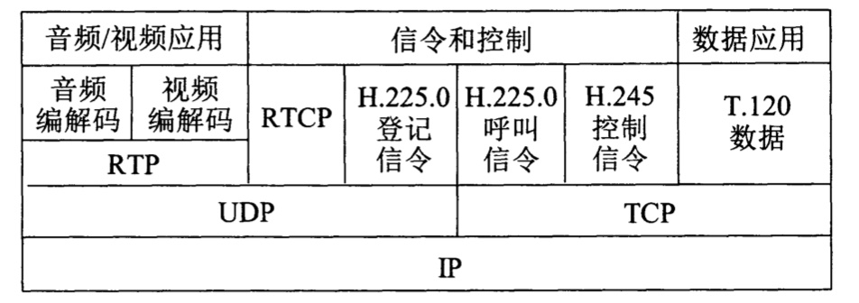

# 目录

   * [互联网音视频](#互联网音视频)
   * [流式存储音频/视频](#流式存储音频视频)
      * [具有元文件的万维网服务器](#具有元文件的万维网服务器)
      * [媒体服务器](#媒体服务器)
      * [实时流式协议RTSP](#实时流式协议rtsp)
   * [交互式音频/视频](#交互式音频视频)
      * [IP电话所需要的几种应用协议](#ip电话所需要的几种应用协议)
         * [实时运输协议RTP](#实时运输协议rtp)
         * [实时运输控制协议RTCP](#实时运输控制协议rtcp)
         * [H.323](#h323)
         * [会话发起协议SIP](#会话发起协议sip)

# 互联网音视频

目前互联网提供的音频/视频服务大体上可分为三种类型：

* **流式(streaming)存储音频/视频** 

  这种类型是先把已压缩的录制好的音频/视频文件存储在服务器上。用户通过互联网下载这样的文件。注意，用户并不是把文件全部下载完毕后再播放，因为这往往需要很长时间，而用户一般也不大愿意等待太长的时间。流式存储音频/视频文件的特点是能够**边下载边播放**，即在文件下载后不久(例如，一般在缓存中存放最大几十秒)就开始连续播放

* **流式实况音频/视频** 

  这种类型和无线电台或电视台的实况广播相似，不同之处是音频/视频节目的广播是通过互联网来传送的。流式实况音频/视频是一对多(而不是一对一)的通信。它的特点是：音频/视频节目不是事先录制好和存储在服务器中的，而是在发送方边录制边发送(不是录制完毕后再发送)。在接收时也要求能够连续播放。接收方收到节目的时间和节目中事件的发生时间可以认为是同时的(相差仅仅是电磁波的传播时间和很短的信号处理时间)。**流式实况音频/视频按理说应当采用多播技术才能提高网络资源的利用率，但目前实际上还是使用多个独立的单播**

* **交互式音频/视频**

  这种类型是用户使用互联网和其他人进行**实时**交互式通信。现在的互联网电话或互联网电视会议就属于这种类型

注意，对于流式音频/视频的"下载"，实际上并没有把"下载"的内容存储在硬盘上。因此当"边下载边播放"结束后，在用户的硬盘上没有留下有关播放内容的任何痕迹。播放流式音频/视频的用户，仅仅能够在屏幕上观看播放的内容，也不能把播放的内容存储下来，因此也无法进行转发。这对保护版权非常有利

目前的技术发展，已经有了能够存储在网上播放的流式音频/视频文件的软件

我们现在常见的词汇**流媒体**（streaming media）就是上面所说的流式音频/视频。流媒体主要的特点就是不是全部都收录下来再播放

# 流式存储音频/视频

这种方式的音视频播放，通常是用户从浏览器通过HTTP协议请求，从服务器获取音视频文件，完全下载到本地后使用自己机器上的媒体播放器进行解压缩，然后播放

这种传统的下载文件的方法并没有涉及到"流式"(即边下载边播放)的概念。传统的下载方法最大缺点就是历时太长，这往往使下载者不愿继续等待。为此，目前已经找出了几种改进的措施

## 具有元文件的万维网服务器

第一种改进的措施就是在万维网服务器中，除了真正的音频/视频文件外，还增加了一个**元文件**(metafile)。所谓元文件（请注意，不是源文件）就是一种非常小的文件，它描述或指明其他文件的一些重要信息。这里的元文件保存了有关这个音频/视频文件的信息。下图说明了使用元文件下载音频/视频文件的几个步骤

    

1. 浏览器用户点击所要看的音频/视频文件的超链，使用HTTP的GET报文接入到万
   维网服务器。实际上，这个超链并没有直接指向所请求的音频/视频文件，而是指向一个元文件。这个元文件有实际的音频/视频文件的统一资源定位符URL
2. 万维网服务器把该元文件装入HTTP响应报文的主体，发回给浏览器。在响应报文中还有指明该音频/视频文件类型的首部
3. 客户机浏览器收到万维网服务器的响应，分析其内容类型首部行，调用相关的媒体
   播放器（客户机中可能装有多个媒体播放器），把提取出的元文件传送给媒体播放器
4. 媒体播放器使用元文件中的URL直接和万维网服务器建立TCP连接，并向万维网
   服务器发送HTTP请求报文，要求下载浏览器想要的音频/视频文件
5. 万维网服务器发送HTTP响应报文，把该音频/视频文件发送给媒体播放器。媒体播放器在存储了若干秒的音频/视频文件后（这是为了消除抖动），就以音频/视频流的形式边下载、边解压缩、边播放

## 媒体服务器

为了更好地提供播放流式音频/视频文件的服务，现在最为流行的做法就是使用两个分开的服务器。如下图所示，现在使用一个普通的万维网服务器，和另一个**媒体播放器**（media server）。媒体服务器和万维网服务器可以运行在一个端系统内，也可以运行在两个不同的端系统中。媒体服务器与普通的万维网服务器的最大区别就是，媒体服务器是专门为播放流式音频/视频文件而设计的，因此能够更加有效地为用户提供播放流式多媒体文件的服务。因此媒体服务器也常被称为**流式服务器**（streaming server）。下面介绍其工作原理

    

在用户端的媒体播放器与媒体服务器的关系是客户与服务器的关系。与之前不同的是，现在媒体播放器不是向万维网服务器而是向媒体服务器请求音频/视频文件。**媒体服务器和媒体播放器之间采用另外的协议进行交互**。
采用媒体服务器后，下载音频/视频文件的前三个步骤仍然和上一节所述的一样，区别就是后面两个步骤，即：

  1 ~ 3.  前三个步骤与上一节的相同

4. 媒体播放器使用元文件中的URL接入到媒体服务器，请求下载浏览器所请求的音频/视频文件。下载文件可以使用上一节描述的HTTP/TCP，也可以借助于使用UDP的任何协议，例如使用**实时运输协议RTP**(后面描述)
5. 媒体服务器给出响应，把该音频/视频文件发送给媒体播放器。媒体播放器在迟延了若干秒后(例如，2~5秒)，以流的形式边下载、边解压缩、边播放

上面提到，传送音频/视频文件可以使用TCP，也可以使用UDP。起初人们选用UDP来传送。不采用TCP的主要原因是担心当网络出现分组丢失时，TCP的重传机制会使重传的分组不能按时到达接收端，使得媒体播放器的播放不流畅。但后来的实践经验发现，采用UDP会有以下几个缺点

* 发送端按正常播放的速率发送流媒体数据帧，但由于网络的情况多变，在接收端的播放器很难做到始终按规定的速率播放。例如，一个视频节目需要以1Mbit/s的速率播放。如果从媒体服务器到媒体播放器之间的网络容量突然降低到1Mbit/s以下，那么这时就会出现播放器的暂停，影响正常的观看
* 很多单位的防火墙往往阻拦外部UDP分组的进入，因而使用UDP传送多媒体文件时会被防火墙阻拦掉
* 使用UDP传送流式多媒体文件时，如果在用户端希望能够控制媒体的播放，如进行暂停、快进等操作，那么还需要使用另外的协议**RTP**和**RTSP**。这样就增加了成本和复杂性

于是，现在对流式存储音频/视频的播放，如YouTube和Netflix，都采用TCP来传送。下图说明了使用TCP传送流式视频的几个主要步骤

    

1. 用户使用HTTP获取存储在万维网服务器中的视频文件，然后服务器把视频数据传送到TCP发送缓存中。若发送缓存已填满，就暂时停止传送
2. 从TCP发送缓存通过互联网向客户机中的TCP接收缓存传送视频数据，直到接收缓存被填满
3. 从TCP接收缓存把视频数据再传送到应用程序缓存(即媒体播放器的缓存)
4. 在播放时，媒体播放器等时地(即周期性地)把视频数据按帧读出，经过解压缩后，把视频节目显示在用户的屏幕上

只有第4步的读出速率是严格按照源视频文件的规定速率来播放。而前面三步的数据传送速率则可以使任意的。如果用户暂停播放，那么图中的三个缓存将很快被填满，这时TCP发送缓存就暂停读取所存储的视频文件。以后，媒体播放器每读出n bit，TCP发送缓存就可以从存储的视频文件再读取n bit。如果客户机中的两个缓存经常处于填满状态，就能较好地应付网上偶然出现的拥塞

如果第2步的传送速率小于第4步的读出速率，那么客户机中的两个缓存中的存量就会逐渐减少。当媒体播放器缓存的数据被取空后，播放就不得不暂停，直到后续的视频数据重新注入进来后才能再继续播放。**实践证明，只要在第2步的TCP平均传送速率达到视频节目规定的播放速率的两倍，媒体播放器一般就能流畅地播放网上的视频节目**

如果是观看实况转播，那么最好应当首先考虑使用UDP来传送。如果使用TCP传送，则当出现网络严重拥塞而产生播放的暂停时，就会使人难于接受。使用UDP传送时，即使因网络拥塞丢失了一些分组，对观看的感觉也会比突然出现暂停要好些

## 实时流式协议RTSP

RTSP已成为互联建议标准。RTSP是为了给流式过程增加更多的功能而设计的协议。RTSP本身并不传送数据，而仅仅是使媒体播放器能够**控制**多媒体流的传送，因此RTSP又称为**带外协议**(out-of-band protocol)

RTSP协议以客户服务器方式工作，它是一个应用层的**多媒体播放控制协议**，用来使用户在播放从互联网下载的实时数据时能够进行控制，如：暂停/继续、快退、快进等。因此，RTSP又称为"**互联网录像机遥控协议**"

RTSP的语法和操作与HTTP的相似(所有的请求和响应报文都是ASCII报文)，但与HTTP不同的是RTSP是有状态的协议(HTTP是无状态的)。RTSP记录客户机所处于的状态(初始化状态、播放状态或暂停状态)。RFC 2326规定，RTSP控制分组既可在TCP上传送，也可在UDP上传送。RTSP没有定义音频/视频流在媒体播放器中应如何缓存

下图表示使用RTSP协议的媒体服务器工作过程

    

1. 浏览器使用HTTP的GET报文向万维网服务器请求音频/视频文件

2. 万维网服务器从浏览器发送携带有元文件的响应

3. 浏览器把收到的元文件传送给媒体播放器

4. 媒体播放器的RTSP客户发送SETUP报文与媒体服务器的RTSP服务器建立连接

5. 媒体服务器的RTSP服务器发送响应RESPONSE报文

6. 媒体播放器的RTSP客户发送PLAY报文开始下载音频/视频文件（即开始播放）

7. 媒体服务器的RTSP服务器发送响应RESPONSE报文

   此后，音频/视频文件被下载，所用的协议是运行在UDP上的。可以是后面要介绍的RTP，也可以是其他专用的协议。在音频/视频播放的过程中，媒体播放器可以随时暂停(利用PAUSE报文)和继续播放(利用PLAY报文)，也可以快进或快退

8. 用户在不想继续观看时，可以由RTSP客户发送TEARDOWN报文断开连接

9. 媒体服务器的RTSP服务器发送响应RESPONSE报文

以上4-9步都使用实时流协议RTSP，上图没有编号的"音频/视频流"则使用另外的传送音频/视频数据的协议，如**RTP**

# 交互式音频/视频

这里仅介绍交互式音频，即IP电话

狭义的IP电话就是指在IP网络上打电话。所谓"IP网络"就是"使用IP协议的分组交换网"的简称。这里的网络可以是互联网，也可以是包含有传统的电路交换网的互联网，不过在互联网中至少要有一个IP网络

广义的IP电话则不仅仅是电话通信，而且还可以是在IP网络上进行交互式多媒体实时通信（包括话音、视像等），甚至还包括**即时传信IM**（Instant Messaging）。即时传信是在上网时就能从屏幕上得知有哪些朋友也正在上网。若有，则彼此可在网上即时交换信息（文字的或声音的），也包括使用一点对多点的多播技术。IP电话可看成是一个正在演进的多媒体服务平台，是话音、视像、数据综合的基础结构。在某些条件下（例如使用宽带的局域网），IP电话的话音质量甚至还优于普通电话

## IP电话所需要的几种应用协议

在IP电话的通信中，我们至少需要两种应用协议。一种是信令协议，它使我们能够在互联网上找到被叫用户。另一种是话音分组的传送协议，它使我们用来进行电话通信的话音数据能够以时延敏感属性在互联网中传送。这样，为了在互联网中提供实时交互式的音频/视频服务，我们需要新的多媒体体系结构

下图给出了在这样的体系结构中的三种应用层协议。第一种协议是与信令有关的，如H.323和SIP（画在最左边）；第二种协议是直接传送音频/视频数据的，如RTP（画在最右边）；第三种协议是为了提高服务质量，如RSVP和RTCP（画在中间）

    

下面先介绍**实时运输协议RTP**及其配套的协议——**实时运输控制协议RTCP**，然后再介绍IP电话的**信令协议H.323**和**会话发起协议SIP**

### 实时运输协议RTP

**实时运输协议RTP**(Real-time Transport Protocol)现已成为互联网标准

**RTP为实时应用提供端到端的运输，但不提供任何服务质量的保证**。需要发送的多媒体数据块(音频/视频数)经过压缩编码处理后，先送给RTP封装成RTP分组(也可称为RTP报文)。RTP分组装入运输层的UDP用户数据报后，再向下递交给IP层。实际上，RTP是一个**协议框架**，因为它只包含了实时应用的一些共同功能。RTP自己并不对多媒体数据块做任何处理，而只是向应用层提供一些附加的信息，让应用层知道应当如何进行处理

上图把RTP协议画在应用层。这是因为从应用开发者的角度看，RTP应当是应用层的一部分。在应用程序的发送端，开发者必须编写用RTP封装分组的程序代码，然后把RTP分组交给UDP套接字接口。在接收端，RTP分组通过UDP套接字接口进入应用层后，还要利用开发者编写的程序代码从RTP分组中把应用数据块提取出来

然而RTP的名称又隐含地表示它是一个运输层协议。这样划分也是可以的，因为RTP封装了多媒体应用的数据块，并且由于RTP向多媒体应用程序提供了服务（如时间戳和序号），因此也可以把RTP看成是在UDP之上的一个运输层子层的协议

RTP还有两点值得注意。首先，RTP分组只包含RTP数据，而控制是由另一个配套使用的RTCP协议提供的（这在下一节介绍）。其次，RTP在端口号1025到65535之间选择一个未使用的偶数UDP端口号，而在同一次会话中的RTCP则使用下一个奇数UDP端口号。但端口号5004和5005则分别用作RTP和RTCP的默认端口号

### 实时运输控制协议RTCP

实时传输控制协议RTCP(RTP Control Protocol)是与RTP配合使用的协议，实际上，RTCP协议也是RTP协议不可分割的部分

RTCP协议的主要功能是：服务质量的监视与反馈、媒体间的同步(如某一个RTP发送的声音和图像的配合)，以及多播组中的成员的标志。RTCP分组(也可称为RTCP报文)也使用UDP来传送，但RTCP并不对音频/视频分组进行封装。由于RTCP分组很短，因此可把多个RTCP分组封装在一个UDP用户数据报中。RTCP分组周期性地在网上传送，它带有发送端和接收端对服务质量的统计信息报告(例如，已发送的分组数和字节数、分组丢失率、分组到达时间间隔的抖动等)

下表是RTCP使用的五种分组类型，它们都使用同样的格式

| 类型 | 缩写表示 | 意义       |
| ---- | -------- | ---------- |
| 200  | SR       | 发送端报告 |
| 201  | RR       | 接收端报告 |
| 202  | SDES     | 源点描述   |
| 203  | BYE      | 结束       |
| 204  | APP      | 特定应用   |

* **结束分组BYE** 关闭一个数据流

* **特定应用分组APP**使应用该程序能够定义新的分组类型

* **接收端报告分组RR** 用来使接收端周期性地向所有的点用多播方式进行报告。接收端每收到一个RTP流（一次会话包含有许多的RTP流）就产生一个接收端报告分组RR。RR分组的内容有：所收到的RTP流的SSRC；该RTP流的分组丢失率（若分组丢失率太高，发送端就应当适当降低发送分组的速率）；在该RTP流中的最后一个RTP分组的序号；分组到达时间间隔的抖动等

  发送RR分组有两个目的：第一，可以使所有的接收端和发送端了解当前网络的状态；第二，可以使所有发送RTCP分组的站点自适应地调整自己发送RTCP分组的速率，使得起控制作用的RTCP分组不要过多地影响传送应用数据的RTP分组在网络中的传输。通常是使RTCP分组的通信量不超过网络中数据分组的通信量的5%，而接收端报告分组的通信量又应小于所有RTCP分组的通信量的75%

* **发送端报告分组SR** 用来使发送端周期性地向所有接收端用多播方式进行报告。发送端每发送一个RTP流，就要发送一个发送端报告分组SR。SR分组的主要内容有：该RTP流的同步源标识符SSRC；该RTP流中最新产生的RTP分组的时间戳和绝对时钟时间(或墙上时钟时间wall clock time)；该RTP流包含的分组数；该RTP流包含的字节数

  绝对时钟时间是必要的。因为RTP要求每一种媒体使用一个流。例如，要传送视频图像和相应的声音就需要传送两个流。有了绝对时钟时间就可进行图像和声音的同步

* **源点描述分组SDES** 给出会话中参加者的描述，它包含参加者的**规范名CNAME**。规范名是参加者的电子邮件地址的字符串

### H.323

H.323协议由ITU-T定义，是一个信令标准

**H.323不是一个单独的协议而是一组协议**

H.323包括系统和构件的描述、呼叫模型的描述、呼叫信令过程、控制报文、复用、话音编解码器、视像编解码器，以及数据协议等

H.323 标准指明了四种构件，使用这些构件连网就可以进行点对点或一点对多点的多媒体通信

* **H.323终端** 这可以是一个PC，也可以使运行H.323程序的单个设备
* **网关** 网关连接到两种不同的网络，使得H.323网络可以和非H.323网络(如公用电话网)进行通信。仅在一个H.323网络上通信的两个终端当然就不需要使用网关
* **网闸(gatekeeper)** 网闸相当于整个H.323网络的大脑。所有的呼叫都要通过网闸，因为网闸提供地址转换、授权、带宽管理和计费功能。网闸还可以帮助H.323终端找到距离公用电话网上的被叫用户最近的一个网关
* **多点控制单元MCU** MCU支持三个或更多的H.323终端的音频或视频会议。MCU管理会议资源、确定使用的音频或视频编解码器

网关、网闸和MCU在逻辑上是分开的构件，但它们可实现在一个物理设备中。在H.323标准中，将H.323终端、网关和MCU都称为H.323端点（end point）

下图表示利用了H.323网关使互联网能够和公用电话网进行连接

    

下图给出了H.323的体系结构。可以看出，H.323是一个协议族，它可以使用不同的运输协议

    

H.323的出发点是以已有的电路交换电话网为基础，增加了IP电话的功能(即远距离传输使用IP网络)。H.323的信令也沿用原有电话网的信令模式，因此与原有电话网的连接比较容易

### 会话发起协议SIP

虽然H.323系列现在已被大部分生产IP电话的厂商采用，但由于H.323过于复杂（整个文档多达736页），不便于发展基于IP的新业务，因此IETF的MMUSIC工作组制定了另一套较为简单且实用的标准，即会话发起协议SIP （Session Initiation Protocol） 【RFC 3261~3264，6665，4566】，目前已成为互联网的建议标准【W-SIP】。SIP使用了KISS原则：即"保持简单、傻瓜"（Keep It Simple and Stupid）

SIP协议的出发点是以互联网为基础，而把IP电话视为互联网上的新应用。因此SIP协议只涉及到IP电话所需的信令和有关服务质量的问题，而没有提供像H.323那样多的功能。SIP没有强制使用特定的编解码器，也不强制使用RTP协议。然而，实际上大家还是选用RTP和RTCP作为配合使用的协议

SIP使用文本方式的客户服务器协议。SIP系统只有两种构件，即**用户代理**（user agent）和**网络服务器**（network server)。用户代理包括两个程序，即**用户代理客户UAC** （User AgentClient）和**用户代理服务器UAS** （User Agent Server），前者用来发起呼叫，后者用来接受呼叫。网络服务器分为**代理服务器（**proxy server）和**重定向服务器**（redirect server）。代理服务器接受来自主叫用户的呼叫请求（实际上是来自用户代理客户的呼叫请求），并将其转发给被叫用户或下一跳代理服务器，然后下一跳代理服务器再把呼叫请求转发给被叫用户（实际上是转发给用户代理服务器）。重定向服务器不接受呼叫，它通过响应告诉客户下一跳代理服务器的地址，由客户按此地址向下一跳代理服务器重新发送呼叫请求

SIP的地址十分灵活。它可以是电话号码,也可以是电子邮件地址、IP地址或其他类型
的地址。但一定要使用SIP的地址格式,例如

* 电话号码	sip: zhangsan8625-87654321
* Pv4地址     sip: zhangsan@201.12.3456
* 电子邮件地址    sip:zhangsan@163.com

和HTTP相似，SIP是基于报文的协议。SIP使用了HTTP的许多首部、编码规则、差错码以及一些鉴别机制。它比H.323具有更好的可扩缩性

SIP的会话共有三个阶段：建立会话、通信和终止会话。下图给出了一个简单的SIP会话的例子。图中的建立会话阶段和终止会话阶段，都是使用SIP协议，而中间的通信阶段，则使用如RTP这样的传送实时话音分组的协议

    

主叫方先向被叫方发出INVITE报文，这个报文中含有双方的地址信息以及其他一些信息（如通话时话音编码方式等）。被叫方如接受呼叫，则发回OK响应，而主叫方再发送ACK报文作为确认（这和建立TCP连接的三次握手相似）。然后双方就可以通话了。当通话完毕时，双方中的任何一方都可以发送BYE报文以终止这次的会话

SIP有一种跟踪用户的机制，可以找出被叫方使用的PC的IP地址（例如，被叫方使用DHCP，因而没有固定的IP地址）。为了实现跟踪，SIP使用登记的概念。SIP定义一些服务器作为SIP登记器（registrar）。每一个SIP用户都有一个相关联的SIP登记器。用户在任何时候发起SIP应用时，都应当给SIP登记器发送一个SIP REGISTER报文，向登记器报告现在使用的IP地址。SIP登记器和SIP代理服务器通常运行在同一台主机上

下图说明了SIP登记器的用途。主叫方把INVITE报文发送给SIP代理服务器。这个INVITE报文中只有被叫方的电子邮件地址而没有其IP地址。SIP代理服务器就向SIP登记器发送域名系统DNS查询（这个查找报文不是SIP的报文），然后从回答报文得到了被叫方的IP地址。代理服务器把得到的被叫方的IP地址插入到主叫方发送的INVITE报文中，转发给被叫方。被叫方发送OK响应，然后主叫方发送ACK报文，完成了会话的建立

如果被叫没有在这个SIP登记器进行过登记，那么这个SIP登记器就发回重定向报文，指示SIP代理服务器向另一个SIP登记器重新进行DNS查询，直到找到被叫为止

    

