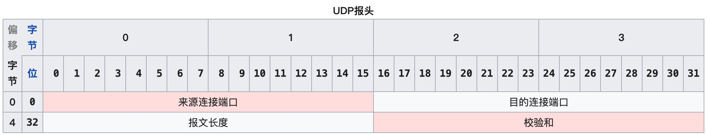
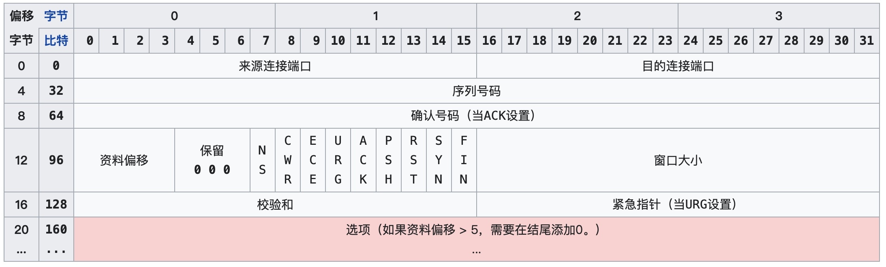

# 目录

# 概述

运输层为运行在不同主机上的应用程序提供直接的通信服务起着至关重要的作用

计算机网络的一个基础性问题之一是两个实体怎样才能在一种会丢失或损坏数据的媒体上可靠地通信，运输层的TCP可靠传输协议正是被设计用来解决此问题

除此之外，控制运输层实体的传输速率以避免网络中的拥塞，或从拥塞中恢复过来，是第二个基础性问题，TCP的**拥塞控制**方法有效解决此类问题

**运输层协议为运行在不同主机上的应用进程之间提供了逻辑通信功能**，从应用程序的角度看，通过逻辑通信，运行不同进程的主机好像直接相连了一样；实际上，这些主机可能位于地球的两侧，通过很多路由器以及不同的通信链路相连。应用进程使用运输层提供的逻辑通信功能彼此发送报文，而无须考虑承载这些报文的物理基础措施的细节

运输层协议是在端系统中实现的，而并不是在路由器中实现。在发送端，运输层将从发送应用进程接收到的报文转换成运输层分组，运输层分组称为**报文段(segment)**。实现的方法是将应用报文划分为较小的块，并为每块加上一个运输层首部以生成运输层报文段。然后再发送端系统中，运输层将这些报文段传递给网络层，网络层将其封装成网络层分组（称为数据报）并向目的地发送。

> 网络层只会关心数据报的网络层字段，它不会检查封装在数据报内的运输层报文段的字段

在接收端，网络层从数据报中提取运输层报文段，并将该报文段向上交给运输层。运输层处理收到的报文段，将报文段中的数据交付给接收应用进程使用

运输层提供两种主要协议：

* **TCP(传输控制协议)**，它为调用它的应用程序提供了一种可靠的、面向连接的服务
* **UDP(用户数据报协议)**，它为调用它的应用程序提供了一种不可靠、无连接的服务

**此处将TCP和UDP的分组统称为报文段**

> 在学习运输层之前，简要了解下网络层，网络层使用IP协议，即网际协议。IP为主机之间提供了逻辑通信，IP的服务模型是尽力而为交付服务。意味着它并不做任何确保，它不确保报文的交付，不保证报文段的按序交付，不保证报文段中数据完整性。**IP被称为不可靠服务**

TCP和UDP最基本的责任是，将两个端系统间IP的交付服务扩展为运行在端系统上的两个进程之间的交付服务。将主机间的交付服务扩展到进程间交付被称为运输层的**多路复用(transport-layer multiplexing)**与**多路分解(demultiplexing)**

TCP和UDP还可以通过在其报文段首部中包括差错检查字段而提供完整性检查。进程到进程的数据交付和差错检查是两种最低限度的运输层服务，也是UDP所能提供的仅有的两种服务

TCP提供了集中附加服务，首先，它提供**可靠数据传输(reliable data transfer)**，通过流量控制、序号、确认和定时器确保正确地、按序地将数据从发送进程交付给接收进程。这样，TCP就将两个端系统间的不可靠IP服务转换成了一种进程间的可靠数据服务

TCP还提供了**拥塞控制(congestion control)**，拥塞控制与其说是一种提供给调用它的应用程序的服务，不如说是一种提供给整个因特网的服务。**因为它防止任何一条TCP连接用过多流量来淹没通信主机之间的链路和交换设备**，可以通过调节TCP连接的发送端发送进网络的流量速率来做到（UDP流量是不受管制的，使用UDP传输的应用可以根据其需要以其愿意的任何速率发送数据）

# 多路复用与多路分解

**将由网络层提供的主机到主机交付服务延伸到为运行在主机上的应用程序提供进程到进程的交付服务**

多路复用与多路分解服务是所有计算机网络都需要的

在源主机从不同的socket中收集数据块，并为每个数据块封装上首部信息从而生成报文段，然后将这些报文段传递到网络层，这些工作称为**多路复用(multiplexing)**

将运输层报文段中的数据交付到正确的socket的工作称为**多路分解(demultiplexing)**

多路复用有两个基本要求是:

* socket有唯一标识符
* 每个报文段有特殊字段来指示该报文段所要交付到的socket

这些特殊字段就是**源端口号字段(source port number field)**和**目的端口号字段(destination port number field)**

运输层的多路分解服务：在主机上的每个socket能够分配一个端口号，当报文段到达主机时，运输层检查报文段中的目的端口号，并将其定向到相应的socket。然后报文段中的数据通过socket进入其所连接的进程。UDP大体上就是这样做的，而TCP中的多路复用与多路分解更为复杂

**UDP使用二元组socket(目的主机IP地址+端口号)，而TCP使用四元组socket(源IP地址、端口号，目的IP地址、端口号)**

# UDP

UDP除了复用/分解功能以及少量的差错检测外，它几乎没有对IP增加别的东西。UDP从应用进程得到数据，**附加上用于多路复用/分解服务的源和目的端口号字段**，以及两个其他的小字段，然后将形成的报文段交给网络层

网络层将该运输层保温封装到一个IP数据报中，然后尽力而为地尝试将报文段中的数据交付给正确应用进程

值得注意的是，使用UDP时，在发送报文段之前，发送方和接收方的运输层实体之间没有握手，正因为如此，**UDP被称为是无连接的**

什么应用更适合用UDP，可以参考以下几点：

* 关于发送什么数据以及何时发送的应用层控制更为精细

  实时应用通常要求最小的发送速率，不希望过分地延迟报文段的传送，且能够容忍一些数据丢失，此类应用试用使用UDP，因为TCP有拥塞控制机制，当通信链路变得拥塞时，TCP会遏制发送方

* 无须建立连接

  TCP在开始数据传输之前要经过三次握手，而UDP不需要，因此UDP不会引入建立连接的时延

* 无连接状态

  TCP需要在端系统中维护连接状态，包括接收和发送缓存、拥塞控制参数以及序号与确认号等参数。

  UDP不维护连接状态，也不跟踪参数

* 分组首部开销小

  每个TCP报文段都有20字节的首部开销，而UDP仅有8字节的开销

## UDP报文结构

    

UDP报头包括4个字段，每个字段占用2个字节

长度指定UDP报头和数据总共占用的长度

校验和字段可以用于发现头部信息和数据中的传输错误

UDP校验和提供了差错检测功能，用于确定当UDP报文从源到达目的地移动时，其中的bit是否发生了改变。发送方的UDP对报文段中的所有16bit字的和进行反码运算，求和时遇到的任何溢出都被回卷（回卷的意思是将溢出的进位添加到和的尾部）。得到的结果放在UDP报文段中的检验和字段。接收方只要将所有的16bit字加在一起，如果分组没错，结果就是`1111111111111111`，否则分组出现差错

# 可靠传输服务基础

自动重传请求(Automatic Repeat reQuest，ARQ)协议，它通过使用**确认**和**超时**这两个机制，在不可靠服务的基础上实现可靠的信息传输。如果发送方在发送后一段时间之内没有收到确认帧，它通常会重新发送。ARQ可能包括停止等待ARQ协议和连续ARQ协议，错误检测（Error Detection）、正面确认（Positive Acknowledgment）、超时重传（Retransmission after Timeout）和 负面确认及重传（Negative Acknowledgment and Retransmission）等机制

## 停止并等待ARQ

1. 发送点对接收点发送数据包，然后等待接收点回复ACK并且开始计时
2. 在等待过程中，发送点停止发送新的数据包
3. 当数据包没有成功被接收点接收时候，接收点不会发送ACK。这样发送点在等待一定时间后，重新发送数据包
4. 反复以上步骤直到收到从接收点发送的ACK

## 连续ARQ

为了克服停止并等待ARQ协议长时间等待ACK的缺点。这个协议会连续发送一组数据包，然后再等待这些数据包的ACK

### 回退N重传

- 接收点丢弃从第一个没有收到的数据包开始的所有数据包
- 发送点收到NACK后，从NACK中指明的数据包开始重新发送

### 选择重传

- 发送点连续发送数据包但对每个数据包都设有个一个计时器
- 当在一定时间内没有收到某个数据包的ACK时，发送点只重新发送那个没有ACK的数据包

# 面向连接的运输：TCP

## TCP连接

TCP被称为是面向连接的，这是因为在一个应用进程可以开始向另一个应用进程发送数据之前，这两个进程必须先相互"握手"，即它们必须相互发送某些预备的报文段，以建立确保数据传输的参数

简单描述一下建立连接过程：客户端首先发送一个特殊的TCP报文段，服务器用另一个特殊的TCP报文段来响应，最后，客户再用第三个特殊报文段作为响应。前两个报文段不附带应用层数据，而第三个报文段可以附带应用层数据。由于两台主机之间发送了3个报文段，所以TCP连接建立过程被称为**三次握手(three-way handshake)**

一旦连接建立就可以相互发送数据，考虑客户端向服务端发送数据：客户进程通过socket传递数据流，数据一旦通过socket，它就由客户端中的TCP控制了，TCP先将数据存放在**发送缓存(send buffer)**里，发送缓存是发起三次握手期间设置的缓存之一。接下来，TCP定时从发送缓存里取出一块数据，并将数据传递给网络层。TCP从缓存中取出放入报文段中的数据长度受限于**最大报文段长度(Maximum Segment Size，MSS)**，它通常根据本地发送主机发送的最大链路层长度(即所谓的**最大传输单元(MTU)**)来确定，例如MTU为1500字节，即MSS等于1460字节，减去的40字节为TCP/IP首部长度

TCP为每块客户数据配上一个TCP首部，从而形成多个**TCP报文段(TCP segment)**，下传给网络层，网络层封装这些段为IP数据报，随后发送到网络中。当TCP的另一端即服务端接收到一个报文段后，该报文段的数据就被放入该TCP连接的接收缓存中，应用程序通过socket从此缓存中读取数据流。TCP连接的每一端都有各自的发送缓存和接收缓存

## TCP报文段结构

TCP报文段由首部字段和一个数据字段组成，首部字段用于记录TCP传输的信息，数据字段包含一块应用数据，如前所述，MSS限制了报文段数据字段的最大长度，当TCP发送发送一个大文件，TCP通常是将文件划分成长度为MSS的若干块(最后一块小于MSS)，

    

上图展示了TCP报头结构，与UDP一样，首部包括**源端口号**和**目的端口号**，用于**多路复用/分解**来自或送到上层应用的数据，TCP首部同样包括**校验和**字段。TCP报文首部还包含以下字段：

* 32位**序列号码(sequence number field)**和32位**确认号码(acknowledgment number field)**，这些字段被TCP发送方和接收方用来实现可靠数据传输服务
* 16位的**接收窗口字段(receive window field)**，该字段用于流量控制，表明接收方愿意接受的字节数量
* 4位的**首部长度字段(header length field)**(资料偏移)，表明以32位的字为单位的TCP首部长度。由于TCP选项字段的原因，TCP首部长度是可变的。（通常选项字段为空，所以TCP首部的典型长度是20字节）

* **标志字段(flag field)**，**ACK**位用于指示确认字段中的值是有效的，即该报文段包括一个对已被成功接收报文段的确认。RST、SYN和FIN位用于连接建立和断开。CWR和ECE位用于拥塞通告。PSH位用于表明接收方应立即将数据交给上层。最后，URG位用来表示报文段里存在着被发送端的上层实体置为"紧急"的数据，

# 小结

这篇仅仅是传输层的概述，非常多的内容还没展开学习回顾
