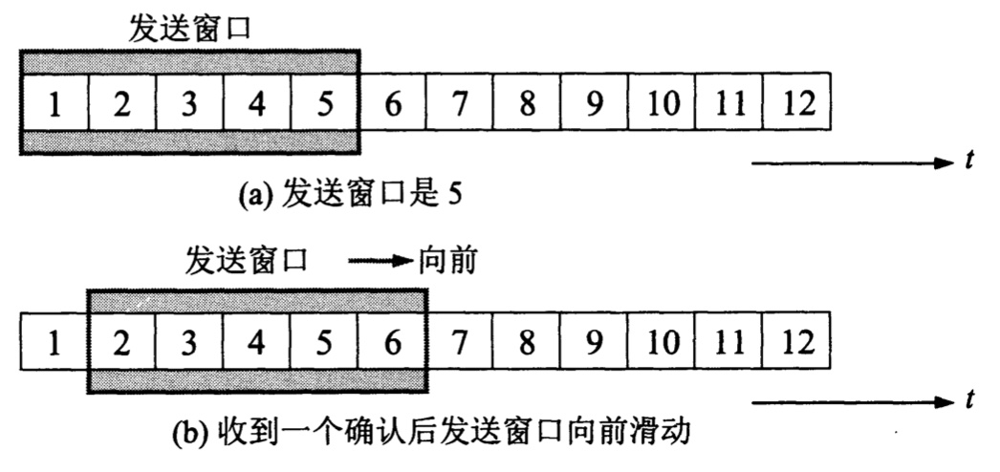

TCP传输报文需要用到IP层传送，但IP层只能提供最大努力服务，也是说，TCP下面的网络所提供的是不可靠的传输，因此TCP必须采用适当的措施才能使得两个运输层之间的通信变得可靠

理想的传输条件有以下两个特点:

- 传输信道不产生差错
- 不管发送方以多块的速度发送数据，接收方总是来得及处理收到的数据

实际中的网络并不具备以上两个理想条件，但我们可以使用一些可靠传输协议，**当出现差错时让发送方重传出现差错的数据**，**同时在接收方来不及处理收到的数据时，及时告知发送方适当降低发送数据的速度**

下面由简单到复杂的顺序描述可靠传输协议

# 自动重传请求(Automatic Repeat-reQuest，ARQ)

**ARQ是OSI模型中数据链路层和传输层的错误纠正协议之一**。它通过使用**确认**和**超时**这两个机制，在不可靠服务的基础上实现可靠的信息传输。**如果发送方在发送后一段时间之内没有收到确认帧，它通常会重新发送**。ARQ可能包括**停止等待ARQ协议**和**连续ARQ协议**，错误检测（Error Detection）、正面确认（Positive Acknowledgment）、超时重传（Retransmission after Timeout）和 负面确认及重传（Negative Acknowledgment and Retransmission）等机制

# 停止并等待ARQ协议
停止并等待，指的是每发送完一个分组就停止发送，等待对方的确认。在收到确认后再发送下一个分组

以下考虑主机A向主机B发送分组

1. 无差错情况 

下图的(a)表示传输分组时的无差错情况。A发送分组M1，发送完就暂停发送，等待B确认。B收到M1就向A发送确认。A收到了对M1的确认后，就再发送下一个分组M2。后面的分组以此类推

2. 出现差错

下图的(b)是分组在传输过程中出现差错的情况。B接收到M1时检测出了差错，就丢弃M1(不通知A收到有差错的分组)；也可能是M1在传输过程中丢失了，这时B什么都不知道。在这两种情况下，B都不会发送任何消息。

    

可靠传输协议是这样设计：A只要超过了一段时间没有收到确认，就认为刚才发送的分组丢失了，因而重传前面发送过的分组，这就叫做**超时重传**。要实现超时重传，就要在每发送完一个分组时设置一个**超时计时器**。如果在超时计时器到期之前收到对方的确认，就撤销该超时计时器。

注意以下三点：

* A在发送完一个分组后，**必须暂时保留已发送的分组的副本**，只有收到相应的确认后才能清除暂时保留的分组副本

* 分组和确认分组都必须进行**编号**，这样才能区分哪个分组收到了确认

* **重传时间应比数据在分组传输的平均往返时间更长一些**。传输层重传时间的准确设定非常复杂，因为时间太长则影响通信效率，太短则会导致频繁的分组重传，也会浪费网络资源。

3. 确认丢失和确认迟到

假设B收到M1后，发送的对M1的确认丢失了，A在设定的超时重传时间内没有收到确认，并无法知道是自己发送的分组出错、丢失，或者是B发送的确认丢失了。因此A在超时计时器到期后就要重传M1。现在注意B的情况，假设B又收到了重传的分组M1，这时应采取两个行动：

* **丢弃这个重复的分组M1**，不向上层交付
* **向A发送确认**，不能认为已经发送过确认就不再发送，因为A之所以重传M1就表示A没有收到对M1的确认

确认迟到这种情况则是，B对分组M1的确认迟到了，A会收到重复的确认，对重复的确认处理很简单：收下后就丢弃。

使用上述的确认和重传机制，我们就可以在**不可靠的传输网络上实现可靠的通信**

上述这种可靠传输协议称为**自动重传请求ARQ(Automatic Repeat reQuest)**

**由于停止等待协议的信道利用率低问题，通常会通过流水线传输提高传输效率，连续ARQ协议和滑动窗口协议是一种改进**

# 连续ARQ协议

下图a表示发送方维持的**发送窗口**，它的意义是：**位于发送窗口内的5个分组都可连续发出去，而不需要等待对方的确认**。如此一来信道利用率就提高了

    

连续ARQ协议规定，发送方每收到一个确认，就把发送窗口向前滑动一个分组的位置。图b表示发送方收到了对第一个分组的确认，于是把发送窗口向前移动一个分组位置。如果原来已经发送了前5个分组，那么现在就可以发送窗口内的第6个分组

接收方一般采用**累积确认**方式，也就是说，接收方不必对收到的分组逐个发送确认，而是在收到几个分组会后，**对按序到达的最后一个分组发送确认**，这表示：到这个分组为止的所有分组都已正确收到了

累积确认有优点也有缺点，优点是：容易实现，即使确认丢失也不必重传。缺点是：不能向发送方反映出接收方已经正确收到的所有分组的信息

例子：如果发送方发送了前5个分组，而中间的第3个分组丢失了。这时接收方只能对前两个分组发出确认。发送方无法知道后面三个分组的下落，而只好把后面的三个分组都再重传一次。这就叫做Go-back-N(回退N)，表示需要再退回来重传已发送过的N个分组。可见当通信线路质量不好时，连续ARQ协议会带来负面影响，因为它需要不断重复发送后面的分组

