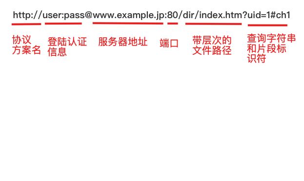

# 目录

   * [TCP/IP](#tcpip)
      * [TCP/IP协议族](#tcpip协议族)
      * [分层管理](#分层管理)
      * [通信传输流](#通信传输流)
      * [URI和URL](#uri和url)
         * [URI格式](#uri格式)

# TCP/IP

## TCP/IP协议族

通常使用的网络（包括互联网）是在TCP/IP协议族的基础上运作的

TCP/IP协议族非常庞大，需要进一步学习，得花不少心思，本篇主要简述TCP/IP协议族，学习回顾这部分的内容

计算机要与网络设备互相通信，双方就需要用相同的方法，如何探测到通信目标，由哪一边发起通信，使用哪种语言进行通信，怎样结束通信等规则都需要事先确定，不同的硬件、操作系统之间有不同的规则，因此所有这一切都需要确定一种规则，这种规则我们称为**协议**

TCP/IP协议有很多种说法，其一是把与互联网相关联的协议集合起来总称为TCP/IP；其二是单纯指TCP和IP这两种协议

## 分层管理

TCP/IP协议族按层次分别分为**应用层**、**传输层**、**网络层**、**数据链路层** 4层

分层的好处是**每一层针对解决特定的问题，每层的内部设计能够自动改动，通过对外层提供接口服务。层次化的结构，设计起来变得相对简单**

**应用层**，主要向用户提供服务，比如FTP（文件传输协议）、DNS（域名系统）、HTTP（超文本传输协议）等等

**传输层**，向应用层提供服务，提供处于网络连接中的两台计算机之间的数据传输，主要协议部分为**TCP**（传输控制协议）、**UDP**（用户数据报协议）这两个协议

**网络层**，处理网络上流动的数据报，数据包是网络传输的最小数据单位，该层规定数据包通过怎样的传输路线到达对方的计算机。**确定通过多台计算机或网络进行传输这一过程，称之为路由(routing)**

**数据链路层**，表示处理连接网络的**硬件部分**，即网络适配器、光纤等物理可见部分(包括一切传输媒介)

数据单元在各层的命名

| 层次       | 命名                                                         |
| ---------- | ------------------------------------------------------------ |
| 应用层     | 报文(message)                                                |
| 传输层     | TCP: 流(Stream) 数据分组称为分段(Segment) UDP: 数据分组称为Message |
| 网络层     | 数据报(Datagram)，数据分组称为分片(Fragment)                 |
| 数据链路层 | 数据帧(frame)                                                |

**数据在TCP层称为流(Stream)，数据分组称为分段或报文段(Segment)，UDP中分组称为Message。数据在IP层称为Datagram，数据分组称为分片(Fragment)。数据在数据链路层称为数据帧(frame)**

## 通信传输流

有了分层的概念，就通过一次数据请求来说说数据流，以下HTTP为例

通常而言请求发送端为客户端，从应用层开始，发出一个请求Web页面内容的请求，交给传输层处理

传输层(TCP协议)将从应用层处收到的数据（HTTP请求报文）进行分割，并在各个报文上加上本协议的字段内容（序号、端口号等等），交给网络层处理

网络层（IP协议），对上层的内容增加目的地址（MAC地址）后转发给数据链路层

整个发送过程如上，服务器接收到对应数据包后，按照逆过程处理，将底层的数据包从下层往上的顺序解开（将首部去掉），最后得到应用层的数据，处理该次请求

发送过程时，把这种将数据信息包装起来的做法称为**封装**

## URI和URL

URI是Uniform Resource Identifier的缩写

Uniform : 规定统一的格式可方便处理多种不同类型的资源，而不用根据上下文环境来识别资源指定的访问方式

Resource ：资源，定义是"可标识的任何东西"

Identifier ： 表示可标识的对象，也称为标识符

URI就是由某个协议方案表示的资源的定位标识符，协议方案是指访问资源所使用的协议类型名称

URI用字符串标识某一互联网资源，而URL表示资源的地点（互联网上所处的位置）。URL是URI的子集

### URI格式

在理解的基础上，可以用URL替换URI，下面用URL描述，URL可分为绝对URL和相对URL

绝对URL表示资源的完整路径

相对URL以包含 URL 本身的位置为参考点，描述目标资源的位置

    

| 字段             | 描述                                                         |
| ---------------- | ------------------------------------------------------------ |
| 登陆认证信息     | 指定用户名和密码作为从服务器端获取资源时必要的登陆信息，可选项 |
| 服务器地址       | DNS可解析的名称，或是IPV4、IPV6地址                          |
| 服务器端口号     | 指定服务器连接的网络端口号，可选项，省略则使用默认端口号     |
| 带层次的文件路径 | 指定服务器上的文件路径来定位特定的资源                       |
| 查询字符串       | 针对指定的文件路径内的资源，使用查询字符串传入任意参数，可选项 |
| 片段标识符       | 标记出已获取资源的子资源，RFC文档没有明确使用方法，可选项    |

