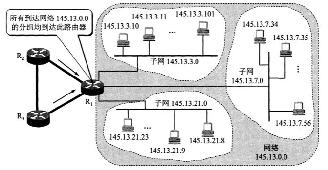

**网络层向上只提供简单灵活的、无连接的、尽最大努力交付的数据报服务**

网络在发送分组时不需要先建立连接。每一个分组(也就是IP数据报)独立发送，与其前后的分组无关(不进行编号)。**网络层不提供服务质量的承诺**，也就是说，所传送的分组可能出错、丢失、重复和失序。可靠的传输交给网络的主机中的运输层负责。采用这种设计思路的好处是：网络造价大大降低，运行方式灵活，能够适应多种应用。

# 网际协议IP

网际协议IP是TCP/IP体系中两个最主要的协议之一，也是最重要的互联网标准协议之一。严格来说，这里所讲的IP其实是IP的第4个版本，应记为IPV4

与IP协议配套使用的还有三个协议：

* **地址解析协议ARP**
* **网际控制报文协议ICMP**
* **网际组管理协议IGMP**

# 分类的IP地址

在TCP/IP中，IP地址是一个最基本的概念

## IP地址及其表示方法

整个的互联网就是一个单一的、抽象的网络。IP地址就是给互联网上的每一台主机(或路由器)的每一个接口分配一个在全世界范围内是唯一的32位的标识符。IP地址的结构使我们可以在互联网上很方便地进行寻址。**IP地址现在由互联网名字和数字分配机构ICANN进行分配**

IP地址的编址方法经历三个历史阶段

1. **分类的IP地址** 最基本的编址方法
2. **子网的划分** 对最基本的编址方法的改进
3. **构成超网** 比较新的无分类编址方法

### 分类的IP地址

所谓"分类的IP地址"，就是将IP地址划分为若干个固定类，每一类地址都由两个固定长度的字段组成，第一个字段是**网络号**(net-id)，它标志主机(或路由器)所连接到的网络。一个网络号在整个互联网范围内必须是唯一的。第二个字段是**主机号**(host-id)，它标志该主机(或路由器)。一台主机号在它前面的网络号所指明的网络范围内必须是唯一的。这种两级的IP地址可以记为：

**IP地址 ::= {<网络号>，<主机号>}**

下图给出了各种IP地址的网络号字段和主机号字段，A、B、C类地址都是**单播地址**(一对一通信)，是最常用的

    

* A、B、C类地址的网络号字段分别为1个、2个和3个字节长，而在网络号字段的最前面有1~3位的类别位，其数值分别规定为0、10、110
* A、B、C类地址的主机号字段分别为3个、2个和1个字节长
* D类地址(前4位是1110)用于多播(一对多通信)
* E类地址(前4位是1111)保留为以后用

**这里要指出，由于近年来已经广泛使用无分类IP地址进行路由选择，A、B、C类地址的区分已成为历史**

从IP地址的结构来看，IP地址并不仅仅指明一台主机，而还指明了主机所连接到的网络

设计初衷：因为各种网络的差异很大，有的网络拥有很多主机，而有的网络上的主机则很少。把IP地址划分为A类、B类、C类是为了更好地满足不同用户的要求。当某个单位申请到一个IP地址时，实际上是获得了具有同样网络号的一块地址。其中具体的各台主机号则由该单位自行分配，只要做到在该单位管辖的范围内无重复的主机号即可

对主机或路由器来说，IP地址都是32位的二进制码。为了提高可读性，我们常常把32位的IP地址中的每8位插入一个空格(但在机器中并没有这样的空格)。为了便于书写，可用其等效的十进制数字表示，并且在这些数字之间加上一个点。这就叫做**点分十进制记法**。

    

####  常用的三种类别的IP地址

A类地址的网络号字段占1个字节，只有7位可供使用(该字段的第一位已固定为0)，所以可指派的网络号是126个(即2的7次方 - 2)。减2的原因是：第一，IP地址中的全0表示"**这个(this)**"。网络号字段为全0的IP地址是个保留地址，意思是"**本网络**"；第二，网络号为127(即01111111)保留作为本地软件**环回测试**(loopback test)本主机的进程之间的通信之用。若主机发送一个目的地址为环回地址(如127.0.0.1)的IP数据报，则本主机中的协议软件就处理数据报中的数据，而不会把数据报发送到任何网络。目的地址为环回地址的IP数据报永远不会出现在任何网络上，因为网络号为127的地址根本不是一个网络地址

A类地址的主机号占3个字节，因此每一个A类网络中的最大主机数是**2的24次方 - 2**，即**16777214**。减2的原因是：全0的主机号字段表示该IP地址是"本主机"所连接到的**单个网络地址**(例如，一主机的IP地址为5.6.7.8，则该主机所在的网络地址就是5.0.0.0)，而全1表示"**所有的(all)**"，因此全1的主机号字段表示该网络上的所有主机

**IP地址空间共有2的32次方(即4294967296)个地址。整个A类地址空间共有2的31次方个地址，占整个IP地址空间的50%**

B类地址的网络号字段占2个字节，但前面两位(10)已经固定，所以剩下14位可以进行分配。因为网络号字段后面的14位无论怎样取值也不可能出现使整个2字节的网络号字段成为全0或全1，因此这里不存在网络总数减2的问题。**但实际上B类网络地址128.0.0.0是不指派的，而可以指派的B类最小网络地址是128.1.0.0。因此B类地址可指派的网络数为2的14次方 - 1，即16383**。B类地址的每一个网络上的最大主机数是2的16次方 - 2，即65534。减2是因为要扣除全0和全1的主机号。整个B类地址空间共约有2的30次方个地址，占整个IP地址空间的25%

C类地址有3个字节的网络号字段，最前面的3位是(110)，还有21位可以进行分配。**C类网络地址192.0.0.0也是不指派的，可以指派的C类最小网络地址是192.0.1.0。因此C类地址可指派的网络总数是2的21次方 - 1，即2097151**。每一个C类地址的最大主机数是2的8次方 - 2，即254。整个C类地址空间共约有2的29次方个地址，占整个IP地址的12.5%

    

特殊IP地址

    

IP地址特点：

* 每个IP地址由网络号和主机号组成。它是一种分等级的地址结构。分两个等级的好处是：第一，IP地址管理机构在分配IP时只分配网络号(第一级)，而剩下的主机号(第二级)则由得到该网络号的单位自行分配。第二，路由器**仅根据目的主机所连接的网络号来转发分组**(而不考虑目的主机号)，这样就可以使路由表中的项目数大幅度减少，从而**减小了路由表所占的存储空间以及查找路由表的时间**
* 实际上IP地址是标志一台主机(或路由器)和一条链路的**接口**。当一台主机同时连接到两个网络上时，该主机就必须同时具有两个相应的IP地址，其网络号必须是不同的。这种主机称为**多归属主机**。由于一个路由器至少应当连接到两个网络，因此一个路由器至少应当连接到两个网络，因此一个路由器至少应当有两个不同的IP地址
* 按照互联网的观点，一个网络是指具有相同网络号net-id的主机的集合，因此，**用转发器或网桥连接起来的若干个局域网仍为一个网络**。因为这些局域网都具有同样的网络号。具有不同网络号的局域网必须使用路由器进行互连

# 划分子网和构造超网

由于分类的IP地址，空间利用率很低，且不够灵活。为了解决这些问题，**就在IP地址中又增加了一个"子网号字段"，使两级IP地址变为三级IP地址，这种做法叫做划分子网(subnetting)**

划分子网的基本思路如下：

1. 一个拥有许多物理网络的单位，可将所属的物理网络划分为若干个子网。划分子网纯属一个单位内部的事情，本单位以外的网络看不见这个网络由多少个子网组成

2. 划分子网的方法是从网络的主机号借用若干位作为子网号(subnet-id)，当然主机号也就相应减少了同样的位数。于是两级IP地址在本单位内部就变为三级IP地址：网络号、子网号和主机号

   IP地址 ::= {<网络号>，<子网号>，<主机号>}

3. 凡是从其他网络发送给本单位某台主机的IP数据报，仍然是根据IP数据报的目的网络号找到连接在本单位网络上的路由器。但此路由器在收到IP数据报后，再按目的网络号和子网号找到目的子网，把IP数据报交付目的主机

下图例子说明划分子网的概念，某单位拥有一个B类IP地址，网络地址是**145.13.0.0(网络号是145.13)**。凡是目的地址为145.13.x.x的数据报都被送到这个网络上的路由器R1

    

现在将这个网络划分为三个子网(见下图)，这里假定子网号占用8位，因此在增加了子网号后，主机号就只有8位。所划分的三个子网分别是：**145.13.3.0，145.13.7.0和145.13.21.0**。在划分子网后，整个网络对外部仍表现为一个网络，其网络地址仍为**145.13.0.0**。但网络145.13.0.0上的路由器R1在收到外来的数据报后，再根据数据报的目的地址把它转发给相应的子网

    

那么，路由器是如何转发数据报到对应子网的呢？**使用子网掩码**

    

图中(a)是IP地址为145.13.3.10的主机本来的两级IP地址结构，(b)是这个两级IP地址的子网掩码。(c)是同一地址的三级IP地址结构，也就是说，现在从原来16位的主机号中拿出8位作为子网号，而主机号由16位减少到8位。**注意，现在子网号为3的网络的网络地址是145.13.3.0**。为了让路由器R1能够方便地从数据报中的目的IP地址中提取出所要找的子网的网络地址，路由器R1就要使用三级IP地址的子网掩码(图中的d)。**(e)表示R1把三级IP地址的子网掩码和收到的数据报的目的IP地址145.13.3.10逐位相"与"(AND)**，得出了所要找的子网的网络地址为145.13.3.0

使用子网掩码的好处就是：不管网络有没有划分子网，只要把子网掩码和IP地址进行逐位的"与"运算，就立即得出网络地址来。这样在路由器处理到来的分组就可采用同样的算法

这里还要弄清楚一个问题，就是：在不划分子网时，为什么还要使用子网掩码？这就是为了更便于查找路由表。现在互联网的标准规定：所有的网络都必须使用子网掩码，同时在路由器的路由表中也必须有子网掩码这一栏。如果一个网络不划分子网，那么该网络的子网掩码就使用**默认子网掩码**

A类地址默认的子网掩码是255.0.0.0，或0XFF000000

B类地址默认的子网掩码是255.255.0.0，或0XFFFF0000

C类地址默认的子网掩码是255.255.255.0，或0XFFFF0000

**子网掩码是一个网络或一个子网的重要属性**。路由器在和相邻路由器交换路由信息时，必须把自己所在网络(或子网)的子网掩码告诉相邻路由器。在路由器的路由表中的每一个项目，除了要给出目的网络地址外，还必须同时给出该网络的子网掩码。若一个路由器连接在两个子网上就拥有两个网络地址和两个子网掩码

---

划分子网在一定程度上缓解了互联网在发展中遇到的困难，但是随着互联网发展，也将继续面临很多问题：

1. B类地址在1992年已分配了近一半
2. 互联网主干网上的路由表中的项目数急剧增长
3. 整个IPv4的地址空间已经在2011年2月3日耗尽

**前面两个问题采用无分类编址方法来解决，第三个问题使用IPv6来解决**

无分类编址的正式名称是**无分类域间路由选择CIDR**(Classless Inter-Domain Routing)

CIDR最主要的特点有两个：

1. CIDR消除了传统的A类、B类和C类地址以及划分子网的概念，因而更加有效地分配IPv4的地址空间，并且在新的IPv6使用之前容许互联网的规模继续增长。CIDR把32位的IP地址划分为前后两个部分。前面部分是"**网络前缀**"(network-prefix)，用来指明网络，后面部分则用来指明主机。因此CIDR使IP地址从三级编址又回到了两级编址，但这已是**无分类的两级编址**，记法如下：

   IP地址 ::={<网络前缀>，<主机号>}

   CIDR使用"**斜线记法**"，或称为CIDR记法，**即在IP地址后面加上斜线"/"，然后写上网络前缀所占的位数**

2. CIDR把网络前缀都相同的连续的IP地址组成一个"**CIDR地址块**"。我们只要知道CIDR地址块中的任何一个地址，就可以知道这个地址块的起始地址和最大地址，以及地址块中的地址数。例如，已知IP地址128.14.35.7/20是某CIDR地址块中的一个地址，现在把它写成二进制表示，其中前20位是网络前缀，后12位是主机号

   
    
   
   

   这个地址所在的地址块中的起始地址和最大地址可以很方便地得出:

   
    
   
   

   以上两个特殊地址的主机号是全0和全1的地址，一般并不适用，通常只使用在这两个特殊地址之间的地址。不难看出，这个地址块共有2的12次方个地址。我们可以用地址块中的最小地址和网络前缀的位数指明这个地址块。例如，上面的地址块可记为**128.14.32.0/20**

为了更方便地进行路由选择，CIDR使用32位的**地址掩码**。地址掩码由一串1和一串0组成，而1的个数就是网络前缀的长度。虽然CIDR不使用子网了，但由于目前仍有一些网络还使用子网划分和子网掩码，因此CIDR使用的地址掩码也可继续成为**子网掩码**

注意，"CIDR不使用子网"是指CIDR并没有在32位地址中指明若干位作为子网字段。但分配到一个CIDR地址块的单位，仍然可以在本单位内根据需要划分出一些子网

由于一个CIDR地址块中有很多地址，所以在路由表中就利用CIDR地址块来查找目的网络。这种地址的聚合称为**路由聚合**，它使得路由表中的一个项目可以表示原来传统分类地址的很多个(例如上千个)路由。路由聚合也称为**构成超网**。路由聚合有利于减少路由器之间的路由选择信息的交换，从而提高了整个互联网的性能

# 网际控制报文协议ICMP

为了更有效地转发IP数据报和提高交付成功的机会，在网际层使用了**ICMP协议**。它允许主机或路由器报告差错情况和提供有关异常情况的报告。ICMP是互联网的标准协议。ICMP报文时装在IP数据报中，作为其中的数据部分。ICMP报文格式如下:

    

ICMP报文的种类有两种：**ICMP差错报告报文**和**ICMP询问报文**

| ICMP报文种类 | 类型值 | 类型                        |
| ------------ | ------ | --------------------------- |
| 差错报告报文 | 3      | 终点不可达                  |
|              | 11     | 时间超过                    |
|              | 12     | 参数问题                    |
|              | 5      | 改变路由(Redirect)          |
| 询问报文     | 8或0   | 回送(echo)请求或回答        |
|              | 13或14 | 时间戳(Timestamp)请求或回答 |

ICMP报文的代码字段是为了进一步区分某种类型中的几种不同情况。检验和字段用来校验整个ICMP报文。我们应当还记得，IP数据报首部的校验和并不校验IP数据报的内容，因此不能保证经过传输的ICMP报文不产生差错

* 终点不可达 当路由器或主机不能交付数据时就向源点发送终点不可达报文
* 时间超过 当路由器收到生存时间为0的数据报时，除丢弃该数据报外，还要向源点发送时间超过报文
* 参数问题 当路由器或目的主机收到的数据报的首部中有的字段的值不正确时，就丢弃该数据报，并向源点发送参数问题报文
