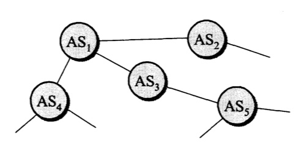

**网络层向上只提供简单灵活的、无连接的、尽最大努力交付的数据报服务**

网络在发送分组时不需要先建立连接。每一个分组(也就是IP数据报)独立发送，与其前后的分组无关(不进行编号)。**网络层不提供服务质量的承诺**，也就是说，所传送的分组可能出错、丢失、重复和失序。可靠的传输交给网络的主机中的运输层负责。采用这种设计思路的好处是：网络造价大大降低，运行方式灵活，能够适应多种应用。

# 网际协议IP

网际协议IP是TCP/IP体系中两个最主要的协议之一，也是最重要的互联网标准协议之一。严格来说，这里所讲的IP其实是IP的第4个版本，应记为IPV4

与IP协议配套使用的还有三个协议：

* **地址解析协议ARP**
* **网际控制报文协议ICMP**
* **网际组管理协议IGMP**

# 分类的IP地址

在TCP/IP中，IP地址是一个最基本的概念

## IP地址及其表示方法

整个的互联网就是一个单一的、抽象的网络。IP地址就是给互联网上的每一台主机(或路由器)的每一个接口分配一个在全世界范围内是唯一的32位的标识符。IP地址的结构使我们可以在互联网上很方便地进行寻址。**IP地址现在由互联网名字和数字分配机构ICANN进行分配**

IP地址的编址方法经历三个历史阶段

1. **分类的IP地址** 最基本的编址方法
2. **子网的划分** 对最基本的编址方法的改进
3. **构成超网** 比较新的无分类编址方法

### 分类的IP地址

所谓"分类的IP地址"，就是将IP地址划分为若干个固定类，每一类地址都由两个固定长度的字段组成，第一个字段是**网络号**(net-id)，它标志主机(或路由器)所连接到的网络。一个网络号在整个互联网范围内必须是唯一的。第二个字段是**主机号**(host-id)，它标志该主机(或路由器)。一台主机号在它前面的网络号所指明的网络范围内必须是唯一的。这种两级的IP地址可以记为：

**IP地址 ::= {<网络号>，<主机号>}**

下图给出了各种IP地址的网络号字段和主机号字段，A、B、C类地址都是**单播地址**(一对一通信)，是最常用的

    

* A、B、C类地址的网络号字段分别为1个、2个和3个字节长，而在网络号字段的最前面有1~3位的类别位，其数值分别规定为0、10、110
* A、B、C类地址的主机号字段分别为3个、2个和1个字节长
* D类地址(前4位是1110)用于多播(一对多通信)
* E类地址(前4位是1111)保留为以后用

**这里要指出，由于近年来已经广泛使用无分类IP地址进行路由选择，A、B、C类地址的区分已成为历史**

从IP地址的结构来看，IP地址并不仅仅指明一台主机，而还指明了主机所连接到的网络

设计初衷：因为各种网络的差异很大，有的网络拥有很多主机，而有的网络上的主机则很少。把IP地址划分为A类、B类、C类是为了更好地满足不同用户的要求。当某个单位申请到一个IP地址时，实际上是获得了具有同样网络号的一块地址。其中具体的各台主机号则由该单位自行分配，只要做到在该单位管辖的范围内无重复的主机号即可

对主机或路由器来说，IP地址都是32位的二进制码。为了提高可读性，我们常常把32位的IP地址中的每8位插入一个空格(但在机器中并没有这样的空格)。为了便于书写，可用其等效的十进制数字表示，并且在这些数字之间加上一个点。这就叫做**点分十进制记法**。

    

####  常用的三种类别的IP地址

A类地址的网络号字段占1个字节，只有7位可供使用(该字段的第一位已固定为0)，所以可指派的网络号是126个(即2的7次方 - 2)。减2的原因是：第一，IP地址中的全0表示"**这个(this)**"。网络号字段为全0的IP地址是个保留地址，意思是"**本网络**"；第二，网络号为127(即01111111)保留作为本地软件**环回测试**(loopback test)本主机的进程之间的通信之用。若主机发送一个目的地址为环回地址(如127.0.0.1)的IP数据报，则本主机中的协议软件就处理数据报中的数据，而不会把数据报发送到任何网络。目的地址为环回地址的IP数据报永远不会出现在任何网络上，因为网络号为127的地址根本不是一个网络地址

A类地址的主机号占3个字节，因此每一个A类网络中的最大主机数是**2的24次方 - 2**，即**16777214**。减2的原因是：全0的主机号字段表示该IP地址是"本主机"所连接到的**单个网络地址**(例如，一主机的IP地址为5.6.7.8，则该主机所在的网络地址就是5.0.0.0)，而全1表示"**所有的(all)**"，因此全1的主机号字段表示该网络上的所有主机

**IP地址空间共有2的32次方(即4294967296)个地址。整个A类地址空间共有2的31次方个地址，占整个IP地址空间的50%**

B类地址的网络号字段占2个字节，但前面两位(10)已经固定，所以剩下14位可以进行分配。因为网络号字段后面的14位无论怎样取值也不可能出现使整个2字节的网络号字段成为全0或全1，因此这里不存在网络总数减2的问题。**但实际上B类网络地址128.0.0.0是不指派的，而可以指派的B类最小网络地址是128.1.0.0。因此B类地址可指派的网络数为2的14次方 - 1，即16383**。B类地址的每一个网络上的最大主机数是2的16次方 - 2，即65534。减2是因为要扣除全0和全1的主机号。整个B类地址空间共约有2的30次方个地址，占整个IP地址空间的25%

C类地址有3个字节的网络号字段，最前面的3位是(110)，还有21位可以进行分配。**C类网络地址192.0.0.0也是不指派的，可以指派的C类最小网络地址是192.0.1.0。因此C类地址可指派的网络总数是2的21次方 - 1，即2097151**。每一个C类地址的最大主机数是2的8次方 - 2，即254。整个C类地址空间共约有2的29次方个地址，占整个IP地址的12.5%

    

特殊IP地址

    

IP地址特点：

* 每个IP地址由网络号和主机号组成。它是一种分等级的地址结构。分两个等级的好处是：第一，IP地址管理机构在分配IP时只分配网络号(第一级)，而剩下的主机号(第二级)则由得到该网络号的单位自行分配。第二，路由器**仅根据目的主机所连接的网络号来转发分组**(而不考虑目的主机号)，这样就可以使路由表中的项目数大幅度减少，从而**减小了路由表所占的存储空间以及查找路由表的时间**
* 实际上IP地址是标志一台主机(或路由器)和一条链路的**接口**。当一台主机同时连接到两个网络上时，该主机就必须同时具有两个相应的IP地址，其网络号必须是不同的。这种主机称为**多归属主机**。由于一个路由器至少应当连接到两个网络，因此一个路由器至少应当连接到两个网络，因此一个路由器至少应当有两个不同的IP地址
* 按照互联网的观点，一个网络是指具有相同网络号net-id的主机的集合，因此，**用转发器或网桥连接起来的若干个局域网仍为一个网络**。因为这些局域网都具有同样的网络号。具有不同网络号的局域网必须使用路由器进行互连

# 划分子网和构造超网

由于分类的IP地址，空间利用率很低，且不够灵活。为了解决这些问题，**就在IP地址中又增加了一个"子网号字段"，使两级IP地址变为三级IP地址，这种做法叫做划分子网(subnetting)**

划分子网的基本思路如下：

1. 一个拥有许多物理网络的单位，可将所属的物理网络划分为若干个子网。划分子网纯属一个单位内部的事情，本单位以外的网络看不见这个网络由多少个子网组成

2. 划分子网的方法是从网络的主机号借用若干位作为子网号(subnet-id)，当然主机号也就相应减少了同样的位数。于是两级IP地址在本单位内部就变为三级IP地址：网络号、子网号和主机号

   IP地址 ::= {<网络号>，<子网号>，<主机号>}

3. 凡是从其他网络发送给本单位某台主机的IP数据报，仍然是根据IP数据报的目的网络号找到连接在本单位网络上的路由器。但此路由器在收到IP数据报后，再按目的网络号和子网号找到目的子网，把IP数据报交付目的主机

下图例子说明划分子网的概念，某单位拥有一个B类IP地址，网络地址是**145.13.0.0(网络号是145.13)**。凡是目的地址为145.13.x.x的数据报都被送到这个网络上的路由器R1

    

现在将这个网络划分为三个子网(见下图)，这里假定子网号占用8位，因此在增加了子网号后，主机号就只有8位。所划分的三个子网分别是：**145.13.3.0，145.13.7.0和145.13.21.0**。在划分子网后，整个网络对外部仍表现为一个网络，其网络地址仍为**145.13.0.0**。但网络145.13.0.0上的路由器R1在收到外来的数据报后，再根据数据报的目的地址把它转发给相应的子网

    

那么，路由器是如何转发数据报到对应子网的呢？**使用子网掩码**

    

图中(a)是IP地址为145.13.3.10的主机本来的两级IP地址结构，(b)是这个两级IP地址的子网掩码。(c)是同一地址的三级IP地址结构，也就是说，现在从原来16位的主机号中拿出8位作为子网号，而主机号由16位减少到8位。**注意，现在子网号为3的网络的网络地址是145.13.3.0**。为了让路由器R1能够方便地从数据报中的目的IP地址中提取出所要找的子网的网络地址，路由器R1就要使用三级IP地址的子网掩码(图中的d)。**(e)表示R1把三级IP地址的子网掩码和收到的数据报的目的IP地址145.13.3.10逐位相"与"(AND)**，得出了所要找的子网的网络地址为145.13.3.0

使用子网掩码的好处就是：不管网络有没有划分子网，只要把子网掩码和IP地址进行逐位的"与"运算，就立即得出网络地址来。这样在路由器处理到来的分组就可采用同样的算法

这里还要弄清楚一个问题，就是：在不划分子网时，为什么还要使用子网掩码？这就是为了更便于查找路由表。现在互联网的标准规定：所有的网络都必须使用子网掩码，同时在路由器的路由表中也必须有子网掩码这一栏。如果一个网络不划分子网，那么该网络的子网掩码就使用**默认子网掩码**

A类地址默认的子网掩码是255.0.0.0，或0XFF000000

B类地址默认的子网掩码是255.255.0.0，或0XFFFF0000

C类地址默认的子网掩码是255.255.255.0，或0XFFFF0000

**子网掩码是一个网络或一个子网的重要属性**。路由器在和相邻路由器交换路由信息时，必须把自己所在网络(或子网)的子网掩码告诉相邻路由器。在路由器的路由表中的每一个项目，除了要给出目的网络地址外，还必须同时给出该网络的子网掩码。若一个路由器连接在两个子网上就拥有两个网络地址和两个子网掩码

---

划分子网在一定程度上缓解了互联网在发展中遇到的困难，但是随着互联网发展，也将继续面临很多问题：

1. B类地址在1992年已分配了近一半
2. 互联网主干网上的路由表中的项目数急剧增长
3. 整个IPv4的地址空间已经在2011年2月3日耗尽

**前面两个问题采用无分类编址方法来解决，第三个问题使用IPv6来解决**

无分类编址的正式名称是**无分类域间路由选择CIDR**(Classless Inter-Domain Routing)

CIDR最主要的特点有两个：

1. CIDR消除了传统的A类、B类和C类地址以及划分子网的概念，因而更加有效地分配IPv4的地址空间，并且在新的IPv6使用之前容许互联网的规模继续增长。CIDR把32位的IP地址划分为前后两个部分。前面部分是"**网络前缀**"(network-prefix)，用来指明网络，后面部分则用来指明主机。因此CIDR使IP地址从三级编址又回到了两级编址，但这已是**无分类的两级编址**，记法如下：

   IP地址 ::={<网络前缀>，<主机号>}

   CIDR使用"**斜线记法**"，或称为CIDR记法，**即在IP地址后面加上斜线"/"，然后写上网络前缀所占的位数**

2. CIDR把网络前缀都相同的连续的IP地址组成一个"**CIDR地址块**"。我们只要知道CIDR地址块中的任何一个地址，就可以知道这个地址块的起始地址和最大地址，以及地址块中的地址数。例如，已知IP地址128.14.35.7/20是某CIDR地址块中的一个地址，现在把它写成二进制表示，其中前20位是网络前缀，后12位是主机号

   
    
   
   

   这个地址所在的地址块中的起始地址和最大地址可以很方便地得出:

   
    
   
   

   以上两个特殊地址的主机号是全0和全1的地址，一般并不适用，通常只使用在这两个特殊地址之间的地址。不难看出，这个地址块共有2的12次方个地址。我们可以用地址块中的最小地址和网络前缀的位数指明这个地址块。例如，上面的地址块可记为**128.14.32.0/20**

为了更方便地进行路由选择，CIDR使用32位的**地址掩码**。地址掩码由一串1和一串0组成，而1的个数就是网络前缀的长度。虽然CIDR不使用子网了，但由于目前仍有一些网络还使用子网划分和子网掩码，因此CIDR使用的地址掩码也可继续成为**子网掩码**

注意，"CIDR不使用子网"是指CIDR并没有在32位地址中指明若干位作为子网字段。但分配到一个CIDR地址块的单位，仍然可以在本单位内根据需要划分出一些子网

由于一个CIDR地址块中有很多地址，所以在路由表中就利用CIDR地址块来查找目的网络。这种地址的聚合称为**路由聚合**，它使得路由表中的一个项目可以表示原来传统分类地址的很多个(例如上千个)路由。路由聚合也称为**构成超网**。路由聚合有利于减少路由器之间的路由选择信息的交换，从而提高了整个互联网的性能

# 网际控制报文协议ICMP

为了更有效地转发IP数据报和提高交付成功的机会，在网际层使用了**ICMP协议**。它允许主机或路由器报告差错情况和提供有关异常情况的报告。ICMP是互联网的标准协议。ICMP报文时装在IP数据报中，作为其中的数据部分。ICMP报文格式如下:

    

ICMP报文的种类有两种：**ICMP差错报告报文**和**ICMP询问报文**

| ICMP报文种类 | 类型值 | 类型                        |
| ------------ | ------ | --------------------------- |
| 差错报告报文 | 3      | 终点不可达                  |
|              | 11     | 时间超过                    |
|              | 12     | 参数问题                    |
|              | 5      | 改变路由(Redirect)          |
| 询问报文     | 8或0   | 回送(echo)请求或回答        |
|              | 13或14 | 时间戳(Timestamp)请求或回答 |

ICMP报文的代码字段是为了进一步区分某种类型中的几种不同情况。检验和字段用来校验整个ICMP报文。我们应当还记得，IP数据报首部的校验和并不校验IP数据报的内容，因此不能保证经过传输的ICMP报文不产生差错

* 终点不可达 当路由器或主机不能交付数据时就向源点发送终点不可达报文
* 时间超过 当路由器收到生存时间为0的数据报时，除丢弃该数据报外，还要向源点发送时间超过报文
* 参数问题 当路由器或目的主机收到的数据报的首部中有的字段的值不正确时，就丢弃该数据报，并向源点发送参数问题报文

# 路由选择协议

路由选择协议的核心是路由算法，即需要何种算法来获得路由表中的各项目。一个理想的路由算法应具有如下的一些特点：

1. 算法必须是正确的和完整的
2. 算法在计算上应简单
3. 算法应能适应通信量和网络拓扑的变化，也就是说要有自适应性
4. 算法应具有稳定性
5. 算法应是公平的
6. 算法应是最佳的，所谓最佳只能是相对于某一种特定要求下得出的较为合理的选择而已

根据路由算法能否随网络的通信量或拓扑自适应地进行调整变化来划分，则只有两大类，即**静态路由选择策略**与**动态路由选择策略**。动态路由选择也叫做自适应路由选择，其特点是能较好地适应网络状态的变化，但实现起来较为复杂，开销也比较大。因此，动态路由选择适用于较复杂的大网络

---

互联网采用的路由选择协议主要是**自适应的、分布式路由选择协议**。由于以下两个原因，互联网采用分层次的路由选择协议：

1. 互联网的规模非常大。如果让所有的路由器知道所有的网络应怎么到达，则这种路由表将非常大，处理起来也太花时间。而所有这些路由器之间交换信息所需的带宽就会使互联网的通信链路饱和
2. 许多单位不愿意外界了解自己单位网络的布局细节和本部门所采用的路由选择协议，但同时还希望连接到互联网上

为此，把整个互联网划分为许多较小的**自治系统**(autonomous system)，一般都记为AS。自治系统AS是在单一技术管理下的一组服务器，而这些路由器使用一种自治系统内部的路由选择协议和共同的度量。一个AS对其他AS表现出的是**一个单一的和一致的路由选择策略**。一个大的ISP就是一个自治系统

路由选择协议划分为两大类，即：

1. **内部网关协议IGP**(Interior Gateway Protocol)，即在一个自治系统内部使用的路由选择协议，而这与在互联网中的其他自治系统选用什么路由选择协议无关。目前这类路由选择协议使用得最大，如**RIP**和**OSPF**协议
2. **外部网关协议EGP** 若源主机和目的主机处在不同的自治系统中(这两个自治系统可能使用不同的内部网关协议)，当数据报传到一个自治系统的边界时，就需要使用一种协议将路由选择信息传递到另一个自治系统中，这样的协议就是外部网关协议EGP。目前使用最多的外部网关协议是BGP的版本4(**BGP-4**)

自治系统之间的路由选择也叫做**域间路由选择**(interdomain routing)，而在自治系统内部的路由选择叫做**域内路由选择**(intradomain routing)

## 内部网关协议RIP

RIP(Routing Infomation Protocol)是内部网关协议IGP中最先得到广泛使用的协议，它的中文名称叫做路由信息协议，但很少被使用。**RIP是一种分布式的基于距离向量的路由选择协议**，是互联网的标准协议，其最大优点就是简单

RIP协议要求网络中的每一个路由器都要维护从它自己到其他每一个目的网络的距离记录(因此，这是**一组距离**，即"**距离向量**")。RIP协议将"**距离**"定义如下：

从一路由器到直接连接的网络的距离定义为1。从一路由器到非直接连接的网络的距离定位为所经过的路由器数加1。"加1"是因为到达目的网络后就进行直接交付，而到直接连接的网络的距离已经定义为1

RIP协议的"**距离**"也称为"**跳数**"(hop count)，因为每经过一个路由器，跳数就加1。RIP认为好的路由就是它通过的路由器的数目少，即"距离短"。**RIP允许一条路径最多只能包含15个路由器。因此"距离"等于16时即相当于不可达**。可见RIP只适用于小型互联网

RIP不能在两个网络之间同时使用多条路由。RIP选择一条具有最少路由器的路由(即最短路由)，哪怕还存在另一条高速(低时延)但路由器较多的路由

除了RIP协议外，OSPF协议也是分布式路由选择协议。它们的共同特点就是每一个路由器都要不断地和其他一些路由器交换路由信息

我们一定要弄清以下三个要点，即**和哪些路由器交换信息？交换什么信息？在什么时候交换信息?**

RIP的做法是：

1. **仅和相邻路由器交换信息**。如果两个路由器之间的通信不需要经过另一个路由器，那么这两个路由器就是相邻的。RIP规定，不相邻的路由器不交换信息
2. 路由器交换的信息是**当前本路由器所知道的全部信息，即自己现在的路由表**。也就是说，交换的信息是："我到本自治系统中所有网络的(最短)距离，以及到每个网络应该经过的下一跳路由器"
3. 按**固定的时间间隔交换路由信息**，例如，每隔30s，路由器根据收到的路由信息更新路由表。当网络拓扑发生变化时，路由器也及时向相邻路由器通告拓扑变化后的路由信息

路由器在刚刚开始工作时，它的路由表是空的。然后路由器就得出到直接相连的几个网络的距离(这些距离定义为1)。接着，每一个路由器也只和**数目非常有限**的相邻路由器交换并更新路由信息。但经过若干次的更新后，所有的路由器最终都会知道到达本自治系统中任何一个网络的最短距离和下一跳路由器的地址

在一般情况下，RIP协议可以收敛，并且过程也较快。**"收敛"就是在自治系统中所有的结点都得到正确的路由选择信息的过程**

路由表中最主要的信息就是：**到某个网络的距离(即最短距离)，以及应经过的下一跳地址**。路由表更新的原则是找出到每个目的网络的**最短距离**。这种更新算法又称为**距离向量算法**，算法步骤如下：

对**每一个相邻路由器**发送过来的RIP报文

1. 对地址为X的相邻路由器发来的RIP报文，先修改此报文中的**所有项目**：把"下一跳"字段中的地址都改为X，并把所有的"距离"字段的值加1(见后面的解释1)。每一个项目都有三个关键数据，即：到目的网络N，距离是d，下一跳路由器是X

2. 对修改后的RIP报文中的每一个项目，进行以下步骤：

   若原来的路由表中没有目的网络N，则把该项目添加到路由表中(见解释2)

   否则(即在路由表中有目的网络N，这时就再查看下一跳路由器地址)

   ​		若下一跳路由器地址是X，则把收到的项目替换原路由表中的项目(见解释3)

   ​		否则(即这个项目是：到目的网络N，但下一跳路由器不是X)

   ​				若收到的项目中的距离d小于路由表中的距离，则进行更新(见解释4)

   ​				否则什么也不做(见解释5)

3. 若3分钟还没有收到相邻路由器的更新路由表，则把此相邻路由器记为不可达的路由器，即把距离设置为16(距离为16表示不可达)

4. 返回

上面给出的距离向量算法的基础是Bellman-Ford算法(或Ford-Fulkerson算法)。这种算法的要点是这样的：

设X是结点A到B的最短路径上的一个结点。若把路径A->B拆成两段路径A->X和X->B，则每一段路径A->X和X->B也都分别是结点A到X和结点X到B的最短路径

**解释1**：这样做是为了便于进行本路由表的更新。假设从位于地址X的**相邻**路由器发来的RIP报文的某一个项目是："Net2，3，Y"，意思是"我经过路由器Y到网络Net2的距离是3"，那么本路由器就可推断出："我经过X到网络Net2的距离应为3 + 1 = 4"。于是，本路由器就把收到的RIP报文的这一个项目修改为"Net2，4，X"，作为下一步和路由表中原有项目进行比较时使用(只有比较后才能知道是否需要更新)。可以注意到，收到的项目中的Y对本路由器是没有用的，因为Y不是本路由器的下一跳路由器地址

**解释2**：表明这是新的目的网络，应当加入到路由表中

**解释3**：为什么要替换呢？因为这是最新的消息，要以最新的消息为准。到目的网络的距离有可能增大或减小，但也可能没有改变。例如，不管原来路由表中的项目是"Net2，3，X"还是"Net2，5，X"，都要更新为现在的"Net2，4，X"

**解释4**:例如，若路由表中已有项目"Net2，5，P"，就要更新为"Net2，2，4，X"。因为到网络Net2的距离原来是5，现在减到4，更短了

**解释5：**若距离更大了，显然不应更新。若距离不变，更新后得不到好处，因此也不更新

RIP协议让一个自治系统中的所有路由器都和自己的相邻路由器定期交换路由信息，并不断更新其路由表，使得从**每一个路由器到每一个目的网络的路由都是最短的**(即跳数最少)

### RIP协议的报文格式

RIP较新的版本是RIP2，新版本协议本身并无多大变化，但性能上有些改进。RIP2可以支持变长子网掩码和无分类域间路由选择CIDR

RIP协议使用运输层的用户数据报UDP进行传送(使用UDP的端口520)

    

### 优缺点

RIP协议最大的优点就是实现简单、开销较小。但RIP协议的缺点也较多。首先，RIP限制了网络的规模，它能使用的最大距离为15(16表示不可达)。其次，路由器之间交换的路由信息是路由器中的完整路由表，因而随着网络规模的扩大，开销也就增加。还有一个就是当网络出现故障时，要经过比较长的时间才能将此消息传送到所有的路由器，使更新过程的收敛时间过长。因此对于规模较大的网络就应当使用下一节所述的OSPF协议。然而在规模较小的网络中，使用RIP协议的仍占多数

## 内部网关协议OSPF

OSPF名字是**开发最短路径优先OSPF**(Open Shortest Path First)。OSPF的原理简单，但实现缺复杂。"**开放**"表明OSPF协议不是受一家厂商控制，而是公开发表的。"**最短路径优先**"是因为使用了**Dijkstra**提出的**最短路径算法SPF**。**OSPF2**已成为互联网标准协议

OSPF最主要的特征就是使用分布式的**链路状态协议**(link state protocol)，而不是像RIP那样的距离向量协议。和RIP协议相比，OSPF的三个要点和RIP的都不一样：

1. 向本自治系统中**所有路由器**发送消息。这里使用的方法是**洪泛法**(flooding)，这就是路由器通过所有输出端口向所有相邻的路由器发送消息。而每一个相邻路由器又再将此消息发往其所有的相邻路由器(但不再发送给刚刚发来信息的那个路由器)。这样，最终整个区域中所有的路由器都得到了这个信息的一个副本。更具体的做法后面讨论。与RIP对比，RIP协议是仅仅向自己相邻的几个路由器发送信息
2. 发送的信息就是与本路由器**相邻的所有路由器的链路状态**，但这只是路由器所知道的**部分信息**。所谓"链路状态"就是说明本路由器都和哪些路由器相邻，以及该链路的"**度量**"(metric)。OSPF将这个"度量"用来表示费用、距离、时延、带宽，等等。这些都由网络管理人员来决定，因此较为灵活。有时为了方便就称这个度量为"**代价**"。与RIP对比，RIP发送的信息是："到所有网络的距离和下一跳路由器"
3. 只有当链路状态发生变化时，路由器才向所有路由器用洪泛法发送此消息。而不像RIP那样，不管网络拓扑有无发生变化，路由器之间都要定期交换路由表信息

从上述三个方面可以看出，OSPF和RIP的工作原理相差较大

由于各路由器之间频繁地交换链路状态信息，因此所有的路由器最终都能建立一个**链路状态数据库**（link-state database），这个数据库实际上就是**全网的拓扑结构图**。这个拓扑结构图在全网范围内是**一致的**（**这称为链路状态数据库的同步**）。因此，每一个路由器都知道全网共有多少个路由器，以及哪些路由器是相连的，其代价是多少，等等。每一个路由器使用链路状态数据库中的数据，构造出自己的路由表（例如，使用Dijkstra的最短路径路由算法）。我们注意到，RIP协议的每一个路由器虽然知道到所有的网络的距离以及下一跳路由器，但却不知道全网的拓扑结构（只有到了下一跳路由器，才能知道再下一跳应当怎样走）

OSPF的链路状态数据库能较快地进行更新，使各个路由器能及时更新其路由表。 OSPF的**更新过程收敛得快**是其重要优点

为了使OSPF能够用于规模很大的网络，OSPF将一个自治系统再划分为若干个更小的范围，叫做**区域**（area）。下图表示一个自治系统划分为四个区域。每一个区域都有一个32位的区域标识符（用点分十进制表示）。当然，一个区域也不能太大，在一个区域内的路由器最好不超过200个

    

划分区域的好处就是把利用洪泛法交换链路状态信息的范围局限于每一个区域而不是整个的自治系统，这就减少了整个网络上的通信量。在一个区域内部的路由器只知道本区域的完整网络拓扑，而不知道其他区域的网络拓扑的情况。为了使每一个区域能够和本区域以外的区域进行通信，OSPF使用层次结构的区域划分。在上层的区域叫做**主干区域**（backbonearea）。主干区域的标识符规定为0.0.0.0。主干区域的作用是用来连通其他在下层的区域。从其他区域来的信息都由**区域边界路由器**（area border router）进行概括。在图中，路由器 R3，R4和R7都是区域边界路由器，而显然，每一个区域至少应当有一个区域边界路由器。在主干区域内的路由器叫做**主干路由器**（backbone router），如R3，R4，R5，R6和R7。一个主干路由器可以同时是区域边界路由器，如R3，R4和R7。在主干区域内还要有一个路由器专门和本自治系统外的其他自治系统交换路由信息。这样的路由器叫做**自治系统边界路由器**（如图中的R6）

采用分层次划分区域的方法虽然使交换信息的种类增多了，同时也使OSPF协议更加复杂了。但这样做却能使每一个区域内部交换路由信息的通信量大大减小，因而使OSPF协议能够用于规模很大的自治系统中。这里，我们再一次地看到划分层次在网络设计中的重要性

OSPF不用UDP而是**直接用IP数据报传送**（其IP数据报首部的协议字段值为89）。OSPF构成的数据报很短。这样做可减少路由信息的通信量。数据报很短的另一好处是可以不必将长的数据报分片传送。分片传送的数据报只要丢失一个，就无法组装成原来的数据报，而整个数据报就必须重传

除了以上的几个基本特点外，OSPF还具有下列的一些特点：

1. OSPF允许管理员给每条路由指派不同的代价。例如，高带宽的卫星链路对于非实时的业务可设置为较低的代价，但对于时延敏感的业务就可设置为非常高的代价。因此，OSPF对于不同类型的业务可计算出不同的路由。链路的代价可以是1至65535中的任何一个无量纲的数，因此十分灵活。商用的网络在使用OSPF时，通常根据链路带宽来计算链路的代价。这种灵活性是RIP所没有的
2. 如果到同一个目的网络有多条相同代价的路径，那么可以将通信量分配给这几条路径。这叫做多路径间的负载平衡（load balancing）。在代价相同的多条路径上分配通信量是通信量工程中的简单形式。RIP只能找出到某个网络的一条路径
3. 所有在OSPF路由器之间交换的分组（例如，链路状态更新分组）都具有鉴别的功能，因而保证了仅在可信赖的路由器之间交换链路状态信息
4. OSPF支持可变长度的子网划分和无分类的编址CIDR
5. 由于网络中的链路状态可能经常发生变化，因此OSPF让每一个链路状态都带上一个32位的序号，序号越大状态就越新。OSPF规定，链路状态序号增长的速率不得超过每5秒钟1次。这样，全部序号空间在600年内不会产生重复号

OSPF分组使用24字节的固定长度首部（见下图），分组的数据部分可以是五种类型分组中的一种。下面简单介绍OSPF首部各字段的意义。

* **版本** 当前的版本号是2
* **类型** 可以是五种类型分组中的一种
* **分组长度** 包括OSPF首部在内的分组长度，以字节为单位
* **路由器标识符** 标志发送该分组的路由器的接口的IP地址
* **区域标识符** 分组属于的区域的标识符
* **检验和** 用来检测分组中的差错
* **鉴别类型** 目前只有两种，0（不用）和1（口令）
* **鉴别** 鉴别类型为0时就填入0，鉴别类型为1则填入8个字符的口令

    

OSPF的五种分组类型：

1. 类型1，问候（Hello）分组，用来发现和维持邻站的可达性

2. 类型2，数据库描述（Database Description）分组，向邻站给出自己的链路状态数据库中的所有链路状态项目的摘要信息

3. 类型3，链路状态请求（Link State Request）分组，向对方请求发送某些链路状态项目的详细信息

4. 类型4，链路状态更新（Link State Update）分组，用洪泛法对全网更新链路状态。这种分组是最复杂的，也是OSPF协议最核心的部分。路由器使用这种分组将其链路状态通知给邻站。链路状态更新分组共有五种不同的链路状态【RFC2328】，这里从略

5. 类型5，链路状态确认（Link State Acknowledgment）分组，对链路更新分组的确认

OSPF规定，每两个相邻路由器每隔10秒钟要交换一次问候分组。这样就能确知哪些邻站是可达的。对相邻路由器来说，"可达"是最基本的要求，因为只有可达邻站的链路状态信息才存入链路状态数据库（路由表就是根据链路状态数据库计算出来的）。在正常情况下，网络中传送的绝大多数OSPF分组都是问候分组。若有40秒钟没有收到某个相邻路由器发来的问候分组，则可认为该相邻路由器是不可达的，应立即修改链路状态数据库，并重新计算路由表

其他的四种分组都是用来进行链路状态数据库的同步。所谓同步就是指不同路由器的链路状态数据库的内容是一样的。两个同步的路由器叫做"**完全邻接的**"（fully adjacent）路由器。不是完全邻接的路由器表明它们虽然在物理上是相邻的，但其链路状态数据库并没有达到一致

当一个路由器刚开始工作时，它只能通过问候分组得知它有哪些相邻的路由器在工作，以及将数据发往相邻路由器所需的"代价"。如果所有的路由器都把自己的本地链路状态信息对全网进行广播，那么各路由器只要将这些链路状态信息综合起来就可得出链路状态数据库。但这样做开销太大，因此OSPF采用下面的办法

OSPF让每一个路由器用数据库描述分组和相邻路由器交换本数据库中已有的链路状态摘要信息。摘要信息主要就是指出有哪些路由器的链路状态信息(以及其序号)已经写入了数据库。经过与相邻路由器交换数据库描述分组后，路由器就使用链路状态请求分组，向对方请求发送自己所缺少的某些链路状态项目的详细信息。通过一系列的这种分组交换，全网同步的链路数据库就建立了。下图给出了OSPF的基本操作，说明了两个路由器需要交换各种类型的分组

    

在网络运行的过程中，只要一个路由器的链路状态发生变化，该路由器就要使用链路状态更新分组，用洪泛法向全网更新链路状态。OSPF使用的是**可靠的洪泛法**，其要点见下图所示。设路由器R用洪泛法发出链路状态更新分组。图中用一些小的箭头表示更新分组。第一次先发给相邻的三个路由器。这三个路由器将收到的分组再进行转发时，要将其上游路由器除外。可靠的洪泛法是在收到更新分组后要发送确认（收到重复的更新分组只需要发送一次确认）。图中的空心箭头表示确认分组

    

为了确保链路状态数据库与全网的状态保持一致，OSPF还规定每隔一段时间，如30分钟，要刷新一次数据库中的链路状态

由于一个路由器的链路状态只涉及到与相邻路由器的连通状态，因而与整个互联网的规模并无直接关系。因此当互联网规模很大时，OSPF协议要比距离向量协议RIP好得多。由于OSPF没有"坏消息传播得慢"的问题，据统计，其响应网络变化的时间小于100ms

若N个路由器连接在一个以太网上，则每个路由器要向其他（N-1）个路由器发送链路状态信息，因而共有N（N-1）个链路状态要在这个以太网上传送。OSPF协议对这种多点接入的局域网采用了**指定的路由器**（designated router）的方法，使广播的信息量大大减少。指定的路由器代表该局域网上所有的链路向连接到该网络上的各路由器发送状态信息

## 外部网关协议BGP

**边界网关协议BGP**已经到达第4个版本BGP4，以下简写成BGP

首先应当弄清,在不同自治系统AS之间的路由选择为什么不能使用前面讨论过的内部网关协议，如RIP或OSPF?

我们知道，内部网关协议(如RIP或OSP)主要是设法使数据报在一个AS中尽可能有效地从源站传送到目的站。在一个AS内部也不需要考虑其他方面的策略。然而BGP使用的环境却不同。这主要是因为以下的两个原因:

第一，**互联网的规模太大，使得自治系统AS之间路由选择非常困难**。连接在互联网主干上的路由器，必须对任何有效的IP地址都能在路由表中找到匹配的目的网络。目前在互联网的主干网路由器中，一个路由表的项目数早已超过了5万个网络前缀。如果使用链路状态协议，则每一个路由器必须维持一个很大的链路状态数据库。对于这样大的主干网用Dijkstra算法计算最短路径时花费的时间也太长。另外，由于自治系统AS各自运行自己选定的内部路由选择协议，并使用本AS指明的路径度量，因此，当一条路径通过几个不同AS时，要想对这样的路径计算出有意义的代价是不太可能的。例如，对某AS来说，代价为1000可能表示一条比较长的路由。但对另一AS代价为1000却可能表示不可接受的坏路由。因此，对于自治系统AS之间的路由选择，要用"代价作为度量来寻找最佳路由也是很不现实的。比较合理的做法是在自治系统之间交换"可达性"信息（即"可到达"或"不可到达"）。例如，告诉相邻路由器："到达目的网络N可经过自治系统ASx"

第二，**自治系统AS之间的路由选择必须考虑有关策略**。由于相互连接的网络的性能相差很大，根据最短距离（即最少跳数）找出来的路径，可能并不合适。也有的路径的使用代价很高或很不安全。还有一种情况，如自治系统AS1要发送数据报给自治系统AS2，本来最好是经过自治系统AS3。但AS，不愿意让这些数据报通过本自治系统的网络，因为"这是他们的事情，和我们没有关系。"但另一方面，自治系统AS3愿意让某些相邻自治系统的数据报通过自己的网络，特别是对那些付了服务费的某些自治系统更是如此。因此，自治系统之间的路由选择协议应当允许使用多种路由选择策略。这些策略包括政治、安全或经济方面的考虑。例如，我国国内的站点在互相传送数据报时不应经过国外兜圈子，特别是，不要经过某些对我国的安全有威胁的国家。这些策略都是由网络管理人员对每一个路由器进行设置的，但这些策略并不是自治系统之间的路由选择协议本身。还可举出一些策略的例子，如："仅在到达下列这些地址时才经过ASx"，"ASx和ASy相比时应优先通过ASx"，等等。显然，使用这些策略是为了找出较好的路径而不是最佳路径

由于上述情况，边界网关协议BGP只能是力求寻找一条能够到达目的网络且**比较好**的路由(不能兜圈子)，而**并非要寻找一条最佳路由**。BGP采用了**路径向量( path vector)路由选择协议**，它与距离向量协议(如RIP)和链路状态协议(如OSPF)都有很大的区别。

在配置BGP时，每一个自治系统的管理员要选择至少一个路由器作为该自治系统的"**BGP发言人**"。一般说来,两个BGP发言人都是通过一个共享网络连接在一起的，而BGP发言人往往就是**BGP边界路由器**，但也可以不是BGP边界路由器

一个BGP发言人与其他AS的BGP发言人要交换路由信息，就要先建立TCP连接（端口号为179），然后在此连接上交换BGP报文以建立BGP会话（session），利用BGP会话交换路由信息，如增加了新的路由，或撤销过时的路由，以及报告出差错的情况等等。使用TCP连接能提供可靠的服务，也简化了路由选择协议。使用TCP连接交换路由信息的两个BGP发言人，彼此成为对方的**邻站**（neighbor）或**对等站**（peer）

BGP发言人和自治系统AS的关系示意图如下：

    

边界网关协议BGP所交换的网络可达性的信息就是要到达某个网络（用网络前缀表示）所要经过的一系列自治系统。当BGP发言人互相交换了网络可达性的信息后，各BGP发言人就根据所采用的策略从收到的路由信息中找出到达各自治系统的较好路由。下图表示从上图的AS上的一个BGP发言人构造出的自治系统连通图，它是树形结构，不存在回路

    

下图给出了一个BGP发言人交换路径向量的例子。自治系统AS2的BGP发言人通知主干网的BGP发言人："要到达网络N1，N2，N3和N4可经过AS2。"主干网在收到这个通知后，就发出通知："要到达网络N1，N2，N3和N4可沿路径（AS1，AS2）。"同理，主干网还可发出通知："要到达网络N5，N6和N7可沿路径（AS1，AS3）。"

    

从上面的讨论可看出，BGP协议交换路由信息的结点数量级是自治系统个数的量级，这要比这些自治系统中的网络数少很多。要在许多自治系统之间寻找一条较好的路径，就是要寻找正确的BGP发言人（或边界路由器），而在每一个自治系统中BGP发言人（或边界路由器）的数目是很少的。这样就使得自治系统之间的路由选择不致过分复杂

BGP支持无分类域间路由选择CIDR，因此BGP的路由表也就应当包括目的网络前缀、下一跳路由器，以及到达该目的网络所要经过的自治系统序列。由于使用了路径向量的信息，就可以很容易地避免产生兜圈子的路由。如果一个BGP发言人收到了其他BGP发言人发来的路径通知，它就要检查一下本自治系统是否在此通知的路径中。如果在这条路径中，就不能采用这条路径（因为会兜圈子）

在BGP刚刚运行时，BGP的邻站是交换整个的BGP路由表。但以为只需要在发生变化时更新有变化的部分。这样做对节省网络带宽和减少路由器的处理开销方面都有好处

在RFC 4271中规定了BGP的四种报文：

* OPEN(打开)报文，用来与相邻的另一个BGP发言人建立关系，使通信初始化
* UPDATE(更新)报文，用来通告某一路由的信息，以及列出要撤销的多条路由
* KEEPALIVE(保活)报文，用来周期性地证实邻站的连通性
* NOTIFICATION(通知)报文，用来发送检测到的差错

若两个邻站属于两个不同AS，而其中一个邻站打算和另一个邻站定期地交换路由信息，这就应当有一个商谈的过程（因为很可能对方路由器的负荷已很重因而不愿意再加重负担）。因此，一开始向邻站进行商谈时就必须发送OPEN报文。如果邻站接受这种邻站关系，就用KEEPALIVE报文响应。这样，两个BGP发言人的邻站关系就建立了

一旦邻站关系建立了，就要继续维持这种关系。双方中的每一方都需要确信对方是存在的，且一直在保持这种邻站关系。为此，这两个BGP发言人彼此要周期性地交换KEEPALIVE报文（一般每隔30秒）。KEEPALIVE报文只有19字节长（只用BGP报文的通用首部），因此不会造成网络上太大的开销

UPDATE报文是BGP协议的核心内容。BGP发言人可以用 UPDATE报文撤销它以前曾经通知过的路由，也可以宣布增加新的路由。撤销路由可以一次撤销许多条,但增加新路由时，每个更新报文只能增加一条

BGP可以很容易地解决距离向量路由选择算法中的"坏消息传播得慢"这一问题。当某个路由器或链路出故障时，由于BGP发言人可以从不止一个邻站获得路由信息，因此很容易选择出新的路由。距离向量算法往往不能给出正确的选择，是因为这些算法不能指出哪些邻站到目的站的路由是独立的

### BGP报文

    

